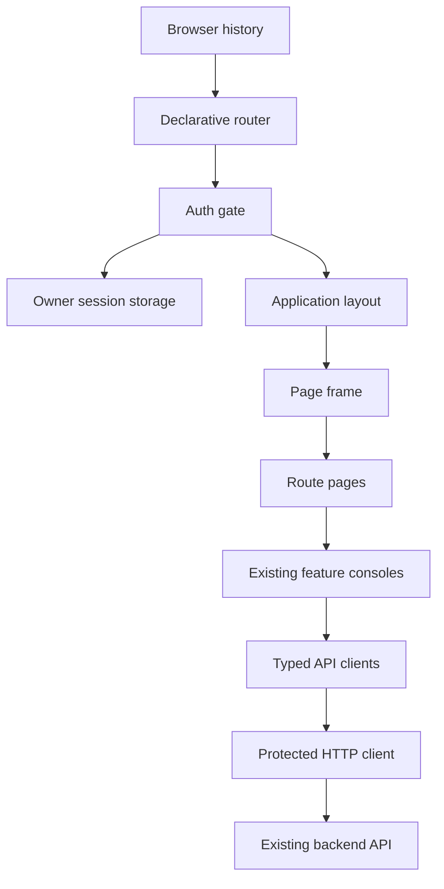
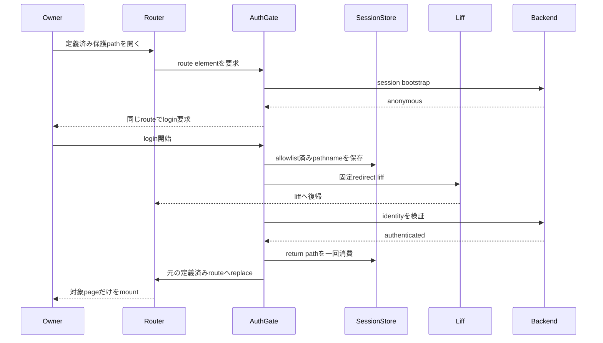
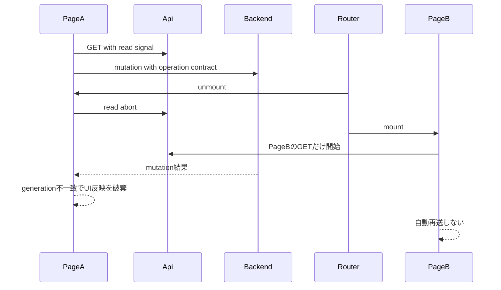
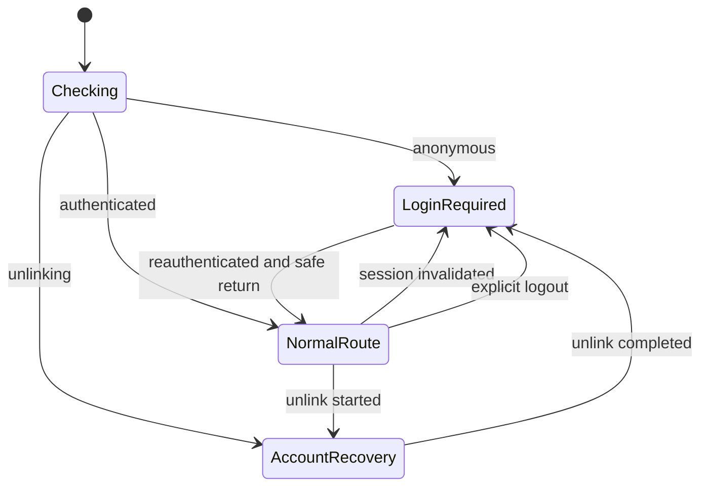
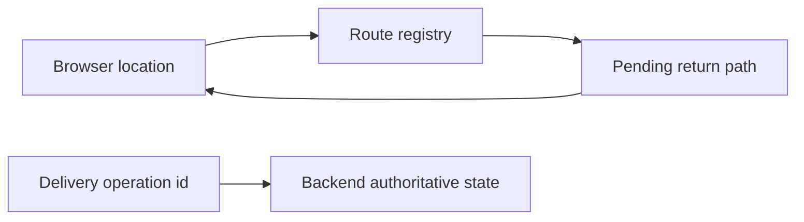

# 設計文書

## Overview

本機能は、owner向けFrontendをURL駆動の独立画面へ分割し、直接アクセス、browser履歴、安全な認証復帰、現在画面だけのデータ読込みを提供する。認証済みownerは中間トップを挟まずチャネル管理から開始し、共通headerからアカウント管理、リッチメニュー管理、メッセージ配信へ移動する。

現行のAPI client、DTO validation、状態reducer、確認・競合・冪等性・結果不明・回復contractを再利用し、React Router Declarative modeを画面実行境界として導入する。Backend、HTTP schema、DB、LINE外部契約は変更しない。Tailwind CSS v4のtheme tokenで全画面の見た目とinteraction stateを統一する。

### Goals

- 定義済みURL、direct access、reload、戻る・進む、404を標準browser history上で成立させる。
- 認証状態とrouteを安全に収束させ、session失効、全連携解除、明示logoutで保護内容と一時情報を正しく扱う。
- route elementだけをmountし、不要なAPI取得、後着応答、draft復元、mutation自動再送を防ぐ。
- 既存4機能の業務・安全性contractを維持し、共通layout、title、focus、responsive、accessibilityを統一する。

### Non-Goals

- Backend業務ロジック、API schema／endpoint、DB／migration、LINE外部contractの変更。
- broadcast、予約、履歴分析、template管理等の新しい業務機能。
- React Router Data／Framework mode、SSR、server loader、route actionの導入。
- 新しいE2E／visual regression／accessibility test framework、Mobile-first保証、LINEアプリ内browserの正式保証。

## Boundary Commitments

### This Spec Owns

- `/`から`/liff`へのreplace redirect、6つの定義済み画面path、rich-menu動的path、wildcard 404のroute tree。
- routeと認証sessionを合成するFrontend制御、allowlist済みtab-local復帰先、logout／全連携解除完了時のowner一時情報消去。
- 共通header、4機能navigation、認証後のチャネル管理直行、page title、route遷移時の`main` focus、loading／error chrome、responsive disclosure。
- 既存Consoleをrouteごとに1つだけmountするpage adapter、rich-menu channel selector、read request cancellation、delivery operation IDのsession追跡。
- Tailwind theme tokenとFrontend markup／CSSの統一、既存Frontend testのroute対応、browser QA matrix。

### Out of Boundary

- Backend、HTTP payload、認可規則、永続model、migration、LINE gateway、既存operation state machineの変更。
- 既存機能の入力項目、確認内容、revision、operation ID、二重実行防止、unknown／recovery semanticsの再定義。
- owner以外の利用者、RBAC、外部return URL、query／hashを使うdeep link、tab間またはdevice間のdraft復元。
- E2E／visual regression基盤、WCAG認証、正式なsmartphone／LIFF browser受入、古いbrowser向けpolyfill。

### Allowed Dependencies

- runtime: React 19.2.7、React DOM 19.2.7、`react-router` 8.3.1のDeclarative APIだけを使用する。
- build/style: Vite 8.1.4、`tailwindcss` 4.3.3、`@tailwindcss/vite` 4.3.3、TypeScript 6.0.3をexact versionで使用する。
- platform: Browser History API、`sessionStorage`、`AbortController`、document title／focus API、LIFF SDK 2.29.1を既存adapter経由で使用する。
- application: 既存`AuthGate`／auth API、各`*Api.ts`／`*Dto.ts`／`*State.ts`、4機能Console、既存Backend `/api/...` contractを使用する。
- constraints: route componentはAPI schemaやDTO validationを複製せず、機能Componentはrouter data loader／actionへ業務状態を移さない。

### Revalidation Triggers

- 定義path、dynamic `channelId`形式、LIFF Endpoint URL／redirect URI、認証session DTOが変わる。
- API payload、error code、operation ID／revision／unknown recovery contractが変わる。
- React Routerのmode、Tailwind major version、Node／Vite runtime、正式browser下限が変わる。
- owner一時情報の所有範囲、storage方式、Backend受付済み操作の追跡方法が変わる。
- Frontend以外の配信serverを導入し、SPA fallback／ngrok routeの起動前提が変わる。

## Architecture

### Existing Architecture Analysis

- `main.tsx`はReact起動、`App.tsx`は単一画面、`AuthGate`は認証state machineとowner header、`OwnerConsole`は3機能同時mountを担当している。
- 各機能はComponent／API／DTO／Stateに分離されているため、route pageは表示の合成だけを所有し、既存業務stateを再利用できる。
- `ChannelAdminConsole`だけがrich-menu detailをlocal stateで内包する。これをURL navigationへ置換し、detail Component自体は維持する。
- readの後着抑止方式がgeneration／request ID／effect flagへ分散し、HTTP abortはない。共通HTTP contractにsignalを追加し、各page lifecycleへ接続する。
- `RichMenuAdminConsole`のdirty back確認と`beforeunload`だけが本Specの離脱contractと衝突する。同一画面内の削除、送信、外部状態変更、入力消去の確認は維持する。

### Architecture Pattern & Boundary Map

**Selected pattern**: Route-driven authenticated shell。BrowserRouterがURLを唯一の画面選択sourceとし、AuthGateがsessionを、AppLayoutが共通chromeを、route pageが機能Componentのmount期間を所有する。



**Dependency direction**: `typed foundation → browser／HTTP adapter → feature UI → route page／shared chrome → composition root`の順に置き、各層は左側だけをimportする。React Routerはroute page／shared chrome／composition rootのnavigationに限定し、API／DTO／State層からimportしない。

**Architecture Integration**:

- Domain/feature boundaries: Routerはpathとmountだけ、AuthGateはsession transitionだけ、AppLayoutはnavigation chromeだけ、各Consoleは既存業務操作だけを所有する。
- Existing patterns preserved: relative `/api`、runtime DTO validation、reducer、generation、operation latch、revision、write-only秘密入力、safe error。
- New components rationale: route metadataはopen redirect防止、PageFrameはtitle／focusの一貫性、ownerSessionStorageはtab-local最小情報、selectorはrich-menu対象選択の独立責務に必要である。
- Steering compliance: flat `frontend/src`、PascalCase Component、`*Api`／`*Dto`／`*State`責務、strict TypeScript、Vitest/jsdomを維持する。

### Technology Stack

| Layer | Choice / Version | Role in Feature | Notes |
|---|---|---|---|
| Frontend | React／React DOM 19.2.7 | 既存Componentとauth stateの描画 | 変更なし |
| Routing | `react-router` 8.3.1 | BrowserRouter、Routes、Route、Navigate、Link、NavLink、Outlet | Declarative modeのみ、exact version |
| Styling | `tailwindcss` 4.3.3 | theme tokenとutility CSS生成 | 既存CSSを最小の固有styleへ縮小 |
| Build | Vite 8.1.4、`@tailwindcss/vite` 4.3.3 | SPA entryとTailwind build | pluginはTailwindと同版固定 |
| Type／Test | TypeScript 6.0.3、Vitest 4.1.10、jsdom 28.1.0 | strict contractとDOM integration test | 新test frameworkなし |
| Browser platform | History、sessionStorage、AbortController、focus API | 履歴、復帰、read中止、a11y | 対応browser下限内 |
| Backend | 既存Django REST API | 認証・機能データ・operationのauthoritative state | 変更なし |

## File Structure Plan

### Directory Structure

```text
frontend/
├── src/
│   ├── main.tsx                         # BrowserRouterを含むReact composition root
│   ├── App.tsx                          # AppRouter: route tree、auth収束、root／404の合成
│   ├── appRoutes.ts                     # RouteRegistry: path、metadata、安全な復帰path検証
│   ├── AppLayout.tsx                    # 共通header、NavLink、owner、logout、responsive menu
│   ├── PageFrame.tsx                    # 単一h1、title、route-change focus、page status領域
│   ├── NotFoundPage.tsx                 # 一般404とチャネル管理へのLink
│   ├── ChannelAdminPage.tsx             # FeaturePageAdapters: ChannelAdminConsole境界
│   ├── AccountPage.tsx                  # FeaturePageAdapters: AccountConsole／unlink境界
│   ├── RichMenuChannelSelectionPage.tsx # 全channelのrich-menu利用可否と導線
│   ├── RichMenuAdminPage.tsx             # channelId検証、非開示not-found、detail metadata
│   ├── DeliveryPage.tsx                  # FeaturePageAdapters: DeliveryForm／追跡境界
│   ├── ownerSessionStorage.ts            # OwnerSessionStorage: 最小tab-local state
│   ├── AuthGate.tsx                      # 認証state machineとlogout／再認証context
│   ├── liffConfig.ts                     # 定義済みpath検証と固定/liff endpoint／redirect
│   ├── liffClient.ts                     # LIFF login／reauth／explicit logout adapter
│   ├── httpApi.ts                        # ScopedReadContract: optional signalとabort分類
│   ├── accountApi.ts                     # account read signal伝播
│   ├── channelAdminApi.ts                # channel list／detail read signal伝播
│   ├── richMenuAdminApi.ts               # rich-menu read signal伝播、mutation contract維持
│   ├── deliveryApi.ts                    # target／status read signal伝播、send contract維持
│   ├── AccountConsole.tsx                # page内heading化、read scope、late mutation fence
│   ├── ChannelAdminConsole.tsx           # inline rich-menu state削除、Link導線、read scope
│   ├── ChannelActions.tsx                # rich-menu detail Link、既存操作button維持
│   ├── RichMenuAdminConsole.tsx           # route detail表示、離脱確認削除、read scope
│   ├── DeliveryForm.tsx                   # operation ID保存／復帰、read scope、late result fence
│   ├── deliveryState.ts                   # 追跡済みoperation statusを型付きでhydrate
│   └── style.css                          # TailwindTheme: import、token、最小固有style
├── test/
│   ├── appRoutes.test.ts                  # path／UUID／safe return純粋contract
│   ├── AppRouting.test.tsx                # direct、pop、replace、auth、404、route mount
│   ├── AppLayout.test.tsx                 # header、order、aria-current、responsive semantics
│   ├── PageFrame.test.tsx                 # title、h1、route focus、refresh non-focus
│   ├── RichMenuChannelSelectionPage.test.tsx # 全状態、empty、利用不可理由、導線
│   └── ownerSessionStorage.test.ts         # allowlist、operation ID、clear、秘密非保存
└── package.json                            # exact runtime／dev dependency
```

### Modified Files

- `frontend/package-lock.json` — `react-router`、`tailwindcss`、`@tailwindcss/vite`のresolved dependencyとintegrityを固定する。
- `frontend/vite.config.ts` — Tailwind pluginと明示的SPA modeを追加し、既存host allowlist／API proxy／Vitest設定を維持する。
- `frontend/index.html` — responsive viewportと既存entryを確認し、route固有情報やowner情報を埋め込まない。
- `frontend/test/App.test.tsx`、`AuthGate.test.tsx`、`liffConfig.test.ts`、`liffClient.test.ts`、`httpApi.test.ts` — composition、固定redirect、logout、signal contractへ更新する。
- `frontend/test/AccountConsole.test.tsx`、`ChannelAdminConsole.test.tsx`、`ChannelActions.test.tsx`、`RichMenuAdminConsole.test.tsx`、delivery関連test — route context、離脱contract、abort、追跡、既存業務回帰を検証する。
- 既存の各presentation Component test — Tailwind class名そのものではなく、role、label、状態文言、disabled、confirmation callback等のobservable contractを維持する。

各新規fileは上記の一責務だけを持つ。Backend、`frontend/src/*Dto.ts`、auth／channel／rich-menuの既存pure state reducerは公開contractが変わらない限り変更しない。

## System Flows

### Direct access、認証、復帰



未知pathはreturn pathへ保存しない。`/`、明示logout、全連携解除中のaccount収束は`replace`を使い、通常navigationとselector→detailは`push`を使う。

### Navigationとasync operation



配信だけは受付時の不透明なoperation IDをtab-localに保存し、再訪時に同じIDの状態確認を行う。rich-menuとchannelは既存Backend projectionを再取得して追跡可能な状態へ収束する。

### Session state収束



session失効は現在の許可URLを維持する。全連携解除中だけ`/liff/account`へreplaceし、AppLayoutを描画しない。明示logoutはowner session storageを消去して`/liff`へreplaceする。

## Requirements Traceability

| Requirement | Summary | Components | Interfaces | Flows |
|---|---|---|---|---|
| 1.1, 1.2, 1.3, 1.4, 1.5 | 定義route、history、404、非開示channel not-found | App、appRoutes、NotFoundPage、RichMenuAdminPage | route metadata、UUID validator | Direct access |
| 2.1, 2.2, 2.3, 2.4, 2.5, 2.6, 2.7, 2.8, 2.9 | auth復帰、失効、unlink、logout | AuthGate、App、AccountPage、ownerSessionStorage | AuthGateContext、SafeReturnPath、OwnerSessionStorage | Direct access、Session state |
| 3.1, 3.2, 3.3, 3.4, 3.5, 3.6, 3.7 | 共通headerと開始画面 | AppLayout、PageFrame、AppRouter | NavigationItem、PageMeta | route mount |
| 4.1, 4.2, 4.3, 4.4 | channel pageの責務分離 | ChannelAdminPage、ChannelAdminConsole、ChannelActions | Link、既存ChannelAdminApiClient | Navigationとasync |
| 5.1, 5.2, 5.3 | account pageとunlink契約 | AccountPage、AccountConsole、UnlinkRecoveryPanel | AuthGateContext、既存AccountApiClient | Session state |
| 6.1, 6.2, 6.3, 6.4, 6.5, 6.6, 6.7, 6.8, 6.9 | rich-menu選択、detail、read-only、回復 | RichMenuChannelSelectionPage、RichMenuAdminPage、RichMenuAdminConsole | selector projection、Link、既存RichMenuAdminApiClient | Navigationとasync |
| 7.1, 7.2, 7.3, 7.4, 7.5 | 独立delivery pageと同一ID確認 | DeliveryPage、DeliveryForm、ownerSessionStorage | DeliveryOperationSession、既存LinkedDeliveryApiClient | Navigationとasync |
| 8.1, 8.2, 8.3, 8.4, 8.5, 8.6 | draft破棄、受付済み操作、非永続化 | route pages、各Console、ownerSessionStorage、ProtectedHttpClient | read signal、generation、operation ID | Navigationとasync |
| 9.1, 9.2, 9.3, 9.4, 9.5, 9.6, 9.7 | route単位load、abort、状態表示 | route pages、PageFrame、各Console、各API client | ReadRequestOptions、PageStatus | Navigationとasync |
| 10.1, 10.2, 10.3, 10.4, 10.5 | titleとfocus | PageFrame、RichMenuAdminPage | PageMeta、route location key | route mount |
| 11.1, 11.2, 11.3, 11.4, 11.5, 11.6, 11.7, 11.8 | unified UI、responsive、a11y | AppLayout、PageFrame、全page／Console、style.css | Tailwind theme token、semantic DOM | 全画面描画 |
| 12.1, 12.2, 12.3, 12.4, 12.5, 12.6 | browser範囲、既存contract、秘密非露出 | 全Frontend境界、validation suite | exact dependency、既存HTTP contract、storage allowlist | 全flow |

## Components and Interfaces

| Component | Domain／Layer | Intent | Req Coverage | Key Dependencies | Contracts |
|---|---|---|---|---|---|
| AppRouter | Composition | URL、auth、layout、pageを合成 | 1.1–1.5, 2.1–2.9, 9.1–9.4 | React Router P0、AuthGate P0 | State |
| RouteRegistry | Foundation | path、meta、安全な復帰pathの唯一の定義元 | 1.1–1.5, 2.2, 10.1–10.2 | UUID validator P0 | Service |
| AuthGate | Auth | session transitionとLIFF操作を所有 | 2.1–2.9 | auth API P0、LIFF adapter P0、OwnerSessionStorage P0 | Service、State |
| OwnerSessionStorage | Browser adapter | 許可済み最小tab-local stateだけを保持 | 2.2, 2.8–2.9, 8.5–8.6, 12.6 | sessionStorage P1、RouteRegistry P0 | Service、State |
| AppLayout | Shared UI | 共通header、nav、owner、logout | 3.1–3.4, 11.3–11.8 | NavLink P0、AuthGateContext P0 | State |
| PageFrame | Shared UI | h1、title、focus、page chrome | 3.5, 9.5–9.7, 10.1–10.5 | Router location P0 | State |
| NotFoundPage | Route UI | 保護情報を取得しない404とチャネル管理への導線を表示 | 1.4 | Link P0、PageFrame P0 | UI |
| FeaturePageAdapters | Route UI | 既存Consoleを1 routeだけmount | 4.1–5.3, 7.1–7.5, 8.1–8.4 | Existing consoles P0 | State |
| RichMenuChannelSelectionPage | Route UI | 全channelの利用可否と導線を表示 | 6.1–6.8 | ChannelAdminApiClient P0、Link P0 | State |
| RichMenuAdminPage | Route UI | channelId検証、非開示error、dynamic meta | 1.5, 6.3–6.9, 10.2 | RichMenuAdminConsole P0 | State |
| ScopedReadContract | IO | GET中止とlate response fenceを統一 | 8.3–8.4, 9.1–9.7 | AbortController P0、ProtectedHttpClient P0 | Service |
| TailwindTheme | Presentation | 全画面design tokenとresponsive utility | 11.1–11.8, 12.1–12.2 | Tailwind／Vite P0 | Build |

### Routing and Authentication

#### RouteRegistry

| Field | Detail |
|---|---|
| Intent | pathの生成、照合、page metadata、安全な内部復帰先判定を一箇所へ集約する |
| Requirements | 1.1, 1.2, 1.4, 1.5, 2.2, 10.1, 10.2 |

**Responsibilities & Constraints**

- static pathはexact matchし、末尾の任意segment、query、hash、別originを復帰先として認めない。
- dynamic detailは既存のcanonical channel UUID validatorを再利用する。
- `/`はpageではなく`/liff`へのreplace redirect、未知pathはnot-foundとして表す。

**Contracts**: Service [x] / API [ ] / Event [ ] / Batch [ ] / State [ ]

```typescript
type StaticProtectedPath =
  | '/liff'
  | '/liff/channels'
  | '/liff/account'
  | '/liff/rich-menus'
  | '/liff/deliveries'

type ProtectedAppPath = StaticProtectedPath | `/liff/rich-menus/${string}`

type RouteMeta = Readonly<{
  navigationKey: 'home' | 'channels' | 'account' | 'richMenus' | 'deliveries' | null
  title: string
  heading: string
}>

interface RouteRegistry {
  parseProtectedPath(pathname: string): ProtectedAppPath | null
  richMenuPath(channelId: string): `/liff/rich-menus/${string}`
  meta(pathname: string): RouteMeta
}
```

- Preconditions: `richMenuPath`はcanonical UUIDだけを受ける。
- Postconditions: parse結果は同一originのpathnameとしてだけ使用できる。
- Invariants: return pathにorigin、query、hash、credential、本文、user IDを含めない。

#### AuthGate

| Field | Detail |
|---|---|
| Intent | Backend sessionとLIFF identityを検証し、保護contentのmount可否を一意に決める |
| Requirements | 2.1–2.9, 12.3, 12.6 |

**Responsibilities & Constraints**

- unauthenticated／invalidatedでは同じ保護route上で機能contentをunmountし、login UIだけを返す。
- login／reauth開始直前に現在の許可済みpathnameを保存し、LIFF redirectは常に`/liff`を使う。
- session invalidationを理由にmutationを再実行しない。認証後はroute componentの通常mountが最新GETを開始する。
- unlinkingではAppへ状態を渡し、Appが`/liff/account`へreplaceして通常layoutを除外する。
- explicit logout成功時はLIFF login stateとOwnerSessionStorageを消去し、`/liff`へreplaceしてanonymousへ移る。

**Contracts**: Service [x] / API [ ] / Event [ ] / Batch [ ] / State [x]

```typescript
type AuthGateContext = Readonly<{
  session: Extract<SessionStatus, { state: 'authenticated' | 'unlinking' }>
  logout: () => Promise<void>
  getAccessToken: () => string | null
  reauthenticate: () => void
  reauthenticateForUnlink: () => void
  unlinkReauthenticationReady: boolean
  onSessionReceived: (session: SessionStatus) => void
  refreshSession: () => Promise<void>
}>
```

- Invariants: `authenticated`以外で通常feature contentを描画しない。generation不一致のsession応答は捨てる。
- Integration: `LinePlatformLiffAdapter`へ明示`logout(): void`を追加し、SDKをComponentから直接呼ばない。
- Risk: Backend logout成功後のLIFF logout失敗はsafe errorへ縮約し、owner一時情報を再表示しないfail-closed状態へ収束させる。

#### OwnerSessionStorage

| Field | Detail |
|---|---|
| Intent | redirectと再訪に必要な最小のtab-local識別子だけを型検証して保持する |
| Requirements | 2.2, 2.8, 2.9, 8.5, 8.6, 12.6 |

**Contracts**: Service [x] / API [ ] / Event [ ] / Batch [ ] / State [x]

```typescript
interface OwnerSessionStorage {
  saveReturnPath(path: ProtectedAppPath): void
  consumeReturnPath(): ProtectedAppPath | null
  saveDeliveryOperationId(operationId: string): void
  readDeliveryOperationId(): string | null
  clearDeliveryOperationId(): void
  setUnlinkReauthenticationPending(pending: boolean): void
  readUnlinkReauthenticationPending(): boolean
  clearAll(): void
}
```

- Storage unavailable／invalid valueではthrowせずnullへ収束し、不正値を削除する。
- `clearAll`は明示logoutと全連携解除完了で必須、session失効では復帰のため保持する。
- delivery IDはcanonical UUIDだけを許可し、subject、body、recipient、LINE user ID、preview、tokenはinterface自体に持たせない。

### Shared Application UI

#### AppLayout

| Field | Detail |
|---|---|
| Intent | 認証済み通常pageに共通navigation chromeを提供する |
| Requirements | 3.1, 3.2, 3.3, 3.4, 11.3–11.8 |

**Responsibilities & Constraints**

- app名は`/liff`へのLink、4機能は指定順のNavLinkとし、current routeに`aria-current="page"`を提供する。
- desktopでは横並び、narrow viewportではbuttonで開閉するnavigation disclosureにowner表示とlogoutを含める。
- menu stateはroute location changeで閉じ、Escape、Tab、focus-visibleを阻害しない。modal focus trapは導入しない。
- unlinking、anonymous、404には通常AppLayoutを表示しない。404は保護情報を取得しない。

#### PageFrame

| Field | Detail |
|---|---|
| Intent | routeごとに一つの可視h1、title、focusと一貫したcontent領域を提供する |
| Requirements | 3.5, 9.5, 9.7, 10.1–10.5 |

**Contracts**: Service [ ] / API [ ] / Event [ ] / Batch [ ] / State [x]

```typescript
type PageFrameProps = Readonly<{
  title: string
  heading: string
  routeFocusKey: string
  children: ReactNode
}>
```

- `routeFocusKey`変更時だけ、`tabIndex={-1}`と`aria-labelledby`を持つmainへprogrammatic focusし、document titleを更新する。main自体のfocus outlineは表示せず、見出し周辺の視覚的なノイズを避ける。
- data refresh、loading→success、error通知ではmainへfocusを移さない。statusは`role="status"`、failureは`role="alert"`で通知し、入力focusを奪わない。
- rich-menu detailはinitial generic titleからchannel取得後に`{channelName} | リッチメニュー管理`へ更新するが、h1は「リッチメニュー管理」のままにする。

### Route Pages and Existing Features

#### FeaturePageAdapters

| Field | Detail |
|---|---|
| Intent | page chromeと既存Consoleを接続し、route unmountをfeature lifecycle境界にする |
| Requirements | 4.1–5.3, 7.1–7.5, 8.1–8.4, 9.1–9.6 |

**Responsibilities & Constraints**

- `ChannelAdminPage`、`AccountPage`、`DeliveryPage`はPageFrameと対応Console一つだけをrenderする。
- Consoleの現行h2をpage h1と競合しないsection headingへ変更し、画面名以外のh1を追加しない。
- ChannelAdminのrich-menu inline selection stateを削除し、対象channelのdetailへLinkする。
- route unmountでdraft／preview local stateを破棄し、`beforeunload`、navigation blocker、discard confirmationを登録しない。
- Console内の削除、送信、外部状態変更、editor reset confirmationは維持する。
- mutation promiseはabortせず、unmount generationにより結果描画だけを捨てる。再訪はauthoritative GETから開始する。

#### RichMenuChannelSelectionPage

| Field | Detail |
|---|---|
| Intent | 登録済み全channelをrich-menu管理可否とともに表示し、detailへの安全な入口を提供する |
| Requirements | 6.1–6.8, 9.1, 9.3–9.7 |

**State model**:

```typescript
type RichMenuChannelChoice = Readonly<{
  channelId: string
  label: string
  stateLabel: string
  mode: 'editable' | 'readOnly' | 'unavailable' | 'recoveryOnly'
  unavailableReason: string | null
}>
```

- Existing `ChannelAdminItem`からpure projectionし、新API／DTOを作らない。
- activeかつprovider IDありは`editable`、inactiveかつprovider IDありは`readOnly`、provider IDなしは`unavailable`、進行中lifecycleは保存状態が許す`recoveryOnly`とする。
- provider IDありの項目だけdetail Linkを表示する。provider IDなしは理由とchannels Linkを表示する。
- 0件はempty stateとchannels Linkだけを表示し、新規登録formを持たない。
- selector→detailはLinkのpush navigationを使い、browser backでselectorへ戻る。

#### RichMenuAdminPage

| Field | Detail |
|---|---|
| Intent | dynamic channel routeを検証し、既存rich-menu lifecycle UIを安全に描画する |
| Requirements | 1.5, 6.3, 6.5, 6.7–6.9, 10.2 |

- URL parameterの形式不正、404、owner scope外を同じ「対象が見つからない」状態へ縮約し、selector Link以外の存在／権限情報を表示しない。
- channel labelをPageFrame titleへ渡し、Consoleへchannel IDとread signal、session invalid callbackを渡す。
- inactive channelは既存allowed action projectionに従うread-only／recovery UIを表示する。provider IDなしの直接accessは管理操作を描画せず、channels設定導線へ収束する。
- `RichMenuAdminConsole`から`onBack` confirmationと`beforeunload`を削除し、selector Linkを常時page chromeに表示する。

### IO and Async Lifecycle

#### ScopedReadContract

| Field | Detail |
|---|---|
| Intent | route離脱時に安全なreadを中止し、後着結果を新pageへ反映しない |
| Requirements | 8.3, 8.4, 9.1, 9.3–9.7 |

**Contracts**: Service [x] / API [ ] / Event [ ] / Batch [ ] / State [x]

```typescript
type ReadRequestOptions = Readonly<{ signal?: AbortSignal }>

interface ProtectedHttpClient {
  request(input: Readonly<{
    path: string
    method: HttpMethod
    body?: unknown
    signal?: AbortSignal
  }>): Promise<Response>
}
```

- GET／安全なstatus read APIだけが`ReadRequestOptions`を公開し、Component effectのAbortControllerを伝播する。
- POSTで実装済みの状態確認endpointは業務上readでもmethodがPOSTのため、個別interfaceで`signal`許可を明示する。preview、send、apply、update、delete等のmutationは許可しない。
- abortは`ProtectedHttpClientError('aborted')`へ分類し、Componentはerror stateへ遷移しない。abort不可能／完了済みresponseはgenerationまたはrequest IDで無視する。
- 再試行buttonはlist／detail／state GETだけを再実行し、mutationを汎用retryへ渡さない。

#### Delivery operation resume

- `send`開始時にoperation IDを保存し、completed後の「新しい配信」で削除する。unknown／processingでは保持する。
- DeliveryPage再訪時はIDがあれば入力値を復元せず`checkStatus`だけを実行し、結果を既存delivery reducerへhydrateする。
- 401ではAuthGateへsession invalidを通知し、再認証後に同じIDを再確認する。新しいIDでsendしない。
- invalid／not-found IDは保存値を削除して通常の新規配信画面へ戻し、安全なstatus messageを表示する。

## Data Models

### Domain Model

本SpecはBackend entityと永続dataを追加しない。Frontendが新しく所有する値は次の一時値だけである。

- `ProtectedAppPath`: route registryが検証したinternal pathname。
- `RouteMeta`: navigation key、page title、h1。
- `RichMenuChannelChoice`: 既存`ChannelAdminItem`から導出する表示projection。
- `OwnerSessionRecord`: pending return path、unlink marker、delivery operation ID。tab-localかつlogout／unlink completionで削除される。
- `ReadRequestOptions`: route pageのread lifetimeを表すoptional signal。

### Logical Data Model



**Consistency & Integrity**:

- storage write前とread後にroute／UUIDを再検証し、invalid valueを削除する。
- return pathはconsume-once、delivery IDはoperation完了またはowner clearまで保持する。
- browser storageはauthoritative stateではない。表示内容とoperation結果は毎回Backendから取得する。
- `sessionStorage` keyへowner PII、資格情報、message内容、preview、confirmation tokenを追加しない。

### Data Contracts & Integration

- HTTP request／response schema、status code、CSRF、cookie、DTO parserは変更しない。
- API clientのTypeScript signatureにoptional `ReadRequestOptions`だけを追加し、wire formatへfieldを追加しない。
- route parameterをAPIへ渡す前にcanonical UUIDを検証する。Backendの404／scope failureは同一safe presentationへ縮約する。

## Error Handling

### Error Strategy

- route error、auth error、read error、business operation errorを別の表示境界に保つ。
- AppLayoutとPageFrameはread中／read failureでも残し、機能contentだけをstatus／alertへ置換する。
- abortとstale generationは利用者errorではなくlifecycle completionとして無表示で終了する。
- mutation failure／unknownは既存Consoleのsafe errorと回復actionを維持し、route layerが自動retryしない。

### Error Categories and Responses

| Category | Detection | Presentation | Recovery |
|---|---|---|---|
| 未定義path | wildcard route | 404、チャネル管理Link | 自動redirectなし |
| channel不正／不存在／scope外 | UUID validation、safe 404／403 | 同一「対象が見つからない」 | selector Link |
| anonymous／401 | AuthGate、ProtectedHttp callback | 保護contentを即unmount、login UI | allowlisted pathへ再認証後復帰 |
| unlinking | session DTO | account recoveryのみ、navなし | 既存UnlinkRecoveryPanel |
| read abort／stale | AbortError、generation mismatch | 表示しない | 新routeのreadへ委譲 |
| retryable read failure | 既存safe API error | PageFrame内alert | 同じreadだけ明示再試行 |
| mutation conflict／unknown | 既存DTO／reducer | 既存operation result／recovery | 同一operation確認、最新状態GET |
| storage unavailable／invalid | guarded adapter validation | 秘密情報なしのsafe fallback | `/liff`または新規入力 |

### Monitoring

- 新しいtelemetry／Backend logは追加しない。browser consoleへroute、owner、channel、本文、credential、operation payloadを出力しない。
- validation hookとしてAPI call count／pathをtest spyで検証し、認証入口からチャネル管理だけが開始され、別routeから不要APIが呼ばれないことを観測する。

## Testing Strategy

### Unit Tests

- `appRoutes.test.ts`: 全static path、canonical detail path、`/`、unknown、query／hash／external値を分類し、safe return allowlistとtitle metadataを検証する（1.1–1.5, 2.2, 10.1–10.2）。
- `ownerSessionStorage.test.ts`: consume-once return、UUID-only delivery ID、storage failure、logout clear、本文等を保存するinterfaceがないことを検証する（2.8–2.9, 8.5–8.6, 12.6）。
- `httpApi.test.ts`と各API test: signal伝播、abort分類、GET／statusだけのcancel、mutationへの非伝播、既存CSRF／401 contractを検証する（8.3, 9.3, 9.6）。
- rich-menu selector projection test: active／inactive／provider missing／lifecycle／emptyを型付きmodeへ変換する（6.1–6.6）。
- delivery reducer test: 保存IDのprocessing／unknown／completed hydrateと新規配信開始時のclearを検証する（7.2–7.3, 8.4–8.5）。

### Integration Tests

- `AppRouting.test.tsx`: direct access、root replace、Link push、popstate、reload相当初期location、wildcard 404、channel not-foundを検証する（1.1–1.5）。
- AuthGate integration: protected path login、fixed `/liff` redirect、safe return、401 content unmount、reauth remount、mutation非再送を検証する（2.1–2.5）。
- unlink／logout integration: unlinking時account replaceとnav非表示、completion anonymous、logout `/liff` replace、全owner一時情報clear、再loginがチャネル管理から開始することを検証する（2.6–2.9）。
- route mount isolation: 各URLで対応Console一つだけがAPIを呼び、`/liff`はチャネル管理だけを開始し、navigation後のaborted／late responseが表示されないことを検証する（3.7, 8.1, 9.1–9.4）。
- 既存feature integration: channel、account、rich-menu、deliveryの確認、競合、unknown、recovery、二重実行防止testをroute wrapper下で維持する（4.4, 5.3, 6.9, 7.2–7.3, 12.3）。

### UI Tests

- AppLayout／AppRouter: app link、4 NavLinkの順序、認証後redirect、`aria-current`、owner、logout、responsive disclosure semanticsを検証する（3.1–3.7, 11.3–11.4）。
- PageFrame: 各固定title、detail動的title、単一可視h1、route key変更時だけfocusし、refresh／status updateではfocusを維持する（10.1–10.5）。
- Rich-menu flows: selectorの全channel、利用不可理由、empty、detail Link、browser back、常時selector Link、inactive read-only、統一not-foundを検証する（6.1–6.9）。
- Navigation leave: draft／previewを作った後のLink、back、reload cleanupでconfirmationがなく、再訪時に入力が復元されないことを検証する。同一画面の危険操作確認は残る（8.1–8.2）。
- status semantics: loading／success／failure／unknownを色以外のtextとroleで通知し、keyboard操作、label、landmark、24px target用class、focus-visible classを確認する（9.5–9.7, 11.6–11.8）。

### Build and Browser Validation

- `npm test`で既存179 testを含む全Vitestを成功させ、`npm run build`でTypeScript strictとVite／Tailwind production buildを成功させる。
- Chrome 111+、Edge 111相当+、Safari 16.4+、Firefox 128+で全定義pathのdirect access／reload、history、responsive menu、2列／1列、horizontal overflow、focus visibility、contrastを手動matrixで確認する（11.1–11.8, 12.1）。
- ngrok→Vite経路で`/liff`と各`/liff/...`が同じSPA entryを返し、`/api`proxyとunknown routeのclient-side 404を壊さないことを確認する（1.3–1.4, 12.4）。
- smartphone／LIFF browserはbest effort smoke testだけを記録し、正式acceptanceに含めない（12.2）。

## Security Considerations

- open redirectを防ぐため、復帰先はroute registryで再構成できるpathnameだけとし、完全URL、protocol-relative URL、query、hash、encoded path traversalを拒否する。
- 未認証／401ではfeature componentを直ちにunmountし、stale responseをgeneration fenceで捨てる。route URL維持は認可の代替にせず、Backend session／provider fenceを継続する。
- channel形式不正、404、scope外は同一表示へ縮約し、label、provider、存在、権限差をerror detailへ出さない。
- sessionStorageはtab-local最小識別子だけを保存し、logout／unlink completionで一括消去する。秘密入力、本文、preview、LINE user IDをURL、storage、log、errorへ追加しない。
- Router／Tailwind導入はFrontendだけに閉じ、relative `/api`、same-origin cookie、CSRF、write-only credential contractを変更しない。

## Performance & Scalability

- route elementが唯一のfeature mount boundaryであり、topではauth bootstrap以外、各featureでは当該Console以外のAPI requestを0件にする。
- navigation時に進行中readをabortし、再訪ではcache復元ではなくBackendの最新保存状態を取得する。新しいglobal data cacheは導入しない。
- Tailwindはbuild-time zero-runtime生成とし、現行4機能規模でroute code splittingは導入しない。依存追加後のproduction bundleを記録し、明らかな重複CSSがないことを確認する。

## Integration and Validation Order

1. exact dependency、Tailwind Vite plugin、BrowserRouter、route registry、SPA fallbackを導入する。
2. AuthGate context、fixed redirect／safe return、OwnerSessionStorage、AppLayout／PageFrameを統合する。
3. top、channel、account、delivery pageを分離し、既存Console回帰testを通す。
4. rich-menu selector／detail routeを統合し、inline切替と離脱確認を削除する。
5. read signal、late result fence、delivery operation resumeを接続する。
6. 全画面をTailwind themeへ移行し、Vitest、production build、browser／ngrok matrixを完了する。

RollbackはFrontend dependency／route composition／markupを直前版へ戻すだけであり、DB／API migration rollbackは存在しない。ただし部分的に旧一画面と新routeを同時提供せず、各段階はtest内で統合してから単一Frontend成果として切り替える。

## Supporting References

- 詳細な依存互換性、既存コード調査、選択肢比較、サイズ評価は`research.md`を参照する。
