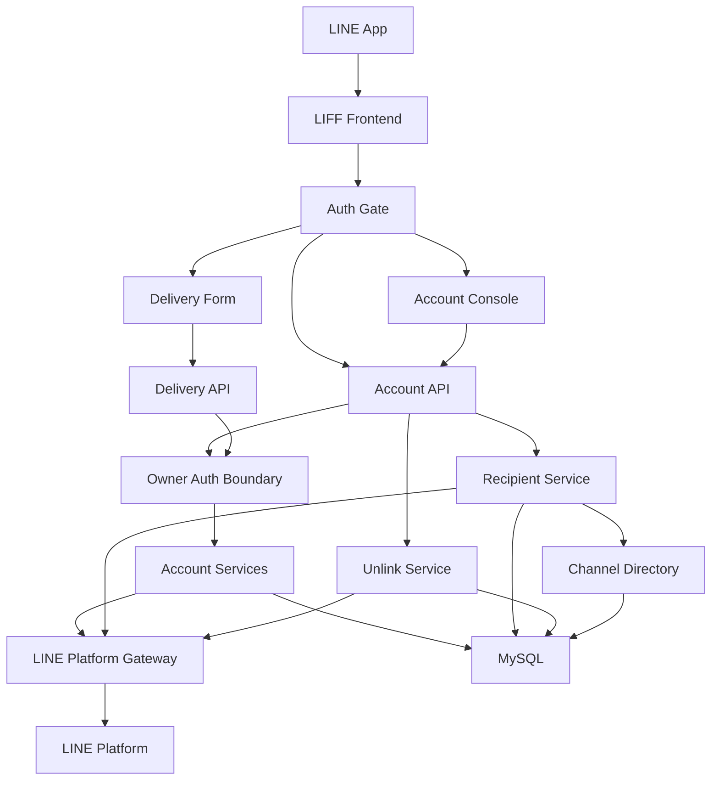
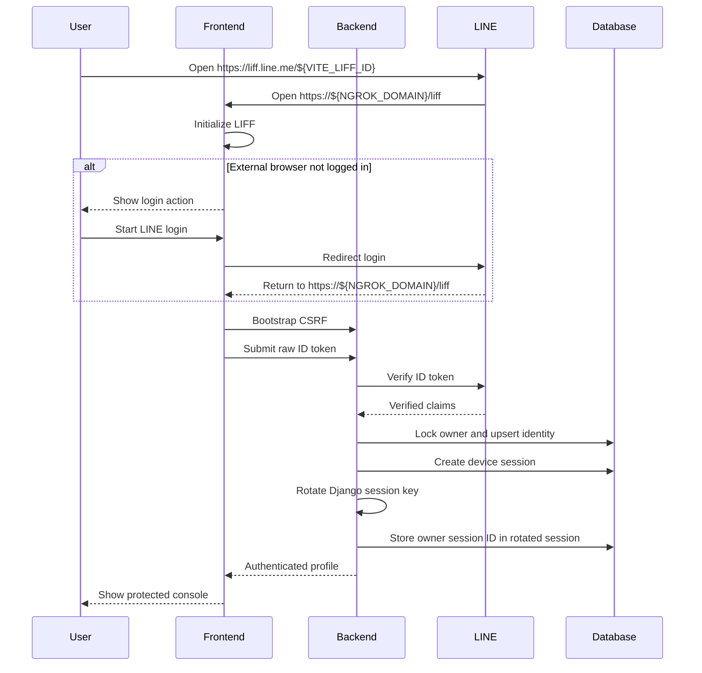
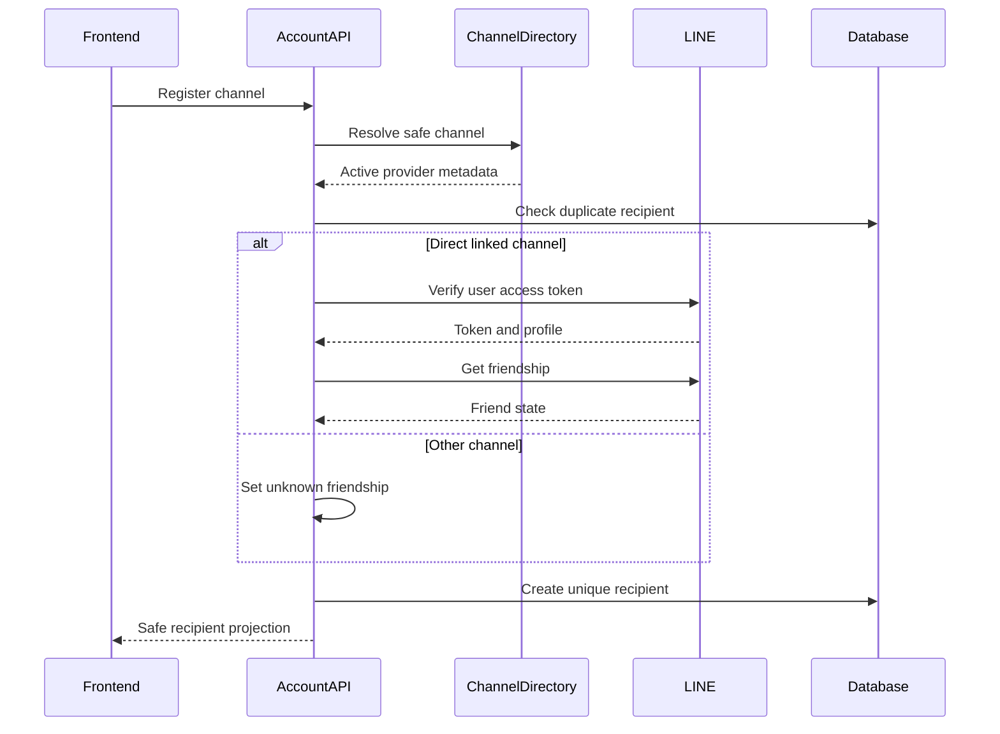
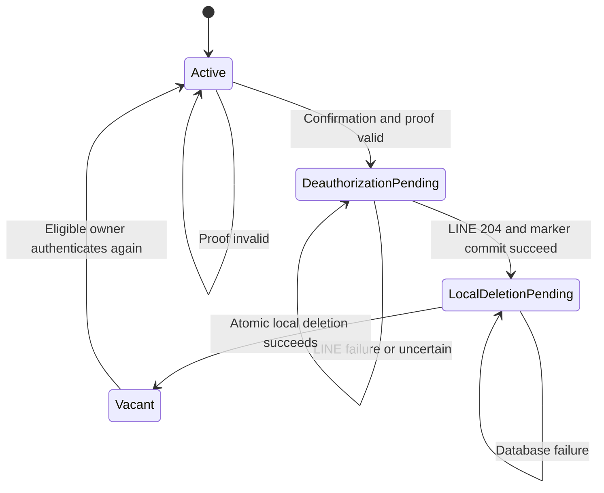
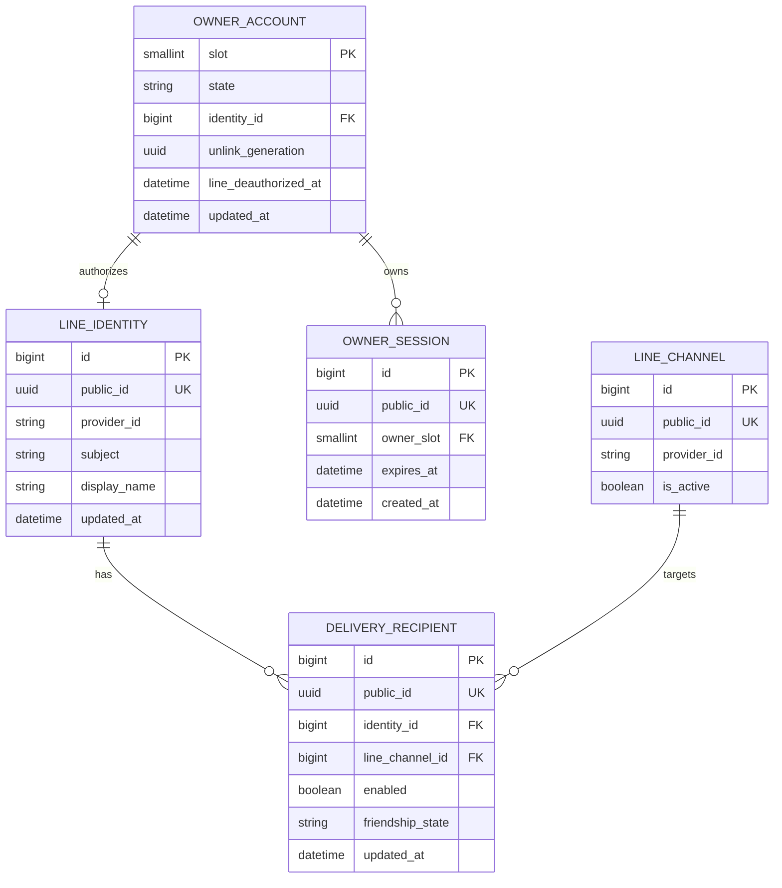
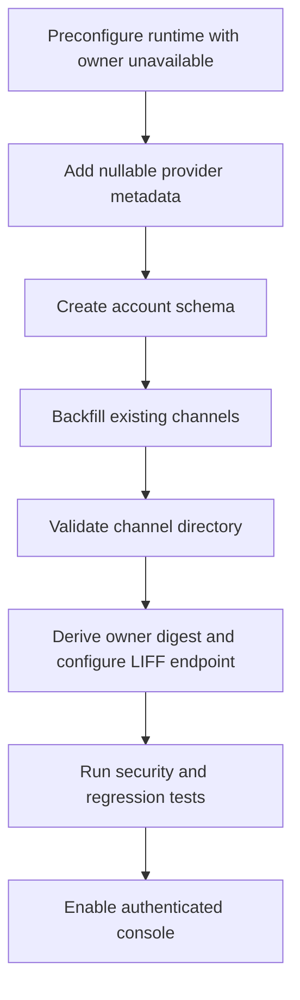

# 技術設計書

## Overview

本機能は、個人開発者がLIFFまたは外部ブラウザからLINE本人性を確認し、単一owner専用の操作環境を安全に利用できるようにする。FrontendはLINEが発行したraw tokenだけをBackendへ渡し、BackendがLINE Platformで検証したprovider-scoped identityから端末別owner sessionを確立する。

Backendには`lineaccounts`境界を新設し、LINE identity、単一owner grant、端末別session、Messaging APIチャネル別recipientを別ライフサイクルとして管理する。既存配信APIはowner認証・認可を入力検証より先に適用するが、配信内容、確認、冪等性、結果状態、監査契約は変更しない。全連携解除はLINE deauthorizeとローカル削除をdeletion fence付きsagaとして収束させる。

### Goals

- LINEが検証したID tokenだけから、事前許可済み単一ownerの複数端末sessionを確立する。
- LINE user IDを公開せず、provider一致を検証したチャネル別recipientを登録・管理する。
- 公開HTTPS originでsession、CSRF、秘密値非露出を一貫して適用する。
- LINE側認可取消とローカル個人データ削除を、未完了状態を明示しながら安全に収束させる。

### Non-Goals

- 複数owner、RBAC、非owner向け招待・同意・管理画面
- 異なるLINE provider間のidentity統合
- Webhookによるfriendship同期、可変recipientへの配信契約変更
- Messaging APIまたはLINE Login credentialのユーザー向け管理画面
- プロフィール画像、メール、ステータスメッセージの保存

## Boundary Commitments

### This Spec Owns

- LIFF Endpoint URL、LIFF URL、redirect URIの導出契約、LIFF初期化、外部ブラウザlogin、Frontend認証状態、保護画面gate
- LINE ID tokenとLIFF access tokenのBackend検証、単一owner適格性判定
- `LineIdentity`、`OwnerAccount`、`OwnerSession`、`DeliveryRecipient`のデータと不変条件
- owner session認証、active owner permission、CSRF保護、全保護APIのsafe error契約
- recipient一覧、登録、disable、enable、チャネル別unlink
- LINE deauthorizeとローカル削除を収束させる全連携解除saga
- `line-channel-foundation`の下流拡張契約に従い、`linechannels`へ追加するprovider metadata、read-only channel directory、migration、backfill、回帰テスト

### Out of Boundary

- `linechannels`が所有するMessaging API credential暗号化、rotation、チャネルmutationの既存契約
- `delivery`が所有する本文整形、確認token、operation ID、LINE retry key、配信状態、監査記録
- LIFF非直結チャネルのfriendship更新。`line-webhook-interaction`だけが検証済みWebhookから更新する
- recipientを実際のpush対象へ切り替える処理。`linked-recipient-delivery`が所有する
- LINE Developers Console上のLIFF、LINE Login、公式アカウントlink設定作業そのもの。必要な設定値と整合条件は本Specが定義する
- 全連携解除後の配信監査削除または匿名化

### Allowed Dependencies

- `line-channel-foundation`: 本仕様が互換的に追加するprovider付き非秘密channel projectionとactive状態のread-only参照だけを利用する。credential repository、暗号化契約、credential Modelを`lineaccounts`から直接参照しない
- `line-message-delivery`: 公開Viewへ共通owner認可を適用する。service、model、gatewayの既存契約は変更しない
- Django 6 session、DRF authentication/permission、CSRF、MySQL transaction
- LINE Login v2.1 verify、profile、friendship、deauthorize APIおよびstateless channel token発行API
- ngrokからVite、ViteからBackendへの既存同一origin proxy

### Upstream Boundary Extension Agreement

- `LineChannel`と資格情報の長期的なデータ所有者は`linechannels`のままとする。本仕様はaccount linkingに必要な非秘密`provider_id`と`LineChannelDirectory`の実装・移行・テスト作業を所有する。
- 上流基盤の`CredentialRepository`、認証付き暗号、用途別復号、rotation、秘密非露出契約は変更しない。`lineaccounts`は公開directory Protocol以外の`linechannels`内部実装をimportしない。
- `line-channel-foundation`designのDownstream Extension Contractを上流合意とし、拡張タスクは本仕様から生成する。基盤の承認済み資格情報タスクを暗黙に変更しない。

### Revalidation Triggers

- LINE Login channel ID、provider ID、LIFF直結Messaging API channelの対応関係変更
- `LineChannel.provider_id`またはsafe channel directoryの型・availability規則変更
- identityの自然キー、owner singleton、session ledger、recipient uniquenessの変更
- deauthorizeの成功判定、pending stage、再開契約、LINE Login channel secret供給方法の変更
- protected APIの認証方式、CSRF origin、cookie属性、ngrok proxy trust境界の変更
- LIFF entry path、`VITE_LIFF_ID`、`NGROK_DOMAIN`、LINE Developers ConsoleのEndpoint URLのいずれかの変更
- recipient delivery availabilityの導出条件変更。この場合は`line-webhook-interaction`と`linked-recipient-delivery`を再検証する

## Architecture

### Existing Architecture Analysis

- FrontendはDTO parser、API client、純粋state transition、React UIを分離している。本機能も同じ分離を維持する。
- BackendはDjango app内でView/Serializer、Service、Repository/Model、Gatewayを分ける。`lineaccounts`も同じ依存方向を採用する。
- `delivery`の共通Viewは認証・permissionを明示的に無効化しているため、共通owner保護Viewへ差し替える。
- `linechannels`にはprovider情報と非秘密一覧queryがないため、account linkingに必要な最小read seamだけを追加する。
- Django sessionとCSRF middlewareは存在するが、Secure Cookie、exact trusted origin、匿名login POSTのCSRF強制は追加が必要である。

### Architecture Pattern & Boundary Map



**Architecture Integration**:

- Selected pattern: app-local layered architecture。外部LINE契約と永続化をProtocolで隔離し、serviceがuse caseとtransactionを所有する。
- Domain boundaries: `lineaccounts`は本人性・owner session・recipient・unlink saga、`linechannels`はチャネルmetadata、`delivery`は配信契約を所有する。
- Dependency direction: `types → runtime/models → repositories/gateways → services → authentication/views → Frontend`。各層は左側だけをimportする。
- Existing patterns preserved: strict DTO validation、safe result union、外部SDK例外のgateway内変換、DB transaction外の外部通信、秘密値をDjango settingsへ載せないruntime境界。
- Build vs adopt: LINEのremote verifyとDjango session/CSRFを採用し、JWT/JWK検証器や独自cookie暗号を構築しない。deauthorizeの分散整合だけを小さなpending sagaとして構築する。

### Technology Stack

| Layer | Choice / Version | Role in Feature | Notes |
|-------|------------------|-----------------|-------|
| Frontend | React 19.2.7、TypeScript 6.0.3、`@line/liff` 2.29.1 | LIFF初期化、login導線、認証gate、recipient管理 | strict union、`any`禁止 |
| Backend | Python 3.14、Django 6.0.7、DRF 3.17.1、HTTPX 0.28.1 | session/CSRF、LINE API adapter、owner API | HTTPXは同期Client、redirect無効、明示timeout |
| Data | MySQL 8.4 | identity、owner singleton、session ledger、recipient、unlink stage | `utf8mb4`、row lock、unique/check制約 |
| External | LINE Login v2.1、LIFF Server関連API | ID/access token検証、profile、friendship、stateless token、deauthorize | raw secretはrequest lifetimeだけ保持 |
| Infrastructure | Docker Compose、Vite 8.1.4 proxy、ngrok 3.39.9 | 同一公開HTTPS origin | exact host/originのみ許可 |

### LIFF URL Configuration Contract

| Item | Source of Truth | Value | Consumer / Responsibility |
|------|-----------------|-------|---------------------------|
| LIFF ID | `VITE_LIFF_ID` | LINE Developers Consoleで発行されたLIFF ID | Frontendが`liff.init()`へ渡す |
| Public host | `NGROK_DOMAIN` | schemeとpathを含まないngrok domain | ComposeがVite allowed hostとBackend trusted originを構成する。Frontend bundleへ直接公開しない |
| LIFF Endpoint URL | LINE Developers Console | `https://${NGROK_DOMAIN}/liff` | LINEがLIFF起動時に遷移する公開endpoint |
| LIFF URL | `VITE_LIFF_ID`から導出 | `https://liff.line.me/${VITE_LIFF_ID}` | 利用者への案内、LINEアプリ内・外部ブラウザからの起動 |
| Login redirect URI | Browser locationから導出 | `${window.location.origin}/liff`。公開環境では`https://${NGROK_DOMAIN}/liff` | 外部ブラウザの`liff.login({ redirectUri })` |

- 固定entry pathは`/liff`とし、Frontend routerはこのpathで同じSPAを描画する。
- `VITE_LIFF_URL`のような重複環境変数は持たない。LIFF URLはLIFF IDから、Endpoint URLは`NGROK_DOMAIN`と固定pathから運用設定し、Frontendのredirect URIは`window.location.origin`と固定pathから導出する。
- `VITE_LIFF_ID`は、Backendの`LINE_LOGIN_CHANNEL_ID`と同じLINE Loginチャネル配下で作成したLIFFアプリのIDでなければならない。
- LIFF appでは`openid`と`profile` scopeを必須にする。BackendはID tokenのname claimとuser access tokenの必要scopeを検証し、scope不足を設定・認証エラーとしてfail closedにする。
- ngrok domain変更時は`NGROK_DOMAIN`とLINE Developers ConsoleのEndpoint URLを同時に更新してFrontend/Backendを再起動する。LIFF IDを変更しない限りLIFF URLは変わらない。
- FrontendはHTTPS originと固定path `/liff`を検証し、不一致ならLIFF初期化やloginを開始せず安全な設定エラーを表示する。exact hostはVite allowed hostとBackend trusted origin/CSRFで`NGROK_DOMAIN`へ限定する。

### Backend Runtime Configuration Contract

- `lineaccounts.runtime`だけが`LINE_LOGIN_CHANNEL_ID`、`LINE_LOGIN_CHANNEL_SECRET`、`LINE_LOGIN_PROVIDER_ID`、`LINE_LIFF_LINKED_CHANNEL_PUBLIC_ID`、`LINE_OWNER_SUBJECT_DIGEST`を環境から直接読み取る。raw channel secretとowner digestをDjango settings、model、container field、例外へ載せない。
- `LineAccountsConfig.ready()`はDB接続より前にruntime loaderを実行する。channel ID/secret、provider ID、linked channel UUIDの未設定・空値・非canonical値は秘密値なしの`ImproperlyConfigured`でfail closedにする。`LINE_OWNER_SUBJECT_DIGEST`だけはbootstrapのため未設定を許し、`OwnerEligibilityUnavailable` sentinelへ変換する。この状態ではprocessとdigest生成commandは起動できるが、owner session確立はRequirement 3.2どおり拒否する。設定済みdigestの形式不正、空白混入はstartup errorとする。検証後はimmutableかつredacted reprのruntime objectだけをprocess-private stateへ保持する。
- unlink confirmationはDjango `TimestampSigner`を専用saltで使うため、`DJANGO_SECRET_KEY`は明示設定、32文字以上、既知のrepository default `local-development-secret-key`以外を必須とする。Composeのdefault fallbackを削除し、`test_settings`はbase settings import前にprocess固有のtest secretを生成する。検証時にsecret値・長さ・断片を例外へ含めない。
- `NGROK_DOMAIN`は非秘密のBackend/Frontend共通運用値として必須にし、空値、wildcard、scheme、port、path、query、fragment、whitespaceを拒否した単一ASCII hostnameだけを許可する。Backendは`CSRF_TRUSTED_ORIGINS=[f"https://{domain}"]`、Viteは`allowedHosts=[domain]`へexact値を設定し、両者で同じvalid/invalid fixtureを検証する。
- `LINE_LOGIN_PROVIDER_ID`と`LineChannel.provider_id`は共通validatorを使う。provider IDは1〜64文字のASCII数字列をopaqueな識別子として扱い、trim、整数化、leading zero除去等の正規化をせず完全一致で比較する。
- 起動時検証はDBへアクセスしない。最初のaccount operation前に`LINE_LIFF_LINKED_CHANNEL_PUBLIC_ID`を`LineChannelDirectory`で解決し、存在、provider binding、`LINE_LOGIN_PROVIDER_ID`との一致を確認する。不一致時はlogin、recipient登録、unlinkを安全な設定エラーで拒否する。
- owner digestは`derive_line_owner_digest`管理commandで生成する。commandはowner digest未設定でも利用できる検証済みruntimeからprovider IDを取得し、subjectを`getpass`相当の非echo入力または既存のBackend-only `LINE_USER_ID`から読み、`SHA256(provider_id + NUL + subject)`のcanonical lowercase hexだけをstdoutへ出す。subject、入力長、断片、digest計算前の結合値をstdout、stderr、logへ出さない。このlocal commandは公開UI/APIのuser ID入力禁止とは別のoperator setup境界である。
- Frontend server設定はVite config processが非`VITE_` prefixの`NGROK_DOMAIN`を読む。clientへ公開されるのは`VITE_LIFF_ID`だけであり、`VITE_ALLOWED_HOST`や`VITE_NGROK_DOMAIN`は作らない。

## File Structure Plan

### Directory Structure

```text
frontend/src/
├── liffConfig.ts                 # LiffRuntimeConfig: URL導出とexact origin/path検証
├── liffClient.ts                 # LinePlatformLiffAdapter: LIFF SDK typed boundary
├── authDto.ts                    # AuthSession DTOのunknownからの厳密検証
├── authApi.ts                    # LiffAuthControllerのsession/login/logout HTTP契約
├── authState.ts                  # LiffAuthControllerの純粋な認証状態遷移
├── AuthGate.tsx                  # LiffAuthController UIと保護Component gate
├── accountDto.ts                 # channel recipient unlink DTOの厳密検証
├── accountApi.ts                 # AccountConsole用HTTP client
├── AccountConsole.tsx            # recipient管理と全連携解除UI
├── httpApi.ts                    # ProtectedHttpClient: CSRF headerと401通知
└── UnlinkRecoveryPanel.tsx       # pending unlink専用の再認証・再開UI

backend/lineaccounts/
├── __init__.py                   # Django app package
├── apps.py                       # DB接続前runtime validation
├── models.py                     # LineIdentity OwnerAccount OwnerSession DeliveryRecipient
├── types.py                      # redacted token型、projection、safe result union
├── runtime.py                    # LINE Login設定、owner digest、LIFF直結channel policyのfail closed検証
├── line_gateway.py               # LinePlatformGateway: LINE remote API adapter
├── repositories.py              # AccountRepository: lockと永続化contract
├── session_services.py           # AccountSessionService: login status logout
├── recipient_services.py         # RecipientService: list register state unlink
├── unlink_services.py            # AccountUnlinkService: deletion fence saga
├── unlink_execution_lock.py      # MySQL session advisory lockによるdeauthorize single-flight
├── confirmation.py               # unlink previewの短期opaque confirmation
├── authentication.py             # OwnerAuthBoundaryのOwnerSessionAuthentication
├── permissions.py                # OwnerAuthBoundaryのIsActiveOwnerとCanResumeUnlink
├── csrf.py                       # OwnerAuthBoundaryのCSRF decoratorとsafe failure view
├── serializers.py                # StrictRequestSerializerとstrict write-only token入力
├── views.py                      # Account API HTTP mapping
├── urls.py                       # app-local URLConf
├── container.py                  # concrete dependency composition
├── management/commands/
│   └── derive_line_owner_digest.py # hidden入力からowner digestだけを出力するlocal setup
├── migrations/0001_initial.py    # linechannels 0002依存、account schemaとowner singleton seed
└── tests/                        # 下記責務別Backend test
    ├── test_models.py
    ├── test_runtime.py
    ├── test_line_gateway.py
    ├── test_repositories.py
    ├── test_session_services.py
    ├── test_recipient_services.py
    ├── test_unlink_services.py
    ├── test_unlink_execution_lock.py
    ├── test_owner_digest_command.py
    ├── test_authentication.py
    ├── test_api.py
    ├── test_csrf.py
    ├── test_security.py
    └── test_concurrency.py

backend/linechannels/
├── migrations/0002_linechannel_provider_id.py  # nullable legacy backfill seam
└── tests/test_channel_directory.py             # safe projection query tests

frontend/test/
├── liffConfig.test.ts
├── liffClient.test.ts
├── authState.test.ts
├── AuthGate.test.tsx
├── accountApi.test.ts
├── AccountConsole.test.tsx
└── UnlinkRecoveryPanel.test.tsx
```

### Modified Files

- `backend/linechannels/models.py` — `LineChannel.provider_id`を追加する。legacy未設定はnullableだがaccount-link対象外とする。
- `backend/linechannels/types.py` — `LinkableChannelSummary`とprovider付き管理inputを追加する。公開HTTPへ出さないchannel IDやbot user IDをsafe projectionへ混在させない。
- `backend/linechannels/validators.py` — provider IDの長さ・文字種・非空検証を追加する。
- `backend/linechannels/repositories.py` — read-only `LineChannelDirectory`を追加し、管理repositoryと分離する。
- `backend/linechannels/services.py` — 新規登録ではprovider必須、legacy updateではbackfill可能とする。
- `backend/linechannels/management/prompts.py`、`backend/linechannels/management/commands/manage_line_channel.py` — provider入力と安全な表示を追加する。
- `backend/linechannels/tests/test_models.py`、`test_validators.py`、`test_line_channel_repository.py`、`test_services.py`、`test_prompts.py`、`test_manage_line_channel_command.py` — upstream contract拡張を検証する。
- `backend/config/settings.py` — app、DRF既定owner保護、session/cookie/CSRF、safe exception handlerを設定する。LINE Login secretとowner digestはsettings属性へ載せない。現行proxy構成では`SECURE_PROXY_SSL_HEADER`を設定しない。
- `backend/config/test_settings.py` — base settings import前にprocess固有のDjango test secretとLINE Login test secret、安全なsynthetic ngrok host/channel/provider/UUIDを環境へ供給する。owner digestはtestごとに明示し、固定secret/canaryをsourceへ保存しない。偽forwarded headerがHTTPS判定を変更しないtest条件も固定する。
- `backend/config/urls.py` — `/api/account/`をincludeする。
- `backend/delivery/views.py` — DeliveryProtectionとして無認証overrideを削除し`OwnerProtectedAPIView`へ依存する。
- `backend/delivery/tests/test_api.py` — 未認証先行拒否、CSRF、owner時の既存契約維持を追加する。
- `backend/requirements.txt` — `httpx==0.28.1`を固定する。
- `frontend/src/App.tsx` — `AuthGate`内に`AccountConsole`と`DeliveryForm`を配置する。
- `frontend/src/deliveryApi.ts`、`frontend/src/DeliveryForm.tsx` — `ProtectedHttpClient`と認証失効通知を利用する。
- `frontend/src/style.css` — 認証、recipient、pending unlinkの状態表示を追加する。
- `frontend/src/vite-env.d.ts` — `VITE_LIFF_ID`を型宣言する。`NGROK_DOMAIN`や導出済みLIFF URLをFrontend環境値として公開しない。
- `frontend/vite.config.ts` — config processだけで非`VITE_` prefixの`NGROK_DOMAIN`を読み、exact allowed hostへ設定する。`VITE_ALLOWED_HOST`は廃止する。
- `frontend/package.json`、`frontend/package-lock.json` — `@line/liff` 2.29.1を固定する。
- `frontend/test/App.test.tsx`、`DeliveryForm.test.tsx`、`deliveryApi.test.ts` — auth gate、CSRF、session expiry回帰を追加する。
- `compose.yaml` — LIFF IDをFrontendだけへ注入し、`NGROK_DOMAIN`からVite allowed hostとBackend trusted originを構成し、LINE Login channel secret等はBackendだけへ注入する。`DJANGO_SECRET_KEY`の既知default fallbackを削除する。
- `.env.example` — `DJANGO_SECRET_KEY`の既知defaultを空値へ変更し、`VITE_LIFF_ID`、`NGROK_DOMAIN`、`LINE_LOGIN_CHANNEL_ID`、`LINE_LOGIN_CHANNEL_SECRET`、`LINE_LOGIN_PROVIDER_ID`、`LINE_LIFF_LINKED_CHANNEL_PUBLIC_ID`、`LINE_OWNER_SUBJECT_DIGEST`を空の例で追加する。
- `README.md` — Django secret生成、LIFF URLの導出、Consoleへ設定する`https://${NGROK_DOMAIN}/liff`、LIFF scopes、provider backfill、owner digestの安全な生成手順、公開origin、deauthorize prerequisite、domain変更手順を記載する。

## System Flows

### LIFF認証と追加端末session



失敗、取消、owner不一致ではsessionを作成せず、Frontendは保護Componentをmountしない。同じidentityの追加端末は新しい`OwnerSession`だけを追加する。初回、追加端末、pending解除の再認証のすべてでDjango session keyをrotateし、認証前の旧keyをowner sessionとして使用できなくする。

### Recipient登録



provider不一致、inactive/unbound channel、user identity不一致はDB mutation前に拒否する。duplicateは既存projectionへ収束し、新規行を作らない。

### 全連携解除saga



`DeauthorizationPending`と`LocalDeletionPending`では通常のowner permissionを拒否し、session status、現在端末logout、unlink resumeだけを許可する。activeからpendingへ入るたびに内部`unlink_generation`を生成し、marker更新とfinalizeはexpected generation一致を必須にして再linkをまたぐstale requestを拒否する。deauthorize実行はowner slotをkeyとするMySQL session advisory lockでsingle-flightにし、lockを取得できない並行要求はLINEを呼ばず409 `unlink_in_progress`を返す。Frontendは短い待機後にsession statusを再取得する。LINE 204と`local_deletion_pending`マーカのcommitの両方が成功した時点だけを「認可取消成功確認済み」とする。204後にmarker保存が失敗した場合は、外部成功の観測を永続化できていないため結果不確定として`DeauthorizationPending`へ留まり、freshなLINE再認証から再開する。一旦markerをcommitした後はLINEを再呼出しない。

deletion fenceの線形化点は`begin_unlink`のcommitである。これより前に`OwnerAuthBoundary`で受理済みのrequestは開始済み操作として完了を許すが、commit後に認可判定へ入るdeliveryと管理requestはhandler、serializer、gatewayより先に拒否する。開始済みDeliveryAttemptはidentityへの外部キーを持たず監査として完了でき、全連携解除はその結果を削除・書換えしない。

## Requirements Traceability

| Requirement | Summary | Components | Interfaces | Flows |
|-------------|---------|------------|------------|-------|
| 1.1, 1.2, 1.3, 1.4, 1.5, 1.6 | LIFF URL/Endpoint URL導出、LIFF起動、外部login、処理中gate、安全な失敗 | LiffRuntimeConfig、LiffAuthController、LinePlatformLiffAdapter | LIFF config、LIFF adapter、session API | LIFF認証 |
| 2.1, 2.2, 2.3, 2.4, 2.5, 2.6, 2.7, 2.8, 2.9, 2.10, 2.11 | proof検証、端末別session、logout、expiry | AccountSessionService、LinePlatformGateway、OwnerAuthBoundary、AccountRepository | session API、gateway protocol | LIFF認証 |
| 3.1, 3.2, 3.3, 3.4, 3.5, 3.6, 3.7, 3.8 | 単一owner適格性と全保護API認可 | AccountSessionService、OwnerAuthBoundary、DeliveryProtection | authentication、permission | LIFF認証 |
| 4.1, 4.2, 4.3, 4.4, 4.5, 4.6, 4.7, 4.8 | 最小identity、display name更新、秘密非公開 | AccountSessionService、AccountRepository、AccountConsole | profile projection | LIFF認証 |
| 5.1, 5.2, 5.3, 5.4, 5.5, 5.6, 5.7, 5.8, 5.9 | provider付きchannel選択、recipient登録と一覧 | ChannelDirectory、RecipientService、LinePlatformGateway、AccountConsole | channel API、recipient API | Recipient登録 |
| 6.1, 6.2, 6.3, 6.4, 6.5, 6.6, 6.7, 6.8, 6.9, 6.10 | recipient disable、enable、unlink | RecipientService、AccountRepository、AccountConsole | recipient mutation API | Recipient状態遷移 |
| 7.1, 7.2, 7.3, 7.4, 7.5, 7.6, 7.7, 7.8, 7.9, 7.10, 7.11, 7.12, 7.13, 7.14, 7.15 | snapshot確認、single-flight LINE deauthorize、pending収束、ローカル削除 | AccountUnlinkService、UnlinkExecutionLock、LinePlatformGateway、OwnerAuthBoundary、UnlinkRecoveryPanel | unlink preview、unlink resume | 全連携解除saga |
| 8.1, 8.2, 8.3, 8.4, 8.5, 8.6, 8.7, 8.8 | HTTPS cookie、CSRF、秘密非露出、既存配信不変 | ProtectedHttpClient、OwnerAuthBoundary、LinePlatformGateway、DeliveryProtection | CSRF、safe error | 全flow |

## Components and Interfaces

| Component | Domain/Layer | Intent | Req Coverage | Key Dependencies | Contracts |
|-----------|--------------|--------|--------------|------------------|-----------|
| LiffRuntimeConfig | Frontend configuration | LIFF ID、Endpoint URL、LIFF URL、redirect URIを一意に導出・検証 | 1.1–1.3, 8.1 | Vite env、Browser location P0 | Service |
| LinePlatformLiffAdapter | Frontend adapter | LIFF SDKをtyped boundaryへ隔離 | 1.1–1.6 | LIFF SDK P0 | Service |
| LiffAuthController | Frontend state/UI | 認証状態と保護画面gate | 1.1–1.6, 2.10 | LiffAdapter P0、Account API P0 | State, API |
| AccountConsole | Frontend UI | profile、recipient、unlink操作 | 4.4–4.6, 5.1–6.10, 7.1–7.15 | Account API P0 | State, API |
| ProtectedHttpClient | Frontend HTTP | same-origin cookie、CSRF、401通知 | 8.1–8.3, 8.7 | Browser fetch P0 | Service |
| OwnerAuthBoundary | Backend security | session認証、active owner認可、CSRF | 2.4–2.11, 3.5–3.8, 7.12, 8.1–8.7 | AccountRepository P0 | Service, State |
| LinePlatformGateway | Backend external | LINE token、profile、friendship、deauthorize | 2.1–2.3, 4.1, 4.3, 5.7, 7.9–7.15, 8.4–8.6 | LINE Platform P0 | Service |
| AccountSessionService | Backend domain | owner確立、profile更新、session lifecycle | 2.4–2.11, 3.1–3.4, 4.1–4.8 | Gateway P0、Repository P0 | Service |
| LiffLinkedChannelPolicy | Backend configuration | LIFF直結Messaging API channelを検証済みUUIDで一意に判定 | 5.7, 5.8 | Runtime config P0 | Service |
| RecipientService | Backend domain | channel別recipient lifecycle | 5.1–6.10 | ChannelDirectory P0、LiffLinkedChannelPolicy P0、Repository P0 | Service |
| UnlinkExecutionLock | Backend infrastructure | deauthorizeのsingle-flight実行 | 2.6, 7.12–7.15 | MySQL session advisory lock P0 | Service |
| AccountUnlinkService | Backend domain | deauthorizeと削除のpending saga | 7.1–7.15 | Gateway P0、Repository P0、UnlinkExecutionLock P0 | Service, State |
| AccountRepository | Backend data | identity、owner、session、recipientの整合 | 2.4–7.15 | MySQL P0 | Service, State |
| ChannelDirectory | Foundation query | provider付きsafe channel参照 | 5.1, 5.3, 5.4, 5.9, 6.4, 6.6 | LineChannel P0 | Service |
| DeliveryProtection | Backend integration | 既存配信をowner認可で先行保護 | 3.7, 8.7, 8.8 | OwnerAuthBoundary P0 | API |

### Frontend

#### LinePlatformLiffAdapter and LiffAuthController

| Field | Detail |
|-------|--------|
| Intent | LIFFの環境差を吸収し、認証済み以外では保護UIを描画しない |
| Requirements | 1.1, 1.2, 1.3, 1.4, 1.5, 1.6, 2.10 |

**Responsibilities & Constraints**

- `LiffRuntimeConfig`は`VITE_LIFF_ID`からLIFF URLを、`window.location.origin`と固定pathからEndpoint URL/redirect URIを導出する。
- 現在地はHTTPS originかつpathname `/liff`でなければならず、queryとfragmentはSDK処理用としてURL比較から除外する。公開hostの完全一致はInfrastructureとBackendの境界で検証する。
- `init`完了前にURL、token、profileをアプリ通信や通常ログへ渡さない。
- LIFF browserでは自動session、外部browserでは明示的なlogin actionを使う。
- `liff.getDecodedIDToken()`と`liff.getProfile()`をBackend本人証明に使わない。
- `authenticated`以外では`DeliveryForm`と`AccountConsole`をmountしない。

**Dependencies**

- External: `@line/liff` — SDK実行（P0）
- Outbound: ProtectedHttpClient — session bootstrap/login（P0）
- Inbound: App — protected content composition（P1）

**Contracts**: Service [x] / API [x] / State [x]

```typescript
type LiffContextKind = 'liff_browser' | 'external_browser'

interface LiffRuntimeConfig {
  liffId: string
  liffUrl: `https://liff.line.me/${string}`
  endpointUrl: `https://${string}/liff`
  redirectUri: `https://${string}/liff`
}

interface LiffConfigFactory {
  create(input: {
    liffId: string
    currentOrigin: string
    currentPathname: string
  }): LiffRuntimeConfig
}

interface LinePlatformLiffAdapter {
  initialize(liffId: string): Promise<LiffContextKind>
  isLoggedIn(): boolean
  login(redirectUri: string): void
  getIdToken(): string | null
  getAccessToken(): string | null
}

type AuthState =
  | { kind: 'initializing' }
  | { kind: 'login_required' }
  | { kind: 'verifying' }
  | { kind: 'anonymous' }
  | { kind: 'authenticated'; profile: OwnerProfile }
  | { kind: 'unlinking'; stage: 'deauthorization_pending' | 'local_deletion_pending' }
  | { kind: 'error'; code: SafeAuthErrorCode; retryable: boolean }
```

**Implementation Notes**

- Integration: `LiffAuthController`は検証済み`LiffRuntimeConfig.liffId`で初期化し、外部browser loginには同configの`redirectUri`を渡す。
- Validation: URL導出、origin/path不一致、init failure、login cancellation、redirect復帰、null ID token、401 expiryをstate testで網羅する。
- Risks: redirect loopを避けるため自動`withLoginOnExternalBrowser`は使わない。

#### AccountConsole

| Field | Detail |
|-------|--------|
| Intent | user IDを表示・入力せずrecipientと全連携解除を操作する |
| Requirements | 4.4, 4.5, 4.6, 5.1–5.9, 6.1–6.10, 7.1–7.15 |

`AccountConsole`は`ChannelLinkView` projectionだけを描画する。全連携解除previewはdisplay name、対象channel label、件数、監査保持の説明を表示する。pending stageでは`UnlinkRecoveryPanel`だけを表示し、fresh access tokenを取得してresumeする。

#### ProtectedHttpClient

```typescript
interface ProtectedHttpClient {
  request(input: {
    path: string
    method: 'GET' | 'POST' | 'PATCH' | 'DELETE'
    body?: unknown
  }): Promise<Response>
}
```

- unsafe methodではCSRF cookieが存在しなければ送信しない。
- `credentials: 'same-origin'`と`X-CSRFToken`を使用する。
- 401はtoken再送で隠さず、LiffAuthControllerへsession invalidationを通知する。

### Backend Security and External Integration

#### OwnerAuthBoundary

| Field | Detail |
|-------|--------|
| Intent | opaque owner sessionを認証し、active ownerだけへ保護操作を許可する |
| Requirements | 2.4–2.11, 3.5–3.8, 7.12, 8.1–8.7 |

**Responsibilities & Constraints**

- Django sessionには`owner_session_id`だけを保存し、raw session keyをdomain tableへ複製しない。
- owner認証成功時は、初回、追加端末、pending解除の再認証を問わず`request.session.cycle_key()`相当を実行した後に`owner_session_id`を設定する。認証前の旧session keyはowner principalへ昇格しない。
- `OwnerSession`、expiry、`OwnerAccount.state`を毎回照合する。
- `IsActiveOwner`は`active`だけを許可する。`CanResumeUnlink`はpending ownerのsession status、現在端末logout、unlink endpointだけを許可し、recipient、preview、deliveryを拒否する。
- unsafe APIは認証前のlogin POSTを含め、最初に単一`Origin` headerがexact `https://${NGROK_DOMAIN}`であることを独自guardで必須検証する。missing、複数値、`null`、scheme/host/port差異を403 `csrf_failed`として拒否した後、Django CSRF decoratorでcookie/header tokenを検証する。内部proxyをHTTPSと誤認させない構成でも送信元確認を省略しない。
- DRF `initial`でhandler、serializer、LINE callより先に拒否する。

**Dependencies**

- Outbound: AccountRepository — session/owner照合（P0）
- External: Django session and CSRF — cookieとrequest検証（P0）
- Inbound: Account API、Delivery API — 共通保護（P0）

**Contracts**: Service [x] / State [x]

```python
@dataclass(frozen=True)
class OwnerPrincipal:
    owner_session_id: UUID
    identity_public_id: UUID
    account_state: Literal[
        "active", "deauthorization_pending", "local_deletion_pending"
    ]

class OwnerSessionAuthentication(BaseAuthentication):
    def authenticate(
        self, request: Request
    ) -> tuple[OwnerPrincipal, OwnerSessionContext] | None: ...
```

#### LinePlatformGateway

| Field | Detail |
|-------|--------|
| Intent | raw LINE credentialをrequest lifetime内だけ扱い、typed verified resultへ変換する |
| Requirements | 2.1, 2.2, 2.3, 4.1, 4.3, 5.7, 7.9–7.15, 8.4–8.6 |

**Responsibilities & Constraints**

- ID token verify成功後も`iss`、`aud`、`exp`、`sub`、nameを防御的に検証する。
- LIFF access tokenはverify後に`client_id`、positive `expires_in`、必要scopeを確認し、profile user IDと保存identity subjectをconstant-timeで比較する。
- friendshipはLIFF直結channelだけLINEから取得する。
- deauthorize前にstateless channel tokenをLINE Login channel ID/secretから発行する。channel tokenとsecretは永続化しない。
- HTTP redirectを追従せず、connect 2秒、read/write/pool 5秒の上限を設定する。
- read-onlyのverify/profile/friendshipとstateless channel token発行は、400系を自動retryせず、429、5xx、transport timeoutだけ最大2回の短いjitter付きretry対象とする。
- deauthorize POST自体は、request送信開始後のstatusや例外に対してin-request自動retryしない。400は`DeauthorizeRejected`、429・5xx・timeout・接続切断は外部作用を断定しない`DeauthorizeUncertain`へ分類し、明示的なfresh再認証resumeだけを次の試行経路とする。

**Dependencies**

- External: LINE Platform — verify/profile/friendship/token/deauthorize（P0）
- Outbound: Runtime config — channel/provider/secret（P0）
- Inbound: Account services — verified result（P0）

**Contracts**: Service [x]

```python
class LinePlatformGateway(Protocol):
    def verify_id_token(self, token: IdToken) -> VerifyIdentityResult: ...
    def verify_user_access_token(
        self, token: UserAccessToken, expected_subject: LineSubject
    ) -> VerifyUserTokenResult: ...
    def get_friendship(self, token: UserAccessToken) -> FriendshipResult: ...
    def deauthorize(self, token: UserAccessToken) -> DeauthorizeResult: ...

DeauthorizeResult = (
    DeauthorizeSucceeded
    | DeauthorizeRejected
    | DeauthorizeUncertain
    | LinePlatformUnavailable
)
```

`IdToken`、`UserAccessToken`、`ChannelAccessToken`、`LineSubject`はserialization不能、immutable、redacted reprの値objectとする。

**LINE External Contracts**

| Operation | Method and Endpoint | Credential / Input | Accepted Success |
|-----------|---------------------|--------------------|------------------|
| ID token verify | POST `https://api.line.me/oauth2/v2.1/verify` | form `id_token`, `client_id` | 200かつ期待claims |
| User token verify | GET `https://api.line.me/oauth2/v2.1/verify` | query `access_token` | 200、期待client ID、positive expiry、必要scope |
| Profile binding | GET `https://api.line.me/v2/profile` | Bearer user access token | 200かつ期待subject |
| Friendship | GET `https://api.line.me/friendship/v1/status` | Bearer user access token | 200かつboolean `friendFlag` |
| Stateless channel token | POST `https://api.line.me/oauth2/v3/token` | form `client_credentials`, channel ID, channel secret | 200、Bearer token、positive expiry |
| App deauthorize | POST `https://api.line.me/user/v1/deauthorize` | Bearer channel token、JSON `userAccessToken` | 204 empty bodyだけを外部成功応答とし、marker commit後にconfirmedとする |

deauthorizeの400は「既解除」と「単なるuser token無効」を区別できないため成功扱いにしない。429、5xx、timeoutも外部作用の有無を断定せず同一HTTP request内では再送しない。channel access tokenはdeauthorize呼出し後に参照を破棄する。

### Backend Domain

#### AccountSessionService

| Field | Detail |
|-------|--------|
| Intent | verified identityから単一ownerと端末sessionを確立・終了する |
| Requirements | 2.4–2.11, 3.1–3.4, 4.1–4.8 |

**Responsibilities & Constraints**

- owner適格性は`SHA256(provider_id + NUL + subject)`と設定済みdigestを`compare_digest`で比較する。未設定sentinelと不一致はいずれもidentityや設定状態を区別しない403 `owner_not_allowed`で拒否する。形式不正はstartupで拒否済みとする。
- remote verifyをtransaction外で行い、`OwnerAccount` singletonを`select_for_update`してowner先取りと競合を防ぐ。
- vacantなら適格identityをbindし、activeなら同じprovider/subjectだけを許可する。
- pendingなら同じprovider/subjectの再認証からresume用`OwnerSession`を作り、owner stateをactiveへ戻さず`unlinking`を返す。これによりlogout、cookie expiry、deauthorize後の再同意から解除を再開できる。
- 初回・再認証でdisplay nameを更新し、追加端末ごとに新規`OwnerSession`を作る。
- service成功後のHTTP境界はDjango session keyをrotateしてから新規`OwnerSession.public_id`を保存する。rotateまたはsession保存に失敗した場合は認証済み応答を返さず、発行済みledgerはowner認証に使われないままexpiryまたはcleanupで収束させる。
- logoutは現在のledgerだけを削除し、Django sessionをflushする。

**Contracts**: Service [x] / State [x]

```python
class AccountSessionService(Protocol):
    def establish(self, proof: IdToken, now: datetime) -> EstablishSessionResult: ...
    def get_status(self, context: SessionContext, now: datetime) -> SessionStatus: ...
    def logout(self, owner_session_id: UUID) -> LogoutResult: ...
```

- Postcondition: 成功時だけidentity、owner bind、sessionが同一transactionへcommitされる。
- Invariant: owner accountは常に1行で、同時に1 identityだけをbindする。

#### LiffLinkedChannelPolicy

| Field | Detail |
|-------|--------|
| Intent | LIFFに直接紐づくMessaging API channelを明示的なserver-side設定で判定する |
| Requirements | 5.7, 5.8 |

`LINE_LIFF_LINKED_CHANNEL_PUBLIC_ID`を起動時にcanonical UUIDとして検証し、未設定・不正形式ではaccount linkingをfail closedにする。DB接続後の最初のaccount operationでdirectoryから対象channelを解決し、provider設定済みかつ`LINE_LOGIN_PROVIDER_ID`と一致することを検証する。存在しない、provider未設定・不一致の場合は全account operationを設定エラーとして拒否する。`RecipientService`へimmutableなpolicyとしてconstructor注入し、serviceがDjango settingsやenvironmentを直接参照する隠れ依存を作らない。

```python
@dataclass(frozen=True)
class LiffLinkedChannelPolicy:
    public_id: UUID

    def is_direct(self, channel_public_id: UUID) -> bool: ...
```

#### RecipientService

| Field | Detail |
|-------|--------|
| Intent | identityとchannelの関係をprovider・friendship・active規則で管理する |
| Requirements | 5.1–5.9, 6.1–6.10 |

**Dependencies**

- Outbound: ChannelDirectory — channel safe metadata（P0）
- Outbound: LiffLinkedChannelPolicy — 検証済みLIFF直結channel public UUIDの判定（P0）
- Outbound: LinePlatformGateway — direct friendship proof（P0）
- Outbound: AccountRepository — recipient transaction（P0）

**Contracts**: Service [x] / State [x]

```python
class RecipientService(Protocol):
    def list_channels(self, identity_id: UUID) -> tuple[ChannelLinkView, ...]: ...
    def register(
        self, identity_id: UUID, channel_id: UUID, access_token: UserAccessToken | None
    ) -> RecipientMutationResult: ...
    def set_enabled(
        self, identity_id: UUID, recipient_id: UUID, enabled: bool
    ) -> RecipientMutationResult: ...
    def unlink(
        self, identity_id: UUID, recipient_id: UUID
    ) -> RecipientMutationResult: ...
```

- `delivery_available`は`recipient.enabled and friendship == friend and channel.active`から導出する。
- direct linked判定は、選択channelの`public_id`とfail-closed検証済み`LiffLinkedChannelPolicy.public_id`の一致だけで行う。一致時はaccess tokenを必須とし、不一致時はLINE friendship APIを呼ばず`unknown`とする。
- 一覧はprovider一致のactive channelと、ownerが既に持つrecipientのchannelの和集合とする。後者はchannel inactiveでも残し、inactiveと配信不可を表示する。
- enable時はchannel active/provider一致を再検証する。unknown friendshipはenabledでも配信不可である。
- unlinkは対象recipientだけを削除し、session、identity、他recipientへ触れない。
- register、enable、disable、channel unlinkはmutation transaction内で`OwnerAccount`をlockし、stateが`active`でprincipalのidentityと一致することを再確認してから書き込む。これによりpreview snapshot検証、deletion fence、recipient mutationの順序を同じlock rootへ線形化する。

#### UnlinkExecutionLock

| Field | Detail |
|-------|--------|
| Intent | 複数端末・二重submitからdeauthorizeをsingle-flightにする |
| Requirements | 2.6, 7.12–7.15 |

`UnlinkExecutionLock`はowner slotから固定prefix付きの非秘密lock nameを導出し、既存`MySQLRotationLock`と同じDjango DB connection-scoped context managerとしてMySQL session advisory lockをwait 0で取得する。transaction lockではなく、token検証完了後からdeauthorize結果のmarker反映までだけ保持し、成功・失敗・例外の全経路で同じconnectionからreleaseする。process crashやconnection喪失ではMySQLがlockを解放する。取得できない要求は409 `unlink_in_progress`を返し、LINEへ到達しない。

```python
class UnlinkExecutionLock(Protocol):
    def acquire(self, owner_slot: int) -> UnlinkLockHandle | None: ...
```

lock取得後にOwnerAccountを再読込し、expected generationと一致する`deauthorization_pending`だけがLINE callへ進む。同generationの`local_deletion_pending`ならLINEを呼ばずlocal finalizeへ、同attempt完了後の`vacant`ならcompleted projectionへ収束する。`active`またはgeneration不一致は409 `unlink_attempt_stale`とし、新しいowner/attemptへ触れない。DB transactionは外部call中に保持しない。

#### AccountUnlinkService

| Field | Detail |
|-------|--------|
| Intent | 全連携解除を確認し、LINE deauthorizeとローカル削除を収束させる |
| Requirements | 7.1–7.15 |

**Responsibilities & Constraints**

- previewは短いread transactionでOwnerAccountをlockし、active stateとprincipal identityを再確認して一貫したsnapshotを取得する。display name、channel labels、recipient count、監査保持説明、5分有効のconfirmation tokenを返す。tokenはclientから見てopaqueなDjango timestamp-signed valueで、専用saltとversionを持ち、payloadにはpurpose、発行時刻、canonical snapshot fingerprintだけを含める。
- canonical snapshot fingerprintは`account_unlink` purpose、owner slot、identity public UUID、display name、sorted recipient public UUID、各channel public UUID、recipient count、監査保持flagを長さprefix付きcanonical encodingで結合してSHA-256化する。LINE subject、token、secretは含めない。
- 初回実行はOwnerAccount lock下でactive stateとprincipal identityを再確認し、現在snapshotを再計算してtokenの署名、version、purpose、5分期限、fingerprintを検証する。不一致・期限切れ・改変はmutation前に`stale_confirmation`とする。検証と`begin_unlink`を同一transactionに置くため、recipient変更とのTOCTOUを作らない。
- confirmation tokenはactiveからdeletion fenceを初めて設定する遷移だけに使える。commit後のreplayはpending stateへ収束してLINE再実行の権限にならず、全解除完了後の再linkでは新identity UUID/snapshotと一致しない。
- fresh user tokenのsubject/channel検証後にdeletion fenceを設定する。tokenは検証後も保存しない。
- `begin_unlink`はactiveからpendingへ遷移すると同時に新しい`unlink_generation`を生成する。以後のmarker更新とlocal finalizeはrequestが保持するexpected generationの一致をOwnerAccount lock下で必須とし、不一致なら新attemptへ触れず409 `unlink_attempt_stale`へ収束する。generationは公開API、log、confirmation token payloadへ出さない。
- pending中は通常permissionを閉じ、session status、現在端末logout、unlink再開だけを許可する。
- deauthorize前に`UnlinkExecutionLock`を取得し、取得後のstate再読込からmarker反映までsingle-flightを維持する。取得できない並行要求はLINEを呼ばず409 `unlink_in_progress`を返す。
- LINE 204後にexpected generation一致を再確認し、`line_deauthorized_at`と`local_deletion_pending`を同一transactionで永続化する。このcommit完了を「認可取消成功確認済み」の線形化点とする。
- 204を観測してもmarker commitに失敗した場合は、永続的には成功を証明できないため`deauthorization_pending`の結果不確定とし、fresh再認証から再開する。このケースを7.15の「成功確認後」に含めない。
- `local_deletion_pending`では永続化済みmarkerとexpected generationを根拠にLINEを再呼出しせず、identity、全recipient、全OwnerSessionを1 transactionで削除し、OwnerAccountをvacantへ戻す。
- deauthorize POSTは自動retryしない。timeout、429、5xx、400は完了扱いにせず、lockを解放してfresh再認証からの明示resumeを待つ。

**Contracts**: Service [x] / State [x]

```python
class AccountUnlinkService(Protocol):
    def preview(self, principal: OwnerPrincipal, now: datetime) -> UnlinkPreview: ...
    def execute(
        self,
        principal: OwnerPrincipal,
        confirmation_token: str | None,
        user_access_token: UserAccessToken | None,
        now: datetime,
    ) -> UnlinkExecutionResult: ...

UnlinkExecutionResult = (
    UnlinkCompleted
    | UnlinkPendingReauthentication
    | UnlinkPendingLocalRetry
    | UnlinkRejected
)
```

初回executeの順序は、`confirmation署名・期限のprecheck → fresh user tokenのremote検証 → OwnerAccount lock下でsnapshot再計算・fingerprint再検証とbegin_unlink/generation生成 → commit → UnlinkExecutionLock取得 → state/generation再読込 → deauthorize → expected generation付きmarker更新`とする。remote検証中はDB transactionを保持せず、失敗時にfenceを残さない。resumeはOwnerAccountから現在generationを取得し、fresh user token検証後にlockを取得して、同じstate/generation再読込規則へ合流する。

### Backend Data and Upstream Integration

#### AccountRepository

| Field | Detail |
|-------|--------|
| Intent | owner singletonをlock rootとしてaccount aggregateの整合性を守る |
| Requirements | 2.4–7.15 |

**Contracts**: Service [x] / State [x]

```python
class AccountRepository(Protocol):
    def lock_owner_account(self) -> LockedOwnerAccount: ...
    def upsert_identity(self, identity: VerifiedLineIdentity) -> LineIdentityView: ...
    def create_owner_session(
        self, owner: LockedOwnerAccount, expires_at: datetime
    ) -> OwnerSessionView: ...
    def get_session(self, public_id: UUID, now: datetime) -> OwnerSessionView | None: ...
    def list_channel_links(self, identity_id: UUID) -> tuple[RecipientView, ...]: ...
    def get_unlink_snapshot(self, owner: LockedOwnerAccount) -> UnlinkSnapshot: ...
    def create_recipient(self, command: NewRecipient) -> RecipientView: ...
    def begin_unlink(
        self, owner: LockedOwnerAccount, generation: UUID
    ) -> LockedOwnerAccount: ...
    def mark_line_deauthorized(
        self, owner: LockedOwnerAccount, expected_generation: UUID, confirmed_at: datetime
    ) -> LockedOwnerAccount: ...
    def finalize_unlink(
        self, owner: LockedOwnerAccount, expected_generation: UUID
    ) -> None: ...
```

全mutation methodはtransaction必須とし、外部LINE callはtransaction外で実行する。recipient mutationとunlink snapshot検証もOwnerAccountを共通lock rootとしてactive stateを再確認する。`begin_unlink`はsnapshot fingerprint検証と同じtransactionで`active`から新generation付き`deauthorization_pending`だけを許可する。`mark_line_deauthorized`はLINE 204観測後、expected generation一致時だけ`line_deauthorized_at`と`local_deletion_pending`を同一commitへ永続化する唯一の経路とする。`finalize_unlink`は永続化済みmarker、local pending、expected generation一致をpreconditionとする。deadlockとlock timeoutはsafe retryable resultへ変換する。

#### ChannelDirectory

| Field | Detail |
|-------|--------|
| Intent | account linkingへ秘密を含まないchannel metadataだけを提供する |
| Requirements | 5.1, 5.3, 5.4, 5.9, 6.4, 6.6 |

```python
@dataclass(frozen=True)
class LinkableChannelSummary:
    public_id: UUID
    label: str
    provider_id: str
    is_active: bool

class LineChannelDirectory(Protocol):
    def list_active_bound(self) -> tuple[LinkableChannelSummary, ...]: ...
    def get(self, public_id: UUID) -> LinkableChannelSummary | None: ...
```

Messaging API channel ID、bot user ID、credential stateは公開projectionへ含めない。legacy `provider_id=NULL`はlist対象外、direct getではunboundとしてsafe failureにする。

### HTTP API Contracts

| Method | Endpoint | Request | Success | Safe Errors |
|--------|----------|---------|---------|-------------|
| GET | `/api/account/session/` | none | `SessionStatusResponse`、CSRF cookie | 503 |
| POST | `/api/account/session/line/` | `{idToken}` write-only | authenticated profile | 400, 401, 403, 429, 503 |
| DELETE | `/api/account/session/` | none | anonymous state | 401, 403 |
| GET | `/api/account/channels/` | none | `{items: ChannelLinkView[]}` | 401, 403, 503 |
| POST | `/api/account/recipients/` | `{channelId, accessToken?}` write-only | safe recipient | 400, 401, 403, 404, 409, 422, 503 |
| PATCH | `/api/account/recipients/{id}/` | `{enabled}` | safe recipient | 400, 401, 403, 404, 422, 503 |
| DELETE | `/api/account/recipients/{id}/` | none | 204 empty | 401, 403, 404, 503 |
| POST | `/api/account/unlink-preview/` | none | summary and confirmation token | 401, 403, 409 |
| POST | `/api/account/unlink/` | `{confirmationToken?, userAccessToken?}` write-only | completed or pending union | 400, 401, 403, 409, 422, 429, 503 |

全request serializerは`StrictRequestSerializer`基底を継承し、`to_internal_value()`の先頭で入力keyと`self.fields`の差分を検出して未知fieldを拒否する。DRF標準の未知field無視に依存しない。`userId`、`sub`、profile objectを受け付けない。全response parserは将来追加fieldを明示的に扱うまでprotocol errorとする既存Frontend方針を維持する。

```typescript
type SessionStatusResponse =
  | { state: 'anonymous' }
  | { state: 'authenticated'; profile: { displayName: string; linked: true } }
  | {
      state: 'unlinking'
      stage: 'deauthorization_pending' | 'local_deletion_pending'
      retryAction: 'reauthenticate' | 'retry_local_delete'
    }

type ChannelLinkView = {
  channelId: string
  channelLabel: string
  channelState: 'active' | 'inactive'
  linkState: 'unlinked' | 'linked_enabled' | 'linked_disabled'
  friendshipState: 'friend' | 'not_friend' | 'unknown'
  deliveryAvailable: boolean
}

type UnlinkPreviewResponse = {
  displayName: string
  recipientCount: number
  channelLabels: string[]
  deliveryAuditRetained: true
  confirmationToken: string
  expiresAt: string
}

type UnlinkExecutionResponse =
  | { state: 'completed' }
  | {
      state: 'pending'
      stage: 'deauthorization_pending' | 'local_deletion_pending'
      retryAction: 'reauthenticate' | 'retry_local_delete'
    }

type SafeApiError = {
  error: {
    code: string
    summary: string
    fields?: Record<string, string[]>
  }
}
```

日時はtimezone付きISO 8601、UUIDはcanonical文字列、JSON keyはcamelCaseとする。`confirmationToken`は全連携解除以外へ利用できず、5分で失効する。
`confirmationToken`はactive状態から初めてdeletion fenceを設定するときだけ必須とし、pending resumeでは不要とする。`userAccessToken`はLINE未確認stageだけ必須で、local deletion retryでは送信しない。`deauthorization_pending`からは必ず`reauthenticate`を返し、同じrequestや古いtokenによるblind retry actionを公開しない。

## Data Models

### Domain Model



### Logical Data Model

- `OwnerAccount`はmigrationで`slot=1`をseedするaggregate lock rootである。stateは`vacant`、`active`、`deauthorization_pending`、`local_deletion_pending`。`unlink_generation`はactiveからpendingへ入るたびに生成する内部UUIDで、stale requestが再link後の新しいunlink attemptを更新・finalizeするABAを防ぐ。CHECKは`vacant = identity NULL / generation NULL / deauthorized NULL`、`active = identity non-NULL / generation NULL / deauthorized NULL`、`deauthorization_pending = identity non-NULL / generation non-NULL / deauthorized NULL`、`local_deletion_pending = identity non-NULL / generation non-NULL / deauthorized non-NULL`を正確に許可する。`local_deletion_pending`と非NULLの`line_deauthorized_at`の組だけが、LINE 204を耐久性ある状態へcommitした成功確認済みmarkerである。行自体は削除しない。
- `LineIdentity`の自然一意性は`provider_id + subject`。異providerの同一人物を統合しない。
- `OwnerSession`は端末ごとにopaque UUIDを持ち、Django session内のUUIDと照合する。raw cookie/session keyを保存しない。
- `DeliveryRecipient`は`identity + line_channel`で一意。friendshipは`friend`、`not_friend`、`unknown`。
- `LineChannel.provider_id`はlegacy migrationのためnullable。新規channel mutationでは必須、account linking directoryではnullableを不適格とする。
- `DeliveryAttempt`への外部キーを追加しない。identity削除cascadeから監査を構造的に分離する。
- `OwnerAccount.identity`は`PROTECT`、`OwnerSession.owner`と`DeliveryRecipient.identity`は`CASCADE`、`DeliveryRecipient.line_channel`は`PROTECT`とする。owner singletonの意図しないcascade削除と、recipientを残したchannel物理削除を許可しない。

### Physical Data Model

**Field Definitions**

| Entity | Field | Django / MySQL Type | Rule |
|--------|-------|---------------------|------|
| OwnerAccount | `slot` | PositiveSmallInteger / unsigned smallint | PK、値1のみ |
| OwnerAccount | `state` | CharField 32 / varchar 32 | 4状態enum |
| OwnerAccount | `identity` | OneToOne nullable / bigint FK | `on_delete=PROTECT`、vacantだけNULL |
| OwnerAccount | `unlink_generation` | UUIDField nullable / char 32 | pendingだけnon-NULL、attempt fencing |
| OwnerAccount | `line_deauthorized_at` | DateTime nullable / datetime 6 | local deletion pendingだけ非NULL |
| LineIdentity | `public_id` | UUIDField / char 32 | unique、immutable |
| LineIdentity | `provider_id` | CharField 64 / varchar 64 | 非空、subjectとの複合unique |
| LineIdentity | `subject` | CharField 33 / varchar 33 | 内部限定、非空 |
| LineIdentity | `display_name` | CharField 255 / varchar 255 | 検証済みnameだけ保存 |
| OwnerSession | `public_id` | UUIDField / char 32 | unique、cookieと別のopaque ID |
| OwnerSession | `expires_at` | DateTime / datetime 6 | default 8時間、期限後拒否 |
| DeliveryRecipient | `public_id` | UUIDField / char 32 | unique、immutable |
| DeliveryRecipient | `enabled` | Boolean / tinyint | disableで行は保持 |
| DeliveryRecipient | `friendship_state` | CharField 16 / varchar 16 | friend、not_friend、unknown |
| LineChannel | `provider_id` | CharField 64 nullable / varchar 64 | legacy NULLはlink不可 |

| Table | Constraint / Index | Purpose |
|-------|--------------------|---------|
| `lineaccounts_owneraccount` | PKかつCHECK `slot=1` | 単一ownerとlock root |
| `lineaccounts_owneraccount` | CHECK stateとidentity/deauthorized時刻の整合 | 不可能stageを防止 |
| `lineaccounts_lineidentity` | UNIQUE provider_id, subject | 重複identity防止 |
| `lineaccounts_lineidentity` | UNIQUE public_id | 公開opaque ID |
| `lineaccounts_ownersession` | UNIQUE public_id、INDEX expires_at | session lookupとlazy cleanup |
| `lineaccounts_deliveryrecipient` | UNIQUE identity_id, line_channel_id | duplicate防止 |
| `lineaccounts_deliveryrecipient` | UNIQUE public_id、INDEX identity_id enabled | 一覧とmutation lookup |
| `linechannels_linechannel` | INDEX provider_id, is_active | provider付きdirectory |

全連携解除のローカルfinalizeはOwnerAccount lock下でexpected `unlink_generation`と`local_deletion_pending`を確認した1 transactionで、`(1) 全recipient削除 → (2) 全OwnerSession ledger削除 → (3) OwnerAccountをidentity=NULL、state=vacant、unlink_generation=NULL、line_deauthorized_at=NULLへ更新 → (4) 旧identity削除`の順に行う。どのstatementが失敗してもtransaction全体をrollbackして`local_deletion_pending`、generation、markerを保持する。Django session storeに残るopaque `owner_session_id`はledger消失により即時認証不能となり、個人情報やLINE user IDを含まない。

## Error Handling

### Error Strategy

- request boundary: strict field/type/length検証。秘密値をfield echoへ含めない。
- authentication: invalid proof、owner mismatch、expired sessionを`authentication_required`または`owner_not_allowed`へ分類する。
- business state: inactive channel、provider mismatch、unknown recipient、invalid transition、stale confirmationを409/422のsafe codeへ変換する。
- LINE dependency: read-only operationとtoken発行ではinvalid 400、rate limited 429、temporary 5xx、timeoutを区別して限定retryする。deauthorizeは204以外を確定成功にせず、自動retryなしのrejected/uncertainへ変換する。raw bodyを返さない。
- unlink saga: pendingは成功でも失敗でもない202 stateとして返し、Frontendが再認証またはlocal retry actionを表示する。LINE 204後のmarker commit失敗も成功ではなく結果不確定に分類する。
- storage: transaction rollback後に`storage_unavailable`。永続化済みLINE deauthorize confirmed markerがある場合はLINEを重複実行せずローカル削除だけを再試行する。

### Error Categories and Responses

| Category | Example code | HTTP | Mutation |
|----------|--------------|------|----------|
| Authentication | `authentication_required`, `invalid_line_proof` | 401 | none |
| Authorization | `owner_not_allowed`, `owner_operation_blocked` | 403 | none |
| CSRF | `csrf_failed` | 403 | none |
| Input | `validation_error` | 400 | none |
| Resource | `channel_not_found`, `recipient_not_found` | 404 | none |
| Conflict | `stale_confirmation`, `unlink_in_progress`, `unlink_attempt_stale` | 409 | none or existing pending fence |
| Business rule | `provider_mismatch`, `channel_unavailable` | 422 | none |
| Dependency | `line_rate_limited`, `line_unavailable` | 429 or 503 | unlink may remain pending |
| Storage | `storage_unavailable` | 503 | rollback or pending stage retained |

### Monitoring

- 通常ログはoperation、safe result code、HTTP status、latency、channel public UUID、recipient public UUID、LINE `x-line-request-id`だけを許可する。
- token、subject、display name、channel secret、session ID、request body、LINE raw errorは記録しない。
- `deauthorization_pending`と`local_deletion_pending`の件数・経過時間を安全な運用指標として取得できるようにする。個人識別子は含めない。

## Testing Strategy

すべてのtest定義直前に、既存標準どおり日本語の`テストケース:`と`期待値:`を1行ずつ記載する。

### Unit Tests

- `VITE_LIFF_ID`とBrowser locationからLIFF URL `https://liff.line.me/${VITE_LIFF_ID}`、Endpoint URLとredirect URI `${window.location.origin}/liff`を導出し、空ID、非HTTPS origin、path不一致を拒否することを検証する（1.1–1.3, 8.1）。
- Backend settingsとVite configへ同じhost fixtureを与え、canonical `NGROK_DOMAIN`だけがexact trusted origin/allowed hostになり、scheme、port、path、wildcard、whitespaceを双方が拒否することを検証する（1.1–1.3, 8.1–8.3）。
- LiffAuthControllerがinit、login required、verifying、authenticated、cancellation、error、401 expiryを正しく遷移し、非authenticatedで保護UIをmountしないことを検証する（1.1–1.6, 2.10）。
- ID token verifierがissuer、audience、expiry、subject、nameを検証し、decoded profileだけを拒否することを検証する（2.1–2.3, 4.1）。
- owner digest未設定、不一致、一致と、redacted型のrepr/serialization拒否を検証する（3.1–3.3, 3.8, 8.4–8.5）。
- runtime loaderがraw LINE secret/digestをsettingsへ載せず、DB接続前に必須設定欠落・形式不正・既知defaultまたは短いDjango secretを秘密値なしで拒否すること、owner digest未設定ではprocessを起動しつつloginをfail closedにすること、digest commandが同状態でもsubjectを出力・記録せずcanonical digestだけを返すことを検証する（3.1–3.3, 8.4–8.6）。
- recipient availabilityがenabled、friendship、channel activeの全組合せで導出されることを検証する（5.7–5.9, 6.2, 6.5–6.6）。
- unlink state machineがinvalid proofではactiveを維持し、不確定LINE結果、confirmed、local retry、completeへ正しく遷移することを検証する（7.5, 7.9–7.15）。

### Integration Tests

- 同時初回loginでOwnerAccount lockとconstraintにより単一identityだけがownerになり、同じownerの追加端末は両sessionを維持することを検証する（2.4, 2.6, 3.4）。
- 初回、追加端末、pending再認証の成功ごとにDjango session keyがrotateされ、認証前の旧keyでowner APIを利用できないことを検証する（2.4, 2.6, 7.12, 8.7）。
- 現在端末logoutとexpiryが他端末、identity、recipientを変更しないことを検証する（2.7–2.11）。
- provider不一致、inactive/unbound channel、duplicate同時登録を拒否または単一行へ収束させることを検証する（5.2–5.6）。
- 検証済み`LiffLinkedChannelPolicy.public_id`と一致するchannelだけがverified access tokenからfriendshipを保存し、他channelがLINEを呼ばずunknownになることを検証する（5.7–5.8）。
- disable、enable、unlinkが対象recipientだけを変更し、sessionと他recipientを維持することを検証する（6.1–6.10）。
- deauthorize 204、429、500、timeout、400、204後marker commit失敗、local deletion transaction失敗をfault injectionする。deauthorize POSTは各requestで1回だけ、marker commit失敗は結果不確定へ、commit済みlocal deletion失敗はLINEを再呼出しないlocal-only retryへ収束することを検証する（7.5, 7.9–7.15）。
- 2端末の同時unlink/resumeでは1要求だけが`UnlinkExecutionLock`を取得してLINEを呼び、他方がLINEを呼ばず409 `unlink_in_progress`になること、lock保持connection喪失後に再取得できることをMySQL実接続で検証する（2.6, 7.12–7.15）。
- 旧unlink requestを遅延させ、unlink完了、再link、新unlink開始後に旧marker更新または旧finalizeを再開しても、`unlink_generation`不一致で新identity/recipient/sessionへ変更を加えず409 `unlink_attempt_stale`になることを検証する（7.2–7.7, 7.14–7.15）。
- preview後のrecipient追加・削除、identity再link、改変token、期限切れtoken、同一token replayを検証し、active snapshot不一致ではfence設定前に409、pending replayではLINEを重複実行しないことを検証する（7.1–7.10）。
- finalize後にidentity、recipient、全OwnerSessionが消え、DeliveryAttempt件数・内容が不変で旧cookieが拒否されることを検証する（7.2–7.8）。
- 未認証の不正delivery payloadがvalidationとgatewayより先に拒否され、ownerでは既存201/200/202と監査契約が維持されることを検証する（3.7, 8.8）。

### API and Security Tests

- `APIClient(enforce_csrf_checks=True)`で匿名login POSTを含む全unsafe endpointについて、Origin欠落・`null`・複数値・scheme/host/port不一致、cookie欠落、header欠落を403かつmutationなしにする（8.2–8.3, 8.7）。
- HTTPS originでSecure、HttpOnly、SameSite Laxのsession cookieとSecure CSRF cookieが設定され、HTTPへ認証cookieを送らない（8.1）。
- `SECURE_PROXY_SSL_HEADER`が未設定で、外部からの偽`X-Forwarded-Proto`でBackendのHTTPS判定を変更できないことを検証する（8.1–8.3）。
- secret canaryをID token、access token、subject、channel secret、session ID、LINE errorへ埋め、response、log、repr、DBの非許可列に現れないことを検証する（4.5–4.7, 8.4–8.6）。
- unknown request fieldとして`userId`、profile、token aliasを送信し、strict validationで拒否する（4.5, 5.5）。
- pending unlink中はdelivery、recipient、preview等の通常管理を拒否し、session status、現在端末logout、resumeだけが使えることを検証する（7.12–7.15）。

### Manual LIFF Acceptance Scenarios

現行steeringではE2E runnerが未確立のため、本仕様だけでPlaywright等を必須依存へ追加しない。以下は実機LINE/外部browser/ngrokを使う手動受入シナリオとし、自動化を導入する場合は別途toolchain、配置、実行commandを設計する。

- LIFF URL `https://liff.line.me/${VITE_LIFF_ID}`からConsole設定済みEndpoint URL `https://${NGROK_DOMAIN}/liff`へ遷移し、LIFF browserでinitからauthenticatedへ進む。
- 外部browserでlogin button、exact redirect URI `https://${NGROK_DOMAIN}/liff`への復帰、本人確認を経て同じconsoleを表示する。
- `/liff`以外のpathまたは非HTTPS originでは設定エラーを表示し、loginと保護UIを開始しない。`NGROK_DOMAIN`と異なるhostはVite allowed hostまたはBackend trusted origin/CSRFで拒否する。
- login取消・init failure・Backend verification failureで安全な概要とretryを表示し、protected contentを表示しない。
- recipient register、disable、enable、channel unlinkの各結果をuser IDなしで更新する。
- 全連携解除preview、LINE pending、再認証resume、completed後のanonymous状態を表示し、pending中は通常操作を表示しない。

### Concurrency and Performance Tests

- MySQL実接続の`TransactionTestCase`で初回owner競合、duplicate recipient、unlink対recipient mutation、二重unlinkを同期させる。
- session statusとchannel listの通常query数に上限を設け、recipient件数に比例するN+1を防ぐ。
- LINE API timeoutがHTTP workerを無期限に占有せず、read-only/token発行は設定timeoutと最大retry内、deauthorizeは単一attempt内で202/503へ収束することを検証する。
- LINE Platformへload testを送らず、gateway fakeで並行・障害testを行う。

## Security Considerations

- LINE Developers ConsoleのLIFF Endpoint URLは`https://${NGROK_DOMAIN}/liff`へ完全一致させる。Frontendは`${window.location.origin}/liff`を外部loginのredirect URIに使い、公開環境では同じ値になる。HTTPSとfixed path `/liff`はFrontend、exact host/originはViteとBackendで検証する。
- LIFF URLは`https://liff.line.me/${VITE_LIFF_ID}`として導出し、別の環境変数やDBへ重複保存しない。
- `SESSION_COOKIE_SECURE=True`、`SESSION_COOKIE_HTTPONLY=True`、`SESSION_COOKIE_SAMESITE='Lax'`、`CSRF_COOKIE_SECURE=True`、`CSRF_COOKIE_HTTPONLY=False`、`CSRF_COOKIE_SAMESITE='Lax'`を設定する。CSRF cookieだけは`ProtectedHttpClient`がheaderへ複製するためJS-readableとし、値をlogやAPI bodyへ出さない。
- 現行のngrok→Vite→Backend構成では`SECURE_PROXY_SSL_HEADER`を設定せず、`X-Forwarded-Proto`を信頼しない。BrowserへのSecure cookie属性はsettingsで常に強制し、状態変更はexact HTTPS `Origin`、CSRF cookie/header、Vite allowed hostで保護する。将来proxy headerを信頼する場合は、Viteによる外部header除去・再設定とproxy testを先に追加し、本設計を再検証する。
- Backendが内部HTTP requestをsecureと判定しないことでDjangoのReferer fallbackが省略され得るため、unsafe APIはDjango CSRF token検証とは別にexact `Origin` headerを必須化する。Origin欠落をtrusted扱いしない。
- owner認証成功はDjango session key rotation後にだけ公開し、認証前のcookieによるsession fixationを防ぐ。
- LINE Login channel secretとowner digestはBackend環境だけへ渡し、Django settings属性、Frontend bundle、DB、responseへ含めない。`LineAccountsConfig.ready()`はDB接続前にredacted runtime objectへ変換する。
- 公開ngrok originでDjango signingへ既知defaultを使わない。`DJANGO_SECRET_KEY`は環境から明示注入し、短い値とrepository defaultをstartupで拒否する。
- raw user access tokenはfriendship登録またはunlink request中だけ保持し、Django session、model、retry recordへ保存しない。
- owner permissionはDjango admin userや単なるsession presenceをownerとみなさず、OwnerAccount bindingとOwnerSession ledgerを照合する。
- `deauthorization_pending`は削除フェンスとして全通常操作をfail closedにする。deauthorizeはsingle-flightかつ自動retryなしとし、外部結果不確定を成功扱いしない。

## Performance & Scalability

- 単一owner・少数channelを前提としcacheやworkerを追加しない。
- ID token verifyはsession確立時、friendshipはdirect recipient登録時、deauthorizeは全連携解除時だけ呼ぶ。
- remote callはDB transaction外、bounded timeoutで実行する。限定retryはread-only operationとstateless token発行だけに適用し、deauthorize POSTへ適用しない。
- channel/recipient一覧は1回のchannel directory queryと1回のrecipient queryをmergeし、秘密credential tableをjoinしない。
- expired OwnerSessionはaccess時lazy deleteし、規模拡張時だけ定期cleanup jobを再検討する。

## Migration Strategy



1. code rollout前に既存channelのpublic UUIDを記録する。READMEのone-shot手順で`DJANGO_SECRET_KEY`を生成し、`VITE_LIFF_ID`、`NGROK_DOMAIN`、LINE Login channel ID/secret/provider、linked channel UUIDを環境へ設定する。`LINE_OWNER_SUBJECT_DIGEST`だけは空の`OwnerEligibilityUnavailable`を許可する。これにより`AppConfig.ready()`を通過した状態でmigrateと管理commandを実行でき、account loginはまだfail closedである。
2. `LineChannel.provider_id`をnullableで追加する。既存channelは無停止で保持するがaccount link候補に出さない。
3. `lineaccounts.0001_initial`は`linechannels.0002_linechannel_provider_id`へ明示依存させ、account schemaを追加してOwnerAccount singletonをseedする。既存固定配信とDeliveryAttemptは移行しない。
4. `manage_line_channel`で既存channelへproviderをbackfillし、設定済みLIFF直結channel public UUIDとの一致を確認する。
5. safe channel directory contractとtestを通過させる。
6. `derive_line_owner_digest`をBackend local commandとして実行し、subjectを表示・記録せず生成したdigestを`LINE_OWNER_SUBJECT_DIGEST`へ設定してBackendを再起動する。LINE Developers ConsoleのLIFF Endpoint URLへ`https://${NGROK_DOMAIN}/liff`を登録し、LIFF IDが同じLINE Loginチャネル配下、scopeが`openid profile`であることを確認する。欠落・不一致時はaccount loginとunlinkをfail closedにする。Vite allowed hostはconfig processが`NGROK_DOMAIN`から構成し、`VITE_ALLOWED_HOST`を残さない。
7. auth/CSRF/security testと既存delivery regressionを通過後、Frontend AuthGateを有効にする。rollback時はFrontend gateを戻しても公開APIを無認証へ戻さない。
