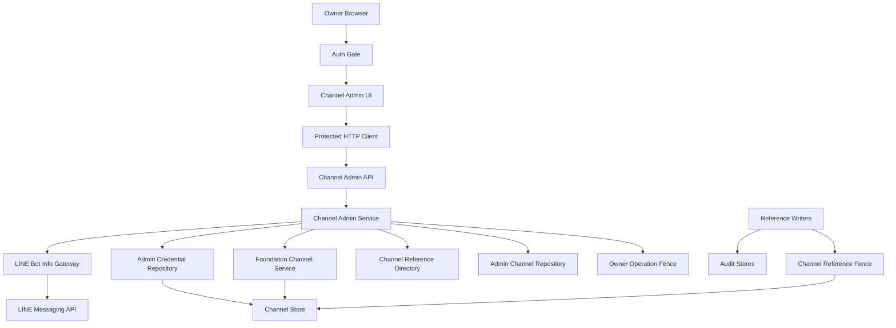
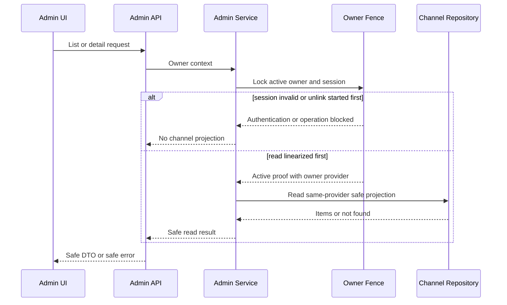
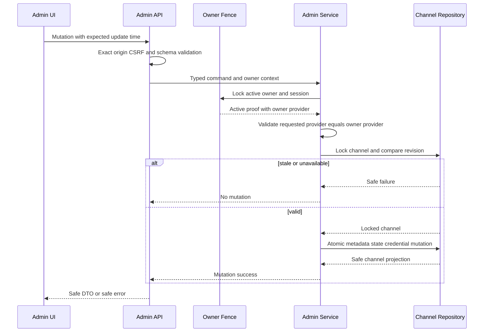
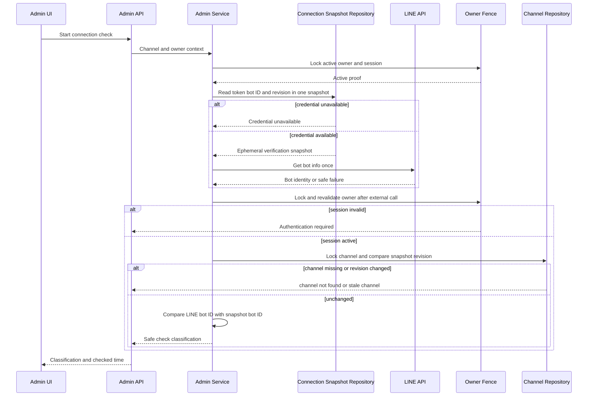
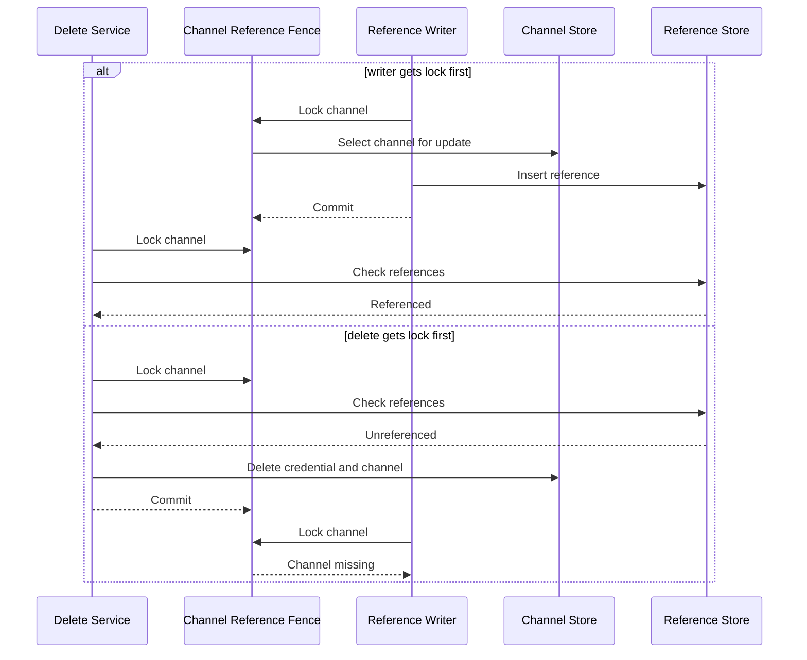
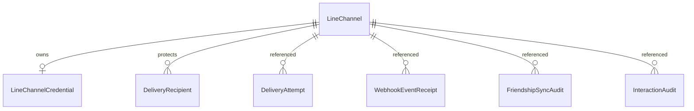

# Technical Design: LINEチャネル管理 UI

## Overview

本機能は、認証済み owner が同一 provider 配下の複数 Messaging API チャネルを一つの専用画面から安全に管理する能力を提供する。既存 `linechannels` app のチャネル、認証付き暗号化資格情報、用途別復号を拡張し、owner 限定 DRF API、React 管理画面、送信を伴わない接続確認、参照整合性を守る削除を追加する。

資格情報は入力時だけ扱う write-only データであり、保存済み平文、暗号文、部分値を HTTP 応答、Frontend state、DOM 属性、ログへ出さない。既存の owner session、exact-origin CSRF、公開 Webhook ingress、配信・監査データの所有権は維持し、管理機能は公開 Protocol を介して統合する。

### Goals

- owner が有効・無効を含む全チャネルの安全な非秘密情報、設定状態、Webhook URL を確認できる。
- 登録と legacy provider backfill を owner の LINE identity と同一 provider に限定する。
- 登録、部分更新、完全資格情報 pair 置換、有効化、無効化、未使用チャネル削除を競合に強い原子的操作として提供する。
- 保存済みアクセストークンで LINE bot identity を一回確認し、秘密値を含まない結果分類だけを返す。
- 読み込み、空、入力エラー、通信失敗、処理中、結果不明から明示操作で回復できる。

### Non-Goals

- 暗号化 keyring の管理、生成、ローテーション UI
- 保存済み資格情報の表示、コピー、export、削除だけを行う操作
- 複数管理者、RBAC、管理操作履歴、接続確認履歴、定期監視
- LINE Developers Console、LINE Official Account Manager、Webhook 設定の自動変更
- 配信先管理、メッセージ配信、利用量・課金管理
- owner の LINE identity と異なる provider のチャネル管理

## Boundary Commitments

### This Spec Owns

- `linechannels` が権威を持つチャネル metadata、資格情報設定状態、資格情報 pair 置換、active lifecycle の owner 管理契約
- owner/session の状態変更と一覧・詳細取得を `OwnerAccount` lock root で線形化する read 契約
- owner provider と登録・legacy backfill provider の完全一致契約
- owner 限定チャネル管理 HTTP API と秘密値を含まない JSON DTO
- 検証済み公開 origin と既存 ingress path から導出するチャネル別 Webhook URL
- 同一 revision のアクセストークン、bot user ID、チャネル更新時刻を検証対象とする read-only bot info 接続確認と安全な分類
- チャネル削除と既存5種の参照 writer が共有する `ChannelReferenceFence`
- Frontend の DTO 検証、HTTP 手順、純粋状態遷移、管理画面、write-only form 境界

### Out of Boundary

- `lineaccounts` の owner identity、login、unlink saga、session 発行規則の再実装
- `linewebhooks` の署名・destination 検証、`delivery` の送信、`linefriendships` の projection、`lineinteractions` の command 処理
- 既存監査 UUID snapshot の FK 化、監査保持期間や cascade policy の変更
- チャネル無効化時に LINE 側 token、Webhook、公式アカウントを変更する処理
- 接続確認成功から Webhook、シークレット、配信、端末到達の成功を推論する処理

### Allowed Dependencies

- `line-channel-foundation`: `LineChannel` aggregate、validator、secret wrapper、暗号化、repository、mutation service、runtime keyring
- `line-account-linking`: `OwnerProtectedAPIView`、`OwnerPrincipal`、exact-origin CSRF、安全な API error、owner/session 永続化境界
- `line-webhook-ingress`: 公開 URL path contract と Webhook 参照 writer
- `line-friendship-sync`、`line-webhook-command-dispatch`、`linked-recipient-delivery`: 参照存在判定と `ChannelReferenceFence` を利用する writer
- Django 6.0.7、DRF 3.17.1、MySQL 8.4、`line-bot-sdk` 3.25.0、React 19.2.7、TypeScript 6.0.3、既存 `ProtectedHttpClient`
- Frontend からの通信は同一 origin の相対 `/api/...` に限定し、LINE API と MySQL への直接アクセスを禁止する。

### Revalidation Triggers

- `OwnerPrincipal`、owner session、有効期限、unlink lock root、exact-origin CSRF の契約変更
- `LineChannel.public_id`、`provider_id` nullable/backfill、`updated_at` 精度、資格情報暗号文 context の変更
- Webhook ingress の公開 prefix、canonical UUID path、`NGROK_DOMAIN` 由来 origin の変更
- 新しいチャネル参照 table または UUID writer の追加、既存 writer の transaction ownership 変更
- LINE bot info endpoint、SDK exception/status、retry、timeout の契約変更
- Frontend が秘密値を reducer、router、永続 storage、telemetry へ渡す変更

## Architecture

### Existing Architecture Analysis

- `linechannels` は Model、暗号、Repository、Service、Management Command を分離し、秘密値を用途別 wrapper と safe result に閉じ込める。
- `lineaccounts` は `OwnerProtectedAPIView` で owner session、active permission、exact Origin、CSRF を共通化し、`OwnerAccount` singleton を unlink と管理 read/mutation の線形化点にする。
- Frontend は `*Dto.ts`、`*Api.ts`、`*State.ts`、Component の flat 構造を採用し、境界の `unknown` を実行時検証する。
- 配信・Webhook・friendship・interaction 監査はチャネル UUID snapshot を保持し、チャネルへの FK を持たない。この audit lifecycle は維持する。

### Architecture Pattern & Boundary Map



**Architecture Integration**

- Selected pattern: 既存 Django app 内の vertical slice と ports/adapters。チャネル管理は `linechannels` に集約し、owner 認可と外部 LINE 呼出しは狭い port で分離する。
- Domain boundaries: `linechannels` はチャネル管理と reference fence、`lineaccounts` は owner fence、各下流 app は自分の参照 record 作成を所有する。
- Existing patterns preserved: transaction を Service が所有、外部通信は transaction 外、safe union、runtime composition、Frontend DTO/API/state/UI 分離。
- New components rationale: owner/session と削除 race は既存 View 認可・FK だけでは閉じないため、readとmutationで共有する `OwnerOperationFence` と `ChannelReferenceFence` を追加する。接続確認は送信 gateway と責務を混ぜず、開始時 snapshot と完了時 revision 検証を分離する。
- Dependency direction:
  - Backend: `admin_types/validators → models/crypto → repositories/fences/gateway → services → presenters/serializers → views/container`
  - Frontend: `channelAdminDto → channelAdminApi → channelAdminState → Components → App`
  - 各層は左側だけを import し、`linechannels` の application 層は `lineaccounts` Model や下流 Model を直接 import しない。

### Technology Stack

| Layer | Choice / Version | Role in Feature | Notes |
|-------|------------------|-----------------|-------|
| Frontend | React 19.2.7、TypeScript 6.0.3、Vite 8.1.4 | 管理画面、型付き DTO/API/state | 新規依存なし、strict、`any` 禁止 |
| Backend | Python 3.14、Django 6.0.7、DRF 3.17.1 | owner API、transaction、serializer | 既存 safe exception handler を拡張 |
| Data | MySQL 8.4 | channel/credential row lock、参照存在判定 | schema migration なし |
| External | `line-bot-sdk` 3.25.0 | `get_bot_info()` による接続確認 | retries=0、bounded timeout |
| Security | `cryptography` 49.0.0 | 既存資格情報の認証付き暗号 | keyring と暗号方式は変更しない |

## File Structure Plan

### Directory Structure

```text
backend/
├── config/
│   └── urls.py                                  # 管理API prefixをlinechannelsへ接続
├── linechannels/
│   ├── admin_types.py                           # 管理command、safe result、portの型
│   ├── admin_repositories.py                    # owner provider投影、接続確認snapshot、削除参照query
│   ├── admin_gateway.py                         # LINE bot info read-only adapter
│   ├── admin_services.py                        # owner管理use caseとtransaction調停
│   ├── admin_serializers.py                     # write-only入力とsafe出力schema
│   ├── admin_presenters.py                      # safe DTOとWebhook URLの構築
│   ├── admin_views.py                           # OwnerProtectedAPIView HTTP境界
│   ├── reference_fence.py                       # 共有row lockと参照probe合成contract
│   ├── urls.py                                  # collection detail state check route
│   ├── container.py                             # 管理serviceを含む依存合成
│   └── tests/
│       ├── test_admin_repositories.py
│       ├── test_admin_gateway.py
│       ├── test_admin_services.py
│       ├── test_admin_api.py
│       ├── test_admin_security.py
│       └── test_reference_fence.py
├── lineaccounts/
│   ├── admin_authorization.py                   # read/mutation共通OwnerOperationFence adapter
│   ├── recipient_services.py                    # recipient作成前にreference fence取得
│   ├── repositories.py                          # owner session lockとrecipient参照probe
│   └── tests/
│       ├── test_admin_authorization.py
│       └── test_recipient_services.py
├── delivery/
│   ├── types.py                                 # fence失敗を表すAttemptTargetUnavailable
│   ├── repositories.py                          # attempt作成前にreference fence取得
│   ├── services.py                              # LINE送信前のsafe channel_unavailable写像
│   └── tests/test_repository_concurrency.py
├── linewebhooks/
│   ├── types.py                                 # receipt channel unavailable結果
│   ├── repositories.py                          # receipt作成前にreference fence取得
│   ├── services.py                              # 公開受付のsafe rejected/storage写像
│   └── tests/test_concurrency.py
├── linefriendships/
│   ├── types.py                                 # audit fence失敗結果
│   ├── repositories.py                          # audit作成前にreference fence取得
│   ├── services.py                              # projection rollbackとsafe失敗写像
│   └── tests/test_concurrency.py
└── lineinteractions/
    ├── types.py                                 # audit fence失敗結果
    ├── repositories.py                          # audit作成前にreference fence取得
    ├── services.py                              # 外部作用前後のsafe失敗写像
    └── tests/test_repositories.py

frontend/
├── src/
│   ├── channelAdminDto.ts                       # unknown応答のexact runtime検証
│   ├── channelAdminApi.ts                       # 管理API HTTP手順とsafe error
│   ├── channelAdminState.ts                     # 非秘密の純粋状態遷移
│   ├── ChannelAdminConsole.tsx                  # 一覧 詳細 空 error retry の統括
│   ├── ChannelEditor.tsx                        # 登録 更新のuncontrolled秘密入力
│   ├── ChannelActions.tsx                       # copy 状態変更 接続確認 削除確認
│   ├── App.tsx                                  # AuthGate配下へ管理consoleを合成
│   └── style.css                                # 管理状態とdialog表示
└── test/
    ├── channelAdminDto.test.ts
    ├── channelAdminApi.test.ts
    ├── channelAdminState.test.ts
    ├── ChannelAdminConsole.test.tsx
    ├── ChannelEditor.test.tsx
    ├── ChannelActions.test.tsx
    └── App.test.tsx
```

### Modified Files

- `backend/linechannels/types.py` — `UpdateLineChannel` に任意の期待 revision、管理用required providerと `stale_channel` safe failure を追加する。既存 management command は期待値・required providerなしで互換動作する。
- `backend/linechannels/repositories.py` — channel lock 下で欠損資格情報行を完全 pair に限り create-or-replace できるようにする。
- `backend/linechannels/services.py` — revision 比較、owner provider との一致、provider の immutable/backfill 規則、修復と有効化の原子性を固定する。
- `backend/lineaccounts/repositories.py` — owner lock 下で session row を lock し、identity、identity provider、期限を照合する最小契約を追加する。
- `backend/lineaccounts/errors.py` — 管理固有の固定 safe code と retryable/storage の区別を追加し、秘密入力の値を field error へ含めない。
- 各下流 `container.py` — repository へ単一 `ChannelReferenceFence` adapter を明示注入する。
- 各下流 `repositories.py` — 自 app の Model だけを読む `ChannelReferenceProbe` を公開し、管理 container が composite directoryへ合成する。
- 各下流 `types.py` / `services.py` — `channel_not_found`、`storage_retryable`、`storage_unavailable` を既存ユースケースのsafe非挿入結果へ写像し、外部作用を開始しない。
- 既存下流 repository test — reference fence 不在、削除競合、既存成功契約の回帰を追加する。

## System Flows

### owner-protected read



一覧・詳細は短い read transaction で owner → session の順に lock し、safe projection の materialize まで同じ transaction に含める。unlink が先に `OwnerAccount` を変更した場合は情報を返さず、read が先に lock を取得した場合は unlink より前の取得として完了する。暗号文の取得や復号は行わない。

### owner mutation



Lock 順序は owner → session → channel とする。Frontend は mutation 応答が失われた場合に成功を推測せず、資格情報欄を消去して明示再取得を要求する。

### read-only connection check



接続確認の開始 snapshot は単一 DB query で access token、保存済み bot user ID、`updated_at` を一貫して取得する。LINE 呼出し中は transaction と row lock を保持せず、自動再試行しない。応答後は owner → session → channel の順に短く lock して revision を再検証し、変更済みなら LINE 結果を破棄して `stale_channel` を返す。結果は永続化しない。

### delete and reference creation



削除側だけの二重確認には依存しない。全 reference insert は同じ transaction 内で fence を先に取得する。delete先行で `channel_not_found` となった writer は insert と後続外部作用を行わず、下記の writer別 safe result へ収束する。storage failure も同じ transaction を rollback し、`retryable` と `storage_unavailable` を既存ユースケースが扱える分類へ保持する。

## Requirements Traceability

| Requirement | Summary | Components | Interfaces | Flows |
|-------------|---------|------------|------------|-------|
| 1.1, 1.2, 1.6 | owner限定提供、未認証拒否、read線形化 | AdminAPI、OwnerOperationFence、ChannelAdminConsole | owner session、safe error | owner-protected read |
| 1.3, 1.4 | exact originとCSRF、失敗時無変更 | AdminAPI、ProtectedHttpClient | Origin、CSRF cookie/header | owner mutation |
| 1.5 | 操作中失効を成功表示しない | OwnerOperationFence、ChannelAdminService、ChannelAdminState | session再検証 | owner mutation、connection check |
| 2.1, 2.2 | 全チャネル一覧と非秘密詳細 | AdminChannelRepository、AdminPresenter、ChannelAdminConsole | `ChannelAdminItem` | 一覧取得 |
| 2.3, 2.4, 2.5 | 設定状態と秘密非露出 | AdminChannelRepository、AdminSerializer、ChannelAdminDto | `credentialsState` | 一覧取得 |
| 2.6 | 不在の安全な結果 | AdminChannelRepository、AdminAPI | `channel_not_found` | 詳細取得 |
| 3.1, 3.2 | 完全登録とopaque ID | ChannelAdminService、FoundationChannelService | `CreateChannelRequest` | owner mutation |
| 3.3, 3.4, 3.5, 3.6 | label、ID、bot ID、pair検証 | AdminSerializer、既存Validators | field-safe validation | owner mutation |
| 3.7, 3.8 | duplicateと原子失敗分類 | FoundationChannelService、AdminAPI | `duplicate_channel`、`storage_retryable` | owner mutation |
| 3.9 | ownerと同一providerだけを登録 | OwnerOperationFence、ChannelAdminService | owner provider proof、`provider_mismatch` | owner mutation |
| 4.1 | 秘密欄を空で表示 | ChannelEditor、ChannelAdminItem | uncontrolled empty inputs | 編集表示 |
| 4.2, 4.3 | 部分更新、provider維持 | ChannelAdminService、FoundationChannelService | `UpdateChannelRequest` | owner mutation |
| 4.4, 4.5, 4.6 | 空欄維持、完全pair置換、片側拒否 | ChannelEditor、AdminSerializer、FoundationChannelService | write-only pair | owner mutation |
| 4.7, 4.8, 4.9 | rollbackとsafe応答 | ChannelAdminService、AdminPresenter、ChannelAdminState | safe channel DTO | owner mutation |
| 4.10 | legacy provider backfillのowner一致 | OwnerOperationFence、FoundationChannelService | owner provider proof、`provider_mismatch` | owner mutation |
| 5.1, 5.2 | 履歴保持無効化と表示 | ChannelAdminService、ChannelActions | `SetChannelStateRequest` | owner mutation |
| 5.3, 5.4, 5.5 | 安全な有効化と同時修復 | FoundationChannelService、AdminChannelRepository | credential availability | owner mutation |
| 5.6 | 不在・状態競合 | FoundationChannelService、ChannelAdminState | `expectedUpdatedAt`、`stale_channel` | owner mutation |
| 6.1, 6.4 | 検証済みoriginとopaque URL | AdminPresenter | `webhookUrl` | 一覧取得 |
| 6.2 | 同一値のcopyと通知 | ChannelActions | Clipboard API | copy |
| 6.3 | inactive併記 | ChannelActions、ChannelAdminConsole | `active` + `webhookUrl` | 一覧表示 |
| 6.5 | Consoleを自動変更しない | ChannelAdminService | read-only URL | 一覧取得 |
| 7.1, 7.2 | 一回のbot infoとidentity一致 | LineBotInfoGateway、ChannelAdminService | `ConnectionCheckResult` | connection check |
| 7.3, 7.4, 7.5 | credential不可、認証失敗、不一致 | AdminCredentialRepository、LineBotInfoGateway | safe check union | connection check |
| 7.6, 7.7 | rate limit、利用不能 | LineBotInfoGateway | `rate_limited`、`line_unavailable` | connection check |
| 7.8, 7.9 | raw値非露出と限定scope | LineBotInfoGateway、AdminPresenter、ChannelActions | `scope` constant | connection check |
| 7.10 | 接続確認中の設定変更をstaleへ収束 | AdminCredentialRepository、OwnerOperationFence、AdminChannelRepository | verification snapshot、`stale_channel` | connection check |
| 8.1 | 取消不能の削除確認 | ChannelActions | delete confirmation state | delete |
| 8.2, 8.3 | 直前参照確認と無効化案内 | AdminChannelRepository、ChannelAdminService | `channel_referenced` | delete |
| 8.4 | 参照作成との競合 | ChannelReferenceFence、ReferenceWriters | shared row lock | delete and reference creation |
| 8.5, 8.6, 8.7 | 対象だけの原子削除とsafe結果 | AdminChannelRepository、AdminPresenter | `DeleteChannelResult` | delete |
| 9.1, 9.2, 9.3 | loading、empty、error、retry | ChannelAdminState、ChannelAdminConsole | UI state union | 一覧取得 |
| 9.4 | 処理中と重複送信防止 | ChannelAdminState、ChannelActions、ChannelEditor | operation key | 全mutation |
| 9.5 | 値を引用しない検証表示 | AdminAPI、ChannelEditor | safe fields | owner mutation |
| 9.6, 9.7 | 成功更新と結果不明・stale後の再取得 | ChannelAdminState、ChannelAdminConsole | stale/unknown state | owner mutation、connection check |
| 9.8, 9.9 | 秘密欄消去と非保持 | ChannelEditor、ChannelAdminApi | write-only transient request | owner mutation |
| 9.10 | 自動再実行禁止 | ChannelAdminApi、ChannelAdminState | one-shot request | mutation、connection check |

## Components and Interfaces

| Component | Domain / Layer | Intent | Req Coverage | Key Dependencies | Contracts |
|-----------|----------------|--------|--------------|------------------|-----------|
| OwnerOperationFence | Backend security adapter | read/mutationとowner/session状態を線形化しprovider proofを返す | 1.1–1.6, 3.9, 4.10 | AccountRepository P0 | Service |
| AdminChannelRepository | Backend data | owner provider範囲のsafe投影、revision再検証、対象削除を提供する | 2.1–2.6, 5.3–5.6, 7.10, 8.2–8.7 | Models P0, Cipher P0 | Service, State |
| ChannelReferenceFence | Backend integration | 参照insertと物理deleteをchannel rowで直列化する | 8.2–8.5 | LineChannel P0 | Service |
| ChannelReferenceDirectory | Backend integration | 各app所有の参照probeを合成して参照有無を返す | 8.2–8.5 | ReferenceProbes P0 | Service |
| ReferenceWriters | Downstream data | fence結果をwriter固有safe resultへ写像して参照insertを制御する | 8.3, 8.4, 8.7 | ChannelReferenceFence P0 | Service |
| FoundationChannelService | Backend application | 同一provider登録、更新、state、資格情報修復を原子的に行う | 3.1–5.6 | Existing service P0 | Service |
| LineBotInfoGateway | Backend external | snapshot tokenでbot infoを一回取得し安全な結果へ縮約する | 7.1–7.10 | LINE SDK P0 | Service |
| ChannelAdminService | Backend application | owner管理use case、read線形化、接続確認revisionを調停する | 1.1–1.6, 3.1–8.7 | Fences P0, Repositories P0 | Service |
| AdminPresenter | Backend presentation | safe DTOとWebhook URLを生成する | 2.1–2.6, 6.1–6.5, 7.8–7.9 | Public origin P0 | Service |
| AdminSerializer | Backend HTTP | exact requestとwrite-only pairを検証する | 3.1–3.9, 4.1–4.10, 5.3–5.6, 9.5 | DRF P0 | API |
| AdminAPI | Backend HTTP | owner保護、endpoint dispatch、safe errorを提供する | 1.1–1.6, 2.1–9.10 | OwnerProtectedAPIView P0 | API |
| ChannelAdminDto | Frontend boundary | safe応答をunknownから検証する | 2.1–2.6, 6.1–7.9 | TypeScript P0 | Service |
| ChannelAdminApi | Frontend HTTP | typed requestと一回のHTTP手順を提供する | 3.1–9.10 | ProtectedHttpClient P0 | Service |
| ChannelAdminState | Frontend state | 非秘密の画面・operation遷移を決定する | 1.5, 9.1–9.10 | DTO P0 | State |
| ChannelAdminConsole | Frontend UI | 一覧、詳細、empty、retryを統括する | 2.1–2.6, 9.1–9.7 | State P0 | State |
| ChannelEditor | Frontend UI | 登録・更新と一時秘密入力を扱う | 3.1–4.9, 9.4–9.9 | API P0 | State |
| ChannelActions | Frontend UI | copy、state、check、delete確認を扱う | 5.1–9.10 | API P0, Clipboard P1 | State |

### Backend Security

#### OwnerOperationFence

**Responsibilities & Constraints**

- 管理 read/mutation の短い transaction 冒頭で `OwnerAccount`、対象 `OwnerSession` の順に row lock を取得する。
- principal の session ID、identity ID、owner active state、session期限を再照合し、DBから得た owner identity providerを proofへ含める。
- list/detail は safe projection の materialize まで owner lockを保持し、unlink開始との前後関係を確定する。
- connection check は開始snapshot取得時と外部応答後のrevision確認時にそれぞれ新しい短いtransactionで `lock_active()` を呼び、外部待機中はlockを保持しない。

**Dependencies**

- Inbound: `ChannelAdminService` — read、mutation、外部応答後の認可とprovider照合（P0）
- Outbound: `AccountRepository` — owner/session/identity providerのlockと照合（P0）

**Contracts**: Service [x]

```python
@dataclass(frozen=True, slots=True)
class OwnerOperationContext:
    owner_session_id: UUID
    identity_public_id: UUID

@dataclass(frozen=True, slots=True)
class OwnerActiveProof:
    identity_public_id: UUID
    provider_id: str

class OwnerOperationFence(Protocol):
    def lock_active(
        self, context: OwnerOperationContext, now: datetime
    ) -> OwnerFenceResult: ...
```

- `OwnerFenceResult` は `OwnerActiveProof`、`authentication_required`、`owner_operation_blocked`、`storage_unavailable` の safe union である。providerは request payloadや principal snapshotから採用しない。
- `lock_active()` は呼出し側 transaction を必須とし、認可失敗時に channel を取得・変更しない。

### Backend Data and Integration

#### AdminChannelRepository

**Responsibilities & Constraints**

- 一覧・詳細は owner provider と一致する行および legacy `provider_id=NULL` の行だけを対象とし、暗号文値を Python object へ materialize せず、資格情報行と両暗号文の非空有無、credential更新時刻だけを投影する。
- 接続確認snapshotは active state を条件にせず、単一queryで access token暗号文、bot user ID、channel `updated_at` を取得し、access token一項目だけを復号する。
- 接続確認完了時は owner provider範囲のchannel rowをlockし、snapshot revisionとの完全一致を確認する。
- 削除は channel lock、期待 revision、credential delete、channel delete を同一 transaction で扱う。参照有無は application service が注入済み `ChannelReferenceDirectory` へ問い合わせる。

**Dependencies**

- Inbound: `ChannelAdminService`（P0）
- Outbound: `LineChannel`、`LineChannelCredential`（P0）
- Outbound: 5種の参照 store existence query（P0）
- Outbound: `CredentialCipher`（P0）

**Contracts**: Service [x] / State [x]

```python
class AdminChannelRepository(Protocol):
    def list_for_owner_provider(
        self, owner_provider_id: str
    ) -> tuple[AdminChannelView, ...]: ...
    def get_for_owner_provider(
        self, public_id: UUID, owner_provider_id: str
    ) -> AdminChannelView | None: ...
    def lock_connection_revision(
        self,
        public_id: UUID,
        owner_provider_id: str,
        expected_updated_at: datetime,
    ) -> ConnectionRevisionResult: ...
    def lock_for_delete(
        self, public_id: UUID, owner_provider_id: str
    ) -> LockedAdminChannel | None: ...
    def delete_locked(self, channel: LockedAdminChannel) -> DeletedChannelView: ...

class AdminCredentialRepository(Protocol):
    def get_connection_snapshot(
        self, public_id: UUID, owner_provider_id: str
    ) -> AdminConnectionSnapshotResult: ...
```

- `credentials_state` は `configured | repair_required`。pair 行欠損、片方空、両方空は `repair_required`。
- `AdminConnectionSnapshot` は ephemeral `AccessToken`、`expected_bot_user_id`、timezone-aware `expected_updated_at` を持つ非直列化値で、reprと例外へtokenを含めない。
- `get_connection_snapshot()` は `SnapshotAvailable | CredentialUnavailable | ChannelNotFound | StorageUnavailable` を返す。`lock_connection_revision()` は `unchanged | stale_channel | channel_not_found | storage_*` を返す。

#### ChannelReferenceFence

**Responsibilities & Constraints**

- 呼出し側 transaction 内で canonical channel UUID の `LineChannel` row を `select_for_update()` する。
- 存在する row を lock できた場合だけ参照 insert を許可する。
- row lock を取得しない参照 writer を公開 contract 違反とする。

**Contracts**: Service [x]

```python
class ChannelReferenceFence(Protocol):
    def lock_existing(self, channel_public_id: UUID) -> ReferenceFenceResult: ...
```

- `ReferenceFenceResult` は `locked | channel_not_found | storage_retryable | storage_unavailable`。
- `DeliveryRecipient`、`DeliveryAttempt`、`WebhookEventReceipt`、`FriendshipSyncAudit`、`InteractionAudit` の writer は既存 transaction 内の insert より前に呼ぶ。

**Writer result mapping**

| Writer | `channel_not_found` | `storage_retryable` / `storage_unavailable` | Required behavior |
|--------|---------------------|---------------------------------------------|-------------------|
| `DeliveryRecipient` | 既存 `RecipientMutationFailed("channel_not_found")` | 既存safe storage error | recipientを作成せずtransaction rollback |
| `DeliveryAttempt` | 新規 `AttemptTargetUnavailable("channel_not_found")` → 既存 `TargetUnavailable("target_not_available")` / HTTP 404 | 新規 `AttemptStorageFailed(code)` → HTTP 503 `storage_unavailable` | attemptとLINE pushを開始しない |
| `WebhookEventReceipt` | 新規 `ReceiptChannelUnavailable` → `IngressRejected("channel_unavailable")` / HTTP 404 | 拡張 `ReceiptStorageFailed(code)` → `IngressRejected("storage_unavailable")` / HTTP 503 | batch先頭で一回lockし、receipt/handlerを開始しない |
| `FriendshipSyncAudit` | `FriendshipAuditStorageError("channel_not_found")` | 同errorのretryable/storage分類 | friendship projectionとauditを同一transactionでrollback |
| `InteractionAudit` | 新規 `InteractionAuditFailed("channel_not_found")` | 同resultのstorage分類 | auditを作成せず、未開始のreply/actionを開始しない。既に確定した外部結果は既存safe outcomeとしてのみ扱う |

各writerは `ReferenceFenceResult` を網羅的に処理する。`channel_not_found` を programming error や成功へ写像せず、storage分類を落とさない。公開APIの既存status/bodyを変更する場合はHTTP contract testを同じtaskに含める。

#### ChannelReferenceDirectory

**Responsibilities & Constraints**

- 各 app は自分の Model だけを読む `ChannelReferenceProbe` を公開する。
- 管理 container は recipient、delivery、webhook、friendship、interaction の5 probeを固定順序で composite directoryへ注入する。
- `linechannels` は下流 Model を import せず、最初の参照検出で `referenced` を返す。DB失敗は削除を許可せず safe storage failureへ縮約する。

**Contracts**: Service [x]

```python
class ChannelReferenceProbe(Protocol):
    def is_referenced(self, channel_public_id: UUID) -> bool: ...

class ChannelReferenceDirectory(Protocol):
    def is_referenced(self, channel_public_id: UUID) -> ReferenceCheckResult: ...
```

#### LineBotInfoGateway

**Responsibilities & Constraints**

- `MessagingApi.get_bot_info()` を一回だけ呼び、SDK retry を 0 にする。
- tokenを一時 local variable 以外に保持せず、SDK exception を文字列化しない。
- bot user ID または safe failure だけを service へ返す。

**Dependencies**

- Inbound: `ChannelAdminService`（P0）
- External: LINE Messaging API（P0）

**Contracts**: Service [x]

```python
class LineBotInfoGateway(Protocol):
    def get_bot_identity(self, access_token: AccessToken) -> BotInfoResult: ...
```

`BotInfoResult`:

- `BotIdentityReceived(bot_user_id)`
- `BotInfoFailed("authentication_failed")`
- `BotInfoFailed("rate_limited")`
- `BotInfoFailed("line_unavailable")`

401・403 は `authentication_failed`、429 は `rate_limited`、timeout・connection・その他4xx・5xx・不定形応答は `line_unavailable` とする。自動 retry は行わない。

### Backend Application

#### FoundationChannelService

既存 `DefaultLineChannelService` を互換拡張する。

- `UpdateLineChannel.expected_updated_at` が指定された場合、channel lock 後の `updated_at` と一致しなければ `stale_channel` を返す。
- 管理commandの `required_provider_id` が指定された場合、channel lock後のnon-null providerが一致するか、provider backfill対象がNULLである場合だけ進める。別providerは存在を開示しない `channel_not_found` とし、期待値を持たないmanagement commandの互換動作を維持する。
- 管理 state request は revision一致に加えて現在stateと要求stateが異なる場合だけ進め、同一状態要求を `stale_channel` とする。期待値を持たない既存 management command の互換動作は維持する。
- access token と channel secret は両方なしなら維持、完全 pair なら置換、片方だけなら全変更を拒否する。
- 欠損 credential row は完全な新 pair 指定時だけ channel lock 下で作成する。
- non-null provider は同値または未指定だけを許し、`NULL` legacy provider は一度だけ backfill できる。
- 新 pair と `is_active=True` の同時指定は primary encrypt、復号照合、credential create-or-replace、state更新を一 transaction で完了する。
- owner providerとの一致は `ChannelAdminService` がDB由来の `OwnerActiveProof` で検証してから本serviceを呼ぶ。既存management commandはowner境界を持たないため、この追加制約を暗黙適用しない。

#### ChannelAdminService

**Responsibilities & Constraints**

- read、register、update、state、delete、connection check を一つの owner 管理 use case として公開する。
- list/getは短いtransactionでowner fenceを最初に取得し、proofのprovider範囲のsafe projectionを同じtransactionでmaterializeする。
- registerはrequest provider、legacy NULL backfillは指定providerが `OwnerActiveProof.provider_id` と完全一致する場合だけ進める。不一致はchannel lock/mutation前に `provider_mismatch` とする。
- get/update/state/delete/connection checkの対象はproofのproviderと一致する行またはlegacy NULLだけに限定し、別providerのpublic IDは `channel_not_found` へ縮約する。
- ローカル mutation は owner fence を最初に取得し、外部通信は transaction 外に置く。
- connection checkは開始時の owner proof と verification snapshot、外部応答後の owner proof とchannel revisionを検証し、stale時は分類結果を返さない。
- safe result だけを API 層へ返す。

**Contracts**: Service [x]

```python
class ChannelAdminService(Protocol):
    def list_channels(
        self, owner: OwnerOperationContext
    ) -> ChannelListResult: ...

    def get_channel(
        self, owner: OwnerOperationContext, channel_id: UUID
    ) -> ChannelReadResult: ...

    def register(
        self, owner: OwnerOperationContext, command: RegisterAdminChannel
    ) -> ChannelMutationResult: ...

    def update(
        self, owner: OwnerOperationContext, command: UpdateAdminChannel
    ) -> ChannelMutationResult: ...

    def set_state(
        self, owner: OwnerOperationContext, command: SetAdminChannelState
    ) -> ChannelMutationResult: ...

    def delete(
        self, owner: OwnerOperationContext, command: DeleteAdminChannel
    ) -> ChannelDeleteResult: ...

    def check_connection(
        self, owner: OwnerOperationContext, channel_id: UUID
    ) -> ConnectionCheckResult: ...
```

`ConnectionCheckResult.status` は `connected | credential_unavailable | authentication_failed | identity_mismatch | rate_limited | line_unavailable`。全結果に timezone-aware `checked_at` と固定 scope `access_token_and_bot_identity_only` を含める。`stale_channel`、`channel_not_found`、認証・storage失敗はcheck statusではなくservice failureであり、LINE結果を破棄する。

### Backend HTTP

#### AdminSerializer

- `accessToken` と `channelSecret` は明示的 `write_only=True`、最大 16 KiB bytes 相当の既存 validator を通す。
- create は両方必須。update/state は両方欠落または空なら維持、両方非空なら置換、片側だけなら `credentialPair` field error。
- provider は create で必須、update では省略、同値、legacy NULL の backfill をrequest shapeとして許す。owner providerとの一致はserializer入力ではなくDB由来proofを使うserviceで検証し、不一致は `provider_mismatch`、既存non-null値との差異は `provider_immutable` とする。
- unknown key、非canonical UUID、naive datetime、余分な credential field を拒否する。

#### AdminPresenter

`ChannelAdminItem`:

| Field | Type | Rule |
|-------|------|------|
| `channelId` | canonical UUID string | opaque public ID |
| `label` | string | 非空、255文字以下 |
| `messagingApiChannelId` | numeric string | 内部連番ではない LINE channel ID |
| `botUserId` | string | canonical bot user ID |
| `providerId` | string or null | legacy未設定を明示 |
| `active` | boolean | 現在状態 |
| `credentialsState` | enum | `configured` or `repair_required` |
| `credentialsUpdatedAt` | datetime or null | 秘密値を含まない |
| `createdAt` | datetime | timezone-aware |
| `updatedAt` | datetime | mutation revision |
| `webhookUrl` | HTTPS URL | trusted origin + reversed ingress path |

Webhook URL は `settings.PUBLIC_HOST` を `build_trusted_https_origin()` で再検証し、`reverse("linewebhooks:ingress", kwargs=...)` と canonical UUID を結合する。request Host、Forwarded header、owner情報は使わない。

#### AdminAPI

| Method | Endpoint | Request | Success | Safe Errors |
|--------|----------|---------|---------|-------------|
| GET | `/api/line/channels/` | none | `{items: ChannelAdminItem[]}` | 401, 503 |
| POST | `/api/line/channels/` | `CreateChannelRequest` | `ChannelAdminItem` 201 | 400, 401, 403, 409, 422, 503 |
| GET | `/api/line/channels/{channelId}/` | none | `ChannelAdminItem` | 401, 404, 503 |
| PATCH | `/api/line/channels/{channelId}/` | `UpdateChannelRequest` | `ChannelAdminItem` | 400, 401, 403, 404, 409, 422, 503 |
| POST | `/api/line/channels/{channelId}/state/` | `SetChannelStateRequest` | `ChannelAdminItem` | 400, 401, 403, 404, 409, 422, 503 |
| DELETE | `/api/line/channels/{channelId}/` | `{expectedUpdatedAt}` | `DeletedChannelResult` | 400, 401, 403, 404, 409, 503 |
| POST | `/api/line/channels/{channelId}/connection-check/` | empty object | `ConnectionCheckResponse` | 400, 401, 403, 404, 409, 503 |

主な request:

```typescript
type CreateChannelRequest = {
  label: string
  messagingApiChannelId: string
  botUserId: string
  providerId: string
  accessToken: string
  channelSecret: string
  active: boolean
}

type UpdateChannelRequest = {
  expectedUpdatedAt: string
  label?: string
  messagingApiChannelId?: string
  botUserId?: string
  providerId?: string
  accessToken?: string
  channelSecret?: string
}

type SetChannelStateRequest = {
  expectedUpdatedAt: string
  active: boolean
  accessToken?: string
  channelSecret?: string
}
```

`DeletedChannelResult` は `{channelId, label, deleted: true}` だけを返す。connection check response は `{channelId, status, checkedAt, scope}` だけを返す。

Safe error code:

- 400: `validation_error`
- 401: `authentication_required`
- 403: `csrf_failed`、`owner_operation_blocked`
- 404: `channel_not_found`
- 409: `duplicate_channel`、`stale_channel`、`channel_referenced`
- 422: `provider_mismatch`、`provider_immutable`、`credential_unavailable`
- 503: `storage_retryable`、`storage_unavailable`

接続確認の LINE 結果は HTTP transport error にせず、200 の `ConnectionCheckResponse.status` で分類する。ただし外部呼出し後のchannel revision不一致は409 `stale_channel` とし、取得済みLINE分類をresponse bodyへ含めない。

### Frontend Boundary and State

#### ChannelAdminDto

- すべての応答を `unknown` として受け、exact key、canonical UUID、timezone-aware datetime、HTTPS URL、enum、不変条件を検証する。
- `webhookUrl` path の UUID が `channelId` と一致しない応答、余分な field、無効な enum や datetime を `protocol_error` にする。`credentialsUpdatedAt` は credential 行の最終更新時刻であり、repair状態でも既存行があれば non-null を許す。
- DTO 型に access token、channel secret、ciphertext field を定義しない。

#### ChannelAdminApi

```typescript
interface ChannelAdminApiClient {
  listChannels(): Promise<ChannelAdminItem[]>
  getChannel(channelId: string): Promise<ChannelAdminItem>
  register(input: CreateChannelInput): Promise<ChannelAdminItem>
  update(channelId: string, input: UpdateChannelInput): Promise<ChannelAdminItem>
  setState(channelId: string, input: SetChannelStateInput): Promise<ChannelAdminItem>
  delete(channelId: string, expectedUpdatedAt: string): Promise<DeletedChannel>
  checkConnection(channelId: string): Promise<ConnectionCheck>
}
```

- 各 method は `ProtectedHttpClient.request()` を一回だけ呼ぶ。
- network error、protocol error、safe API error を discriminated error へ変換するが、secret request body を Error object へ保持しない。
- 401 は既存 `onSessionInvalid` を通して AuthGate の再取得へ接続する。

#### ChannelAdminState

```typescript
type ChannelAdminState =
  | { state: 'idle' }
  | { state: 'loading' }
  | { state: 'empty'; operations: OperationStateMap }
  | { state: 'ready'; items: ChannelAdminItem[]; operations: OperationStateMap }
  | { state: 'load_failed'; error: SafeClientError }
  | { state: 'refresh_required'; reason: 'unknown_result' | 'stale_channel' }
```

- `OperationStateMap` の key は `create` または `${channelId}:${operationKind}`。同じ key の二重開始を拒否し、他チャネルの独立 read-only 表示は維持する。
- state action と state に秘密 input を含めない。mutation success は server DTO だけで item を置換する。
- request generation が古い一覧・詳細応答を破棄する。mutation と connection check は自動再実行しない。
- network unknown の mutation は optimistic update せず `refresh_required` にする。
- connection checkの `stale_channel` も一時結果を消去して `refresh_required` にし、最新DTO取得後のowner明示操作だけで再確認する。

### Frontend UI

#### ChannelAdminConsole

- AuthGate の authenticated state でだけ mount する。
- loading、empty + 新規登録導線、safe load error + 明示 retry、ready 一覧を排他的に表示する。
- active/inactive、credential repair、provider legacy null、Webhook URL を取り違えない行・詳細構造で表示する。

#### ChannelEditor

- create と edit で非秘密 field を controlled または reducer外 local state にできるが、秘密欄は uncontrolled input とする。
- edit の秘密欄は常に空で、既存値やマスク文字列を `value`、`defaultValue`、`placeholder`、`data-*` へ入れない。
- submit 時に pair を一度だけ読み、Promise settle の `finally` で `form.reset()` する。失敗時も再入力を要求する。
- `autocomplete="off"` を補助指定するが、これだけを秘密保護の根拠にしない。

#### ChannelActions

- copy は表示済み `webhookUrl` と同じ DTO field を `navigator.clipboard.writeText()` へ渡し、成功・失敗を通知する。
- disable、enable、delete は対象 label、public ID、現在状態を dialog 内で再表示し、owner の明示確認後だけ API を呼ぶ。
- inactive channel の URL は表示するが受付可能・connected の持続状態として表示しない。
- connection result は一時 UI state だけに保持し、`connected` の説明へ「access token と bot identity の確認のみ」を常に併記する。

## Data Models

### Domain Model

- Aggregate root は既存 `LineChannel`。`LineChannelCredential` は同じ transaction 境界の一対一資格情報 pair。
- `AdminChannelView` は秘密値を持たない read model で、HTTP DTO と mutation revision の元になる。
- `OwnerOperationContext` は request 時の principal snapshot であり、権限やproviderの証明ではない。read/mutation transaction 内の fence が `OwnerActiveProof` をDBから生成する。
- `AdminConnectionSnapshot` は同一query時点のaccess token、bot user ID、channel revisionを束ねる非直列化value objectである。
- `ChannelReferenceFence` は永続 entity を追加せず、既存 `LineChannel` row を参照作成と削除の線形化点にする。
- `ConnectionCheckResult` は非永続 value object。

### Logical Data Model



- `DeliveryRecipient` だけが DB FK を持つ。他4 relation は `channel_public_id` 値の論理参照である。
- 物理 schema、既存 audit UUID、index、cascade policy は変更しない。
- mutation revision は `LineChannel.updated_at`。metadata、credential置換、state変更の成功時に同じ transaction で更新する。

### Consistency & Integrity

- create: channel と credential pair を同一 transaction で insert する。
- list/detail: owner/session lock → provider proof → 同一providerまたはlegacy NULLのsafe projection materialize。
- update/state: owner/session lock → channel lock → revision 比較 → validation/crypto → metadata/credential/state commit。
- delete: owner/session lock → channel lock → revision 比較 → 全参照 existence query → credential → channel delete。
- connection check: owner/session lock → 同一queryのverification snapshot → transaction外でLINEを一回呼ぶ → owner/session/channel lock → revision一致 → snapshot bot ID比較。staleなら分類を破棄し、結果は保存しない。
- result unknown 後の自動再送は行わず、最新 `updatedAt` の再取得を必須にする。

## Error Handling

### Error Strategy

- 入力、認証、業務競合、DB、暗号、外部 LINE の失敗を固定 safe code または connection status へ縮約する。
- serializer validation は field名だけを返し、入力値と下位 exception message を返さない。
- mutation の DB deadlock/lock timeout は `storage_retryable`、connection/storage failure は `storage_unavailable` として再試行可能性を区別する。
- Frontend network failure は commit 不明として扱い、成功 toastや optimistic state を出さない。

### Error Categories and Responses

| Category | Examples | HTTP or Status | Recovery |
|----------|----------|----------------|----------|
| Authentication | session欠落、失効、unlink中 | 401 or 403 | AuthGate再認証 |
| Request protection | Origin/CSRF不正 | 403 `csrf_failed` | page reload |
| Validation | ID形式、片側secret、unknown field | 400 `validation_error` | field修正、pair再入力 |
| Conflict | duplicate、stale revision、参照中 | 409 | 最新状態取得、無効化 |
| Credential | 欠損、破損、復号不能 | 422 または check status | 完全pair修復 |
| LINE check | auth、mismatch、429、timeout | 200 check status | 説明表示、明示再確認 |
| Storage | deadlock、timeout、接続不能 | 503 safe code | `storage_retryable`だけ状態再取得後に明示再操作 |

### Monitoring

- 通常ログは endpoint、safe code、HTTP status、channel public UUID、所要時間だけを許可する。
- request body、serializer validated secret、ciphertext、SDK response/body/header、外部 request ID を log context に入れない。
- 接続確認は status別 count と duration を非秘密 metric として計測可能にするが、履歴 table は作らない。

## Testing Strategy

Frontend は Vitest/jsdom、Backend は Django test runner と DRF `APITestCase` を使う。全テスト定義の直前に日本語の `テストケース:` と `期待値:` コメントを置き、入力・競合操作と観測可能な結果を明記する。

### Unit Tests

- `AdminSerializer` が 3.3–3.6、4.4–4.6 の境界値、unknown key、write-only representation を検証し、canary値を errorへ返さない。
- `OwnerOperationFence` がread/mutationのowner、session、expiry、identity providerを同じlock順序で検証し、principalやpayloadのproviderをproofに採用しない（1.2、1.6、3.9、4.10）。
- `FoundationChannelService` が expected revision 一致時だけ更新し、stale、provider immutable、欠損credential修復、修復+enable rollbackを検証する（4.2–4.8、5.3–5.6）。
- `ChannelAdminService` がowner provider不一致のregister/backfillをchannel mutation前に拒否し、接続確認snapshotと完了revisionの不一致時にLINE分類を破棄する（3.9、4.10、7.10）。
- `LineBotInfoGateway` が一回の `get_bot_info()`、retries=0、bot ID、401、429、timeout、connection、5xx、不定形応答を分類し、例外/body/headerを文字列化しない（7.1–7.8）。
- 各reference writerがfenceの4結果を網羅し、`channel_not_found`とstorage分類でrecordや後続外部作用を開始しないことを検証する（8.4、8.7）。
- `ChannelAdminState` が loading/empty/ready/error、operation key重複、stale response、unknown result、明示refreshを純粋遷移として検証する（9.1–9.7、9.10）。
- `ChannelAdminDto` が exact safe DTO だけを受理し、secret様field、余分なfield、URL/ID不一致を `protocol_error` にする（2.5、6.1、6.4、7.8）。

### Integration Tests

- active owner の一覧・詳細が同一providerとlegacy provider nullのactive/inactive、configured/repair、時刻、完全Webhook URLを返し、別providerとcredential table値を応答へ含めない（1.1、2.1–2.6、3.9、6.1–6.4）。
- `APIClient(enforce_csrf_checks=True)` で全 unsafe endpoint の Origin 欠落・null・複数値・scheme/host/port差・token欠落を serializer より先に拒否し、DB無変更とcanary非露出を確認する（1.3、1.4）。
- owner認可後に unlink開始またはsession削除を競合させ、一覧・詳細・mutationが owner fence の前後いずれかへ線形化し、失効後の情報や未完了変更を成功表示しない（1.2、1.5、1.6）。
- create/update/state の unique conflict、owner provider不一致、legacy NULL backfill不一致、暗号失敗、credential row欠損、network response loss相当の再取得を検証する（3.2、3.7–3.9、4.7、4.10、5.4–5.6、9.7）。
- 接続確認が inactive channel でも同一queryのtoken・bot ID・revisionを取得し、送信APIを呼ばず、bot ID一致/不一致と全safe分類だけを返す。外部call中のmetadata/credential更新、削除、unlinkを競合させ、stale/認証失敗時にLINE分類を返さない（7.1–7.10）。
- delete と5種の参照 writerを実thread/transactionで競合させ、writer先行は `channel_referenced`、delete先行はwriter固有safe非挿入結果となり、record、LINE push/reply/action、部分削除がない（8.2–8.7）。

### UI Integration Tests

- authenticated owner が empty 一覧から登録し、秘密欄が応答待ち中の重複submitを防ぎ、成功後に空へ戻り、一覧へsafe情報だけが追加される（3.1–3.2、9.2、9.4、9.8）。
- edit画面が既存非秘密値と空の秘密欄を表示し、pair空欄でmetadataだけ更新、片側入力で全更新拒否、完全pairで置換する（4.1–4.9）。
- inactive表示、修復+enable、disable、stale conflict、network unknown後のrefresh要求を検証する（5.1–5.6、9.6–9.7、9.10）。
- Webhook URL copyの成功・失敗通知と、inactive時に受付可能と表示しないことを検証する（6.1–6.5）。
- 接続確認の全6分類を表示し、connectedにも限定scopeを併記し、再実行はowner click時だけ行う（7.1–7.9、9.10）。
- 接続確認中のchannel更新で409 `stale_channel`を受けた場合は一時分類を表示せず、`refresh_required`から最新状態を明示取得する（7.10、9.7、9.10）。
- 参照中deleteが無効化案内へ収束し、未参照deleteだけが確認対象チャネルを一覧から除く（8.1–8.7）。

### Performance and Concurrency

- 一覧 query がチャネル数に対して定数回で、暗号文 bytes を取得・復号しないことを query capture で確認する。
- delete参照確認は各参照 store の `exists` 一回以内とし、N+1を発生させない。
- connection check の timeout upper bound と SDK retry 0 を検証し、開始snapshotと完了revision検証の間にDB transaction/row lock が保持されないことを確認する。
- read/mutation/connection completionのowner → session → channel lock order、deadlock、lock timeout を実DB concurrency testで検証し、safe retryable failureへ縮約する。

## Security Considerations

- `OwnerProtectedAPIView`、exact HTTPS Origin、CSRF tokenを全 unsafe endpointで必須にし、permissionだけでCSRFを代替しない。
- access token と channel secret は explicit write-only、最大16 KiB、完全pairだけを受理する。API schemaとFrontend型の出力側に秘密fieldを定義しない。
- `ChannelEditor` は秘密を uncontrolled input に限定し、`value`、`defaultValue`、`placeholder`、DOM属性、URL、reducer、storage、error、telemetryへ複製しない。
- 接続確認は active policyを緩めた汎用credential repositoryを作らず、管理目的に限定した専用 port とする。
- provider一致はrequest値ではなくowner/session lock下で取得したidentity providerを信頼し、別providerの一覧・詳細・登録・backfill・接続確認を許可しない。
- Webhook URLはtrusted runtime originから生成し、Host/Forwarded header、owner identity、内部PK、sessionを含めない。
- CSP/XSSやbrowser password managerは既存Frontend security境界に従う。`autocomplete`属性だけを秘密保護の保証にしない。

## Performance & Scalability

- 個人向け少数チャネルを前提とし pagination、cache、background job は追加しない。
- 一覧は一つの safe projection query、詳細は一つの row query、credential復号は明示 mutation/接続確認時だけ行う。
- 接続確認は同じ画面操作keyで重複開始を防ぎ、LINE 429を自動retryしない。
- チャネル数または参照tableが増え、一覧・削除 query budget を超える場合は pagination と reference index を別途再評価する。

## Migration and Rollout

- schema migration と data migration は不要である。
- rollout順序は、reference fence contract → 全既存 writer統合 → 管理 repository/service/API → Frontend UI → concurrency/security/regression validation。
- Frontend を有効化する前に全 writer が fence を利用していることを検証する。APIを先に配置しても AuthGate と owner protectionは維持する。
- rollback時はFrontend管理consoleを外しても、新しい writer fence を残す。fenceを先に戻すと旧API経由のdelete raceが再発するため、管理API停止後にのみ検討する。
