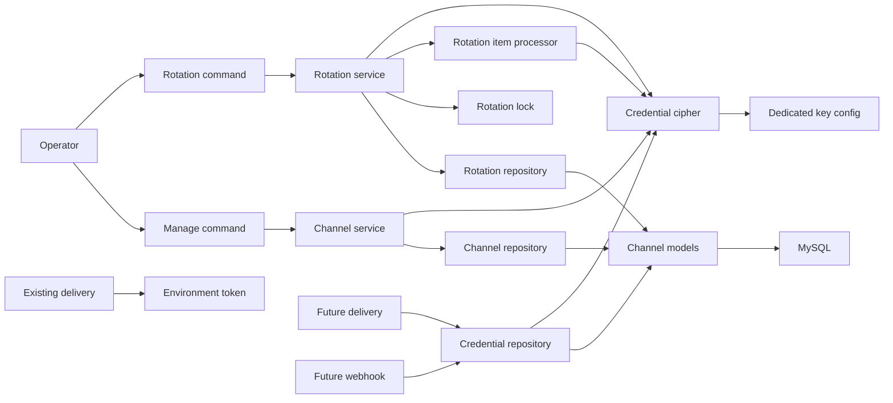
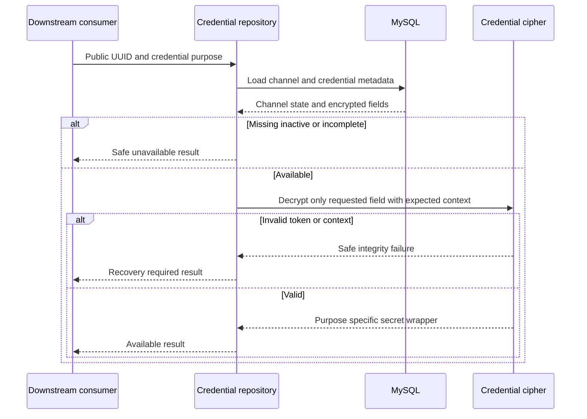
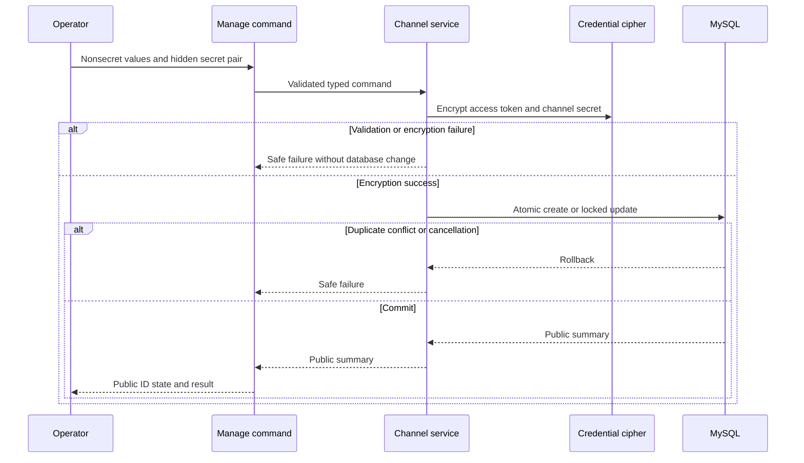
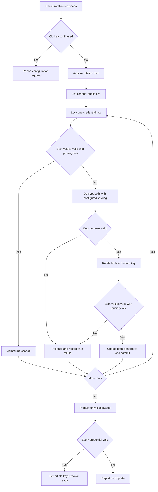
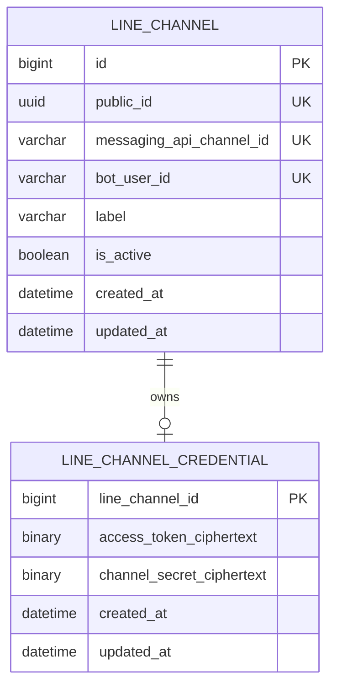

# 技術設計書

## Overview

本機能は、個人開発者が複数の LINE Messaging API チャネルを安全に登録・無効化・再有効化し、後続の配信処理と Webhook 処理が用途に必要な資格情報だけを取得できる共通 Backend 基盤を提供する。チャネルの非秘密メタデータと、認証付き暗号で保護したアクセストークン／チャネルシークレットを MySQL に永続化する。

新しい `linechannels` Django app がチャネル、暗号化、用途別 repository、対話式管理コマンド、中断可能な鍵ローテーションを所有する。既存 `delivery.LINEGateway` の環境変数契約と配信 API は変更せず、後続仕様が明示的に新 repository へ移行する。

### Goals

- 複数チャネルを不透明な公開 UUID、LINE の識別情報、名称、有効状態で一意に管理する。
- 資格情報を用途別に独立して認証付き暗号化し、平文・暗号文・鍵を通常の表示やログへ露出しない。
- 専用 keyring を起動時に fail-fast 検証し、新規 write は現用鍵、移行中の read は現用鍵と旧鍵を使用する。
- 資格情報を扱う Backend では Django の SQL query capture を無効にし、暗号文がデバッグ情報へ残らない実行条件を強制する。
- 登録・更新・有効化・無効化と、検証済みの中断可能な鍵ローテーションを管理 UI なしで実行できるようにする。

### Non-Goals

- React 管理画面、DRF のチャネル管理 API、Django Admin による資格情報管理
- LIFF／LINE Login、配信先、Webhook 受付・署名検証・イベント処理
- 既存固定宛先配信のチャネル選択対応、`delivery.LINEGateway` の資格情報取得変更
- LINE API を使った資格情報の接続確認、token 発行・失効、Basic ID 自動取得
- 外部 KMS、複数管理者 RBAC、秘密値または暗号文の表示・コピー・export
- Backend host/process 侵害、DB 行削除、古い正当な DB snapshot への rollback の防止

## Boundary Commitments

### This Spec Owns

- `LineChannel` の公開 UUID、Messaging API channel ID、bot user ID、運用者向け名称、有効状態、作成・更新日時
- `LineChannelCredential` のアクセストークン暗号文、チャネルシークレット暗号文、資格情報更新日時
- 専用 keyring の形式検証、認証付き暗号化、用途 context の完全性検証、複数鍵での復号
- 公開 UUID を入力とする送信用アクセストークン／Webhook 検証用シークレットの用途別 typed repository 契約
- チャネル登録・指定項目更新・有効化・無効化の transaction と安全な失敗分類
- 対話式 bootstrap/update command と、行単位で再開可能な rotation command
- 本基盤が生成する stdout、stderr、例外、モデル文字列表現、通常ログの秘密非露出
- Django DEBUG query capture と MySQL general query log を無効にした資格情報操作の実行境界

### Out of Boundary

- `delivery` app、Frontend、公開 URL/API、LINE SDK gateway の変更
- 後続機能におけるチャネル所有権、配信先、Webhook signature、イベント、友だち状態の管理
- 秘密値を読み戻す汎用 `decrypt_all`、model property、serializer、admin action、export command
- 暗号化鍵の生成・安全な配布・DB 外 backup・最終破棄を自動化する機能
- 資格情報暗号文と同じ DB に鍵を保存する構成、`SECRET_KEY` の鍵利用、暗黙の既定鍵
- 同一チャネル・同一用途の過去の正当な暗号文 replay 防止。これは外部 KMS/単調 version を必要とする将来境界とする。

### Downstream Extension Contract

- `LineChannel`の長期的なデータ所有者は`linechannels`とする。後続の`line-account-linking`仕様は、本基盤の資格情報契約を変更せず、非秘密の`provider_id`とread-onlyのチャネルdirectory契約を互換的に追加できる。
- `line-account-linking`はその拡張に必要なmigration、legacy backfill、入力検証、management command、safe projection、regression testを所有する。本基盤の既存実装タスクに暗黙に追加しない。
- directoryは`public_id`、運用者向け名称、`provider_id`、有効状態だけを返し、Messaging API channel ID、bot user ID、credential state、暗号文を含めない。
- `CredentialRepository`、認証付き暗号、用途別復号、ローテーション、秘密非露出の既存契約はこの拡張で変更しない。

### Legacy Environment Variable Migration

| Variable | This Spec Completion | Removal Point |
|----------|----------------------|---------------|
| `LINE_CHANNEL_SECRET` | DB 登録後は環境変数から削除する。`compose.yaml` の Backend 注入と `.env.example` の項目も本仕様で削除する | `line-channel-foundation` |
| `LINE_CHANNEL_ACCESS_TOKEN` | DB にも保存するが、既存 `delivery.LINEGateway` の互換性のため環境変数を一時的に維持する | `linked-recipient-delivery` が `CredentialRepository` 利用へ移行し、既存配信回帰テストが通過した時点 |
| `LINE_USER_ID` | 本仕様の資格情報管理対象ではないため維持する | 後続の配信先管理・配信移行仕様 |

この段階的移行により、本仕様完了直後はアクセストークンだけが DB と環境変数に重複して存在する。これは既存配信を壊さないための明示的な暫定状態であり、新規 `linechannels` 処理は環境変数の token/secret を参照しない。operator は DB への登録確認後、実際のローカル `.env` から `LINE_CHANNEL_SECRET` を削除する。

### Allowed Dependencies

- Django 6.0.7 の app 初期化、ORM、transaction、management command
- MySQL 8.4 InnoDB の一意制約、行 lock、transaction、command 二重起動防止用 advisory lock
- `cryptography==49.0.0` の Fernet/MultiFernet recipes API
- Backend にだけ注入される `LINE_CHANNEL_CREDENTIAL_KEYS` 環境変数
- Python 3.14 の `uuid`、`dataclasses`、`typing`、`getpass`、`json` 標準機能

### Runtime Configuration Contract

#### Credential keyring grammar

- `LINE_CHANNEL_CREDENTIAL_KEYS` の raw value は ASCII の `FERNET_KEY(,FERNET_KEY)*` とする。先頭要素が現用鍵、後続要素が読取専用の旧鍵である。
- 区切りは ASCII comma 1文字だけとし、先頭末尾の comma、空要素、空白文字、quote、改行を拒否する。parser は値を trim または補正しない。
- 各要素は URL-safe Base64 で表現した canonical な32 byte Fernet keyでなければならない。decode後の32 byte列を再encodeした値が入力と一致しない場合は拒否する。
- 重複は decode後の key bytes で判定する。1件以上を必須とし、設定値・要素番号・入力断片を例外へ含めない。
- ドキュメント上の `<primary-fernet-key>,<old-fernet-key>` は説明用 placeholder であり、`.env.example` は空値のままにする。実鍵は runtime configuration と同時に更新する README の one-shot 生成手順で operator が `.env` へ設定する。
- raw value は Django setting として定義しない。`linechannels.runtime` だけが `os.environ` から直接読み、検証後は immutable な keyring object だけを process-private state に保持する。これにより `diffsettings` 等の settings 列挙経路へ鍵を載せない。
- `backend/config/test_settings.py` は明示的な test settings module とし、base settings の import より前に Fernet key を毎回生成して当該test processの environment へ注入し、`DJANGO_DEBUG=false` を強制する。固定鍵を source、fixture、snapshotへ保存せず、本番 settings には test key の生成や fallback を追加しない。
- Backend 全 test の標準実行は `python manage.py test --settings=config.test_settings` とする。未設定・不正鍵・`DEBUG=True` の startup test は `config.settings` を使う子 subprocess へ対象 environment を明示して検証する。

#### Debug and database logging invariant

- `linechannels` を登録した Backend は `settings.DEBUG is False` を必須とする。`LineChannelsConfig.ready()` は keyring 検証と同じく DB access 前に `DEBUG=True` を秘密値なしの `ImproperlyConfigured` で拒否する。
- `django.db.backends` は `WARNING` 以上、`propagate=False` とし、SQL/parameter handlerを持たせない。`DEBUG=False` により `connection.queries` と debug cursor にSQL parameterを保持させない。
- Compose の Backend default は `DJANGO_DEBUG=false` とし、MySQL `general_log=OFF` を明示する。資格情報を含むDBで general query logを有効化する運用はサポートしない。
- startup test は `DEBUG=True` を fail closed として検証し、integration test は `connection.queries`、captured log、例外、stdout/stderrに canary ciphertext が存在しないことを検証する。

依存方向は次の順序に固定する。

`types/validators → crypto/models → repositories/rotation lock → channel service/rotation item processor → rotation service → prompts/management commands`

`runtime.py` は環境変数の直接読取と検証済み keyring の private process state だけを所有し、`crypto` の純粋な key parser/validator へ依存する。`apps.py` は起動 entry point として `runtime` だけへ依存し、model/DB を参照しない。`container.py` は raw environment や Django settings を読まず、`runtime` の検証済み keyring だけを取得する。`models` と `crypto` は相互依存せず、repository より上位の layer を import しない。ローテーション開始可否は keyring を再読込せず、`CredentialCipher` が返す非秘密の `RotationReadiness` を `CredentialRotationService` が判定する。後続 app は `linechannels.models` や暗号文へ直接依存せず、`CredentialRepository` の公開 contract を利用する。

### Revalidation Triggers

- `public_id`、`messaging_api_channel_id`、`bot_user_id` の型・一意性・意味の変更
- `provider_id`の型・nullable/backfill・更新規則、または非秘密チャネルdirectoryのprojection・availability契約の変更
- `CredentialRepository` の入力、成功型、failure code、用途別復号境界の変更
- 認証済み envelope の format version、credential kind、context binding の変更
- `LINE_CHANNEL_CREDENTIAL_KEYS` の構文、先頭鍵の意味、起動時必須条件の変更
- 暗号アルゴリズム、暗号文 storage、鍵 ID/KMS 導入、rotation 完了条件の変更
- Backend startup/migration/test に必要な環境変数や Compose 起動順序の変更
- `DEBUG=False` startup invariant、Django DB logger、MySQL general query log禁止の変更
- `LineChannelRepository` または `RotationCredentialRepository` のtransaction ownership、`RotationLock` のconnection lifecycle、safe persistence error契約の変更
- 既存配信の資格情報取得を `LINE_CHANNEL_ACCESS_TOKEN` から `CredentialRepository` へ移行し、環境変数を撤去する変更
- チャネルまたは資格情報の物理削除、所有者、Admin/API 公開の導入

これらの変更時は `line-account-linking`、`line-webhook-interaction`、`linked-recipient-delivery`、`line-channel-admin-ui` の統合を再検証する。

## Architecture

### Existing Architecture Analysis

- Backend は `config` と機能別 Django app を分離し、複数責務を持つ app では Model、Service、HTTP/Gateway 境界を分ける。
- 既存 `delivery.LINEGateway` は送信時に `settings.LINE_CHANNEL_ACCESS_TOKEN` と `LINE_USER_ID` を読む。このため access token 環境変数だけは本仕様後も暫定維持し、後続 `linked-recipient-delivery` で repository 利用へ移行後に削除する。`LINE_CHANNEL_SECRET` は現行配信で未使用なので、本仕様で環境変数注入を削除できる。
- Backend は `python manage.py migrate` 後に server を起動するため、app の keyring/`DEBUG=False` 検証は migration、test、すべての management command より前にも実行される。
- 資格情報の永続化・暗号・管理 command は既存にないため、既存 app へ混在させず新しい `linechannels` app に閉じる。

### Architecture Pattern & Boundary Map

独立 Django app 内の layer 分離を採用する。交換可能性が必要な暗号と後続 app 向け取得だけを明示 contract とし、汎用 port/adapter 群は追加しない。



**Architecture Integration**:

- **Selected pattern**: 独立 Django app + application service/repository/crypto layer。チャネル状態と秘密処理の ownership を一箇所に保つ。
- **Domain/feature boundaries**: `linechannels` は資格情報を安全に渡すところまでを所有し、配信/Webhook の業務判断と LINE API 呼出しを所有しない。
- **Existing patterns preserved**: app-local model/service/test、明示 transaction、安全な error classification、Docker Compose による環境注入。
- **New components rationale**: Cipher は暗号詳細と非秘密readinessを隔離し、Repository は通常mutation・用途別取得・rotation行操作を分離する。RotationLockはconnection scope、RotationItemProcessorは1pairの暗号判定、Serviceはtransactionと全件orchestration、PromptsはTTY安全性を所有する。
- **Steering compliance**: 秘密は Backend のみ、MySQL へ平文を保存しない、既存配信の固定設定と外部作用を変更しない。

### Technology Stack

| Layer | Choice / Version | Role in Feature | Notes |
|-------|------------------|-----------------|-------|
| Backend | Python 3.14 / Django 6.0.7 | typed contract、ORM、transaction、app startup、management command | DRF/Frontend endpoint は追加しない |
| Cryptography | `cryptography==49.0.0` | Fernet 認証付き暗号、MultiFernet 複数鍵 read/rotate | 新規固定依存。Python 3.14 wheel 対応 |
| Data | MySQL 8.4 InnoDB | チャネル、2暗号文、一意制約、行 lock | 暗号文は unindexed binary storage |
| Runtime | Docker Compose | 専用 keyring を Backend のみに注入 | 既定鍵を持たず、未設定は起動失敗 |

## File Structure Plan

### Directory Structure

```text
backend/
├── linechannels/
│   ├── __init__.py
│   ├── apps.py                         # DBを読まず、起動時に専用keyringを検証する
│   ├── types.py                        # safe secret wrappers、command/result、failure code
│   ├── validators.py                   # LINE識別情報、名称、秘密入力の境界検証
│   ├── crypto.py                       # context envelope、Fernet/MultiFernet、safe crypto error
│   ├── runtime.py                      # env直接読取、keyring検証、private process state
│   ├── models.py                       # LineChannelと1対1LineChannelCredential
│   ├── repositories.py                # 通常mutation永続化と用途別資格情報取得contract
│   ├── services.py                    # 登録/更新/有効状態遷移のapplication service
│   ├── rotation_repository.py         # rotation用snapshot、行lock、暗号文pair更新
│   ├── rotation_lock.py               # MySQL advisory lockの取得、busy判定、明示解放
│   ├── rotation_item.py               # 1資格情報pairのprimary判定、rotate、再検証
│   ├── rotation.py                    # 全件orchestration、行transaction、最終sweep
│   ├── container.py                    # validated keyringからconcrete依存を組み立てるcomposition root
│   ├── management/
│   │   ├── __init__.py
│   │   ├── prompts.py                  # TTY検証、非秘密prompt、hidden秘密入力、取消分類
│   │   └── commands/
│   │       ├── __init__.py
│   │       ├── manage_line_channel.py  # action dispatch、service呼出し、安全な結果出力
│   │       └── rotate_line_channel_credentials.py # 中断・再実行可能なrotation command
│   ├── migrations/
│   │   ├── __init__.py
│   │   └── 0001_initial.py             # channel/credential schemaとDB制約
│   └── tests/
│       ├── __init__.py
│       ├── test_apps.py                # startup key validation
│       ├── test_runtime.py             # env読取、private state、settings出力非露出
│       ├── test_crypto.py              # 暗号、改変、context差し替え、複数鍵
│       ├── test_models.py              # schema、不変条件、安全な文字列表現
│       ├── test_secret_safety.py       # wrapper/result/modelの文字列化・serialization非露出
│       ├── test_query_non_exposure.py  # query capture、DB log、例外のcanary非露出
│       ├── test_line_channel_repository.py # 通常mutationのlockと原子性
│       ├── test_credential_repository.py   # 用途別単一復号とsafe failure
│       ├── test_service_registration.py    # 登録、重複、暗号失敗
│       ├── test_service_updates.py         # 部分更新、pair置換、状態遷移
│       ├── test_service_concurrency.py     # MySQL行lockとlost update防止
│       ├── test_command_prompts.py         # hidden入力、TTY、取消・割込み分類
│       ├── test_manage_command.py           # action dispatchと公開出力
│       ├── test_rotation_repository.py      # snapshot、行lock、単一pair更新
│       ├── test_rotation_lock.py            # busyと全終了経路のadvisory lock解放
│       ├── test_rotation_item.py            # 1行のprimary判定、rotate、再検証
│       ├── test_rotation_recovery.py        # 中断、再実行、破損行保持
│       ├── test_rotation_concurrency.py     # 通常更新競合とfinal sweep
│       └── test_rotation_command.py         # exit statusと出力非露出
└── config/
│   └── test_settings.py                # base settings読込前にephemeral test keyを明示注入
```

`tests/` は既存 Backend 規約どおり、各 test 定義直前に日本語の `テストケース:` と `期待値:` コメントを置く。MySQL の lock/一意制約に依存する test は `TransactionTestCase` と独立 connection を使う。

| Component | Concrete file |
|-----------|---------------|
| LineChannelsConfig | `backend/linechannels/apps.py` |
| safe DTO / result contracts | `backend/linechannels/types.py` |
| boundary validation | `backend/linechannels/validators.py` |
| CredentialCipher | `backend/linechannels/crypto.py` |
| RuntimeKeyring | `backend/linechannels/runtime.py` |
| LineChannel / LineChannelCredential | `backend/linechannels/models.py` |
| LineChannelRepository / CredentialRepository | `backend/linechannels/repositories.py` |
| LineChannelService | `backend/linechannels/services.py` |
| RotationCredentialRepository | `backend/linechannels/rotation_repository.py` |
| RotationLock | `backend/linechannels/rotation_lock.py` |
| CredentialRotationItemProcessor | `backend/linechannels/rotation_item.py` |
| CredentialRotationService | `backend/linechannels/rotation.py` |
| Composition root | `backend/linechannels/container.py` |
| ManageLineChannelPrompts | `backend/linechannels/management/prompts.py` |
| ManageLineChannelCommand | `backend/linechannels/management/commands/manage_line_channel.py` |
| RotateLineChannelCredentialsCommand | `backend/linechannels/management/commands/rotate_line_channel_credentials.py` |

### Modified Files

- `backend/config/settings.py` — Backend runtime integration の唯一の所有箇所として `"linechannels.apps.LineChannelsConfig"` を `INSTALLED_APPS` へ明示登録し、`django.db.backends` の SQL/parameter 出力を無効化する。`LINE_CHANNEL_CREDENTIAL_KEYS` は Django setting として定義しない。既存配信用の `LINE_CHANNEL_ACCESS_TOKEN` と固定 `LINE_USER_ID` は暫定維持し、`LINE_CHANNEL_SECRET` は引き続き読み込まない。
- `backend/config/test_settings.py` — 明示選択された test process だけで、base settings import 前に ephemeral Fernet key を生成して `LINE_CHANNEL_CREDENTIAL_KEYS` へ設定し、`DJANGO_DEBUG=false` を強制する。本番起動からは参照しない。
- `backend/requirements.txt` — Python 3.14 対応を確認した `cryptography==49.0.0` を固定する。
- `compose.yaml` — `LINE_CHANNEL_CREDENTIAL_KEYS` を Backend service だけへ渡し、Backend の `DJANGO_DEBUG=false` と MySQL `general_log=OFF` を既定・明示設定にする。未使用の `LINE_CHANNEL_SECRET` 注入を削除し、既存配信用の `LINE_CHANNEL_ACCESS_TOKEN` と `LINE_USER_ID` は暫定維持する。
- `.env.example` — `LINE_CHANNEL_SECRET` 項目を削除する。実鍵を含めず、空の専用 keyring 変数名、`DJANGO_DEBUG=false` の必須条件を示し、既存配信用 token/user ID は移行完了まで残す。
- `README.md` — Container runtime configuration と同じ技術セットアップ成果物として、keyring の厳密な comma-separated grammar、one-shot鍵生成、`DEBUG=False`/MySQL general log禁止、DB 初期登録確認後のローカル `.env` からの `LINE_CHANNEL_SECRET` 削除、rotation、backup と旧鍵撤去の運用順序を記載する。独立した文書実装境界にはしない。

`.kiro/steering/tech.md` の同期は実装ファイル変更ではなく project-memory maintenance として扱い、実装タスクの File Structure Plan には含めない。本設計の runtime/test 契約が実装・検証された時点で、別の steering 更新操作として反映する。

実装順は、`RuntimeKeyring` と `LineChannelsConfig` を先に作り、次に Backend runtime integration が `settings.py` へapp登録とlogger設定を接続する。Container runtime configurationはCompose、`.env.example`、READMEだけを所有し、`apps.py`/`settings.py`へ触れない。これによりstartup hook実装と設定統合のファイル所有権を重ねない。

変更しないファイル境界は `backend/delivery/**`、`backend/config/urls.py`、`frontend/**` である。

## System Flows

### 用途別資格情報取得



Repository は access token 要求で channel secret 列を Cipher へ渡さず、channel secret 要求でも access token 列を渡さない。返却 wrapper は安全な `repr` を持ち、cache、model、session、通常ログへ保存しない。

### チャネル登録・更新



資格情報更新は token と secret のペア置換だけを許可する。非秘密項目だけの更新では既存暗号文へ触れず、既存秘密値を表示しない。

### 中断可能な鍵ローテーション



command は旧鍵がない場合にDBへ触れず、MySQL advisory lock を取得できない場合にも走査を開始しない。各行は別 transaction とし、割込み時は処理中の1行だけ rollback する。新旧 keyring が維持されていれば、commit 済み行と未処理行の両方を読める。

## Requirements Traceability

| Requirement | Summary | Components | Interfaces | Flows |
|-------------|---------|------------|------------|-------|
| 1.1, 1.2 | 複数チャネルとLINE識別情報、名称、状態、日時 | LineChannel、LineChannelService | RegisterLineChannel | 登録・更新 |
| 1.3 | 不透明な公開識別子 | LineChannel | `public_id: UUID` | 登録・更新 |
| 1.4 | 重複時に上書きしない | LineChannel、LineChannelRepository | `duplicate_channel` | 登録・更新 |
| 1.5 | 指定チャネルだけを更新 | LineChannelService | UpdateLineChannel | 登録・更新 |
| 1.6 | 無効化して情報を保持 | LineChannelService、CredentialRepository | `set_active false` | 資格情報取得 |
| 1.7 | 完全・復号可能な資格情報で再有効化 | LineChannelService、CredentialCipher | `set_active true` | 資格情報取得 |
| 2.1, 2.2 | 2秘密の認証付き暗号化と平文非永続化 | CredentialCipher、LineChannelCredential | `encrypt` | 登録・更新 |
| 2.3 | 設定済み状態と更新日時 | LineChannelCredential、PublicChannelSummary | `credentials_configured` | 登録・更新 |
| 2.4 | 暗号化失敗時の無変更 | LineChannelService | `encryption_failed` | 登録・更新 |
| 2.5 | 改変・破損・欠損・差し替え拒否 | CredentialCipher、CredentialRepository | `integrity_failed` | 資格情報取得 |
| 2.6 | 不完全な登録拒否 | Validators、LineChannelService | RegisterLineChannel | 登録・更新 |
| 3.1 | 送信用tokenだけを復号 | CredentialRepository | `get_access_token` | 資格情報取得 |
| 3.2 | Webhook用secretだけを復号 | CredentialRepository | `get_channel_secret` | 資格情報取得 |
| 3.3, 3.4, 3.5 | 不存在・無効・設定不備 | CredentialRepository | CredentialUnavailable codes | 資格情報取得 |
| 3.6 | 復号不能を復旧必要として扱う | CredentialCipher、CredentialRepository | `credential_unreadable` | 資格情報取得 |
| 3.7 | 復号値を保持・再保存・ログしない | Secret wrappers、CredentialRepository | purpose specific result | 資格情報取得 |
| 4.1, 4.2 | 起動時の必須鍵検証 | LineChannelsConfig、RuntimeKeyring、CredentialCipher | env loader、key parser | Backend startup |
| 4.3, 4.4, 4.5 | 既定鍵・SECRET_KEY・DB鍵保存・Django setting保持の禁止 | RuntimeKeyring、Settings、LineChannelsConfig | dedicated environment | Backend startup |
| 4.6 | 現用鍵writeと旧鍵read | CredentialCipher | MultiFernet contract、RotationReadiness | 資格情報取得、鍵ローテーション |
| 4.7 | 全鍵で失敗した資格情報を利用不能化 | CredentialCipher、CredentialRepository | `credential_unreadable` | 資格情報取得 |
| 5.1, 5.2 | 対話登録と非表示秘密入力 | ManageLineChannelPrompts、ManageLineChannelCommand | typed hidden prompt | 登録・更新 |
| 5.3 | 指定項目だけの更新 | ManageLineChannelPrompts、ManageLineChannelCommand、LineChannelService | UpdateLineChannel | 登録・更新 |
| 5.4 | 取消・検証・暗号失敗の原子性 | ManageLineChannelPrompts、LineChannelService | cancelled result、atomic service result | 登録・更新 |
| 5.5 | 更新で暗黙作成しない | LineChannelService | `channel_not_found` | 登録・更新 |
| 5.6, 5.7 | 完了/エラー出力の非露出 | ManageLineChannelCommand、safe results | PublicChannelSummary | 登録・更新 |
| 6.1, 6.2 | 複数鍵開始条件、全資格情報の再暗号化、現用鍵検証 | CredentialRotationService、CredentialRotationItemProcessor、CredentialCipher | `rotation_readiness`、`rotate_all` | 鍵ローテーション |
| 6.3 | 失敗行を上書きせず安全に報告 | CredentialRotationItemProcessor、CredentialRotationService | RotationItemFailure | 鍵ローテーション |
| 6.4, 6.5 | 中断中の読取と安全な再実行 | RotationCredentialRepository、CredentialRotationService、MultiFernet | row transaction | 鍵ローテーション |
| 6.6, 6.7 | 全件検証後だけ完了 | CredentialRotationService | RotationSummary | 鍵ローテーション |
| 6.8 | rotation出力の非露出 | RotateCommand、safe results | RotationSummary | 鍵ローテーション |
| 7.1 | 文字列・Admin・API・ログ・例外の非露出 | 全 linechannels components | safe repr and errors | 全 flow |
| 7.2 | 非秘密情報だけの運用出力 | PublicChannelSummary、RotationSummary | safe result DTO | 登録・更新、鍵ローテーション |
| 7.3 | 下位例外の安全な分類 | CredentialCipher、Repositories、Services | FailureCode | 全 flow |
| 7.4 | read/copy/export操作を提供しない | Boundary、Commands | purpose specific repository only | 資格情報取得 |
| 7.5 | 既存値を表示しない置換 | ManageLineChannelPrompts、ManageLineChannelCommand | hidden replacement prompt | 登録・更新 |

## Components and Interfaces

| Component | Domain/Layer | Intent | Req Coverage | Key Dependencies | Contracts |
|-----------|--------------|--------|--------------|------------------|-----------|
| LineChannelsConfig | Runtime | DB接続前に専用keyringと安全なDEBUG条件を検証する | 4.1–4.5, 7.1 | RuntimeKeyring P0 | State |
| CredentialCipher | Security | context bound認証付き暗号と鍵素材を露出しないrotation readinessを提供する | 2.1–2.5, 4.2–4.7, 6.1–6.7, 7.3 | cryptography P0 | Service |
| LineChannel models | Data | チャネルと暗号文ペアの整合性を保持する | 1.1–1.7, 2.2–2.6, 7.1 | MySQL P0 | State |
| LineChannelRepository | Data boundary | 通常mutationのORM操作とlocked persistenceを提供する | 1.1–1.7, 2.3–2.6, 5.4–5.5 | Models P0, MySQL P0 | Service, State |
| CredentialRepository | Data boundary | 用途に必要な秘密だけを一時復号する | 3.1–3.7, 4.7, 7.1–7.4 | Models P0, Cipher P0 | Service |
| RotationCredentialRepository | Rotation data boundary | rotation用snapshot、資格情報行lock、暗号文pair更新を提供する | 6.1–6.7 | Models P0, MySQL P0 | Service, State |
| RotationLock | Rotation runtime boundary | MySQL advisory lockの取得、busy判定、全経路の明示解放を所有する | 6.1, 6.3, 6.5, 7.3 | MySQL P0 | Service |
| LineChannelService | Application | 登録、部分更新、有効状態を原子的に変更する | 1.1–1.7, 2.1–2.6, 5.3–5.5 | Repository P0, Cipher P0 | Service |
| CredentialRotationItemProcessor | Application | 1資格情報pairのprimary判定、再暗号化、primary再検証を行う | 6.1–6.5, 7.3 | Cipher P0 | Service |
| CredentialRotationService | Application | readiness gate、行transaction、全件集計、最終sweepを実行する | 6.1–6.8 | Cipher P0, Rotation repository P0, Rotation lock P0, Item processor P0 | Batch, Service |
| ManageLineChannelPrompts | Runtime input | TTY、非秘密prompt、hidden秘密入力、取消分類を所有する | 5.1–5.4, 5.7, 7.1, 7.5 | getpass P0 | Service |
| ManageLineChannelCommand | Runtime | action dispatch、service呼出し、安全な結果出力を提供する | 5.1–5.7, 7.1–7.5 | Prompts P0, LineChannelService P0 | Batch |
| RotateLineChannelCredentialsCommand | Runtime | rotationを起動し安全な集計だけを出力する | 6.1–6.8, 7.1–7.3 | RotationService P0 | Batch |
| RuntimeKeyring | Runtime | raw keyringをenvから直接読み、検証済みprivate stateだけを公開する | 4.1–4.7, 7.1 | Environment P0, credential key parser/value P0 | State |
| CompositionRoot | Runtime | validated keyringからconcrete実装を一意に構築する | 3.1–3.7, 4.1–4.7, 5.1–5.7, 6.1–6.8 | RuntimeKeyring P0, CredentialCipher P0, concrete components P0 | Factory |

### Runtime and Security

#### RuntimeKeyring

| Field | Detail |
|-------|--------|
| Intent | raw keyringをDjango settingsへ載せずに環境から直接検証し、opaqueなprocess-private stateとして共有する |
| Requirements | 4.1, 4.2, 4.3, 4.4, 4.5, 4.6, 4.7, 7.1 |

**Responsibilities & Constraints**

- `os.environ.get("LINE_CHANNEL_CREDENTIAL_KEYS")` を唯一のraw入力とし、`crypto.parse_keyring()`の成功結果だけを保存する。未設定/空/不正時はprivate stateを作らない。
- `ValidatedCredentialKeyring` は鍵値を公開するproperty/iteration/serializationを持たないopaque objectとし、`repr`/`str` はredacted markerだけを返す。許可されたconsumerは `FernetCredentialCipher` constructorだけであり、旧鍵有無をruntimeやserviceへ直接公開しない。
- `load_credential_keyring()` は起動時に一度だけ検証・保存し、同一raw設定での再呼出しは冪等とする。異なるraw値での再初期化は安全なprogramming/configuration errorとして拒否する。
- `get_validated_keyring()` は未初期化時に鍵値なしのprogramming errorを返し、環境を遅延再読込したり既定鍵を生成したりしない。

**Contracts**: State [x]

```python
class ValidatedCredentialKeyring: ...  # opaque, repr/str redacted

def load_credential_keyring() -> None: ...
def get_validated_keyring() -> ValidatedCredentialKeyring: ...
```

**Dependencies**

- Inbound: LineChannelsConfig / CompositionRoot — loadとvalidated state取得（P0）
- Outbound: credential key parser/value — raw grammar検証とopaque value構築（P0）
- External: process environment — raw keyring入力（P0）

**Implementation Notes**

- Integration: `LineChannelsConfig.ready()`だけがloadを呼び、`CompositionRoot`はgetだけを呼ぶ。Django settingsとmanagement commandはraw値を参照しない。
- Validation: canary keyが`settings`、`diffsettings`、object `repr`/`str`、例外、captured logへ現れず、未初期化getと異なるraw値での再初期化が安全に失敗することを確認する。

#### LineChannelsConfig

| Field | Detail |
|-------|--------|
| Intent | Django 初期化時に専用 keyring とDEBUG無効化を fail-fast 検証する |
| Requirements | 4.1, 4.2, 4.3, 4.4, 4.5, 7.1 |

**Responsibilities & Constraints**

- `runtime.load_credential_keyring()` を呼び、環境変数の raw value を厳密な runtime grammar で解析し、1件以上の canonical Fernet key、decode後重複なし、先頭現用鍵を検証する。
- raw value を `settings`、AppConfig attribute、例外、ログへ保持しない。AppConfig と composition root が参照できるのは `runtime.get_validated_keyring()` の immutable object だけとする。
- `settings.DEBUG is False` を検証し、true の場合はDB/modelへ触れる前に起動を拒否する。
- DB、model、`SECRET_KEY`、既定鍵生成へ依存しない。
- 検証失敗は値を含まない `ImproperlyConfigured` へ変換し、WSGI/ASGI/management command 初期化を停止する。
- `ready()` の複数呼出しに対して冪等である。

**Dependencies**

- Inbound: Django app registry — startup hook（P0）
- Outbound: RuntimeKeyring — env直接読取と純粋な形式検証（P0）
- External: Django 6.0.7 — app lifecycle（P0）

**Contracts**: State [x]

##### State Management

- State model: immutable な順序付き key list。先頭だけが write/primary verification に使われる。
- Persistence & consistency: process memory の設定であり DB へ保存しない。process 起動後の環境変更は再起動まで反映しない。
- Concurrency strategy: immutable object として共有し、呼出し側が変更できない。

**Implementation Notes**

- Integration: Compose production/dev startup は明示鍵と `DEBUG=False` を必要とする。test process は `config.test_settings` を明示選択し、Django setup 前に ephemeral key と `DEBUG=False` を注入する。未使用の `LINE_CHANNEL_SECRET` 注入は削除し、既存配信用の access token/user ID は触らない。
- Validation: 未指定、空、空要素、whitespace/quote、不正または非canonical base64/長さ、decode後重複、`DEBUG=True` を `config.settings` の子 subprocess startup test で確認する。`diffsettings` の stdout/stderr と `settings` 属性一覧に canary key が存在しないことも検証する。
- Risks: 例外へ設定値や index 周辺文字列を含めない。

#### CredentialCipher

| Field | Detail |
|-------|--------|
| Intent | 秘密値を期待チャネル・用途へ束縛して暗号化、復号、rotationする |
| Requirements | 2.1, 2.2, 2.4, 2.5, 4.2, 4.6, 4.7, 6.1, 6.2, 6.3, 6.4, 6.5, 6.6, 6.7, 7.3 |

**Responsibilities & Constraints**

- access token と channel secret を別 envelope/別 Fernet token として暗号化する。
- 構築時に受け取ったopaque keyringから、鍵素材・鍵ID・鍵数を含まない `RotationReadiness` を確定する。`ready` は現用鍵と1件以上の旧鍵、`old_key_missing` は現用鍵のみを表す。
- envelope は `format_version=1`、`channel_public_id`、`credential_kind`、`value` を持ち、復号時に期待 context と完全一致させる。
- envelope は UTF-8 JSON の固定 key set、`sort_keys=True`、余分な空白なしで符号化し、復号時は型、必須 key、余剰 key、version を厳格検証する。parse error の入力内容は例外へ含めない。
- 通常 encrypt は MultiFernet の先頭鍵だけ、通常 decrypt は設定済み全鍵、primary verification は先頭 Fernet だけを使う。
- raw `InvalidToken`、decode/serialization error、入力値を外へ出さず、`CredentialCryptoError(code)` へ変換する。
- 暗号化・復号結果を cache せず、secret wrapper の `repr`/`str` は値を表示しない。

**Dependencies**

- Inbound: Repositories/Services — 秘密処理（P0）
- Outbound: Types — context、wrapper、safe error（P0）
- External: `cryptography==49.0.0` — Fernet/MultiFernet（P0）

**Contracts**: Service [x]

##### Service Interface

```python
SecretT = TypeVar("SecretT", AccessToken, ChannelSecret)

@dataclass(frozen=True)
class CredentialContext(Generic[SecretT]):
    channel_public_id: UUID
    kind: Literal["access_token", "channel_secret"]

class CredentialCipher(Protocol):
    def rotation_readiness(self) -> RotationReadiness: ...
    def encrypt(self, value: SecretT, context: CredentialContext[SecretT]) -> EncryptedCredential: ...
    def decrypt(self, value: EncryptedCredential, context: CredentialContext[SecretT]) -> SecretT: ...
    def decrypt_with_primary(self, value: EncryptedCredential, context: CredentialContext[SecretT]) -> SecretT: ...
    def rotate(self, value: EncryptedCredential, context: CredentialContext[SecretT]) -> EncryptedCredential: ...
```

`RotationReadiness = Literal["ready", "old_key_missing"]` は `types.py` が所有する非秘密の能力分類である。`ready` でも鍵数や識別子は公開しない。

- Preconditions: secret は非空で境界 byte 上限内、context は immutable public UUID と既知 kind を持つ。
- Postconditions: 成功 token は認証済みで、primary で復号した値/context が入力と一致する。`rotation_readiness()` は `ready` または `old_key_missing` だけを返し、失敗時は secret/ciphertext/key を含まない typed error となる。
- Invariants: key list の先頭だけが write を行い、envelope version と context の不一致は完全性失敗である。readinessから鍵値、鍵ID、鍵数を復元できない。

**Implementation Notes**

- Integration: Fernet token の生成時刻露出は非秘密の資格情報更新日時と同等として許容する。
- Validation: bit flip、truncate、欠損、別チャネル swap、token/secret swap、不正 envelope、未知 version を拒否する。単一鍵と複数鍵でreadinessが正しく分岐し、その表示・例外・logに鍵情報が現れないことを確認する。
- Risks: Python object の完全な memory zeroization は保証しない。request/command scope を越えて保持しないことで境界を制限する。

### Data Boundary

#### LineChannel Models

| Field | Detail |
|-------|--------|
| Intent | 非秘密チャネル情報と完全な暗号文ペアを永続化する |
| Requirements | 1.1, 1.2, 1.3, 1.4, 1.5, 1.6, 1.7, 2.2, 2.3, 2.5, 2.6, 7.1, 7.2 |

**Responsibilities & Constraints**

- 内部 bigint PK と外部 `public_id` を分離する。
- Messaging API channel ID と bot user ID をそれぞれ DB 一意制約で保護する。
- credential は channel と1対1で、2暗号文は null/empty を許さない。同一 row の同一 transaction でだけ作成・置換する。
- disable は `is_active` だけを変更し、channel/credential を削除しない。
- credential を Django Admin/ModelForm へ公開せず、`__str__`/`__repr__` は公開 ID、状態、設定済み flag 以外を含めない。

**Dependencies**

- Inbound: Repositories — ORM access（P0）
- Outbound: Validators/Types — 非秘密値と状態（P1）
- External: MySQL 8.4 InnoDB — constraints/transaction（P0）

**Contracts**: State [x]

##### State Management

- State model: channel は active/inactive。credential は absent または complete pair であり、片側だけの configured state を持たない。
- Persistence & consistency: channel 作成と credential 作成、credential pair 置換は `transaction.atomic()`。unique/check/one-to-one 制約を最終防御にする。
- Concurrency strategy: update/activation/rotation は channel または credential 行を `select_for_update()` してから変更する。

**Implementation Notes**

- Integration: 物理 delete operation は本仕様で提供しない。将来の参照関係追加時に delete policy を再検証する。
- Validation: Django `save()` が `full_clean()` を自動実行しないため、service validation と DB constraint の両方を使う。
- Risks: `DEBUG=False` の startup invariant、`django.db.backends` の非伝播設定、Compose の MySQL `general_log=OFF` を外す変更は security revalidation trigger とする。

#### LineChannelRepository

| Field | Detail |
|-------|--------|
| Intent | serviceが所有するtransaction内で、aggregateの作成と通常mutationのlocked更新を実行する |
| Requirements | 1.1–1.7, 2.3–2.6, 5.4–5.5 |

**Responsibilities & Constraints**

- concrete実装は `DjangoLineChannelRepository` とし、ORM modelやDB例外をapplication/public contractへ公開しない。
- 通常mutationでは `LineChannelService` が `transaction.atomic()` を所有する。`create_with_credentials`、`get_for_update`、metadata/state update、credential pair置換は同じDB aliasとtransactionを使う。
- lock取得後に読み直した値だけを更新し、serviceが渡した暗号文pairを単一 `UPDATE` で保存する。repository内部で暗号化・復号しない。

**Contracts**: Service [x] / State [x]

##### Service Interface

```python
@dataclass(frozen=True)
class NewLineChannel:
    public_id: UUID
    messaging_api_channel_id: str
    bot_user_id: str
    label: str
    is_active: bool

@dataclass(frozen=True, repr=False)
class PersistedChannelMutation:
    messaging_api_channel_id: str | None = None
    bot_user_id: str | None = None
    label: str | None = None
    is_active: bool | None = None
    encrypted_credentials: EncryptedCredentialPair | None = None

@dataclass(frozen=True)
class LockedChannel:
    public: PublicChannelSummary
    encrypted_credentials: EncryptedCredentialPair | None

class LineChannelRepository(Protocol):
    def create_with_credentials(
        self, channel: NewLineChannel, credentials: EncryptedCredentialPair
    ) -> PublicChannelSummary: ...
    def get_for_update(self, public_id: UUID) -> LockedChannel | None: ...
    def update_locked(
        self, channel: LockedChannel, mutation: PersistedChannelMutation
    ) -> PublicChannelSummary: ...
```

- `create_with_credentials`、`get_for_update`、`update_locked` は呼出し側の `transaction.atomic()` 内だけで使用し、transaction外なら安全なprogramming errorとして失敗する。
- unique/deadlock/timeout/connection errorはrepositoryのsafe persistence errorへ変換し、serviceが`duplicate`、`retryable`、`storage_unavailable`へ分類する。

#### RotationCredentialRepository

| Field | Detail |
|-------|--------|
| Intent | rotation専用のsnapshot、資格情報行lock、暗号文pair更新を通常mutation repositoryから分離する |
| Requirements | 6.1, 6.2, 6.3, 6.4, 6.5, 6.6, 6.7 |

- `list_credential_public_ids()` はpublic ID昇順のimmutable snapshotを返す。final sweepは同methodで新しいsnapshotを取得する。
- `get_credentials_for_update()` と `replace_credentials_locked()` は呼出し側の行単位 `transaction.atomic()` 内だけで動作し、transaction外を安全に拒否する。
- lock取得後に読み直したpairだけを単一 `UPDATE` で置換し、暗号・集計・advisory lockを所有しない。

**Dependencies**

- Inbound: CredentialRotationService — 行単位transaction内の永続化（P0）
- Outbound: LineChannel models — 暗号文pairと公開UUID（P0）
- External: MySQL 8.4 InnoDB — locking readとtransaction（P0）

**Contracts**: Service [x] / State [x]

```python
class RotationCredentialRepository(Protocol):
    def list_credential_public_ids(self) -> tuple[UUID, ...]: ...
    def get_credentials_for_update(
        self, public_id: UUID
    ) -> EncryptedCredentialPair | None: ...
    def replace_credentials_locked(
        self, public_id: UUID, credentials: EncryptedCredentialPair
    ) -> None: ...
```

#### RotationLock

| Field | Detail |
|-------|--------|
| Intent | command二重起動防止用MySQL advisory lockのconnection lifecycleだけを所有する |
| Requirements | 6.1, 6.3, 6.5, 7.3 |

- `acquire()` は同一DB connection上でlockを取得し、busyを例外ではなく `False` として返す。
- 正常、busy、storage error、予期しない例外、`KeyboardInterrupt` の全経路で `finally` から `RELEASE_LOCK()` を1回実行する。transaction commit/rollbackを解放として扱わない。
- lock名、SQL、接続情報を結果・例外・logへ含めない。

**Dependencies**

- Inbound: CredentialRotationService — batch scope lock（P0）
- External: MySQL 8.4 — connection scoped advisory lock（P0）

**Contracts**: Service [x]

```python
class RotationLock(Protocol):
    def acquire(self) -> ContextManager[bool]: ...
```

#### CredentialRepository

| Field | Detail |
|-------|--------|
| Intent | active channel の要求された秘密だけを安全な型で返す |
| Requirements | 3.1, 3.2, 3.3, 3.4, 3.5, 3.6, 3.7, 4.7, 7.1, 7.2, 7.3, 7.4 |

**Responsibilities & Constraints**

- 公開 UUID で channel を解決し、不存在、inactive、credential absent/incomplete を復号前に分類する。
- method ごとに対象暗号文列を1つだけ Cipher へ渡し、他方を復号しない。
- secret 成功値は `repr=False` の用途固有 wrapper として返し、永続化/cache/logging を行わない。
- ORM/crypto の raw exception を公開 contract へ漏らさない。

**Dependencies**

- Inbound: Future delivery/webhook、LineChannelService — 資格情報取得（P0）
- Outbound: LineChannel models — metadata/ciphertext load（P0）
- Outbound: CredentialCipher — requested field decrypt（P0）

**Contracts**: Service [x]

##### Service Interface

```python
FailureCode = Literal[
    "channel_not_found",
    "channel_inactive",
    "credentials_incomplete",
    "credential_unreadable",
]

@dataclass(frozen=True)
class CredentialAvailable(Generic[SecretT]):
    status: Literal["available"]
    value: SecretT

@dataclass(frozen=True)
class CredentialUnavailable:
    status: Literal["unavailable"]
    code: FailureCode

CredentialResult = CredentialAvailable[SecretT] | CredentialUnavailable

class CredentialRepository(Protocol):
    def get_access_token(self, channel_public_id: UUID) -> CredentialResult[AccessToken]: ...
    def get_channel_secret(self, channel_public_id: UUID) -> CredentialResult[ChannelSecret]: ...
```

- Preconditions: 呼出し側は構文検証済み UUID と、目的に合う method を選ぶ。
- Postconditions: 成功時だけ要求用途の secret wrapper を返す。失敗時は secret/ciphertext/raw error を返さない。
- Invariants: inactive channel と unreadable credential は利用可能値を返さない。
- `AccessToken` と `ChannelSecret` は private な文字列を保持し、`reveal_for_use() -> str` だけを明示的な平文取出し口とする。property、iteration、serialization、暗黙の文字列変換は提供しない。
- `reveal_for_use()` は将来の LINE SDK configuration または HMAC 検証 adapter の直前だけで呼び、戻り値を DTO、model、cache、log、exceptionへ渡さない。wrapper自体の `repr`/`str` は型名と redacted marker だけを返す。

**Implementation Notes**

- Integration: 後続 app が依存する安定 seam であり、model relation や暗号方式を公開しない。
- Validation: spy Cipher で非対象 field が復号されないこと、wrapper の暗黙変換・serializationを拒否し `reveal_for_use()` だけが元値を返すことを検証する。
- Risks: consumer が wrapper の値を LINE SDK/HMAC 境界より長く保持しないことを後続 design で再検証する。

### Application Services

#### Shared mutation contracts

```python
@dataclass(frozen=True, repr=False)
class EncryptedCredential:
    ciphertext: bytes

@dataclass(frozen=True, repr=False)
class CredentialPair:
    access_token: AccessToken
    channel_secret: ChannelSecret

@dataclass(frozen=True, repr=False)
class EncryptedCredentialPair:
    access_token: EncryptedCredential
    channel_secret: EncryptedCredential

@dataclass(frozen=True)
class PublicChannelSummary:
    public_id: UUID
    messaging_api_channel_id: str
    bot_user_id: str
    label: str
    is_active: bool
    credentials_configured: bool
    created_at: datetime
    updated_at: datetime

MutationFailureCode = Literal[
    "duplicate_channel",
    "channel_not_found",
    "invalid_input",
    "invalid_transition",
    "encryption_failed",
    "credential_unreadable",
    "retryable",
    "storage_unavailable",
]

@dataclass(frozen=True)
class ChannelMutationSucceeded:
    status: Literal["succeeded"]
    channel: PublicChannelSummary

@dataclass(frozen=True)
class ChannelMutationFailed:
    status: Literal["failed"]
    code: MutationFailureCode

ChannelMutationResult = ChannelMutationSucceeded | ChannelMutationFailed
```

- `CredentialPair` と `EncryptedCredentialPair` は secret/ciphertextを表示しない `repr`/`str` を持ち、field値をexception messageへ連結しない。
- `PublicChannelSummary` とfailure codeだけがcommand、log、将来adapterへ渡せる公開mutation結果である。
- DB/cryptoのraw exceptionと入力値はresultへ保持せず、safe codeへ置き換える。

#### LineChannelService

| Field | Detail |
|-------|--------|
| Intent | チャネル登録、指定項目更新、有効状態変更を原子的に実行する |
| Requirements | 1.1, 1.2, 1.3, 1.4, 1.5, 1.6, 1.7, 2.1, 2.3, 2.4, 2.6, 5.3, 5.4, 5.5 |

**Responsibilities & Constraints**

- register は UUID を先に生成し、2秘密の validation/encryption 成功後に channel と credential を同一 transaction で作成する。
- update は対象を lock 後、指定された非秘密 field だけを更新する。credential 更新指定時は新しい pair のみを暗号化し、既存値を読み戻し/表示しない。
- disable は credential を保持する。enable は complete pair が設定済みで、両方が設定済み keyring で復号/context 検証可能な場合だけ成功する。
- `credentials` と `is_active=True` を同時指定した update は、lock 取得後に新しい pair を validation・primary encrypt・primary-only復号照合し、検証済み暗号文pairとactive stateを同一 transaction・同一mutationで保存する。破損した旧pairはenable判定へ使用しない。
- `credentials` を指定せず `is_active=True` とする update/set_active は、lock後の保存済みpairを設定済み全keyringで復号/context検証してからstateだけを更新する。どちらの経路も検証失敗時はmetadataを含む全変更をrollbackする。
- DB unique conflict、validation、crypto failure、not found を safe result へ分類する。

**Dependencies**

- Inbound: ManageLineChannelCommand — application operation（P0）
- Outbound: LineChannelRepository — locked persistence（P0）
- Outbound: CredentialCipher — pair encrypt/enable verification（P0）

**Contracts**: Service [x]

##### Service Interface

```python
@dataclass(frozen=True)
class RegisterLineChannel:
    messaging_api_channel_id: str
    bot_user_id: str
    label: str
    credentials: CredentialPair
    is_active: bool

@dataclass(frozen=True)
class UpdateLineChannel:
    channel_public_id: UUID
    messaging_api_channel_id: str | None = None
    bot_user_id: str | None = None
    label: str | None = None
    credentials: CredentialPair | None = None
    is_active: bool | None = None

class LineChannelService(Protocol):
    def register(self, command: RegisterLineChannel) -> ChannelMutationResult: ...
    def update(self, command: UpdateLineChannel) -> ChannelMutationResult: ...
    def set_active(self, channel_public_id: UUID, active: bool) -> ChannelMutationResult: ...
```

- Preconditions: register の credential pair は両方非空。update は少なくとも1項目を指定し、credential は pair 単位である。同時enableでは新pairを検証対象とし、保存済みpairは置換後の判定に使わない。
- Postconditions: 成功時は対象 channel だけが更新され `updated_at` が進む。失敗時は channel/credential のどちらにも部分変更がない。
- Invariants: `public_id` は変更しない。active channel は complete かつ設定済み keyring で読める credential pair を持つ。

**Implementation Notes**

- Integration: API/serializer は作らず、将来 UI はこの service 上に別仕様で adapter を追加する。
- Validation: concurrent duplicate/update、暗号の2件目失敗、取消、保存済みpairだけでのenable時破損、破損旧pairを新pairで置換しながらenableする復旧経路を検証する。
- Risks: `auto_now` に依存する bulk update を避け、更新日時を明示更新する。

#### CredentialRotationItemProcessor

| Field | Detail |
|-------|--------|
| Intent | DB transactionやbatch集計を持たず、1資格情報pairの暗号学的なrotation判定と検証を完結させる |
| Requirements | 6.1, 6.2, 6.3, 6.4, 6.5, 7.3 |

**Responsibilities & Constraints**

- primary-onlyで2値ともcontext検証できるpairは変更せず `verified` を返す。
- それ以外は全keyringで両値を復号し、現用鍵へrotateした新pairをprimary-onlyで再復号して、元値とcontextの一致を確認する。
- 失敗時は入力pairを返却・変更せず、安全なfailure codeだけを返す。成功した新暗号文pairもsafe wrapperの外へ表示しない。
- `verify_with_primary()` はrotation fallbackを一切行わず、final sweepで現在のpairが両方ともprimary-only復号・context検証可能かだけを副作用なしで分類する。
- repository、transaction、advisory lock、全件集計を所有しない。

**Dependencies**

- Inbound: CredentialRotationService — lock後pairの暗号判定（P0）
- Outbound: CredentialCipher — primary/all-key decryptとrotate（P0）

**Contracts**: Service [x]

```python
class CredentialRotationItemProcessor(Protocol):
    def process(
        self, public_id: UUID, credentials: EncryptedCredentialPair
    ) -> RotationItemResult: ...
    def verify_with_primary(
        self, public_id: UUID, credentials: EncryptedCredentialPair
    ) -> PrimaryVerificationResult: ...
```

- `RotationItemResult` は `verified`、`rotated` と新pair、または `failed` とsafe codeのdiscriminated unionである。
- `PrimaryVerificationResult` は `verified` または `failed` とsafe codeだけを持ち、旧鍵read、rotate、新暗号文生成を許さない。
- Validation: primary済み、旧鍵pair、片側破損、context不一致、再検証失敗を純粋なfake repositoryなしのtestで確認し、primary-only検証が旧鍵pairをrotateしないことも確認する。

#### CredentialRotationService

| Field | Detail |
|-------|--------|
| Intent | 全credentialを現用鍵へ安全に収束させ、旧鍵撤去可否を判定する |
| Requirements | 6.1, 6.2, 6.3, 6.4, 6.5, 6.6, 6.7, 6.8 |

**Responsibilities & Constraints**

- `CredentialCipher.rotation_readiness()` が `ready`、すなわち現用鍵と1件以上の旧鍵を持つことを開始条件とする。`old_key_missing` ではDB接続、advisory lock、ID列挙より前に変更ゼロの `configuration_required` を返す。
- stable な public ID 一覧を走査し、各 credential 行を別 transaction で lock する。
- 開始前にすべての Backend writer が同じ「新しい現用鍵 + 旧鍵」の順序付き keyring で再起動済みであることを運用前提とする。
- lock後のpairを `CredentialRotationItemProcessor` へ渡し、`verified` は無変更、検証済み `rotated` pairだけを同一 UPDATE で commit する。
- 行失敗は rollback して public ID と safe code だけを集計する。走査後はfresh snapshotの各pairを短いread transactionで取得し、`CredentialRotationItemProcessor.verify_with_primary()` だけを使って全件primary-only final sweepを実行する。final sweepはpair更新や旧鍵fallbackを行わない。

**Dependencies**

- Inbound: RotateLineChannelCredentialsCommand — batch trigger（P0）
- Outbound: CredentialCipher — 非秘密readiness判定（P0）
- Outbound: RotationLock — command scopeの二重起動防止（P0）
- Outbound: RotationCredentialRepository — IDs、row lock、pair update（P0）
- Outbound: CredentialRotationItemProcessor — 1pairの暗号学的検証（P0）
- External: MySQL 8.4 — transaction/lock（P1）

**Contracts**: Service [x] / Batch [x]

##### Service Interface

```python
@dataclass(frozen=True)
class RotationItemFailure:
    channel_public_id: UUID
    code: Literal[
        "credential_missing",
        "credential_unreadable",
        "verification_failed",
        "retryable",
        "storage_unavailable",
    ]

@dataclass(frozen=True)
class RotationSummary:
    status: Literal["complete", "incomplete", "busy", "configuration_required"]
    verified_count: int
    rotated_count: int
    failed_count: int
    failures: tuple[RotationItemFailure, ...]
    old_keys_removable: bool

class CredentialRotationService(Protocol):
    def rotate_all(self) -> RotationSummary: ...
```

- `configuration_required` の不変条件は `verified_count=0`、`rotated_count=0`、`failed_count=0`、`failures=()`、`old_keys_removable=False` であり、repositoryとRotationLockを呼ばない。

##### Batch / Job Contract

- Trigger: `python manage.py rotate_line_channel_credentials`。秘密や鍵を argument に取らない。
- Input / validation: startup で keyring を検証し、rotation 開始時はCipherの非秘密readinessをDBより先に確認してからadvisory lockを取得する。
- Output / destination: stdout/stderr の public ID、件数、安全な failure code、旧鍵撤去可否。
- Idempotency & recovery: `configuration_required`、`busy` は変更ゼロとする。primary verified 行をskipし、中断時の行transactionをrollbackする。再実行で残りだけを収束させる。

**Implementation Notes**

- Integration: 新規登録/通常更新は走査中も primary write なので final sweep の保証を弱めない。
- Validation: 単一鍵ではrepository/lock未呼出し、複数鍵でのみ走査開始、N件目強制割込み、破損行、並行通常更新、二重command、active ciphertext破損を確認する。item processorの暗号判定とserviceのtransaction/orchestration testを分離する。
- Risks: final sweep 後、operator が DB backup と旧鍵保持方針を確認するまで実際の旧鍵撤去は自動化しない。

### Runtime Commands

#### ManageLineChannelPrompts

| Field | Detail |
|-------|--------|
| Intent | TTY安全性、非秘密prompt、hidden資格情報入力、取消分類をcommand dispatchから分離する |
| Requirements | 5.1, 5.2, 5.3, 5.4, 5.7, 7.1, 7.5 |

- actionと非秘密fieldは通常prompt、資格情報pairは確認付き`getpass`だけで収集し、既存秘密をplaceholderやdefaultへ設定しない。
- 非TTY、`GetPassWarning`、EOF、`KeyboardInterrupt`、明示取消をmutation inputへ変換せず、安全な `InputCancelled` / `InputInvalid` へ分類する。
- concrete実装は `GetPassManageLineChannelPrompts` とし、成功時は `RegisterLineChannel`、`UpdateLineChannel`、または公開UUIDとactive状態だけを持つtyped inputを返す。stdout/stderrやservice呼出しを所有しない。

**Dependencies**

- Inbound: ManageLineChannelCommand — 対話入力の収集（P0）
- External: Python 3.14 getpass/TTY — hidden input（P0）

**Contracts**: Service [x]

```python
class ManageLineChannelPrompts(Protocol):
    def collect(self) -> ManageLineChannelInputResult: ...
```

`ManageLineChannelInputResult` は秘密非表示で収集済みのtyped input、`cancelled`、`invalid` のdiscriminated unionであり、`repr`/`str`へ資格情報を含めない。

#### ManageLineChannelCommand

| Field | Detail |
|-------|--------|
| Intent | 管理UIなしで登録、更新、有効化、無効化を安全に対話実行する |
| Requirements | 5.1, 5.2, 5.3, 5.4, 5.5, 5.6, 5.7, 7.1, 7.2, 7.4, 7.5 |

**Contracts**: Batch [x]

##### Batch / Job Contract

- Trigger: `python manage.py manage_line_channel`。action、対象 public ID、非秘密値を対話選択する。
- Input / validation: `ManageLineChannelPrompts` のtyped resultだけを受け、CLI optionやargumentから秘密を受けない。`cancelled`/`invalid` ではservice mutationを呼ばない。
- Output / destination: public ID、LINE の非秘密識別情報、active/configured state、日時、安全な結果だけを command stdout/stderr へ出す。
- Idempotency & recovery: update は対象 public ID を必須とし、not found から create へ切り替えない。取消時は service mutation を呼ばない。

**Implementation Notes**

- Integration: commandはaction dispatch、service factoryの1回呼出し、安全な結果出力だけを所有し、promptのTTY/getpass処理を直接実装しない。
- Validation: prompt単体のhidden/取消testと、command単体のdispatch/not-found/公開出力testを分け、canary plaintext/ciphertext/key が output、exception、captured log に存在しないことを確認する。
- Risks: 非TTY環境で安全な hidden input を保証できない場合は fail closed とする。

#### RotateLineChannelCredentialsCommand

| Field | Detail |
|-------|--------|
| Intent | operator が鍵素材を渡さずに検証済みrotationを起動する |
| Requirements | 6.1, 6.3, 6.6, 6.7, 6.8, 7.1, 7.2, 7.3 |

**Contracts**: Batch [x]

##### Batch / Job Contract

- Trigger: `python manage.py rotate_line_channel_credentials`。
- Input / validation: process の専用 keyring だけを利用し、鍵 option/stdin は受け付けない。
- Output / destination: `RotationSummary` の件数、public ID、安全な code、`old_keys_removable` のみ。
- Idempotency & recovery: service contract に従い、`incomplete`、`busy`、`configuration_required` は秘密値なしの行動可能な説明を出して非完了exitとする。

#### CompositionRoot

`backend/linechannels/container.py` だけが concrete component の組み立てを所有する。

```python
def build_credential_repository() -> CredentialRepository: ...
def build_line_channel_service() -> LineChannelService: ...
def build_rotation_service() -> CredentialRotationService: ...
def build_manage_line_channel_prompts() -> ManageLineChannelPrompts: ...
```

- `runtime.get_validated_keyring()` の immutable objectから1つの `FernetCredentialCipher` を構築し、`DjangoLineChannelRepository`、`DjangoCredentialRepository`、`DjangoRotationCredentialRepository`、`MySQLRotationLock`、`DefaultCredentialRotationItemProcessor`、`DefaultLineChannelService`、`DefaultCredentialRotationService` へconstructor injectionする。Rotation serviceとitem processorは同じCipher instanceを共有する。prompt factoryは鍵素材へ触れず `GetPassManageLineChannelPrompts` を構築する。
- Djangoがmanagement command classのlifecycleを所有する。`handle()` は必要なservice/prompt factoryを各1回だけ呼び、prompt実装、model、environment raw value、Django settings、Fernetを直接組み立てない。
- future delivery/webhook consumerは `build_credential_repository()` または同じProtocolへ注入されたinstanceだけを利用し、concrete model/cipherへ依存しない。
- factoryはDB query、readiness policy判断、環境変数再読込を行わず、起動時に検証済みのkeyring objectだけを共有する。testはfactoryを迂回してfake repository/cipher/item processor/lockをconstructor injectionできる。

**Dependencies**

- Inbound: management commands / future consumers — concrete dependency取得（P0）
- Outbound: RuntimeKeyring / CredentialCipher / repositories / services / prompts — constructor injection（P0）
- External: Django command lifecycle — command instanceの生成（P1）

## Data Models

### Domain Model

- `LineChannel` がチャネル識別情報と有効状態の aggregate root である。
- `LineChannelCredential` は `LineChannel` に `on_delete=PROTECT` の1対1で所有され、aggregate 外から暗号文を直接操作しない。物理削除は本仕様で提供せず、将来導入時はcredentialの明示破棄手順を別途設計する。
- `CredentialPair` は access token と channel secret の両方を持つ application value object である。
- `AccessToken` と `ChannelSecret` は別の safe wrapper とし、相互代入を型で防ぐ。
- channel の disable は credential を削除せず、enable は両方の復号/context 検証成功を invariant とする。



### Logical Data Model

**Structure Definition**:

- `LineChannel.public_id`: UUID v4、unique、immutable、外部識別子。内部 bigint を外へ出さない。
- `messaging_api_channel_id`: `^[0-9]{1,64}$` の正規化済み string、unique。LINE Developers Console の channel ID。
- `bot_user_id`: `^U[0-9a-f]{32}$` の bot user ID、unique。Webhook `destination` と照合する将来 seam。
- `label`: 前後空白を除去した1–255文字の operator 向け名称。識別子ではなく変更可能。
- `is_active`: default は command 入力で明示し、active query の index 対象とする。
- `LineChannelCredential.line_channel`: `OneToOneField(primary_key=True, on_delete=PROTECT)` ownership。credential 単独の公開 ID を持たず、channel の直接削除でcredentialをcascade削除しない。
- 2暗号文: null/empty 不可、index/unique 不可、`editable=False`。
- `created_at`/`updated_at`: timezone-aware。credential 更新日時は configured state とともに公開可能な運用情報である。

**Consistency & Integrity**:

- channel ID、bot user ID、public UUID の一意性を DB constraint で保証する。秘密入力は空白だけを許さず、UTF-8で16 KiB以下に制限してFernetのin-memory処理と保存サイズを有界にする。
- credential pair の作成/置換は同一 transaction、同一 row update とする。
- channel disable は soft state change であり、関連 credential の cascade/delete を起動しない。
- service 以外の bulk update は invariants と `updated_at` を迂回するため使用しない。

### Physical Data Model

| Table | Column | Django / MySQL intent | Constraints / Index |
|-------|--------|-----------------------|---------------------|
| `linechannels_linechannel` | `id` | BigAutoField / BIGINT | PK、非公開 |
| | `public_id` | UUIDField | UNIQUE |
| | `messaging_api_channel_id` | CharField max 64 | UNIQUE |
| | `bot_user_id` | CharField max 33 | UNIQUE |
| | `label` | CharField max 255 | NOT NULL |
| | `is_active` | BooleanField | INDEX |
| | `created_at`, `updated_at` | DateTimeField | NOT NULL |
| `linechannels_linechannelcredential` | `line_channel_id` | OneToOneField primary key / PROTECT | PK/FK、channel cascade delete禁止 |
| | `access_token_ciphertext` | BinaryField editable false | NOT NULL、非空 check、indexなし |
| | `channel_secret_ciphertext` | BinaryField editable false | NOT NULL、非空 check、indexなし |
| | `created_at`, `updated_at` | DateTimeField | NOT NULL |

既存データからの backfill はない。credential 暗号文に key ID は保存せず、MultiFernet が設定順に認証検証する。envelope の `format_version` が将来 format migration の識別子となる。

## Error Handling

### Error Strategy

- 境界入力は DB/crypto 前に検証し、secret 値を含まない field code を返す。
- crypto/library/serialization の例外は `CredentialCryptoError` の `configuration_invalid`、`encryption_failed`、`integrity_failed` へ置換する。単一鍵でrotationを要求した場合は例外ではなく `configuration_required` とする。
- repository は `channel_not_found`、`channel_inactive`、`credentials_incomplete`、`credential_unreadable` の discriminated result を返す。
- persistence repository は unique conflict、deadlock/timeout、storage failureをraw SQL/parameterなしのsafe errorへ変換し、serviceはduplicate、not found、invalid transition、retryable/busyへ分類する。
- advisory lock context managerは例外・割込みを含む全経路で明示解放し、解放失敗も鍵名やSQLを含まないstorage failureとして扱う。
- management command は安全な code を日本語の行動可能な説明へ変換するが、raw exception、secret、ciphertext、key は連結しない。

### Error Categories and Responses

| Category | Examples | Observable response | Data effect |
|----------|----------|---------------------|-------------|
| Operator input | 空secret、不正UUID、不正bot user ID、取消 | validation/cancelled | mutationなし |
| Business state | duplicate、not found、inactive、incomplete、busy | safe failure code | mutationなし |
| Configuration | key未指定、不正/非canonical形式、重複、`DEBUG=True` | startup `ImproperlyConfigured` | Backend起動失敗、DB accessなし |
| Rotation readiness | 旧鍵なしでrotation要求 | `configuration_required` | DB接続、advisory lock、mutationなし |
| Integrity | Fernet invalid、context mismatch、欠損 | recovery required / rotation failure | plaintextなし、対象行変更なし |
| Database | unique race、deadlock、lock timeout | conflict/retryable classification | transaction rollback |

### Monitoring

- 通常ログは public ID、operation、active/configured state、timestamp、安全な result code、rotation 件数だけを記録可能とする。
- `DEBUG=False` を起動時に強制し、`django.db.backends` は `WARNING` 以上かつ `propagate=False` とする。`connection.queries`、debug cursor、exception debug viewへSQL parameterを保持しない。
- Compose管理下のMySQLは `general_log=OFF` を明示し、資格情報DBのquery log有効化をサポートしない。
- rotation command の complete/incomplete/configuration_required と failed public IDs が運用上の検証 hook となる。
- health endpoint に鍵、資格情報、暗号文状態の詳細を追加しない。起動失敗自体を設定不備の signal とする。

## Testing Strategy

### Unit Tests

- `CredentialCipher` が2秘密を別 token として暗号化し、正常復号、改変/欠損、別チャネル swap、用途 swap、未知 envelope version を安全な完全性エラーへ変換することを検証する。単一鍵は `old_key_missing`、複数鍵は `ready` を鍵素材・鍵数なしで返すことも同じ境界で確認する（2.1, 2.2, 2.5, 3.1, 3.2, 4.6, 6.1, 7.1）。
- key parser が未指定、空、空要素、whitespace/quote、非ASCII、不正/非canonical Fernet key、decode後重複を拒否し、先頭鍵で write、旧鍵で read できることを検証する（4.1–4.7）。
- secret wrapper、model、result/error の `str`/`repr` に canary plaintext、ciphertext、key が現れず、wrapperは `reveal_for_use()` 以外の暗黙変換・serializationを拒否することを検証する（3.7, 7.1–7.3）。
- validator が channel ID、bot user ID、label、credential pair の不足を mutation 前に拒否することを検証する（1.1, 1.2, 2.6）。

### Integration Tests

- register が channel/credential を同時作成し、DB 直読で平文を含まず、2件目の暗号化失敗または duplicate race では両 table に部分行を残さないことを検証する（1.1–1.4, 2.1–2.6）。
- update が指定 field だけを変更し、資格情報置換は pair 単位、disable は暗号文保持、enable は両値の復号成功時だけ同じ public ID を active にすることを検証する。新pair＋enable同時指定では新pairをprimary-only検証して同時commitし、旧pair破損でも復旧可能、検証失敗ではmetadataを含め全rollbackとなることも確認する（1.5–1.7, 5.3–5.5）。
- spy Cipher 付き repository で `get_access_token`/`get_channel_secret` が対象列だけを復号し、not found/inactive/incomplete/corrupt を正しい safe result にすることを検証する（3.1–3.7）。
- `config.settings` を明示した子 subprocess で、専用鍵なし/不正鍵、`DEBUG=True` は migrate/runserver 相当の Django setup にDB access前で失敗し、`SECRET_KEY` だけでは成功しないことを検証する。親test processは `config.test_settings` のephemeral keyで既に起動済みとし、検証対象envを子processごとに上書きする（4.1–4.5, 7.1）。
- canary keyを環境へ設定した `config.settings` の子processで `diffsettings` を実行し、key名/raw値がstdout/stderrへ出ず、`settings.LINE_CHANNEL_CREDENTIAL_KEYS` 属性も存在しないことを検証する（4.5, 7.1）。
- `DEBUG=False` の資格情報登録・取得・rotationで、`connection.queries`、`django.db.backends` captured log、safe exception、stdout/stderrのいずれにもcanary ciphertext/plaintext/keyがないことを専用のquery非露出testで検証する（3.7, 5.7, 6.8, 7.1–7.3）。
- `DjangoLineChannelRepository` の通常mutation locked methodと `DjangoRotationCredentialRepository` のrotation locked methodがtransaction外で失敗し、それぞれservice所有transactionでは対象pairが同時commit/rollbackすることを別test moduleで検証する（1.4–1.7, 2.4, 5.4, 6.2–6.5）。
- `CredentialRotationItemProcessor` のprimary済み、旧鍵、片側破損、context不一致、再検証失敗をDBなしで検証する。`verify_with_primary()` は旧鍵pairを失敗分類し、rotateや新pair生成を行わないことも確認してbatch orchestration testから暗号学的な行判定を分離する（6.1–6.7）。
- 単一鍵のrotationはrepositoryとadvisory lockを一度も呼ばず `configuration_required`、複数鍵だけが走査を開始することをfake依存で検証する（4.6, 6.1, 6.8, 7.1）。
- MySQL `TransactionTestCase` で同一 channel update と rotation を競合させ、row lock 後の最新値へ収束し lost update がないこと、fresh snapshotのfinal sweepが`verify_with_primary()`だけで完了可否を判定することをrotation concurrency専用testで検証する（1.5, 6.2–6.7）。

### Command E2E Tests

- prompt単体で非秘密識別情報、名称、hidden token/secret、初期状態をtyped inputへ変換し、非TTY、`GetPassWarning`、EOF、`KeyboardInterrupt`、取消をservice未呼出しの安全な結果へ分類することを検証する（5.1, 5.2, 5.4, 5.7, 7.1–7.3）。
- manage command単体で登録・更新・状態変更をdispatchし、完了出力にpublic summaryだけを出すことを検証する（5.1, 5.3, 5.5, 5.6, 5.7）。
- update の not found が暗黙 create にならず、既存秘密を表示せず、新しい pair だけを置換することを検証する（5.3, 5.5, 7.4, 7.5）。
- rotation を N 件目で強制中断し、新旧混在を keyring で取得可能、再実行で primary へ収束、破損行は未変更、失敗があれば完了非報告となることを検証する（6.1–6.8）。
- 同時 rotation command の一方が `busy` で変更せず終了することを MySQL 上で検証する（6.3, 6.5）。
- rotationの正常、busy、行失敗、予期しない例外、`KeyboardInterrupt` の各経路後に別connectionから同名advisory lockを再取得できることを検証する（6.3–6.5）。
- rotation commandが `configuration_required`、`busy`、`incomplete` を非完了exitへ写像し、鍵素材、鍵数、平文、暗号文を出力しないことを検証する（6.1, 6.8, 7.1–7.3）。

### Regression Tests

- 既存 `delivery` test suite を実行し、`LINEGateway` が引き続き環境変数の access token と固定 user ID を使用すること、Backend Compose 設定から `LINE_CHANNEL_SECRET` を除去しても回帰しないことを確認する。
- Backend 全 test は `docker compose run --rm backend python manage.py test --settings=config.test_settings` で実行し、test settings がbase settings import前に毎回生成する専用keyringと `DJANGO_DEBUG=false` の下で、固定/既定鍵なしでも再現可能であることを確認する。
- migration の作成状態と `python manage.py check` を検証し、新 app の model constraint と startup validation を確認する。

## Security Considerations

- **DB at rest**: 平文を model field、migration、fixture、test snapshot へ保存しない。暗号文も秘密扱いし、Admin/API/export/log へ出さない。
- **Context binding**: 認証済み envelope の public UUID と credential kind を照合し、行間・用途間の差し替えを拒否する。
- **Least exposure**: repository method を用途別に分け、必要な一方だけを復号する。汎用 decrypt API を公開せず、用途固有wrapperの `reveal_for_use()` だけをSDK/HMAC adapter直前の明示的な平文境界にする。
- **Key separation**: 専用 keyring は Backend 環境変数だけに置き、`SECRET_KEY`、LINE credential、DB と分離する。raw keyringをDjango settingsへ登録せず、検証済みprivate stateだけを共有する。実鍵を `.env.example`、README、test source に置かない。
- **Debug isolation**: `DEBUG=False` を startup invariant とし、Django SQL query capture、DB logger、MySQL general query logを無効化する。暗号文もdebug artifactへ出さない。
- **Lock lifecycle**: MySQL advisory lockはtransactionと独立しているため、同一connectionのcontext managerが全終了経路で明示解放する。
- **Terminal safety**: secrets は getpass の hidden TTY だけで受け、argument、shell history、process list、stdout/stderr に渡さない。echo fallback は拒否する。
- **Error safety**: raw lower-level exception を safe enum へ置換し、exception chaining の表示にも秘密値を含む object/message を残さない。
- **Threat limit**: Backend process/host を制御した攻撃者は keyring と一時平文へ到達できる。本仕様はその侵害を防ぐ KMS/host hardening を所有しない。

## Performance & Scalability

- 対象は個人開発の少数チャネルであり、通常取得は public UUID unique lookup 1回と Fernet decrypt 1回を基本とする。
- MultiFernet decrypt は設定鍵数に比例するため、rotation 完了後に旧鍵を撤去し、keyring を短く保つ。
- rotation は全 secret を同時に memory へ載せず、1 channel pair ずつ短い transaction で処理する。
- 暗号文は検索/index 対象にせず、channel lookup index だけを利用する。

## Migration Strategy

1. `cryptography`、`linechannels` app、schema、env直接読取の厳密な専用 keyring parser/private state、明示的な `config.test_settings`、`DEBUG=False`/DB query log禁止設定を同時に導入する。raw keyringはDjango settingsへ追加しない。
2. operator は DB migration/startup 前に one-shot生成した専用 Fernet key を grammarどおり Backend 環境へ設定し、`DJANGO_DEBUG=false` と MySQL `general_log=OFF` を確認する。未設定・不正形式・DEBUG有効 deployment は意図的に起動失敗する。
3. migration 後、対話 command で現在の access token/channel secret を channel credential pair として初期登録し、用途別 repository で復号可能であることを確認する。
4. 確認後、`LINE_CHANNEL_SECRET` を `compose.yaml`、`.env.example`、operator のローカル `.env` から削除する。既存固定配信は channel secret を使用しない。
5. `LINE_CHANNEL_ACCESS_TOKEN` と `LINE_USER_ID` は既存固定配信のため暫定維持する。後続 `linked-recipient-delivery` が repository 利用へ移行し、回帰検証を通過した後に access token 環境変数を削除する。
6. 将来 rotation では新鍵を keyring 先頭、旧鍵を後続へ配置して全 Backend process を再起動し、rotation command を完了まで再実行する。
7. `old_keys_removable=true`、DB backup、復元に必要な鍵保持期間を operator が確認してから旧鍵を環境から撤去し、再起動する。

rollback は新 app/schema の未使用期間に限り code を戻せるが、登録済み暗号文を保持する場合は keyring と migration を先に撤去しない。旧 DB backup を復元する可能性がある間は、その backup を読める鍵を DB 外に保持する。
