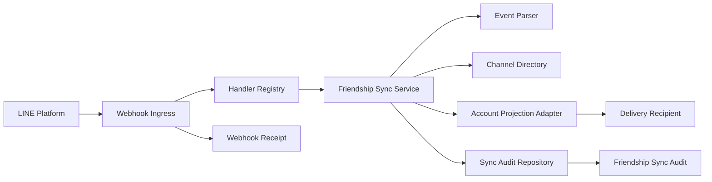
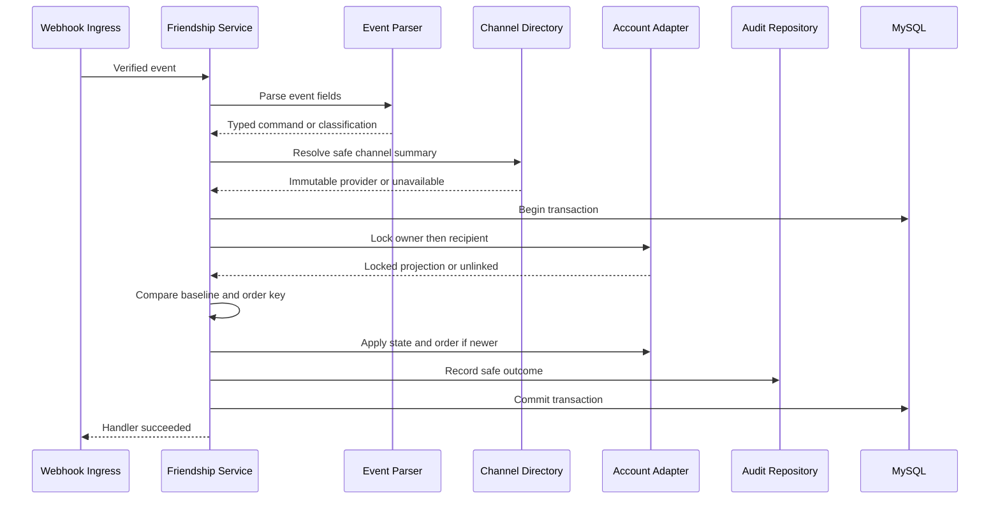
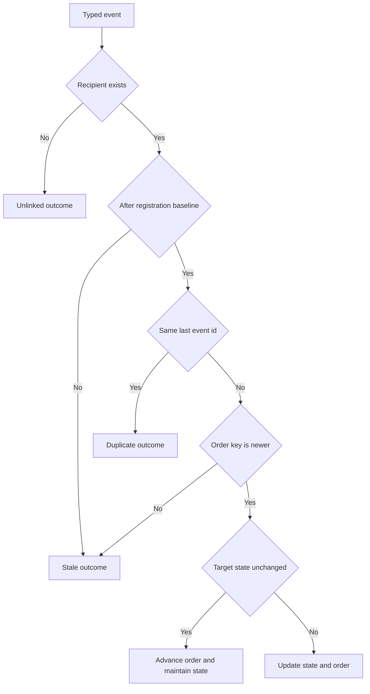
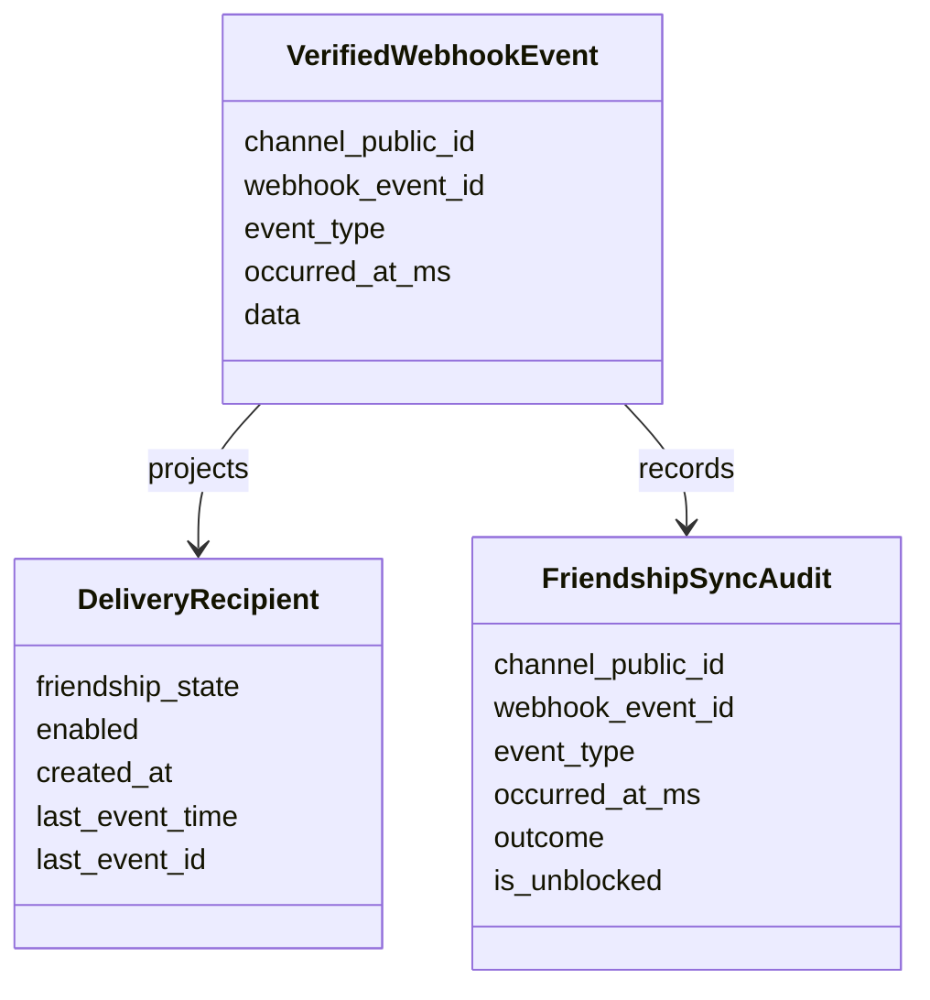
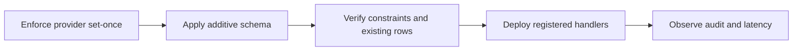

# 技術設計書

## Overview

本機能は、検証済みLINE `follow`／`unfollow`イベントを、同一provider・同一Messaging API channelに登録済みの`DeliveryRecipient`へ順序付きで投影する。ownerはLINE上の現在の友だち状態を確認でき、後続の配信可否判定は、再送、遅延、順序逆転、同時処理があっても古い状態へ巻き戻らない。

既存`line-webhook-ingress`の署名・destination・共通属性・重複受付契約と、`line-account-linking`のidentity／recipient登録・有効設定・解除契約は維持する。新しい`linefriendships` domainがイベント固有validation、順序決定、projection orchestration、安全な結果監査を所有し、account adapterを介して既存recipient aggregateだけを更新する。

### Goals

- user sourceの`follow`／`unfollow`だけを既存recipientへ安全に照合する。
- channelのprovider bindingをlegacy backfill後は不変にし、署名検証からprojectionまでproviderが別の値へ差し替わらない照合境界を保証する。
- `(occurred_at_ms, webhook_event_id)`と登録境界により、再送・順序逆転・同時処理を単一状態へ収束させる。
- `enabled`等の利用者設定と解除結果を保護し、状態・順序・同期監査を原子的に確定する。
- LINE user IDを監査、ログ、例外、公開surfaceへ露出せず、1イベント100ミリ秒・最大10イベント2秒の同期契約を維持する。

### Non-Goals

- LINE identity、owner、recipientの作成、表示名取得、再認証を行わない。
- recipientの`enabled`、channel active、配信結果、端末到達、既読状態を変更しない。
- message、postback、reply、group／roomの状態、完全なブロック履歴を扱わない。
- LINE APIまたは他の外部サービスへ問い合わせず、queue、worker、自動再実行を追加しない。
- 同期監査の公開API／UI、保持期間管理、削除jobを追加しない。

## Boundary Commitments

### This Spec Owns

- 検証済み`VerifiedWebhookEvent`から`follow`／`unfollow`固有fieldをtyped commandへ変換する契約。
- channel provider、source user ID、対象channelによる既存recipient限定照合。
- `DeliveryRecipient.friendship_state`と最後に適用した友だちイベント順序のprojection。
- recipient登録時刻を境界とするstale判定、同時更新の線形化、状態維持イベントの順序更新。
- safeな`FriendshipSyncAudit`結果と、recipient状態・順序との同一transaction確定。
- `follow`／`unfollow`handlerのruntime compositionと、同期固有の単体・MySQL統合・性能試験。
- 既存`line-account-linking`が導入したprovider backfill契約のenforcement gapを閉じ、`LineChannel.provider_id`を`NULL`から1回だけ設定可能、設定後は変更不能にするapplication invariantと回帰試験。

### Out of Boundary

- Webhook URL、署名、destination、payload共通属性、request単位上限、receipt重複受付の検証は`line-webhook-ingress`が所有する。
- identity／owner／recipientの登録、再登録、利用者による有効化・無効化、個別解除、全解除sagaは`line-account-linking`が所有する。
- channel資格情報、provider bindingの値、channel active状態の管理は`line-channel-foundation`が所有する。本仕様は既存のlegacy backfill契約を変更せず、設定済みproviderを別値へ変更できない不変条件だけを強制する。
- 配信可否の最終判定とpushは`linked-recipient-delivery`、表示は`line-channel-admin-ui`が所有する。
- 失敗イベントの再dispatch、queue／worker復旧、LINE API照会、reply、command dispatchは本仕様へ取り込まない。

### Allowed Dependencies

- Inbound: `linewebhooks.handlers.VerifiedEventHandler`と`linewebhooks.types.VerifiedWebhookEvent`。署名・destination・共通field検証済みであることだけに依存する。
- Outbound: `lineaccounts`が公開するfriendship projection adapter。identity／recipient作成APIへは依存しない。
- Outbound: `linechannels.repositories.LineChannelDirectory`のsafe channel summary。資格情報、bot user ID、Messaging API channel IDを取得しない。non-null provider bindingは設定後不変であることを前提とする。
- Shared: Django 6 transaction API、MySQL 8.4 InnoDB、既存database alias `default`、既存safe webhook receipt／audit。
- Constraint: dependency方向を`types → parsing／Protocols → persistence adapters → service → container → ingress composition`に固定し、serviceからDjango modelへ直接依存しない。
- Constraint: provider updateは`NULL → validated provider_id`のlegacy backfillまたは同値指定だけを許可し、異なるnon-null値への変更を`invalid_transition`として拒否する。これによりtransaction外のdirectory readでも検証済みchannelのproviderが途中で別値へ切り替わらない。

### Revalidation Triggers

- `VerifiedWebhookEvent`のfield、共通validation、handler outcome、dispatch／receipt確定契約が変わる場合。
- `LineIdentity(provider_id, subject)`、`DeliveryRecipient(identity, line_channel)`、channel `provider_id`の所有・一意性・set-once規則が変わる場合。
- recipient登録がrow作成以外のlifecycleになり、`created_at`を再登録境界として使用できなくなる場合。
- account mutationのowner→recipient lock順、全解除saga、database isolation／engineが変わる場合。
- event ordering、audit保持・公開、100ミリ秒／2秒target、外部queue／自動再実行を導入する場合。
- 下流が`friendship_state`以外の順序fieldまたは監査tableを直接参照する場合。

## Architecture

### Existing Architecture Analysis

- `linewebhooks`は公開requestを検証し、`webhookEventId`ごとのreceiptを確定後、registered handlerを同期呼出しする。handlerはreceipt受付transactionの外で動く。
- `lineaccounts`はowner rowを先にlockし、recipientを後にlockするtransaction patternを持つ。個別解除と全解除はrecipientを削除し、Webhook由来の作成経路は存在しない。
- `DeliveryRecipient`は`enabled`と`friendship_state`を分離済みで、既存UI／API projectionは`friendship_state`を読む。schema追加は後方互換なnullable metadataに限定できる。
- `WebhookEventReceipt`とsafe webhook loggerは共通受付の成功／失敗／重複を扱うが、projection固有の非更新理由は表現しない。
- `line-account-linking`の設計はprovider updateをlegacy channelのbackfillとして導入したが、現行`linechannels` serviceはnon-null providerから別のnon-null providerへの更新も許可している。このenforcement gapを閉じ、署名検証後にdirectoryが別providerを返すTOCTOUを防ぐ。

### Architecture Pattern & Boundary Map



**Architecture Integration**:

- Selected pattern: 専用domain serviceとports／adaptersによる同期projection。1つのtransaction coordinatorがaccount adapterとaudit repositoryを合成する。
- Domain boundaries: `linefriendships`は解釈・順序・監査、`lineaccounts`はrecipient永続化、`linewebhooks`は公開受付、`linechannels`はchannel summaryを所有する。
- Existing patterns preserved: immutable dataclass、`Protocol`、discriminated union、builder composition、Django `atomic()`、repository error translation、safe repr。
- New components rationale: parserはuntrusted nested fieldを隔離し、account adapterは別app model依存をserviceから隠し、audit repositoryは正常非更新理由を永続化する。
- Steering compliance: Backend外へLINE user IDを出さず、外部I/Oをtransactionへ入れず、標準実行環境と既存dependencyだけを使用する。

### Technology Stack

| Layer | Choice / Version | Role in Feature | Notes |
|---|---|---|---|
| Backend | Python 3.14、Django 6.0.7 | typed handler、validation、transaction orchestration | 新規dependencyなし |
| Data | MySQL 8.4 InnoDB、Django ORM | recipient row lock、順序metadata、safe audit | 既存`default` DB内で原子化 |
| Messaging / Events | 既存`VerifiedWebhookEvent`、`VerifiedEventHandler` | 検証済みfollow／unfollowの同期dispatch | LINE SDK objectへ依存しない |
| Runtime | Docker Compose | 標準Backend／MySQLでintegration・performance検証 | queue／worker追加なし |

## File Structure Plan

### Directory Structure

```text
backend/
├── linefriendships/
│   ├── __init__.py                         # Django app package
│   ├── apps.py                             # app metadata
│   ├── types.py                            # immutable command、結果、Protocol共有型
│   ├── parsing.py                          # follow／unfollow source固有validation
│   ├── models.py                           # PII非保持FriendshipSyncAudit
│   ├── repositories.py                     # audit persistence adapter
│   ├── services.py                         # 順序決定とtransaction coordinator handler
│   ├── container.py                        # account／channel／audit dependency合成
│   ├── migrations/
│   │   └── 0001_initial.py                 # sync audit table・constraint・index
│   └── tests/
│       ├── test_parsing.py                 # source、userId、isUnblocked境界
│       ├── test_services.py                # projection判断とhandler outcome
│       ├── test_models.py                  # audit schema・PII非保持constraint
│       ├── test_integration.py             # account／channel／audit統合
│       ├── test_concurrency.py             # 順序逆転・解除競合・再登録
│       ├── test_security.py                # repr／log／audit非露出
│       └── test_performance.py             # 1件100ms・10件2s・query budget
├── lineaccounts/
│   ├── friendship_repositories.py          # 公開projection adapterとowner→recipient lock
│   ├── migrations/
│   │   └── 0002_friendship_order.py        # recipient最終event metadata
│   └── tests/
│       └── test_friendship_repositories.py # exact match、更新field、registration境界
├── linechannels/
│   ├── services.py                         # provider set-once invariant
│   └── tests/
│       └── test_services.py                # backfill・同値・異値拒否
└── linewebhooks/
    └── container.py                        # follow／unfollow registry登録
```

### Modified Files

- `backend/config/settings.py` — `linefriendships.apps.LineFriendshipsConfig`をinstalled appへ登録する。
- `backend/lineaccounts/models.py` — `DeliveryRecipient`へnullableな最終友だちイベント時刻・IDと整合性constraintを追加する。`enabled`等の既存field契約は変更しない。
- `backend/lineaccounts/tests/test_models.py` — 追加fieldとcheck constraint、既存state／enabled契約の回帰を検証する。
- `backend/linechannels/services.py` — provider updateをlegacy `NULL`からのbackfillまたは同値指定に限定し、設定済み値から別値への変更を拒否する。
- `backend/linechannels/tests/test_services.py` — `NULL → provider`、同値指定、異なるnon-null provider拒否を検証する。
- `backend/linewebhooks/container.py` — 1つのfriendship handler instanceを`follow`／`unfollow`へ登録する。
- `backend/linewebhooks/tests/test_container.py` — default runtimeで対象eventだけがhandlerへ接続されることを検証する。

### Referenced Existing Files

- `backend/linewebhooks/types.py` — `VerifiedWebhookEvent`と`HandlerOutcome`の既存typed envelope／result。
- `backend/linewebhooks/handlers.py` — `VerifiedEventHandler`と`StaticHandlerRegistry`の既存dispatch contract。
- `backend/linewebhooks/models.py` — common receipt、duplicate、handler failureの既存監査surface。
- `backend/linechannels/repositories.py` — provider付きsafe summaryを返す`LineChannelDirectory` contract。
- `backend/linechannels/types.py` — 資格情報を含まない`LinkableChannelSummary`。
- `backend/lineaccounts/types.py` — user IDをredactedに扱う`LineSubject`。
- `backend/lineaccounts/recipient_services.py` — 登録・有効設定・個別解除の既存owner→recipient lock利用者。変更しない。
- `backend/lineaccounts/unlink_services.py` — 全解除sagaと最終削除の既存lock利用者。変更しない。

## System Flows

### イベント処理と原子確定



Invalid、out-of-scope、unresolvable、unlinkedも正常な非更新結果であり、safe auditだけを同じtransactionで確定する。database error、deadlock、lock timeout、audit insert failureはtransactionをrollbackし、`HandlerFailed`としてingressへ返す。

Provider bindingはchannel登録時またはlegacy backfill時に1回だけ確定し、その後はapplication serviceが異値変更を拒否する。したがって署名検証後にhandlerがtransaction外でdirectoryを参照しても、同じchannel UUIDが別providerへ切り替わることはない。provider未設定の間は`unresolvable`とし、recipientへ反映しない。

### 順序決定



Key decision: order keyは`(occurred_at_ms, webhook_event_id)`の昇順であり、`isRedelivery`と到着順は比較へ参加しない。同一状態の新しいeventも順序metadataを進め、後着した古い反対eventを拒否する。

## Requirements Traceability

| Requirement | Summary | Components | Interfaces | Flows |
|---|---|---|---|---|
| 1.1 | 対象eventのsource検査 | EventParser | Parse Contract | イベント処理 |
| 1.2 | valid user sourceを照合へ渡す | EventParser, FriendshipSyncService | ValidatedFriendshipEvent | イベント処理 |
| 1.3 | 欠落・不正sourceを非更新分類 | EventParser, AuditRepository | InvalidEvent | イベント処理 |
| 1.4 | non-boolean isUnblockedを拒否 | EventParser | Parse Contract | イベント処理 |
| 1.5 | group／roomを対象外分類 | EventParser, AuditRepository | OutOfScopeEvent | イベント処理 |
| 1.6 | 未知fieldを無視して継続 | EventParser | Parse Contract | イベント処理 |
| 1.7 | follow／unfollow以外を根拠にしない | HandlerComposition | Registry Contract | Architecture map |
| 2.1 | provider＋user ID identity照合 | ProviderBindingInvariant, AccountProjectionAdapter | Provider Set-Once Contract, Lock Target Contract | イベント処理 |
| 2.2 | identity＋channel recipient照合 | AccountProjectionAdapter | Lock Target Contract | イベント処理 |
| 2.3 | 異providerを非更新 | ProviderBindingInvariant, AccountProjectionAdapter | Provider Set-Once Contract, Lock Target Contract | イベント処理 |
| 2.4 | identity未存在を未連携分類 | AccountProjectionAdapter, AuditRepository | ProjectionResult | イベント処理 |
| 2.5 | recipient未存在を未連携分類 | AccountProjectionAdapter, AuditRepository | ProjectionResult | イベント処理 |
| 2.6 | channel／provider不明を照合不能分類 | ProviderBindingInvariant, ChannelDirectory, FriendshipSyncService | Provider Set-Once Contract, Safe Channel Summary | イベント処理 |
| 2.7 | 一致recipientだけを更新 | AccountProjectionAdapter | Exact Match Contract | イベント処理 |
| 3.1 | followをfriendへ投影 | FriendshipSyncService | Projection Command | 順序決定 |
| 3.2 | unfollowをnot_friendへ投影 | FriendshipSyncService | Projection Command | 順序決定 |
| 3.3 | unblock followを識別可能に監査 | EventParser, AuditRepository | Audit State | イベント処理 |
| 3.4 | isUnblockedを補助情報に限定 | EventParser, FriendshipSyncService | Projection Command | 順序決定 |
| 3.5 | 任意現状態からtargetへ収束 | FriendshipSyncService, AccountProjectionAdapter | Apply Contract | 順序決定 |
| 3.6 | 同状態の新eventでorderを前進 | FriendshipSyncService, AccountProjectionAdapter | Apply Contract | 順序決定 |
| 4.1 | 登録／再登録時点をbaseline化 | AccountProjectionAdapter | Locked Projection State | 順序決定 |
| 4.2 | baseline以前をstale化 | FriendshipSyncService | Ordering Contract | 順序決定 |
| 4.3 | baseline後の新eventを適用 | FriendshipSyncService | Ordering Contract | 順序決定 |
| 4.4 | 最終eventより古いeventを拒否 | FriendshipSyncService | Ordering Contract | 順序決定 |
| 4.5 | 同時刻をevent ID辞書順で決定 | FriendshipSyncService | Ordering Contract | 順序決定 |
| 4.6 | 同event IDを追加変更なしへ収束 | FriendshipSyncService, WebhookReceipt | Ordering Contract, Receipt Contract | 順序決定 |
| 4.7 | 同時eventを単一最終状態へ収束 | AccountProjectionAdapter | State Lock Contract | イベント処理 |
| 4.8 | 到着順／redeliveryを比較に不使用 | FriendshipSyncService | Ordering Contract | 順序決定 |
| 5.1 | disabledを維持して状態だけ更新 | AccountProjectionAdapter | Apply Contract | イベント処理 |
| 5.2 | 非所有fieldを変更しない | AccountProjectionAdapter | Apply Contract | イベント処理 |
| 5.3 | 個別解除競合で再作成しない | AccountProjectionAdapter | Lock Target Contract | イベント処理 |
| 5.4 | 全解除競合で削除を維持 | AccountProjectionAdapter | Lock Target Contract | イベント処理 |
| 5.5 | 再登録baseline前を拒否 | FriendshipSyncService | Ordering Contract | 順序決定 |
| 5.6 | reply／配信を開始しない | FriendshipSyncService | Handler Contract | Architecture map |
| 6.1 | 安全な処理結果分類を保持 | AuditRepository, WebhookReceipt | Audit State | イベント処理 |
| 6.2 | safe metadataを相関 | AuditRepository | Audit State | イベント処理 |
| 6.3 | LINE user IDを非露出 | EventParser, AuditRepository | Sensitive Value Contract | イベント処理 |
| 6.4 | 更新・順序・監査を部分確定しない | FriendshipSyncService | Transaction Contract | イベント処理 |
| 6.5 | 正常非更新を成功として返す | FriendshipSyncService | Handler Outcome | イベント処理 |
| 6.6 | 外部serviceへ問い合わせない | FriendshipSyncService | Dependency Contract | Architecture map |
| 6.7 | 1eventを100ms以内に処理 | Performance Validation | Handler Contract | イベント処理 |
| 6.8 | 最大10eventで2秒受付を維持 | HandlerComposition, Performance Validation | Ingress Contract | イベント処理 |

## Components and Interfaces

| Component | Domain/Layer | Intent | Req Coverage | Key Dependencies | Contracts |
|---|---|---|---|---|---|
| EventParser | linefriendships domain | 検証済みraw eventをPII-safeなtyped command／分類へ変換 | 1.1, 1.2, 1.3, 1.4, 1.5, 1.6, 3.3, 3.4, 6.3 | VerifiedWebhookEvent P0 | Service |
| FriendshipSyncService | linefriendships application | channel照合、順序判断、transaction、handler outcomeを統括 | 1.2, 2.6, 3.1, 3.2, 3.3, 3.4, 3.5, 3.6, 4.2, 4.3, 4.4, 4.5, 4.6, 4.7, 4.8, 5.5, 5.6, 6.4, 6.5, 6.6, 6.7, 6.8 | AccountProjectionAdapter P0, AuditRepository P0, ChannelDirectory P0 | Service, Event |
| AccountProjectionAdapter | lineaccounts persistence | owner→recipient lockと限定更新を既存aggregateへ適用 | 2.1, 2.2, 2.3, 2.4, 2.5, 2.7, 4.1, 4.7, 5.1, 5.2, 5.3, 5.4, 5.5 | MySQL P0 | Service, State |
| ProviderBindingInvariant | linechannels application | legacy backfill後のprovider差し替えを拒否して照合境界を固定 | 2.1, 2.3, 2.6 | Existing channel mutation service P0 | State |
| AuditRepository | linefriendships persistence | PII非保持の同期結果をprojection transactionへ保存 | 1.3, 1.5, 2.4, 2.5, 2.6, 3.3, 6.1, 6.2, 6.3, 6.4 | MySQL P0, WebhookReceipt P1 | Service, State |
| HandlerComposition | runtime | 同一handlerをfollow／unfollowへ登録 | 1.7, 5.6, 6.8 | StaticHandlerRegistry P0 | Event |

### linefriendships Domain

#### EventParser

| Field | Detail |
|---|---|
| Intent | nested sourceとfollow metadataだけを厳格に検証し、未知fieldを無視する |
| Requirements | 1.1, 1.2, 1.3, 1.4, 1.5, 1.6, 3.3, 3.4, 6.3 |

**Responsibilities & Constraints**

- `event_type`は`follow`または`unfollow`、sourceはobject、source typeは`user`、userIdは`U`＋32桁小文字hexに限定する。
- source type `group`／`room`は`out_of_scope`、欠落・未知source type・不正userIdは`invalid`に分ける。
- `follow.isUnblocked`は省略またはstrict booleanだけを許可する。unfollowでは状態根拠として読まない。
- userIdはredacted `LineSubject`へ直ちに包み、返却型のreprとerrorへ値を含めない。

**Dependencies**

- Inbound: `VerifiedWebhookEvent` — immutableな共通検証済みenvelope (P0)
- Outbound: なし

**Contracts**: Service [x]

##### Service Interface

```python
FriendshipState = Literal["friend", "not_friend"]

@dataclass(frozen=True, slots=True, repr=False)
class ValidatedFriendshipEvent:
    channel_public_id: UUID
    webhook_event_id: str
    event_type: Literal["follow", "unfollow"]
    occurred_at_ms: int
    subject: LineSubject
    target_state: FriendshipState
    is_unblocked: bool | None

ParseResult = ValidatedFriendshipEvent | InvalidFriendshipEvent | OutOfScopeSource

class FriendshipEventParser(Protocol):
    def parse(self, event: VerifiedWebhookEvent) -> ParseResult: ...
```

- Preconditions: ingressが共通fieldを検証済みである。
- Postconditions: valid resultだけがsensitive subjectを持ち、invalid／out-of-scope resultはuserIdを保持しない。
- Invariants: unknown fieldと`isRedelivery`はtarget stateへ影響しない。

**Implementation Notes**

- Integration: LINE SDK modelではなく既存`FrozenJsonObject`を読み、SDK version差を境界へ持ち込まない。
- Validation: boolは`type(value) is bool`で判定し、整数`0`／`1`を受理しない。
- Risks: validation error messageはfield分類だけを返し、入力値を含めない。

#### FriendshipSyncService

| Field | Detail |
|---|---|
| Intent | 正常・非更新・失敗をtyped outcomeへ収束させ、projection transactionを統括する |
| Requirements | 1.2, 2.6, 3.1, 3.2, 3.3, 3.4, 3.5, 3.6, 4.2, 4.3, 4.4, 4.5, 4.6, 4.7, 4.8, 5.5, 5.6, 6.4, 6.5, 6.6, 6.7, 6.8 |

**Responsibilities & Constraints**

- parser classificationとsafe channel summaryをprojection commandへ合成する。
- `atomic(using)`内でaccount targetをlockし、pureなordering decisionを算出し、必要なstate／order更新と全結果のauditを確定する。
- normal non-updateは`HandlerSucceeded`、database／contract failureはrollback後に`HandlerFailed`を返す。
- 外部I/O、retry、reply、message dispatchを行わない。

**Dependencies**

- Inbound: `VerifiedEventHandler` — ingress dispatch contract (P0)
- Outbound: `FriendshipEventParser` — event-specific validation (P0)
- Outbound: `LineChannelDirectory` — provider付きsafe summary (P0)
- Outbound: `AccountProjectionRepository` — locked recipient snapshot／限定更新 (P0)
- Outbound: `FriendshipAuditRepository` — safe outcome persistence (P0)
- External: Django transaction API — atomic commit／rollback (P0)

**Contracts**: Service [x] / Event [x]

##### Service Interface

```python
ProjectionOutcome = Literal[
    "applied",
    "state_maintained",
    "stale",
    "duplicate",
    "unlinked",
    "unresolvable",
    "out_of_scope",
    "invalid",
]

class FriendshipSyncHandler(VerifiedEventHandler, Protocol):
    def handle(self, event: VerifiedWebhookEvent) -> HandlerOutcome: ...
```

- Preconditions: event typeはregistryで`follow`／`unfollow`へ限定される。
- Postconditions: success時はsafe auditが1件確定し、必要なrecipient mutationと同一commitに含まれる。
- Invariants: ordering comparisonはASCII code pointによる`(occurred_at_ms, webhook_event_id)`であり、arrival order／redelivery flagを使用しない。

##### Event Contract

- Subscribed events: 検証済み`follow`、`unfollow`のみ。
- Trigger: ingress receiptが新規`processing`として確定した後の同期dispatch。
- Payload: channel UUID、event ID、event type、occurred timestamp、immutable raw event。user sourceはhandler内部だけで解釈する。
- Delivery: request thread上でat-most-once dispatch。ingress重複はhandler前に抑止される。
- Idempotency: ingress receiptのevent ID一意性とrecipient order metadataの二重防御。service単体の同event IDも状態を追加変更しない。

**Implementation Notes**

- Integration: channel未存在／provider未設定は`unresolvable`、identity／recipient未存在は`unlinked`として成功させる。
- Validation: audit repository failureを含むtransaction errorがstate更新をrollbackすることをfault injectionで検証する。
- Risks: 100ミリ秒は外部transactionがowner／recipient lockを意図的に保持していない標準計測条件のhandler budgetであり、lock競合の待機を100ミリ秒で強制中断する契約ではない。DBがdeadlock／lock timeoutを返した場合だけsafe failureへ変換し、実測超過は既存ingressのdeadline auditで観測する。

### linechannels Prerequisite Hardening

#### ProviderBindingInvariant

| Field | Detail |
|---|---|
| Intent | 検証済みchannel UUIDとproviderの対応をlegacy backfill後に固定し、Webhook処理中のprovider差し替えを防ぐ |
| Requirements | 2.1, 2.3, 2.6 |

**State Contract**

- 新規channelは従来どおりvalidなproviderを必須とする。
- legacy `provider_id=NULL`はvalidなproviderへ1回だけbackfillできる。
- 設定済みproviderと同じ値の指定は冪等に成功してよい。
- 設定済みproviderと異なるnon-null値への変更は、channel rowをlockした後に`invalid_transition`として拒否し、provider、credential、他metadataを一切変更しない。
- provider変更を伴わないlabel、active state、credential等の既存mutation契約は維持する。

**Validation**

- service testで`NULL → value`、`value → same value`、`value → different value`を検証する。
- 独立connection testでWebhook処理と異provider updateを競合させ、updateが拒否され、eventが元providerのrecipientだけへ反映されることを検証する。

### lineaccounts Persistence

#### AccountProjectionAdapter

| Field | Detail |
|---|---|
| Intent | account aggregateの所有を維持しながら、既存recipientだけをlocking read／限定更新する |
| Requirements | 2.1, 2.2, 2.3, 2.4, 2.5, 2.7, 3.5, 3.6, 4.1, 4.7, 5.1, 5.2, 5.3, 5.4, 5.5 |

**Responsibilities & Constraints**

- active owner rowをlockし、owner identityが`provider_id + subject`に一致する場合だけ、対象channel recipientをlockする。
- provider不一致、identity不一致、recipient欠落、unlink中ownerを`ProjectionTargetMissing`へ縮約し、存在有無の詳細を外へ漏らさない。
- state更新時は`friendship_state`、2つのorder field、`updated_at`だけを保存する。`enabled`を含む他fieldへ書き込まない。
- create、upsert、undeleteを提供しない。

**Dependencies**

- Inbound: `FriendshipSyncService` — typed projection command (P0)
- Outbound: `OwnerAccount`／`LineIdentity`／`DeliveryRecipient` repository model — aggregate persistence (P0)
- Outbound: `LineChannel` relation — exact channel／provider predicate (P0)
- External: MySQL InnoDB locking read — concurrent serialization (P0)

**Contracts**: Service [x] / State [x]

##### Service Interface

```python
@dataclass(frozen=True, slots=True)
class LockedRecipientProjection:
    recipient_public_id: UUID
    registered_at: datetime
    friendship_state: Literal["friend", "not_friend", "unknown"]
    last_occurred_at_ms: int | None
    last_webhook_event_id: str | None

ProjectionTarget = LockedRecipientProjection | ProjectionTargetMissing

class AccountProjectionRepository(Protocol):
    def lock_target(
        self,
        *,
        channel_public_id: UUID,
        provider_id: str,
        subject: LineSubject,
    ) -> ProjectionTarget: ...

    def apply_locked(
        self,
        target: LockedRecipientProjection,
        *,
        friendship_state: Literal["friend", "not_friend"],
        occurred_at_ms: int,
        webhook_event_id: str,
    ) -> None: ...
```

- Preconditions: callerは同じdatabase aliasの`atomic()`内にあり、`apply_locked` targetは同transactionで取得済みである。
- Postconditions: 対象行が存在する場合だけ指定3fieldが更新される。
- Invariants: `(last_occurred_at_ms, last_webhook_event_id)`は同時nullまたは同時non-null。`created_at`は変更しない。

##### State Management

- State model: `unknown | friend | not_friend`に、nullableなlast order keyを付加する。
- Registration baseline: `floor(created_at.timestamp() * 1000)`。event timestampがbaseline以下なら非適用。
- Persistence & consistency: state、order、safe auditを同じDB transactionでcommitする。
- Concurrency strategy: owner row、recipient rowの順で`select_for_update()`し、既存registration／unlinkとlock順を統一する。

**Implementation Notes**

- Integration: `LineSubject`はquery parameterへ必要な瞬間だけrevealし、query loggingは既存設定どおり無効にする。
- Validation: disabled recipient、他channel、他provider、他identity、unlink競合を実MySQLで検証する。
- Risks: joined locking readのSQLとindex利用をintegration query plan／query budgetで確認する。

### linefriendships Persistence

#### AuditRepository

| Field | Detail |
|---|---|
| Intent | unlink後も相関可能でPIIを含まないprojection結果を永続化する |
| Requirements | 1.3, 1.5, 2.4, 2.5, 2.6, 3.3, 6.1, 6.2, 6.3, 6.4 |

**Responsibilities & Constraints**

- channel UUID、event ID、event type、occurred timestamp、safe outcome、follow補助flag、recorded timeだけを保存する。
- identity、recipient、ownerへのFK、LINE user ID、display name、raw payload、exception textを保存しない。
- account state updateと同じtransaction内でinsertし、失敗を握りつぶさない。
- common duplicate／handler failureはevent IDで既存Webhook receipt／safe auditへ相関できる。

**Dependencies**

- Inbound: `FriendshipSyncService` — projection decision (P0)
- Outbound: `FriendshipSyncAudit` model — append-only safe result (P0)
- Outbound: `WebhookEventReceipt` — 共通受付・重複・失敗の相関元。直接更新しない (P1)

**Contracts**: Service [x] / State [x]

##### Service Interface

```python
@dataclass(frozen=True, slots=True)
class FriendshipAuditRecord:
    channel_public_id: UUID
    webhook_event_id: str
    event_type: Literal["follow", "unfollow"]
    occurred_at_ms: int
    outcome: ProjectionOutcome
    is_unblocked: bool | None

class FriendshipAuditRepository(Protocol):
    def record(self, audit: FriendshipAuditRecord) -> None: ...
```

- Preconditions: recordはPII-freeで、caller transactionがactiveである。
- Postconditions: 1回のhandler処理につき1件のsafe resultがappendされる。
- Invariants: `unfollow`は`is_unblocked=None`。timestampは非負。raw payloadを保持しない。

##### State Management

- State model: append-only audit outcome。更新・削除APIを本仕様では定義しない。
- Persistence & consistency: non-unique event ID indexにより複数処理試行を保持し、`(webhook_event_id, recorded_at)`で追跡する。
- Concurrency strategy: recipient lock後にinsertする。recipientがない分類はaudit insertだけの短いtransactionにする。

**Implementation Notes**

- Integration: normal outcomeはsync audit、ingress duplicate／failureはreceiptとsafe webhook auditを参照する合成監査とする。
- Validation: model field一覧にsubject、user、identity、recipient、payload、error detailが存在しないことをschema testで固定する。
- Risks: retention導入時は本仕様のrevalidation triggerとし、暗黙削除を追加しない。

### Runtime Composition

#### HandlerComposition

| Field | Detail |
|---|---|
| Intent | production registryへ対象eventだけを1つの同期handlerとして接続する |
| Requirements | 1.7, 5.6, 6.8 |

**Dependencies**

- Inbound: `build_webhook_ingress_service` (P0)
- Outbound: `build_friendship_sync_handler` (P0)
- Outbound: `StaticHandlerRegistry` (P0)

**Contracts**: Event [x]

##### Event Contract

- Registrations: `follow → friendship_handler`、`unfollow → friendship_handler`。
- Unsupported events: registry未登録を維持し、ingressの`unsupported` receiptへ委ねる。
- Side effects: handler build／dispatchはreply、push、LINE API clientを生成しない。
- Runtime prerequisite: `linefriendships` migration適用後にhandler登録済みBackendを起動する。

**Implementation Notes**

- Integration: 同一instanceを2event typeへ登録して共通ordering／audit policyを保証する。
- Validation: default containerのsigned HTTP integrationでfollow／unfollowだけが処理されることを確認する。
- Risks: migration未適用での起動をdeployment順序により防ぐ。

## Data Models

### Domain Model



- Aggregate root: `DeliveryRecipient`。友だち状態とorder keyは同じaggregate invariantである。
- Value objects: `LineSubject`、`ValidatedFriendshipEvent`、`LockedRecipientProjection`、`FriendshipAuditRecord`。
- Domain decision: `invalid | out_of_scope | unresolvable | unlinked | stale | duplicate | state_maintained | applied`。
- Invariants: state／order更新とauditは同一transaction。監査はrecipient relationを保持しない。

### Logical Data Model

**Structure Definition**:

- `DeliveryRecipient` 1行は`identity × line_channel`の現在projectionを表す。既存一意制約を維持する。
- `FriendshipSyncAudit`はevent処理試行ごとのappend-only rowであり、recipientと論理相関はするがFKを持たない。
- `WebhookEventReceipt`はevent IDごとの共通受付を表し、sync auditとは`webhook_event_id`で相関する。

**Consistency & Integrity**:

- recipientの2つのlast event fieldは両方nullまたは両方non-nullとする。
- non-null `last_occurred_at_ms`とaudit `occurred_at_ms`は0以上とする。
- `FriendshipSyncAudit.event_type`は`follow | unfollow`、outcomeは定義済みsafe choiceに限定する。
- unlink時はrecipientが削除されるがauditは保持する。auditからidentityを復元できない。

### Physical Data Model

#### `lineaccounts_deliveryrecipient`追加field

| Column | Type | Null | Constraint / Use |
|---|---|---|---|
| `last_friendship_event_occurred_at_ms` | BIGINT | Yes | 0以上、last IDと同時null／non-null |
| `last_friendship_webhook_event_id` | VARCHAR(26) | Yes | last timestampと同時null／non-null |

既存recipientは両field nullのまま移行し、現在の`friendship_state`を保持する。最初のbaseline後eventからorder metadataを開始する。recipient row自体を一意キーでlocking readするため、last field単独indexは追加しない。

#### `linefriendships_friendship_sync_audit`

| Column | Type | Null | Constraint / Use |
|---|---|---|---|
| `id` | BIGINT | No | primary key |
| `channel_public_id` | UUID storage | No | safe channel correlation |
| `webhook_event_id` | VARCHAR(26) | No | ingress receipt correlation |
| `event_type` | VARCHAR(16) | No | `follow | unfollow` |
| `occurred_at_ms` | BIGINT | No | 0以上 |
| `outcome` | VARCHAR(24) | No | safe projection outcome |
| `is_unblocked` | BOOLEAN | Yes | follow補助情報だけ |
| `recorded_at` | DATETIME | No | server-side auto timestamp |

Indexes: `(webhook_event_id, recorded_at)`でevent追跡、`(channel_public_id, recorded_at)`でchannel時系列診断を支援する。userId、identity ID、recipient ID、raw payload、error detail columnは設けない。

### Data Contracts & Integration

- Inbound schemaは既存`VerifiedWebhookEvent`を再利用し、公開JSON schemaを追加しない。
- Outbound API／event publishはない。後続機能は既存`DeliveryRecipient.friendship_state`だけを読む。
- Cross-app transactionは単一MySQL database alias内に限定する。2PC、Saga、eventual consistencyを導入しない。
- `FriendshipSyncAudit`は内部監査modelであり、owner API serializer、admin UI、通常ログへ自動公開しない。

## Error Handling

### Error Strategy

- parse errorと対象外sourceは正常な非更新としてsafe auditを確定し、`HandlerSucceeded`を返す。
- channel／provider照合不能、identity／recipient未連携、stale、duplicate、state maintainedも正常な非更新として扱う。
- repository contract違反はprogramming error、database unavailable／deadlock／lock timeout／audit insert failureはstorage failureへ縮約する。
- storage failureはtransactionをrollbackして`HandlerFailed`を返し、ingressがreceiptを`failed/handler_failed`へ確定する。本仕様は自動retryしない。
- LINE user ID、raw event、SQL、SDK exceptionをerror detailへ含めない。

### Error Categories and Responses

| Category | Examples | State Mutation | Handler Result | Audit |
|---|---|---|---|---|
| Normal non-update | invalid、out of scope、unlinked、stale、duplicate | なし | succeeded | safe sync audit、必要に応じreceipt相関 |
| Normal projection | applied、state maintained | state／orderを原子更新 | succeeded | 同一transactionのsync audit |
| Retryable storage | deadlock、lock timeout | rollback | failed | ingress failed receipt。自動retryなし |
| Storage unavailable | query／commit／audit insert failure | rollback | failed | 確定可能ならingress failed receipt |
| Contract defect | impossible union、transaction外adapter call | rollback | failed | safe generic failureのみ |

### Monitoring

- `FriendshipSyncAudit.outcome`をchannel UUID、event ID、event type、event timestampで検索可能にする。
- 既存`WebhookEventReceipt.status/failure_code`とsafe webhook loggerをevent IDで相関し、重複とhandler failureを診断する。
- 通常ログへsync件数を追加する場合もsafe outcomeとopaque IDだけを使用し、userIdを出力しない。

## Testing Strategy

### Unit Tests

- `EventParser`: valid user follow／unfollow、`isUnblocked`のtrue／false／省略をtyped targetへ変換し、未知fieldを無視する（1.1, 1.2, 1.6, 3.1, 3.2, 3.3, 3.4）。
- `EventParser`: source／userId欠落、format不正、unknown source、non-boolean `isUnblocked`を`invalid`にし、group／roomを`out_of_scope`にする（1.3, 1.4, 1.5）。
- ordering decision: baseline以前、last keyより古い、同時刻のID大小、same ID、same stateの新eventを各outcomeへ分類する（3.5, 3.6, 4.1, 4.2, 4.3, 4.4, 4.5, 4.6, 4.8）。
- handler result: 全normal non-updateは`HandlerSucceeded`、repository failureは`HandlerFailed`になる（6.4, 6.5）。
- model／type: order field pair、non-negative timestamp、audit choice、safe repr、frozen dataclassを検証する（6.1, 6.2, 6.3）。

### Integration Tests

- provider未設定legacy channelは`unresolvable`となり、backfill後は対象providerへ照合できること、設定済みproviderの同値指定は冪等、異値指定は全field不変の`invalid_transition`となることを検証する（2.1, 2.3, 2.6）。
- signed follow／unfollowをdefault registryへ通し、同provider・subject・channelのrecipientだけが`friend`／`not_friend`へ更新され、他provider／channel／identityは不変であることを検証する（2.1, 2.2, 2.3, 2.4, 2.5, 2.6, 2.7, 3.1, 3.2）。
- disabled recipientへeventを適用し、`enabled`、channel state、配信関連fieldを変えずfriendshipとorderだけを更新する（5.1, 5.2）。
- identity／recipient未存在、provider未設定channel、invalid／group／room、stale、same-stateをsafe auditへ保存しHTTP受付を成功させる（1.3, 1.4, 1.5, 2.4, 2.5, 2.6, 6.1, 6.2, 6.5）。
- audit insert failureを注入し、friendship stateと2つのorder fieldがすべてrollbackされ、receiptがhandler failureになることを検証する（6.4）。
- migration前相当のorder-null既存recipientへbaseline後eventを適用し、既存stateを保ったままorder trackingを開始する（4.1, 4.3）。

### Concurrency Tests

- signed eventの処理と同channelへの異provider updateを独立connectionで競合させ、provider updateだけが拒否され、元providerに属するrecipient以外は不変であることを検証する（2.1, 2.3, 2.6）。
- 独立connectionで古いfollowと新しいunfollowを同時処理し、開始順に関係なく最大order keyの単一状態へ収束する（4.4, 4.5, 4.7）。
- 同一時刻の反対eventを同時処理し、辞書順が大きいevent IDへ収束する。`isRedelivery`を反転しても結果が変わらない（4.5, 4.8）。
- friendship updateと個別recipient unlinkを競合させ、最終的にrecipientが存在せず再作成されない（5.3）。
- friendship updateと全unlink finalizeを競合させ、identity、recipient、sessionが復元されない（5.4）。
- unlink後にrecipientを再登録し、旧baseline以前eventが新rowへ適用されず、新baseline後eventだけが適用される（4.1, 4.2, 5.5）。

### Security Tests

- valid／invalid userId canaryがmodel field、audit row、repr、exception、logger record、HTTP responseへ現れない（6.3）。
- handlerがLINE gateway、reply client、delivery serviceを構築または呼出ししない（5.6, 6.6）。
- audit schemaがraw payload、subject、identity、recipient、error detailを持たない（6.1, 6.2, 6.3）。

### Performance Tests

- 標準Backend／MySQLで、計測開始前から別transactionがowner／recipient row lockを保持していない条件をfixtureで保証し、valid 1eventのhandler処理を複数回測定して各回100ミリ秒未満、query count固定を検証する（6.7）。
- 同じ非事前競合条件で、同一recipientを含む最大10eventのsigned requestが2,000ミリ秒未満で完了し、最終状態が最大order keyへ一致する（4.7, 6.8）。
- invalid、unlinked、stale pathも外部I/Oなし・bounded query countで100ミリ秒未満を検証する（6.5, 6.6, 6.7, 6.8）。
- concurrency suiteは正しさと有限時間での完了を検証するが、意図的なlock保持時間をhandlerの100ミリ秒budgetへ算入しない。synthetic clockでrequestが2,000ミリ秒以上となる場合は、既存`response_deadline_exceeded` auditが残ることを回帰確認する。

E2E/UI testは公開UI／APIを追加しないため対象外とする。HTTP ingress integrationが本機能の端点試験を担う。

## Security Considerations

- userIdは署名検証済みpayloadからのみ受け取るが、source固有validationまではuntrustedとして扱う。
- `LineSubject`のrevealはaccount adapterのexact match query直前に限定し、repr／例外へ値を含めない。
- sync auditはPIIとraw payloadを保存せず、opaque channel UUIDとevent IDだけを使用する。
- owner session認証はWebhookへ適用しない。信頼根拠は既存channel URL、署名、destination検証である。
- credentialsを読み取らず、channel directoryのsafe summaryだけを使用する。
- database query loggingを有効化しない既存方針を維持する。

## Performance & Scalability

- Target: handler 1event 100ミリ秒未満、1request最大10eventを含むingress応答2,000ミリ秒未満。これは`line-webhook-ingress`が定義済みのvalid request／registered handler budgetであり、標準性能計測では開始前から別transactionが対象owner／recipient lockを保持していないことを前提とする。
- 1eventはsafe channel read、owner／recipient locking read、必要時recipient update、audit insertのbounded queryで完結する。
- owner row lockが現行single-owner account mutationを直列化し、続くrecipient row lockが更新対象を限定する。最大10イベントの同期契約では解除との整合を優先し、transactionを外部I/Oなしで短く保つ。
- 同時event／unlink競合は同じlock順で収束させるcorrectness contractであり、人為的に長時間保持したlockを100ミリ秒で打ち切るcontractではない。`nowait`はfailure後の自動再dispatchがない現行ingressでeventを失わせるため採用しない。
- deadlock／DB lock timeoutは`HandlerFailed`へ変換する。実行時間が2,000ミリ秒以上となった場合は既存ingressが`response_deadline_exceeded`を監査し、成功や再実行を推測しない。
- cacheはstale readとinvalidate責務を増やすため導入しない。queue／batch writeも現行同期契約では導入しない。
- indexは既存unique recipient key、identity provider／subject unique key、channel public UUID unique keyを利用し、audit検索用に2つの複合indexだけを追加する。

## Migration Strategy



- Phase 1: `LineChannel.provider_id`のset-once guardを先に有効化し、legacy backfill、同値指定、異値拒否を確認する。schema変更は不要である。
- Phase 2: `DeliveryRecipient`へnullable order fieldsとpair constraintを追加し、`FriendshipSyncAudit` table／indexesを作成する。data backfillは行わない。
- Phase 3: migration testで既存recipientのstate、enabled、created_atが不変で、order fieldsがnullであることを確認する。
- Phase 4: installed appとfollow／unfollow registryを有効化し、signed integration／provider競合／concurrency／performance suiteを実行する。
- Rollback trigger: provider異値変更の通過、constraint failure、PII露出、順序非収束、100ミリ秒／2秒target違反。まずregistryからhandlerを外して新規projectionを停止する。provider set-once guardは既存backfill契約の安全性を強化するため原則維持し、その後schema rollbackのデータ損失範囲を確認する。
- Rollback impact: order metadataとsync auditを削除すると処理履歴を失うため、破壊的schema rollbackは明示判断とする。既存`friendship_state`、enabled、identity／recipient関係は維持する。
