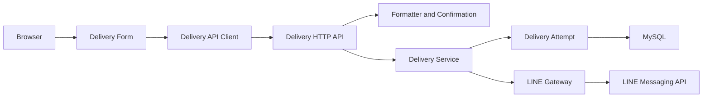
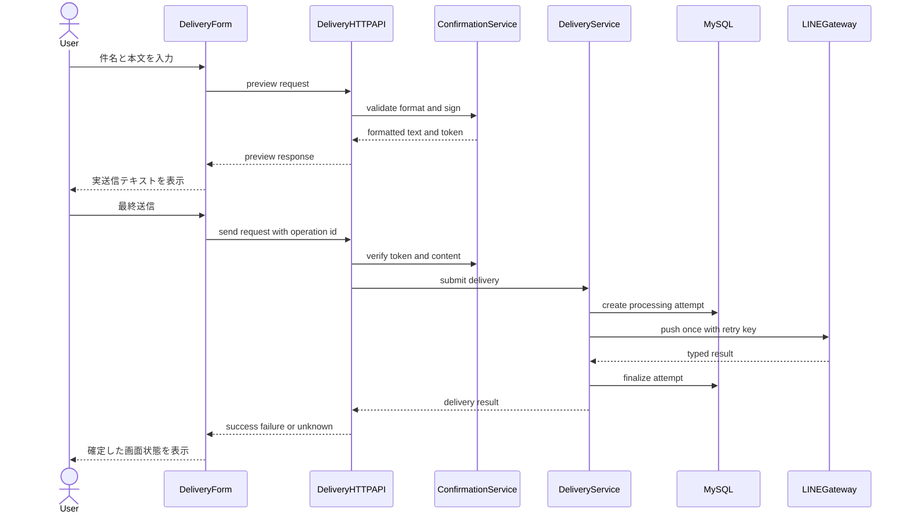
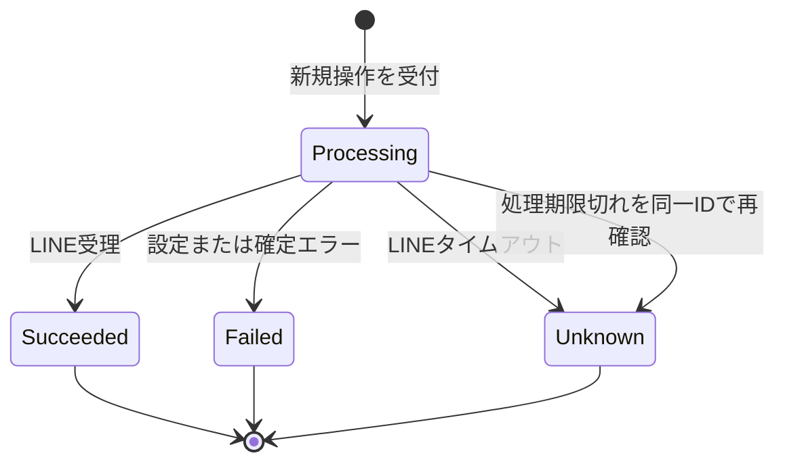
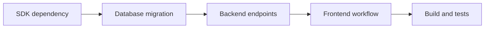

# 技術設計書

## Overview

本機能は、LINE Messaging API を学ぶ個人開発者に、件名と本文を確認してから自分の固定 LINE アカウントへテキスト1件を安全に送る操作を提供する。既存の React 画面へ入力・確認・結果表示を追加し、Django の独立 `delivery` app が検証、冪等受付、同期 push、監査記録を所有する。

取り消せない外部作用は、Backend が発行する確認トークン、DB一意制約、LINE retry key の三つの境界で保護する。送信成功は LINE Platform による受付を意味し、端末到達は保証しない。失敗と結果不明を区別し、秘密値やLINEのraw error本文を画面、API、DB、通常ログへ出さない。

### Goals

- Backendの正規フォーマッタが生成した `【件名】\n\n本文` を、明示的な確認後に固定宛先へ1件送信する。
- 同一操作ID、同一内容の並行操作、HTTP再送による二重送信を、Frontend・DB・LINEの各境界で抑止する。
- 成功、確定失敗、結果不明を送信試行へ記録し、安全で判断可能な結果を利用者へ返す。
- LINE SDK、HTTP、永続化、UIの責務を分離し、各受入基準を自動テスト可能にする。

### Non-Goals

- 宛先の表示・選択・管理、複数宛先配信、broadcast、multicast、narrowcast
- 配信履歴の一覧・詳細画面、Webhook、応答、予約、queue、worker、自動再送
- 月間利用量取得、本番向け認証・認可・レート制限、外部公開運用
- LINEによる実端末到達の保証、ブロック状態の判定

## Boundary Commitments

### This Spec Owns

- 件名・本文の検証、唯一の整形規則、確認トークンの発行と検査
- `POST /api/deliveries/preview/`、`POST /api/deliveries/`、`POST /api/deliveries/{operationId}/status/` のHTTP契約
- 固定 `LINE_USER_ID` への同期 push 1件と、LINE応答の安全な内部結果への変換
- 送信試行、操作ID、内容fingerprint、処理状態、日時、LINE request IDの正本
- 入力、確認、送信中抑止、成功・失敗・結果不明、新規入力のFrontend状態

### Out of Boundary

- LINE認証情報および固定宛先の作成、更新、表示、保存、ローテーション管理
- 送信試行を検索・列挙する履歴API/UI、および期限切れ判定を超える管理者向け回復操作
- LINE timeout、5xx、terminalな `unknown` に対する自動または手動のLINE再送workflow（受付記録を確認できないHTTP要求を同一operation IDで明示的に再試行することは含める）
- user/group/roomなど宛先種別の一般化、メッセージ種別の追加、複数メッセージ送信
- production deployment、利用者識別、アクセス制御、rate limit、監視サービス連携

### Allowed Dependencies

- Frontendは既存 React 19、TypeScript 6、Vitest、jsdom、および相対URL `/api/...` だけに依存する。LINE SDK、秘密値、Backend内部型へ依存しない。
- Backendは Django 6、Django REST Framework 3、Django ORM/signing、MySQL 8.4、`line-bot-sdk==3.25.0` の `linebot.v3` に依存できる。
- Backendは環境変数 `LINE_CHANNEL_ACCESS_TOKEN` と `LINE_USER_ID` を送信時だけ参照する。pushに不要な `LINE_CHANNEL_SECRET` は本機能の処理へ取り込まない。
- 依存方向は Backendで `Model and Value Types → Formatter and Confirmation → LINE Gateway → Delivery Service → Serializer and View → URL Composition`、Frontendで `DTO Types → API Client and State → Delivery Form → App` とする。右側の層から左側だけを参照し、逆方向importを禁止する。

### Revalidation Triggers

- preview/sendのJSON shape、error code、HTTP status、整形規則、UTF-16コード単位による5,000文字判定の変更
- `DeliveryAttempt` の状態、fingerprint、一意制約、日時またはrequest IDの所有権変更
- 自動再送、非同期job、履歴API、可変/複数宛先、別メッセージ種別の追加
- LINE SDK major version、retry keyの保持/形式、push APIの成功・エラー契約変更
- `DJANGO_SECRET_KEY` の変更方法、Backend起動前提、LINE環境変数の注入方法変更
- FrontendからLINEへ直接接続する変更、またはdependency directionの変更

## Architecture

### Existing Architecture Analysis

- 既存の Browser → Vite `/api` proxy → Django REST API → MySQL を維持し、DjangoからのみLINEへ接続する。
- `health` appのapp-local URLConfとDRF `APIView` パターンを踏襲するが、配信責務は新しい `delivery` appへ隔離する。
- Frontendは現在の `App.tsx` を画面合成点として維持し、配信固有コードを `src/delivery/` へ置く。
- Composeは必要なLINE環境変数をBackendだけへ注入済みであり、コンテナ構成変更は不要である。

### Architecture Pattern & Boundary Map



**Architecture Integration**:

- Selected pattern: 単一Django app内の明示的な層分離。外部SDKをadapterへ隔離しつつ、単一DB向けrepository抽象は作らない。
- Domain/feature boundaries: UI状態、HTTP境界、確認、送信orchestration、外部adapter、監査modelを単独責務にする。
- Existing patterns preserved: app-local URLConf、DRF View/serializer、Django ORM、相対 `/api`、co-located Frontend tests。
- New components rationale: 署名確認は2.3–2.4、service/modelは4.x–5.x、LINE adapterは3.xと6.xを独立に保証する。
- Steering compliance: 秘密情報をBackendへ隔離し、外部作用を冪等化し、固定の小規模対象だけを扱う。

### Technology Stack

| Layer | Choice / Version | Role in Feature | Notes |
|-------|------------------|-----------------|-------|
| Frontend | TypeScript 6.0.3 / React 19.2.7 | 入力・確認・状態表示 | strict、`any`禁止、相対APIのみ |
| Backend | Python 3.14 / Django 6.0.7 / DRF 3.17.1 | HTTP、署名確認、同期orchestration | type hintsを境界契約へ付与 |
| External SDK | `line-bot-sdk==3.25.0` | `linebot.v3` によるpushとヘッダー取得 | 2.x API禁止、同期呼出し1回 |
| Data | MySQL 8.4 `utf8mb4` / Django ORM | 送信試行と一意制約 | raw外部errorと宛先IDを保存しない |
| Runtime | Docker Compose | 環境変数注入とサービス起動 | 既存構成を維持 |

## File Structure Plan

### Directory Structure

```text
backend/
├── delivery/
│   ├── __init__.py                  # Django app package境界
│   ├── apps.py                      # delivery app定義
│   ├── models.py                    # DeliveryAttemptと状態・失敗種別
│   ├── formatters.py                # MessageFormatterの整形・fingerprint・長さ検証
│   ├── confirmation.py              # ConfirmationTokenServiceの署名契約
│   ├── line_client.py               # LINEGatewayのSDK adapterと外部結果変換
│   ├── services.py                  # DeliveryServiceの冪等受付・状態遷移・同期送信
│   ├── serializers.py               # DeliveryHTTPAPIのDTO検証と安全な出力
│   ├── views.py                     # PreviewAPIView、DeliveryAPIView、DeliveryStatusAPIView
│   ├── urls.py                      # delivery appのURL定義
│   ├── migrations/
│   │   ├── __init__.py              # migration package境界
│   │   └── 0001_initial.py          # DeliveryAttempt schema
│   └── tests/
│       ├── __init__.py              # test package境界
│       ├── test_formatters.py        # 整形・空白・改行・文字数
│       ├── test_confirmation.py      # 署名・改変・入力変更
│       ├── test_line_client.py       # SDK成功・header・例外分類
│       ├── test_services.py          # 冪等性・状態遷移・設定不足
│       ├── test_concurrency.py       # DB一意制約による並行抑止
│       └── test_api.py               # 公開HTTP契約
frontend/src/
└── delivery/
    ├── types.ts                      # DTO Typesとdiscriminated union
    ├── api.ts                        # DeliveryApiClientの型付きfetch通信
    ├── state.ts                      # DeliveryStateの確認無効化を含む状態遷移
    ├── DeliveryForm.tsx              # 入力・preview・最終送信・結果表示
    └── DeliveryForm.test.tsx         # 受入フローのjsdomテスト
```

### Modified Files

- `backend/config/settings.py` — `delivery` appを登録し、LINE設定をBackend内で読み取れる形にする。
- `backend/config/urls.py` — `/api/deliveries/` 配下へapp-local URLConfをincludeする。
- `backend/requirements.txt` — `line-bot-sdk==3.25.0` を固定する。
- `frontend/src/App.tsx` — 既存health表示を保持し、`DeliveryForm` を合成する。
- `frontend/src/style.css` — 配信フォーム、確認、結果の画面全体スタイルを追加する。

`compose.yaml` と `.env.example` は必要キーを既にBackendだけへ配線しているため変更しない。生成物 `dist`、`node_modules`、`*.tsbuildinfo` は対象外とする。

## System Flows

### Previewから最終送信まで



編集はFrontendのpreview状態とtokenを即時破棄する。Backendも最終送信時にtokenと再計算fingerprintを照合するため、古い確認内容ではLINEを呼ばない。

### 送信試行の状態



terminal状態からの自動送信・再送はない。単一試行の状態確認APIは新しい送信試行やLINE呼出しを作らず、処理期限内なら現在の `processing`、期限切れならcompare-and-setで `unknown` に確定した結果を返す。operation IDが存在しない場合は404を返し、受付有無を断定せず送信も開始しない。

## Requirements Traceability

| Requirement | Summary | Components | Interfaces | Flows |
|-------------|---------|------------|------------|-------|
| 1.1 | 件名・本文入力 | DeliveryForm | DeliveryUIState | Preview |
| 1.2 | 空白入力拒否 | MessageFormatter, DeliveryHTTPAPI, DeliveryForm | PreviewRequest, ValidationError | Preview |
| 1.3 | 所定形式へ整形 | MessageFormatter | `format_message` | Preview |
| 1.4 | 本文改行保持 | MessageFormatter | `format_message` | Preview |
| 1.5 | LINE基準の5,000文字超過拒否 | MessageFormatter, DeliveryHTTPAPI | ValidationError | Preview |
| 1.6 | 無効入力時は送信しない | DeliveryHTTPAPI, DeliveryService | Preview/Send error | Preview |
| 2.1 | 実送信テキスト表示 | MessageFormatter, DeliveryForm | PreviewResponse | Preview |
| 2.2 | 確認と最終送信を分離 | DeliveryForm, DeliveryHTTPAPI | preview/send endpoints | Preview |
| 2.3 | 未確認送信拒否 | ConfirmationTokenService, DeliveryHTTPAPI | confirmationToken | Preview |
| 2.4 | 編集後の確認無効化 | DeliveryState, ConfirmationTokenService | content fingerprint | Preview |
| 2.5 | 入力へ戻って値保持 | DeliveryState, DeliveryForm | DeliveryUIState | Preview |
| 3.1 | 固定宛先へ1件push | DeliveryService, LINEGateway | `push_text` | Send |
| 3.2 | 宛先UIを提供しない | DeliveryForm, DeliveryHTTPAPI | targetを含まないDTO | Send |
| 3.3 | 設定不足・無効を失敗化 | LINEGateway, DeliveryService | DeliveryResult | Send |
| 3.4 | 処理中表示 | DeliveryState, DeliveryForm | processing status | Send |
| 3.5 | LINE受付を成功表示 | LINEGateway, DeliveryForm | succeeded status | Send |
| 4.1 | 操作を一意識別 | DeliveryAttempt, DeliveryState | operationId | Send |
| 4.2 | 処理中の同一内容を抑止 | DeliveryAttempt, DeliveryService, DeliveryForm | active fingerprint | Send |
| 4.3 | 同一操作IDは既存結果を返す | DeliveryService, DeliveryHTTPAPI, DeliveryApiClient | idempotent send/status response | Send, State |
| 4.4 | 同一IDの内容差し替え拒否 | DeliveryService | operation_id_reused | Send |
| 4.5 | 失敗・不明時に自動再送しない | DeliveryService, LINEGateway | single call invariant | Send, State |
| 5.1 | 受付内容と日時を記録 | DeliveryAttempt, DeliveryService | attempt schema | Send |
| 5.2 | 成功と送信日時を記録 | DeliveryAttempt, DeliveryService | succeeded transition | State |
| 5.3 | LINE request IDを記録 | LINEGateway, DeliveryAttempt | LinePushResult | Send |
| 5.4 | 失敗種別と日時を記録 | DeliveryAttempt, DeliveryService | failed transition | State |
| 5.5 | 成功と失敗を区別表示 | DeliveryForm, DeliveryHTTPAPI | DeliveryResultResponse | State |
| 5.6 | 安全なエラー概要 | LINEGateway, DeliveryHTTPAPI | SafeError | State |
| 6.1 | LINE status別の安全な分類 | LINEGateway | LineFailureType | Send |
| 6.2 | timeoutまたは処理期限切れを結果不明として記録 | LINEGateway, DeliveryAttempt, DeliveryService, DeliveryHTTPAPI, DeliveryForm | unknown status | State |
| 6.3 | 予期しないエラーを失敗化 | LINEGateway, DeliveryService | unexpected failure | State |
| 6.4 | 秘密値と宛先を露出しない | LINEGateway, DTO Types, DeliveryAttempt | targetなしresponse | Send |
| 6.5 | raw外部errorを露出しない | LINEGateway, DeliveryAttempt | SafeError mapping | Send |
| 7.1 | 送信中の再操作無効化 | DeliveryState, DeliveryForm | submitting state | Send |
| 7.2 | 対象内容の成功表示 | DeliveryForm | succeeded state | State |
| 7.3 | 未確定を含む失敗表示 | DeliveryForm | failed/unknown state | State |
| 7.4 | 新規入力で別操作化 | DeliveryState | new operation transition | State |

## Components and Interfaces

| Component | Domain/Layer | Intent | Req Coverage | Key Dependencies | Contracts |
|-----------|--------------|--------|--------------|------------------|-----------|
| DeliveryForm | Frontend UI | 入力から結果・状態再確認までを表示し操作を制御 | 1.1–1.2, 2.1–2.5, 3.2, 3.4–3.5, 4.3, 6.2, 7.1–7.4 | DeliveryState P0, DeliveryApiClient P0 | State |
| DeliveryState | Frontend state | 確認・送信・結果の合法な遷移を定義 | 2.4–2.5, 3.4, 4.1–4.2, 7.1–7.4 | DTO Types P0 | State |
| DeliveryApiClient | Frontend integration | 型付きpreview/send/status HTTP通信 | 2.1–2.3, 3.5, 4.3, 5.5–5.6, 6.2 | DeliveryHTTPAPI P0 | Service |
| DeliveryHTTPAPI | Backend HTTP | DTO検証と安全なHTTP応答を所有 | 1.2, 1.5–1.6, 2.2–2.4, 4.3–4.4, 5.5–5.6, 6.2 | Confirmation P0, DeliveryService P0 | API |
| MessageFormatter | Backend domain | 正規整形とfingerprintを一意に定義 | 1.2–1.5 | なし | Service |
| ConfirmationTokenService | Backend domain | preview済み内容と最終送信内容を結合 | 2.1–2.4 | MessageFormatter P0, Django signing P1 | Service |
| DeliveryAttempt | Persistence | 送信操作と監査状態の正本 | 4.1–4.4, 5.1–5.4, 6.2 | MySQL P0 | State |
| DeliveryService | Application | 冪等受付、同期送信、状態確認・確定を統括 | 3.1, 3.3, 4.1–4.5, 5.1–5.4, 6.2–6.3 | DeliveryAttempt P0, LINEGateway P0 | Service |
| LINEGateway | External integration | SDK v3をpush用の安全な型へ変換 | 3.1, 3.3, 5.3, 6.1–6.5 | linebot.v3 P0, LINE API P0 | Service |

### Frontend

#### DeliveryState

| Field | Detail |
|-------|--------|
| Intent | 入力、preview、送信中、状態確認、成功、失敗の排他的状態と編集時無効化を定義する |
| Requirements | 2.4, 2.5, 3.4, 4.1, 4.2, 4.3, 6.2, 7.1, 7.2, 7.3, 7.4 |

**Responsibilities & Constraints**

- `editing | preview | submitting | processing | uncertain | checking | succeeded | failed` のdiscriminated unionを用い、存在しない組合せを型で表現しない。
- 件名または本文の変更時はpreview text、confirmation token、operation IDを破棄して `editing` へ戻る。
- `submitting` と `checking` 中は追加操作を受理しない。202 responseは期限付きの `processing`、fetch/network errorはoperation IDと元のsend payloadを保持する `uncertain` とする。通常は「状態を再確認」だけを許可し、statusが404の場合に限り「同じ送信操作を再試行」を明示的に許可する。
- terminal状態から「新しい配信」を選ぶと空入力の `editing` へ戻り、前回のoperation IDを破棄する。
- `failed` は確定失敗と `unknown` を表示種別で区別する。

**Dependencies**

- Inbound: DeliveryForm — 操作イベントと表示（P0）
- Outbound: DTO Types — API結果の型（P0）

**Contracts**: State [x]

```typescript
type DeliveryUIState =
  | { phase: 'editing'; subject: string; body: string; errors: FieldErrors }
  | { phase: 'preview'; subject: string; body: string; formattedText: string; confirmationToken: string }
  | { phase: 'submitting'; subject: string; body: string; formattedText: string; confirmationToken: string; operationId: string }
  | { phase: 'processing'; subject: string; body: string; formattedText: string; confirmationToken: string; operationId: string; acceptedAt: string; expiresAt: string }
  | { phase: 'uncertain'; subject: string; body: string; formattedText: string; confirmationToken: string; operationId: string; summary: string; canRetrySameOperation: boolean }
  | { phase: 'checking'; subject: string; body: string; formattedText: string; confirmationToken: string; operationId: string }
  | { phase: 'succeeded'; subject: string; body: string; formattedText: string; result: DeliverySuccess }
  | { phase: 'failed'; subject: string; body: string; formattedText: string; result: DeliveryFailure }
```

**Implementation Notes**

- Integration: operation IDは最終送信開始時に `crypto.randomUUID()` で一度だけ生成する。
- Validation: reducer/state transition testsで編集時無効化、二重submit拒否、processing/uncertainから同一IDでのchecking、status 404後だけ許可する同一操作再試行、新規入力時のID破棄を確認する。
- Risks: fetch自体のnetwork errorは外部送信結果を断定せず、成功未確認の表示と同一IDによる状態再確認を提供する。

#### DeliveryApiClient

| Field | Detail |
|-------|--------|
| Intent | API DTOをruntimeで安全に判別し、UIへ型付き結果を返す |
| Requirements | 2.1, 2.2, 2.3, 3.5, 4.3, 5.5, 5.6, 6.2 |

**Responsibilities & Constraints**

- `/api/deliveries/preview/`、`/api/deliveries/`、`/api/deliveries/{operationId}/status/` のみを相対URLで呼ぶ。
- 非2xx responseも共通error envelopeとして読み、想定shapeでない応答は `protocol_error` に変換する。
- target、access token、channel secretをrequest/response型へ定義しない。
- 最終送信のnetwork error後もoperation IDを保持し、利用者の「状態を再確認」操作では `POST /api/deliveries/{operationId}/status/` だけを呼ぶ。send payloadを再POSTせず、新しいLINE送信操作を生成しない。

**Dependencies**

- Inbound: DeliveryForm — preview/send要求（P0）
- Outbound: DeliveryHTTPAPI — JSON契約（P0）

**Contracts**: Service [x]

```typescript
interface DeliveryApiClient {
  preview(input: PreviewRequest): Promise<PreviewResponse>
  send(input: SendDeliveryRequest): Promise<DeliveryResultResponse>
  checkStatus(operationId: string): Promise<DeliveryResultResponse>
}

type DeliveryResultResponse =
  | { status: 'processing'; operationId: string; acceptedAt: string; expiresAt: string }
  | { status: 'succeeded'; operationId: string; acceptedAt: string; completedAt: string; lineRequestId: string | null }
  | { status: 'failed' | 'unknown'; operationId: string; acceptedAt: string; completedAt: string; error: SafeError; lineRequestId: string | null }
```

**Implementation Notes**

- Integration: `Content-Type: application/json` を指定し、認証headerやLINE headerは扱わない。
- Validation: statusごとの必須fieldをtype guardで検査する。`any` や無条件castを使わない。
- Risks: ブラウザnetwork errorはBackend結果と異なる可能性があるため、新しいoperation IDによる自動再送はしない。statusの404は「受付記録をまだ確認できない」と表示して `uncertain` を維持する。利用者が明示的に再試行する場合だけ、元と同じoperation ID・内容・confirmation tokenをsendへ再POSTし、DB一意制約とLINE retry keyで同一操作として扱う。

#### DeliveryForm

DeliveryStateを表示するpresentational boundaryである。`editing` では件名・本文と項目別error、`preview` ではBackendが返した整形済みテキスト、`submitting/checking` では操作をdisabledにし、`processing/uncertain` では新規送信と区別した「状態を再確認」を表示する。statusが404の `uncertain` だけは、同じoperation IDを使うことを明示した「同じ送信操作を再試行」も表示する。terminal状態では確認済みテキストに対応する結果を表示する。宛先値または宛先入力要素は一切描画しない。

**Implementation Notes**

- Integration: 既存health表示を壊さず `App.tsx` から合成する。
- Validation: 入力→確認→戻る、編集による再確認、送信中disabled、成功/失敗→新規入力をjsdomで検証する。
- Risks: Frontendの事前検証は操作性向上だけに使い、Backendの判断を正本とする。

### Backend HTTP and Domain

#### DeliveryHTTPAPI

| Field | Detail |
|-------|--------|
| Intent | preview、最終送信、単一試行の状態確認契約を検証し、安全なresponseだけを返す |
| Requirements | 1.2, 1.5, 1.6, 2.2, 2.3, 2.4, 4.3, 4.4, 5.5, 5.6, 6.2 |

**Responsibilities & Constraints**

- serializerでJSON型、必須field、UUIDを検証し、domain validationはMessageFormatterへ委譲する。
- previewは永続化もLINE呼出しも行わない。sendはconfirmation検証後だけDeliveryServiceを呼ぶ。
- status POSTはoperation IDだけを受け取り、DeliveryServiceの状態確認以外を呼ばない。試行が存在しない場合は安全な404を返す。
- 外部error本文、例外文字列、設定値、固定宛先をresponseへ含めない。

**Dependencies**

- Inbound: DeliveryApiClient — HTTP JSON（P0）
- Outbound: MessageFormatter / ConfirmationTokenService — previewと確認（P0）
- Outbound: DeliveryService — 最終送信（P0）

**Contracts**: API [x]

##### API Contract

| Method | Endpoint | Request | Success Response | Errors |
|--------|----------|---------|------------------|--------|
| POST | `/api/deliveries/preview/` | `{ subject: string, body: string }` | 200 `{ formattedText, confirmationToken }` | 400 validation_error |
| POST | `/api/deliveries/` | `{ subject, body, operationId, confirmationToken }` | 201 new result / 200 existing terminal or stale→unknown / 202 existing processing | 400 validation/confirmation, 409 reused/in_progress, 500 safe internal |
| POST | `/api/deliveries/{operationId}/status/` | path UUIDのみ、bodyなし | 200 terminal or stale→unknown / 202 processing | 400 invalid UUID, 404 operation_not_found, 500 safe internal |

共通error envelopeは `{ error: { code: string, summary: string, fields?: Record<string, string[]> } }` とする。`summary` とfield messageはアプリ定義の固定文言だけを返す。

**Implementation Notes**

- Integration: 認証/permissionは既存ローカル環境に合わせて空とし、外部公開しない前提を明記する。
- Validation: status codeとresponse bodyの双方、かつinvalid時にservice/LINEが未呼出しであることをAPITestCaseで確認する。
- Recovery: status POSTはDB read/compare-and-setだけを行い、試行が存在しなくても作成しない。`processing_expires_at` 以前は202を返し、期限後はLINEを呼ばずに `processing → unknown` を原子的に確定して200を返す。404は受付失敗の断定ではなく、その時点で記録を観測できないことだけを表す。
- Risks: 本番公開する場合はこの認証なし契約を再利用せず、別仕様で認可を追加する。

#### MessageFormatter

| Field | Detail |
|-------|--------|
| Intent | 件名・本文から唯一の送信テキストと安定した内容fingerprintを生成する |
| Requirements | 1.2, 1.3, 1.4, 1.5 |

**Responsibilities & Constraints**

- 空白だけの値を拒否するが、有効値の本文改行は変更しない。
- 送信テキストを正確に `【{subject}】\n\n{body}` とし、LINEの文字数規則に合わせてUTF-16コード単位が5,000を超える場合は拒否する。PythonのUnicode code point数を返す `len(text)` を文字数判定へ直接使わない。
- fingerprintはformatter version、件名、本文、整形後テキストを曖昧でないserializationで結合しSHA-256化する。

**Dependencies**

- Inbound: ConfirmationTokenService / DeliveryService — 正規内容（P0）
- Outbound: なし

**Contracts**: Service [x]

```python
@dataclass(frozen=True)
class FormattedMessage:
    subject: str
    body: str
    formatted_text: str
    fingerprint: str
    formatter_version: int

def count_utf16_code_units(text: str) -> int: ...
def format_message(subject: str, body: str) -> FormattedMessage: ...
```

- Preconditions: `subject` と `body` は文字列である。
- Counting: `count_utf16_code_units` はBOMを含めず `len(text.encode("utf-16-le")) // 2` と等価な値を返す。不正な孤立surrogateはvalidation errorとして拒否する。
- Postconditions: 成功時の `formatted_text` はUTF-16コード単位で5,000以下で、本文改行を保持する。
- Invariants: 同じversionと入力は同じfingerprintを返す。

#### ConfirmationTokenService

| Field | Detail |
|-------|--------|
| Intent | preview済みの正規内容だけを最終送信で受理する |
| Requirements | 2.1, 2.2, 2.3, 2.4 |

**Responsibilities & Constraints**

- token payloadはformatter versionとfingerprintだけとし、本文、宛先、秘密値を含めない。
- Django signingの専用saltを使い、署名不正、version不一致、fingerprint不一致をconfirmation errorへ変換する。
- token検査前後にLINEを呼ばず、失敗時は送信試行を作らない。

**Dependencies**

- Inbound: DeliveryHTTPAPI — preview発行とsend検証（P0）
- Outbound: MessageFormatter — fingerprint（P0）
- External: Django signing — 改変検出（P1）

**Contracts**: Service [x]

```python
class ConfirmationTokenService:
    def issue(self, message: FormattedMessage) -> str: ...
    def verify(self, token: str, message: FormattedMessage) -> None: ...
```

- Preconditions: `message` はMessageFormatterの成功結果である。
- Postconditions: verify成功はpreviewとsendの内容一致を保証する。
- Invariants: tokenは送信権限、宛先情報、operation IDを表さない。

### Backend Application and Persistence

#### DeliveryAttempt

| Field | Detail |
|-------|--------|
| Intent | 1回の最終送信操作と監査状態の正本を保持する |
| Requirements | 4.1, 4.2, 4.3, 4.4, 5.1, 5.2, 5.3, 5.4, 6.2 |

**Responsibilities & Constraints**

- aggregate rootは1行のDeliveryAttemptであり、`processing → succeeded | failed | unknown` だけを許可する。
- `operation_id` は永続的に一意、`active_content_fingerprint` はprocessing中だけ非NULLかつ一意とする。
- 新規受付時に `processing_expires_at` を設定する。期限切れは送信成功・失敗を推測せず、同一operation IDの状態再確認時にだけ `unknown` へ確定する。
- targetは固定方式enumだけを保存し、`LINE_USER_ID` は保存しない。
- raw SDK response、raw error body、token、channel secretを保存しない。

**Dependencies**

- Inbound: DeliveryService — 作成と状態遷移（P0）
- External: MySQL — 一意制約と永続化（P0）

**Contracts**: State [x]

##### State Management

- State model: `processing`, `succeeded`, `failed`, `unknown`。`processing → unknown` はLINE timeoutに加え、処理期限切れの状態再確認でも許可する。
- Persistence & consistency: 新規受付とterminal更新を別々の短いtransactionでcommitする。
- Concurrency strategy: `operation_id` uniqueとnullable `active_content_fingerprint` uniqueをDBの最終防壁にする。gateway完了と期限切れ確定は `status=processing` を条件にしたcompare-and-setで競合させ、先に成立したterminal状態を後続処理が上書きしない。

**Implementation Notes**

- Integration: migration適用後にのみendpointを公開する。既存行のdata migrationはない。
- Validation: model transition helperがterminal状態の再更新を拒否し、terminal化時にactive fingerprintをNULL化する。
- Risks: process crash直後はprocessingが残るが、有限の期限後に同一IDで状態を再確認すると `processing_expired` の `unknown` へ確定できる。期限切れ確定はLINE再送を伴わない。

#### DeliveryService

| Field | Detail |
|-------|--------|
| Intent | 送信受付を冪等化し、外部結果を1回だけ永続状態へ確定する |
| Requirements | 3.1, 3.3, 4.1, 4.2, 4.3, 4.4, 4.5, 5.1, 5.2, 5.3, 5.4, 6.2, 6.3 |

**Responsibilities & Constraints**

- 新規operationをprocessingでcommit後、DB transaction外でLINEGatewayを1回だけ呼ぶ。
- 同一operation/fingerprintは既存状態を返す。ただし期限切れprocessingは原子的にunknownへ確定して返し、同一operation/異なるfingerprintは拒否する。
- 別operationでも同じactive fingerprintがある場合は `delivery_in_progress` として拒否する。
- gateway結果を `succeeded`、`failed`、`unknown` のいずれかへ一度だけ確定し、自動再送しない。

**Dependencies**

- Inbound: DeliveryHTTPAPI — 検証・確認済みcommand（P0）
- Outbound: DeliveryAttempt — 監査と競合制御（P0）
- Outbound: LINEGateway — 外部作用（P0）

**Contracts**: Service [x]

```python
@dataclass(frozen=True)
class SubmitDeliveryCommand:
    operation_id: UUID
    message: FormattedMessage

DeliverySubmission = ProcessingSubmission | SucceededSubmission | FailedSubmission | UnknownSubmission

class DeliveryService:
    def submit(self, command: SubmitDeliveryCommand) -> DeliverySubmission: ...
    def check_status(self, operation_id: UUID) -> DeliverySubmission | None: ...
```

- Preconditions: message validationとconfirmation検証が成功している。
- Postconditions: 新規受付は必ずDeliveryAttemptを持ち、外部呼出し結果は安全なterminal状態へ保存される。
- Invariants: 1 operation IDにつき外部呼出しは最大1回。同一内容のprocessingは最大1行。`check_status` と期限切れ確定は試行作成および外部呼出しを行わない。

**Implementation Notes**

- Integration: `IntegrityError` をoperation競合とactive fingerprint競合へ安全に再照会・分類する。
- Validation: gateway mockのcall count、transaction後呼出し、各terminal fieldに加え、期限前再確認、期限後のunknown確定、gateway完了とのcompare-and-set競合を検証する。並行性テストは `TransactionTestCase` とthreadごとの独立DB connectionを使う。
- Risks: DB terminal更新失敗では成功レスポンスを推測して返さない。試行は期限後の状態再確認でunknownへ収束する。

### External Integration

#### LINEGateway

| Field | Detail |
|-------|--------|
| Intent | 固定宛先へのSDK pushを、秘密を含まないtyped resultへ変換する |
| Requirements | 3.1, 3.3, 5.3, 6.1, 6.2, 6.3, 6.4, 6.5 |

**Responsibilities & Constraints**

- `linebot.v3.messaging.MessagingApi.push_message_with_http_info` へTextMessage 1件を渡し、`operation_id` を `X-Line-Retry-Key` に指定する。
- access tokenまたは固定user ID不足はSDK構築前に `configuration` failureとして返す。
- `ApiException.status` とheaderだけを読み、bodyと例外文字列を上位層や通常ログへ渡さない。
- 409に `X-Line-Accepted-Request-Id` がある場合は既受理成功、それ以外は `conflict` failureとする。
- timeoutは `unknown`、400/401/403/429/5xx/その他を固定enumへ写像する。adapter自身はretryしない。connect 3秒・read 10秒の有限timeoutを指定し、processing期限はこれより十分長い30秒とする。

**Dependencies**

- Inbound: DeliveryService — push command（P0）
- External: `linebot.v3` — SDK contract（P0）
- External: LINE Messaging API — 外部受付（P0）
- External: Backend environment — access tokenと固定user ID（P0）

**Contracts**: Service [x]

```python
@dataclass(frozen=True)
class LinePushCommand:
    retry_key: UUID
    text: str

LinePushResult = LinePushAccepted | LinePushRejected | LinePushUnknown

class LINEGateway:
    def push_text(self, command: LinePushCommand) -> LinePushResult: ...
```

- Preconditions: textはMessageFormatterが検証した1件である。
- Postconditions: SDKは最大1回呼ばれ、戻り値はraw bodyを含まない。
- Invariants: 宛先は環境変数だけから読み、response/model/logへ渡さない。

**Implementation Notes**

- Integration: SDKのrequest timeoutへconnect 3秒・read 10秒を指定し、`X-Line-Request-Id` と必要時の `X-Line-Accepted-Request-Id` を大文字小文字非依存で抽出する。SDK/HTTP clientの自動retryは無効にする。
- Validation: SDKをmockし、200、409 accepted、各status、timeout、unexpected、設定不足を網羅する。
- Risks: SDK minor updateで生成signatureが変わり得るため、固定versionとadapter contract testを維持する。

## Data Models

### Domain Model

- Aggregate: `DeliveryAttempt`
- Value objects: `FormattedMessage`、`ContentFingerprint`、`OperationId`、`SafeFailure`
- Invariants:
  - `operation_id` は1つの内容fingerprintにだけ結び付く。
  - processingだけが非NULLのactive fingerprintを持つ。
  - processingは受付時に確定した `processing_expires_at` を持ち、期限後の同一ID再確認は外部送信なしでunknownへ収束する。
  - succeededは `sent_at` を持ち、failed/unknownは `failed_at` とfailure typeを持つ。
  - terminal状態は再遷移しない。
  - 宛先値、認証情報、raw LINE errorはaggregateへ入らない。

### Logical Data Model

`DeliveryAttempt` は独立entityで、他の既存tableとの外部キーを持たない。履歴機能は対象外だが、送信受付と結果追跡の正本として削除cascadeを持たない。

### Physical Data Model

| Column | Django / DB Type | Null | Constraint / Meaning |
|--------|------------------|------|----------------------|
| `id` | BigAutoField / BIGINT | no | primary key |
| `operation_id` | UUIDField / CHAR | no | unique、LINE retry key |
| `subject` | TextField / LONGTEXT | no | 利用者入力 |
| `body` | TextField / LONGTEXT | no | 改行を保持する利用者入力 |
| `formatted_text` | TextField / LONGTEXT | no | UTF-16コード単位で最大5,000の正規内容 |
| `content_fingerprint` | CharField(64) | no | 内容同一性、index |
| `active_content_fingerprint` | CharField(64) | yes | unique、processing中のみ値あり |
| `target_mode` | CharField | no | 固定値 `fixed_user` |
| `status` | CharField | no | processing/succeeded/failed/unknown、index |
| `failure_type` | CharField | yes | 固定enum、raw本文なし |
| `line_request_id` | CharField | yes | LINEの今回request ID |
| `line_accepted_request_id` | CharField | yes | 409既受理時の元request ID |
| `accepted_at` | DateTimeField | no | Backend受付日時 |
| `processing_expires_at` | DateTimeField | no | 受付から30秒後の処理期限、状態再確認の判定基準 |
| `sent_at` | DateTimeField | yes | LINE受理確定日時 |
| `failed_at` | DateTimeField | yes | failed/unknown確定日時 |
| `completed_at` | DateTimeField | yes | terminal確定日時 |

DB constraintは `operation_id` unique、`active_content_fingerprint` unique、状態別必須fieldを検査するcheck constraintを含む。秘密値を含まないため、通常のDjango model reprにも本文やtokenを出さない。

### Data Contracts & Integration

- JSON field名はFrontend契約に合わせcamelCase、Backend modelはsnake_caseとしserializerが明示変換する。
- datetimeはtimezone-aware ISO 8601文字列で返す。
- failure/error codeは `validation_error`, `confirmation_required`, `confirmation_stale`, `configuration`, `invalid_request`, `authentication`, `permission`, `conflict`, `rate_limited`, `service_unavailable`, `timeout_unknown`, `processing_expired`, `unexpected`, `operation_id_reused`, `delivery_in_progress`, `operation_not_found` の閉じた集合とする。
- APIはtarget value、confirmation tokenの内容、raw LINE bodyをresponseへ含めない。preview responseだけが署名済みopaque tokenを返す。

## Error Handling

### Error Strategy

- 入力・confirmation errorは送信試行作成前にfail fastし、LINEを呼ばない。
- 設定error以降は受付済み試行をterminalへ確定し、HTTP成功response内のdelivery statusとして返す。
- LINE errorはstatus/headerのみから分類し、safe summaryは内部codeから生成する。
- timeoutは配信の有無を断定しない `unknown` とし、UIでは「送信成功として確認できない」と表示する。
- 同一operation IDの状態再確認で処理期限切れを検出した場合も `processing_expired` の `unknown` とし、LINEを再送せず「処理結果を確認できない」と表示する。
- DB更新やprotocol解釈に失敗した場合は成功を推測せず、安全な500またはfailed状態にする。

### Error Categories and Responses

| Source | Internal result | User summary | Retry behavior |
|--------|-----------------|--------------|----------------|
| 空白・長さ・JSON不正 | validation_error | 該当項目を修正 | LINE未呼出し |
| token不正・内容変更 | confirmation_required/stale | 内容を再確認 | LINE未呼出し |
| token/user ID不足 | configuration | Backend設定を確認 | 自動再送なし |
| LINE 400 | invalid_request | 入力または設定を確認 | 自動再送なし |
| LINE 401 | authentication | 認証設定を確認 | 自動再送なし |
| LINE 403 | permission | チャネル権限を確認 | 自動再送なし |
| LINE 409 accepted headerあり | succeeded | 既にLINEが受付済み | 再送なし |
| LINE 409 accepted headerなし | conflict | 競合を確認 | 自動再送なし |
| LINE 429 | rate_limited | 時間・上限を確認 | 自動再送なし |
| LINE 5xx | service_unavailable | LINE側の状態を確認 | 自動再送なし |
| timeout | timeout_unknown | 成功を確認できない | 自動再送なし |
| processing期限切れ | processing_expired | 処理結果を確認できない | 状態確認のみ、LINE再送なし |
| unexpected | unexpected | 記録を確認 | 自動再送なし |

### Monitoring

- 通常ログはoperation ID、内部status、failure type、LINE request IDだけをstructured fieldsとして出力できる。
- 件名、本文、formatted text、target、token、access token、channel secret、raw response body、例外文字列は通常ログへ出さない。
- 外部監視導入は対象外。`processing` 滞留はDB記録から調査でき、同一operation IDの状態再確認時に期限切れをunknownへ確定する。background jobによる修復や再送は行わない。

## Testing Strategy

### Unit Tests

- `MessageFormatter`: 件名/本文の空白だけを項目別に拒否し、`【件名】\n\n本文` と本文内改行を正確に保持する。UTF-16コード単位で5,000境界は受理し、5,001を拒否する。BMP文字、サロゲートペアになる絵文字、結合文字を含む境界を検証する（1.2–1.5）。
- `ConfirmationTokenService`: 正しい内容だけを受理し、件名変更、本文変更、token改変、formatter version変更をLINE呼出し前に拒否する（2.3–2.4）。
- `DeliveryState`: 確認後編集でtokenを破棄し、入力へ戻る場合は値を保持し、submitting中の再submitを拒否する（2.4–2.5, 7.1）。
- `LINEGateway`: 200 request ID、409 accepted ID、400/401/403/409/429/5xx、timeout、unexpectedをtyped resultへ変換し、raw bodyを返さない（3.3, 5.3, 6.1–6.5）。
- `DeliveryAttempt`: 合法な状態遷移とterminal再遷移拒否、active fingerprint解放を検証する（5.2, 5.4, 6.2）。
- `DeliveryAttempt`: processing期限前後の判定と、期限切れunknown確定・gateway terminal更新のcompare-and-set競合を検証する（5.4–5.5, 6.2–6.3）。

### Integration Tests

- preview APIは有効内容をBackendの正規テキストとtokenで返し、無効内容ではDB/LINEを変更しない（1.6, 2.1–2.3）。
- send APIはconfirmation済み内容を固定宛先へTextMessage 1件だけ送り、operation IDをretry keyに使い、成功日時とrequest IDを保存する（3.1, 4.1, 5.1–5.3）。
- 同一operation ID・同一内容の再要求はgateway callを増やさず既存状態を返し、異なる内容は409で拒否する（4.3–4.4）。
- 同一operation IDの期限前再確認は202 processing、期限後再確認はgateway callなしで200 unknownを返し、`processing_expired` と完了日時を保存する（4.3, 5.4–5.6, 6.2）。
- MySQL上の並行requestは同一operation IDおよび別operation IDの同一active fingerprintについてgateway callを最大1回にする（4.2）。
- 設定不足、各LINE error、timeout、unexpectedで正しいstatus/failure/dateを保存し、response/logに秘密値とraw bodyを含めない（3.3, 5.4–5.6, 6.1–6.5）。

### E2E/UI Tests

- 件名と改行付き本文を入力して確認すると、Backendが返した実送信テキストが表示され、確認と最終送信が別操作である（1.1, 1.4, 2.1–2.2）。
- 確認から入力へ戻ると値を保持し、編集後は最終送信できず再確認が必要になる（2.4–2.5）。
- 最終送信中はbuttonがdisabledで処理中表示となり、重複clickがsend requestを増やさない（3.4, 7.1）。
- 成功は確認済み内容に対するLINE受付として表示し、failed/unknownは成功未確定としてsafe summaryを表示する（3.5, 5.5–5.6, 7.2–7.3）。
- network error後はoperation IDを保持し、利用者の状態再確認でstatus POSTだけを使う。202なら処理中、200 unknownなら成功未確認、404なら受付有無を断定しないuncertainを維持する。404後の明示的な同一操作再試行は元と同じoperation ID/payloadを使い、並行する元要求があってもgateway callを最大1回にする（4.3, 4.5, 6.2, 7.1–7.3）。
- terminal結果から新規入力へ進むと前回operation IDを再利用しない（7.4）。

### Performance and Concurrency

- 外部LINE APIを用いた負荷試験は行わない。gateway mockとMySQL integration testで競合だけを検証する。
- 外部通信中にDB transaction/row lockを保持していないことをservice testで確認する。
- 同期APIはconnect 3秒・read 10秒の有限timeoutと30秒のprocessing期限を持ち、その間の再操作をUIとDB制約の双方で抑止する。

## Security Considerations

- LINE access tokenと固定user IDはBackend環境変数からだけ読み、Frontend bundle、request、response、DB、通常ログへ出さない。
- channel secretはpushに不要なため本機能では参照しない。将来Webhookを追加するときに別境界で扱う。
- confirmation tokenはDjango signingを専用saltで使い、本文や秘密値を含めない。tokenは確認の証跡であり、利用者認証の代替ではない。
- APIはローカル開発専用で認証なしとする。外部公開、本番利用、複数利用者化は認証・CSRF・認可・rate limitを含む再設計のtriggerである。
- raw `ApiException.body` と例外文字列は保存・表示・通常ログ出力しない。安全なenumへのallow-list変換だけを許可する。

## Performance & Scalability

- 本機能は単一利用者・単一宛先・同期1件を対象とし、throughput最適化、batch、cache、水平scaleを導入しない。
- DB transactionは受付行作成とterminal更新に限定し、LINE network I/Oを含めない。
- 同一内容processingのunique制約は単一MySQLを整合性境界とする。複数DBやqueueを導入する変更は再検証する。
- LINEの2,000 req/s上限を利用目標にせず、同一ユーザーへの大量送信やLINE経由のload testを禁止する。

## Migration Strategy



- Phase 1: SDK固定、`delivery` app登録、初期migrationを適用する。
- Phase 2: formatter、confirmation、model、gateway、service、HTTP契約を有効化する。
- Phase 3: Frontend workflowを接続し、Backend tests、Frontend tests、production buildを実行する。
- Rollback: Frontend/API routeを戻してからapp登録を外す。新規tableには既存データ依存がないが、監査記録を失うtable dropは明示的な破壊操作として自動実行しない。
- Validation checkpoints: migration成功、health endpoint維持、LINE mock tests成功、秘密値非露出、TypeScript build成功を各phaseのgateとする。
