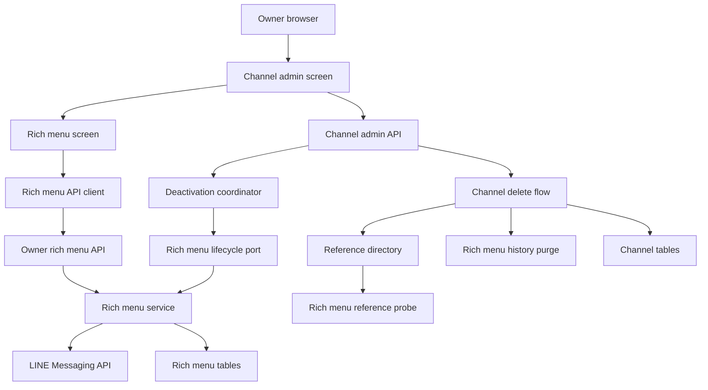
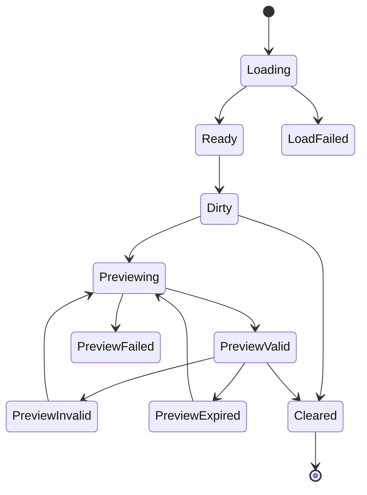
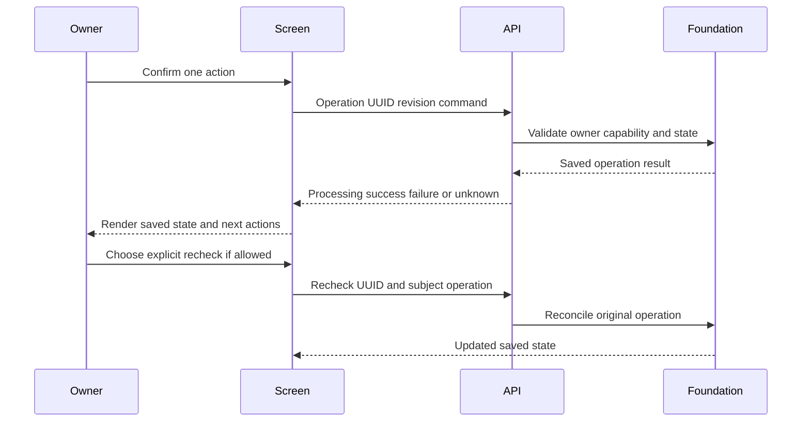
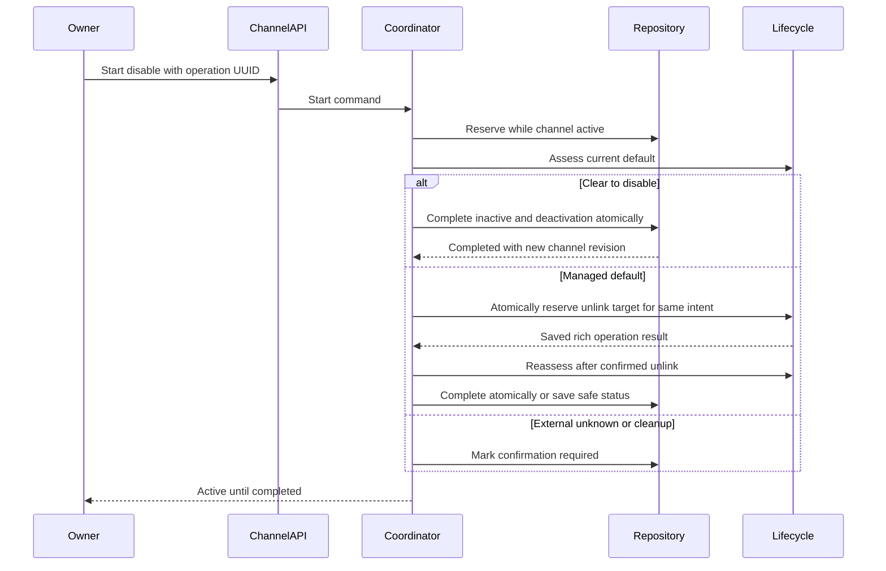
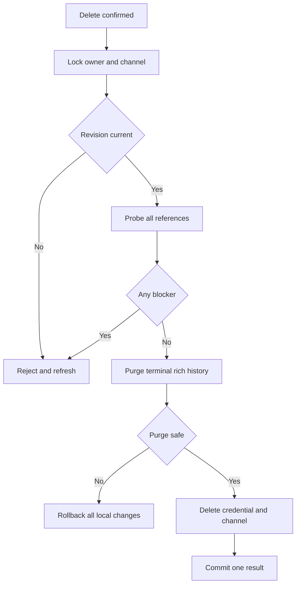
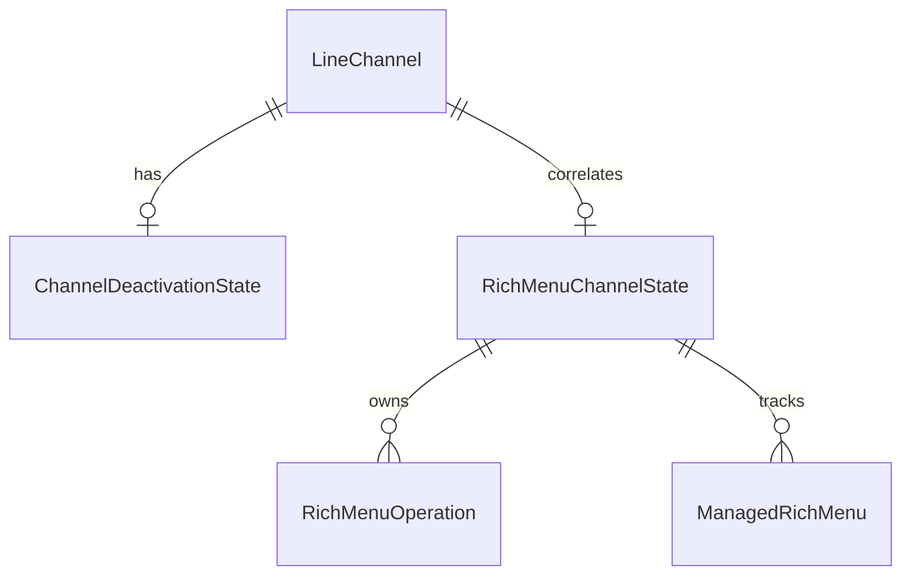
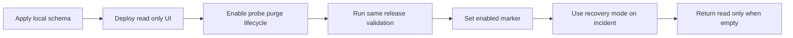

# 技術設計: line-rich-menu-admin-lifecycle

## Overview

本機能は、認証済みownerが登録済みMessaging APIチャネルごとに、組み込みリッチメニューの編集、期限付きpreview、適用・解除・管理終了、結果不明の再確認、後片付け、履歴参照を一つの専用管理画面から安全に行えるようにする。Frontendは既存`linerichmenus` owner APIの状態を厳密に表示し、画像生成、所有権判定、LINE操作状態機械、外部失敗分類を再実装しない。

Backendでは、既存foundationのheadless lifecycle/reference/purge契約を`linechannels`管理へ合成する。チャネル無効化はLINE既定の解除または不在確認が完了するまでチャネルをactiveに保ち、未確定結果を永続的な同一deactivation operationへ収束させる。物理削除はrich menu blockerを再確認し、terminal historyのpurgeと資格情報・チャネル削除を一つのDB transactionで完了する。

### Goals

- owner/provider/channel revisionでfenceされた専用管理画面とstrictな型付き契約を提供する。
- draft、preview、操作、実状態、回復、履歴、channel lifecycleを混同しない表示と操作可否を実現する。
- 無効化・再有効化・物理削除をfoundationの状態契約へ安全に統合する。
- `read_only | recovery_only | enabled`の提供modeを画面へ反映し、部分統合をfail closedにする。

### Non-Goals

- template catalog、renderer、confirmation、ownership marker、reconciliation、LINE gateway、operation sagaの内部変更または再実装。
- owner画像、自由layout、URI以外のaction、利用者別rich menu、alias、統計、予約、rollback、端末到達結果の保存。
- アプリ外rich menuの内容取得、取込み、編集、解除、削除。
- LINE Developers Console上のチャネル停止、Official Account削除、token再発行またはrevoke。

## Boundary Commitments

### This Spec Owns

- チャネルカードから一件のchannel contextを選ぶin-memory画面遷移と、専用rich menu管理screen。
- Frontendのstrict DTO、HTTP client、ephemeral reducer、離脱確認、preview object URL lifecycle、manual link open。
- foundation stateにreadinessを適用したeffective capabilitiesの公開projection。
- `linechannels`内のcurrent deactivation state、無効化coordinator、再確認API、再有効化後refresh gate。
- rich menu reference probe登録、terminal history purgeとchannel deleteのatomic composition。
- 同一releaseでのreadiness marker、回復mode、failure/security/integration validation。

### Out of Boundary

- `linerichmenus`が所有するtemplate、image binary生成、confirmation digest、resource/operation/history、LINE観測、cleanup可否判定。
- `linechannels`資格情報暗号化、owner authentication、provider identity、一般的なreference probe群の再設計。
- app外資源または外部toolが作成したaliasの管理。外部toolは本アプリ管理IDへaliasを設定しないことを運用前提とし、この保証を変更する場合はfoundationへ戻す。
- draftやpreviewのサーバー保存、Web Storage、Service Worker cache、URL routeへの埋込み。

### Allowed Dependencies

- `linerichmenus`: owner HTTP API、`RichMenuLifecyclePort`、reference probe、history purge、mutation readiness。Model/repositoryへの直接参照は禁止する。
- `linechannels`: owner admin service/repository、channel reference fence、revision、credential delete。rich menu側から`LineChannel` Modelへ直接依存しない。
- `lineaccounts`: `OwnerProtectedAPIView`、`OwnerOperationContext`、owner/provider fence。
- Frontend既存`httpApi.ts`とAuthGate。FrontendからLINE APIへ直接通信しない。
- React 19、TypeScript 6 strict、Django 6、DRF 3、MySQL 8.4。新しいrouter/store/background workerを追加しない。

### Revalidation Triggers

- foundationのstate/operation/history DTO、enum、`nextAllowedActions`、headless assessment/purge契約の変更。
- disable unlinkの原子的reservation、subject有無で分岐するdisable recovery、channel inactive化とdeactivation完了のatomic finalization契約の変更。
- rich menu resource/historyのdata ownership、channel reference fenceまたはlock順序の変更。
- aliasを含む削除安全性、利用者別menu、LINE default `200/403/404` semanticsのscope変更。
- channel revision、provider scope、owner session、delete transactionの変更。
- readiness marker、mode、startup validation、環境変数の変更。
- URL route導入、draft永続化、background polling/retryの導入。

## Architecture

### Existing Architecture Analysis

- `linerichmenus`はowner APIと四つの永続tableを持ち、operation ID、channel単位排他、外部I/O後のrevision再検証、unknown/recovery、cursor historyを実装済みである。
- `linechannels` adminはowner/provider/revisionをtransaction内でfenceするが、現行`set_state(false)`はrich menuを確認せず即時にinactiveへ更新する。deleteはreference directoryを使うがrich menu probe/purgeが未登録である。
- Frontendはflat構成で、Component、`*Api.ts`、`*Dto.ts`、`*State.ts`を分離する。routerと共有storeはなく、protected consoleはsession失効時にunmountされる。
- rich menu state APIはchannel label/active/revisionを返さないため、screenは既存channel detailとrich stateを同一request generationで組み合わせる。mutationは必ず表示中`updatedAt`をserverへ送り、二つのread間競合は409で閉じる。

### Architecture Pattern & Boundary Map



**Architecture Integration**:

- **Selected pattern**: 既存ports-and-adaptersを維持し、UIはHTTP、app間はtyped headless portで接続する。
- **Domain boundaries**: rich menuの判断と履歴は`linerichmenus`、channel active/deleteとdeactivation intentは`linechannels`、ephemeral edit stateはFrontend screenが所有する。
- **Existing patterns preserved**: exact DTO、owner fence、optimistic revision、外部I/O中lock非保持、safe result、composition root。
- **New components rationale**: deactivation coordinator/stateだけが、複数request・再認証をまたぐchannel lifecycle intentを表現するために必要である。
- **Steering compliance**: secretsをBackendに隔離し、unknownを成功扱いせず、ownerの明示操作以外で外部recheck/retryを実行しない。

### Technology Stack

| Layer | Choice / Version | Role in Feature | Notes |
|-------|------------------|-----------------|-------|
| Frontend | React 19 / TypeScript 6 / Vite 8 | screen、ephemeral reducer、strict DTO | `any`、router、共有storeなし |
| Backend | Python 3.14 / Django 6 / DRF 3 | owner API、deactivation coordinator、composition | type hintとclosed result型 |
| Data | MySQL 8.4 | current deactivation state、既存rich/channel data | row lock、atomic purge/delete |
| External | LINE Messaging API | foundation経由の観測とmutation | adminから直接callしない |
| Runtime | Docker Compose | 同一release compositionとtest | elevated modeはstartup fail closed |

## File Structure Plan

### Directory Structure

```text
frontend/src/
├── RichMenuAdminConsole.tsx       # 一件のchannel screenとrequest generation
├── RichMenuEditor.tsx             # template fieldsとdirty確認
├── RichMenuPreview.tsx            # image expiry warnings manual link test
├── RichMenuStatePanel.tsx         # actual state effective actions operation summary
├── RichMenuRecoveryPanel.tsx      # recheck unlink release cleanup confirmations
├── RichMenuHistory.tsx            # bounded cursor history append
├── richMenuAdminApi.ts            # owner rich menu and deactivation HTTP procedures
├── richMenuAdminDto.ts            # unknown responseのexact runtime validation
└── richMenuAdminState.ts          # draft preview request dialog page transitions

backend/linechannels/
├── admin_lifecycle_types.py       # deactivation command result view closed types
├── admin_lifecycle_repositories.py # current state reserve lock CAS projection
├── admin_lifecycle_services.py    # external I O前後のdeactivation coordinator
└── migrations/0003_channel_deactivation_state.py
```

テストはFrontendの各新規fileに対応する`frontend/test/*.test.ts(x)`、Backendは`backend/linechannels/tests/test_admin_lifecycle_{types,repositories,services,api,concurrency}.py`へ分ける。既存foundation変更のtestは`backend/linerichmenus/tests/test_{headless_references,disable_reservation,mutation_readiness,api}.py`へ追加する。

### Modified Files

- `frontend/src/App.tsx` — channel listとrich menu screenの選択、session失効時の即時screen破棄。
- `frontend/src/ChannelAdminConsole.tsx` — exact-provider channelだけに専用画面導線を公開し、pending deactivationを表示する。
- `frontend/src/ChannelActions.tsx` — unsafeな直接disableをdeactivation APIへ置換し、delete確認へrich blocker summaryを追加する。
- `frontend/src/channelAdmin{Api,Dto,State}.ts` — deactivation summaryと専用APIのtyped連携。
- `frontend/src/style.css` — smartphone preview、state badge、dialog、read-only panelのlayout。
- `backend/linerichmenus/headless.py` — typed disable assessment、subject有無で分岐するdisable recovery、targetをcallerへ公開しないstart contract。
- `backend/linerichmenus/services.py`、`repository.py` — rich state lock下でtarget選定とunlink operation acceptを一体化するatomic reservation、およびreadiness適用。
- `backend/linerichmenus/presenters.py` — readiness modeとeffective action projection。
- `backend/linerichmenus/container.py` — lifecycle integration markerのcomposition validation。
- `backend/config/settings.py` — readiness設定のsafe defaultとsystem check入力を維持する。
- `backend/linechannels/models.py` — `ChannelDeactivationState`を追加する。
- `backend/linechannels/admin_{types,serializers,presenters,views,services,repositories}.py` — deactivation summary、unsafe direct disable拒否、delete/purge resultを統合する。
- `backend/linechannels/container.py` — rich reference probe、history purge、lifecycle port、coordinatorを合成する。
- `backend/linechannels/urls.py` — deactivation read/start/recheck routeを追加する。
- `.env.example` — safe defaultを`read_only`のまま保ち、検証済みmarker/mode切替を説明する。
- 既存Frontend/Backend test files — response shape、navigation、atomic delete、readiness回帰を更新する。

### Component to File Ownership

| Component | Primary Files |
|-----------|---------------|
| RichMenuAdminConsole | `RichMenuAdminConsole.tsx`, `App.tsx` |
| RichMenuAdminState | `richMenuAdminState.ts` |
| RichMenuEditor | `RichMenuEditor.tsx`, `richMenuAdminState.ts` |
| RichMenuPreview | `RichMenuPreview.tsx`, `richMenuAdminState.ts` |
| RichMenuStatePanel | `RichMenuStatePanel.tsx` |
| RichMenuRecoveryPanel | `RichMenuRecoveryPanel.tsx` |
| RichMenuHistory | `RichMenuHistory.tsx` |
| RichMenuAdminClient | `richMenuAdminApi.ts`, `richMenuAdminDto.ts` |
| EffectiveCapabilityProjection | `linerichmenus/services.py`, `presenters.py` |
| RichMenuLifecyclePort | `linerichmenus/headless.py`, `linerichmenus/services.py`, `linerichmenus/repository.py` |
| ChannelDeactivationCoordinator | `admin_lifecycle_services.py`, `admin_lifecycle_types.py` |
| ChannelDeactivationRepository | `admin_lifecycle_repositories.py`, `linechannels/models.py` |
| ChannelAdminLifecycleAPI | `admin_views.py`, `admin_serializers.py`, `admin_presenters.py`, `urls.py` |
| AtomicChannelDelete | `admin_services.py`, `container.py` |
| LifecycleReadiness | `linerichmenus/container.py`, `config/settings.py`, `.env.example` |

## System Flows

### Screen and Preview State



- `PreviewValid`はserver expiry、draft fingerprint、template version、channel revisionに結び付く。入力変更、template変更、channel refresh、期限到達でapplyを即時無効化する。
- browser reload/closeはdirty時だけ標準`beforeunload`確認を使う。session失効、owner利用不能、unlink開始では確認を出さずstate参照破棄とobject URL revokeを行う。
- operation detailのGETは保存済みDB状態の取得であり、LINEへのrecheckではない。外部recheckは確認dialog後のPOSTだけである。

### Explicit Operation Flow



UIは`processing`でも自動pollingしない。ownerの「状態を再取得」は保存projectionだけを読み、`recheck`と`cleanup`は対象・不可逆性・禁止中操作を表示した明示確認を要求する。

### Channel Deactivation Flow



- `unlink_required`だけがunlinkを開始する。external default、other managed、unknown、cleanup blockerは変更せず`confirmation_required`へ保存する。
- unlink開始時はfoundationがrich stateをlockし、最新保存observation、current managed resource、ownership、channel revisionを再検証してtarget選定とunlink operation acceptを同じtransactionで確定する。callerはtarget resource IDを指定できず、reservation後のLINE mutationでも現在既定が予約targetと一致しなければ外部変更として作用前に停止する。
- unlinkが明示成功した同じowner requestでは最新状態を再assessmentし、`clear_to_disable`かつrevision不変ならinactiveまで収束する。失敗またはunknownなら解除成功を推測せずactiveを維持する。
- recheck requestは同じdeactivation operation IDと新しいrecovery operation IDを送る。保存subjectがある場合は元のrich operationだけをreconcileしてから再assessmentし、external defaultまたは解消済みcleanupのようにsubjectがない場合は新しいrich operationを作らず最新disable assessmentだけを実行する。どちらも`clear_to_disable`を確認して初めてinactiveへ更新する。
- 外部I/O中はDB lockを保持しない。最終transactionでowner、provider、channel revision、deactivation operation、foundation resultを再検証し、競合時はactiveを維持する。
- inactive化とdeactivation `completed`化は`linechannels` repositoryの単一atomic commandとする。commandは更新前revisionを一度だけCASし、同じlock区間で`LineChannel.is_active=false`、新しい`LineChannel.updated_at`、deactivation status/completed_atを保存して新revisionを返す。inactive更新後に旧revisionで二度目のCASを行わない。
- finalization前にchannel revisionが変わった場合は部分更新せず、current operationとactive channelだけをlockして旧expected revisionを維持したまま`confirmation_required: stale_channel`を保存する。同じ明示recheckはowner/provider/current operationとownerが提示した最新active revisionを再fenceした後だけ`expected_channel_revision`を前進させ、既に成功したunlinkを再送せず上記recovery分岐から再assessmentする。
- 再有効化は過去resourceを適用せずchannelだけをactiveにする。Frontendは新しいchannel detailとrich stateの両方が成功するまでmutation controlを閉じる。

### Atomic Channel Delete



`purged`とrich state不存在の`not_found`だけを続行可能とする。rollback-only contractにより、呼出側がfailureを誤って無視してもchannel deleteはcommitできない。

## Requirements Traceability

| Requirement | Summary | Components | Interfaces | Flows |
|-------------|---------|------------|------------|-------|
| 1.1, 1.2, 1.3, 1.4, 1.5, 1.6, 1.7 | owner限定導線、composite state、safe error、revision、秘密非露出 | RichMenuAdminConsole, RichMenuAdminClient, RichMenuStatePanel | Channel detail, state, owner fence | Screen and Preview State |
| 2.1, 2.2, 2.3, 2.4, 2.5, 2.6, 2.7, 2.8, 2.9, 2.10 | template編集、dirty確認、memory-only、field validation、scope制限 | RichMenuEditor, RichMenuAdminState | Template and preview DTO | Screen and Preview State |
| 3.1, 3.2, 3.3, 3.4, 3.5, 3.6, 3.7, 3.8, 3.9, 3.10 | 期限付きpreview、manual link、binding、cleanup、端末非保証 | RichMenuPreview, RichMenuAdminClient | Preview API, object URL lifecycle | Screen and Preview State |
| 4.1, 4.2, 4.3, 4.4, 4.5, 4.6, 4.7, 4.8 | 保存状態とLINE観測の保守的表示 | RichMenuStatePanel, EffectiveCapabilityProjection | State DTO, effective actions | Explicit Operation Flow |
| 5.1, 5.2, 5.3, 5.4, 5.5, 5.6, 5.7, 5.8, 5.9, 5.10, 5.11 | apply/replace確認、一件性、追跡、unknown、非自動再試行、スマートフォンでの初期表示 | RichMenuAdminConsole, RichMenuStatePanel, RichMenuService | Operation API, operation detail, LINE rich menu `selected` | Explicit Operation Flow |
| 6.1, 6.2, 6.3, 6.4, 6.5, 6.6, 6.7, 6.8, 6.9 | unlinkとreleaseの効果分離、結果分類、競合禁止 | RichMenuRecoveryPanel, EffectiveCapabilityProjection | Discriminated OperationCommand | Explicit Operation Flow |
| 7.1, 7.2, 7.3, 7.4, 7.5, 7.6, 7.7, 7.8, 7.9, 7.10 | subject recheck、一件cleanup、ownership拒否、自動retry禁止 | RichMenuRecoveryPanel, Foundation service | recheck and cleanup commands | Explicit Operation Flow |
| 8.1, 8.2, 8.3, 8.4, 8.5, 8.6, 8.7, 8.8, 8.9 | scoped cursor history、snapshot、inactive read、秘密除外 | RichMenuHistory, RichMenuAdminClient | History API | Screen and Preview State |
| 9.1, 9.2, 9.3, 9.4, 9.5, 9.6 | inactive saved-only、reactivation refresh、非自動復元 | RichMenuAdminConsole, ChannelAdminLifecycleAPI | Channel detail, state API | Channel Deactivation Flow |
| 10.1, 10.2, 10.3, 10.4, 10.5, 10.6, 10.7, 10.8, 10.9, 10.10, 10.11 | active維持、同一disable intent、永続確認待ち、外部解消 | ChannelDeactivationCoordinator, RichMenuLifecyclePort | Deactivation API, headless assessment | Channel Deactivation Flow |
| 11.1, 11.2, 11.3, 11.4, 11.5, 11.6, 11.7, 11.8, 11.9 | reactivation分類、delete preflight、atomic history purge、競合 | AtomicChannelDelete, ChannelDeactivationRepository | Reference probe, purge, delete API | Atomic Channel Delete |
| 12.1, 12.2, 12.3, 12.4, 12.5, 12.6, 12.7 | read-only、enabled、recovery-only、fail-closed capability refresh | LifecycleReadiness, EffectiveCapabilityProjection | Readiness mode, integration marker | 全flowのaction gate |

## Components and Interfaces

| Component | Domain/Layer | Intent | Req Coverage | Key Dependencies | Contracts |
|-----------|--------------|--------|--------------|------------------|-----------|
| RichMenuAdminConsole | Frontend screen | channel単位のload、navigation、dialogを所有 | 1, 2, 3, 5, 9 | RichMenuAdminClient P0 | State |
| RichMenuAdminClient | Frontend boundary | exact DTOとprotected HTTPを提供 | 1–9, 12 | httpApi P0 | Service, API |
| RichMenuAdminState | Frontend state | request generationとephemeral editor状態を所有 | 1–3, 5, 9 | RichMenuAdminConsole P0 | State |
| RichMenuEditor | Frontend UI | template draftだけをmemoryで扱う | 2 | RichMenuAdminState P0 | State |
| RichMenuPreview | Frontend UI | preview、expiry、manual linkを表示 | 3 | RichMenuAdminState P0 | State |
| RichMenuStatePanel | Frontend UI | server-authoritative状態とeffective actionを表示 | 4, 5, 9, 12 | EffectiveCapabilityProjection P0 | State |
| RichMenuRecoveryPanel | Frontend UI | unlink、release、recheck、cleanupを明示確認 | 6, 7 | RichMenuAdminClient P0 | State |
| RichMenuHistory | Frontend UI | bounded cursor pageを明示追加する | 8 | History API P0 | State |
| EffectiveCapabilityProjection | Backend application | readiness適用後actionを公開する | 4.8, 9.2, 12 | MutationReadiness P0 | Service, API, State |
| RichMenuLifecyclePort | Backend integration | disable用assessment/unlink/recheckを安全に公開 | 10 | RichMenuService P0 | Service, State |
| ChannelDeactivationCoordinator | Backend application | activeを維持したdisable sagaを進める | 10, 11.1, 11.2 | LifecyclePort P0, Repository P0, reactivation用ChannelService P0 | Service, State |
| ChannelDeactivationRepository | Backend data | current disable intentとCASを永続化する | 10.4, 10.6, 10.9 | MySQL P0 | Service, State |
| ChannelAdminLifecycleAPI | Backend HTTP | disable stateと明示start/recheckを公開 | 10, 11.1, 11.2 | ChannelDeactivationCoordinator P0 | API |
| AtomicChannelDelete | Backend application | probe、purge、deleteを一transactionにする | 11.3–11.9, 12.5 | Reference P0, Purge P0 | Service, State |
| LifecycleReadiness | Runtime | incomplete compositionをmutation前に拒否 | 12 | settings P0 | Service, State |

### Frontend Boundary

#### RichMenuAdminClient

**Responsibilities & Constraints**

- 全responseを`unknown`としてexact key、canonical UUID、aware datetime、closed enum、field lengthを検証する。未知値は`protocol_error`でscreenをfail closedにする。
- GETのnetwork failureで以前のstate/historyを最新と表示しない。POSTのnetwork failureは成功/失敗を推測せず、明示refreshへ移す。
- confirmation token、field URL、base64 imageをError、URL、logger、Web Storageへ渡さない。

**Dependencies**

- Inbound: RichMenuAdminConsole — user command（P0）
- Outbound: ProtectedHttpClient — session/CSRF HTTP（P0）
- External: Owner Rich Menu API — domain projection（P0）

**Contracts**: Service [x] / API [x]

```typescript
interface RichMenuAdminApiClient {
  listTemplates(): Promise<TemplateDescriptor[]>
  createPreview(channelId: string, input: PreviewInput): Promise<PreviewView>
  getState(channelId: string): Promise<RichMenuStateView>
  startOperation(channelId: string, input: RichMenuOperationInput): Promise<OperationView>
  getOperation(operationId: string): Promise<OperationView>
  getHistory(channelId: string, cursor?: string): Promise<HistoryPageView>
  getDeactivation(channelId: string): Promise<DeactivationView | null>
  startDeactivation(channelId: string, input: StartDeactivationInput): Promise<DeactivationView>
  recheckDeactivation(channelId: string, input: RecheckDeactivationInput): Promise<DeactivationView>
}
```

`RichMenuOperationInput`は既存`apply | unlink | release | recheck | cleanup` discriminated unionを正確に表現し、`StartDeactivationInput`は`operationId`と`expectedUpdatedAt`、recheckは同じ`operationId`、新しい`recoveryOperationId`、最新revisionを要求する。

#### RichMenuAdminConsole State

**Responsibilities & Constraints**

- request generationで古いchannel/state/history responseを採用しない。operation lockはrerender前の二重clickも拒否する。
- domain actionは`effectiveActions`に含まれるものだけを表示する。presentation panelは独自に許可を推測しない。
- dirty template switch、app内戻るはcustom確認、reload/closeは`beforeunload`、session失効は確認なしの即時clearとする。

**Contracts**: State [x]

```typescript
type RichMenuAdminState =
  | { state: 'loading'; generation: number }
  | { state: 'ready'; channel: ChannelAdminItem; rich: RichMenuStateView; editor: EditorState; history: HistoryState }
  | { state: 'read_only'; channel: ChannelAdminItem; rich: RichMenuStateView; history: HistoryState }
  | { state: 'refresh_required'; reason: 'stale_channel' | 'unknown_result' | 'protocol_error' }
  | { state: 'load_failed'; error: SafeApiError }
```

`EditorState`は`empty | dirty | previewing | preview_valid | preview_invalid | preview_expired`のclosed unionとし、preview binary/tokenは`preview_valid` variant以外に存在させない。

### Foundation Projection and Port

#### EffectiveCapabilityProjection

**Responsibilities & Constraints**

- domain `nextAllowedActions`へreadinessとchannel activeを適用し、`mode`、`effectiveActions`、safe `unavailableReason`をstate responseへ追加する。
- `read_only`はreadのみ、`recovery_only`は`unlink | release | recheck | cleanup`、`enabled`はdomainが許可する全actionを上限とする。設定不整合は空actionと`unavailable`へ閉じる。
- inactive state GETはLINEへ通信せず保存projectionだけを返す。

**Contracts**: Service [x] / API [x] / State [x]

```python
@dataclass(frozen=True, slots=True)
class EffectiveCapabilities:
    mode: Literal["read_only", "recovery_only", "enabled", "unavailable"]
    actions: tuple[NextAllowedAction, ...]
    unavailable_reason: str | None = None
```

#### RichMenuLifecyclePort

**Responsibilities & Constraints**

- foundation内部の保存state、ownership、observationからdisable assessmentを作る。callerへLINE rich menu ID、token、生responseを返さない。
- `unlink_required`だけがopaque managed resource UUIDを持つ。`recheck_required`と`cleanup_required`は必要なsubject/target UUIDだけを持つ。
- `start_disable_unlink`はcallerからtargetを受け取らない。foundation service/repositoryのatomic reservationがrich stateをlockし、assessment proof、最新observation、current managed resource、ownership、channel revisionを再検証してtarget選定とunlink operation acceptを一体で確定する。
- reservation後の外部I/OはDB transaction外で実行する。LINE上の現在既定が予約targetと一致しない場合はunlinkを送らず、外部変更または結果不明へ保存する。
- disable recoveryは保存subjectの有無でclosed unionに分ける。subjectありは元operationだけをreconcileし、subjectなしは新operationを作成せず最新disable assessmentだけを実行する。

**Contracts**: Service [x] / State [x]

```python
DisableAssessmentStatus = Literal[
    "clear_to_disable",
    "unlink_required",
    "external_default_blocked",
    "recheck_required",
    "cleanup_required",
    "unavailable",
]

class RichMenuLifecyclePort(Protocol):
    def assess_disable(self, command: HeadlessStateCommand) -> DisableAssessment: ...
    def start_disable_unlink(self, command: HeadlessUnlinkCommand) -> OperationResult: ...
    def recover_disable(self, command: HeadlessDisableRecoveryCommand) -> DisableRecoveryResult: ...
```

`HeadlessStateCommand`はowner context、provider、channel UUID、expected revisionを持つ。`HeadlessUnlinkCommand`はそれらとdeactivation operation UUID、直前assessmentのopaque proofだけを持ち、target resource UUIDはport内部のatomic reservationで再解決する。assessment proofは認可やownershipの代替ではなく、lock下の再検証に失敗すれば`stale_assessment`となる。

`HeadlessDisableRecoveryCommand`は次のclosed unionである。

```python
@dataclass(frozen=True, slots=True)
class ReconcileDisableSubject:
    deactivation_operation_id: UUID
    recovery_operation_id: UUID
    subject_operation_id: UUID

@dataclass(frozen=True, slots=True)
class ReassessDisableState:
    deactivation_operation_id: UUID
    recovery_operation_id: UUID
    reason: Literal["external_default", "cleanup_resolved", "revision_changed"]

HeadlessDisableRecoveryCommand = ReconcileDisableSubject | ReassessDisableState
```

両variantは共通でowner context、provider、channel UUID、最新expected revisionを持つ。`ReconcileDisableSubject`は保存済みsubjectとの一致をport内部で検証し、reconcile後に最新assessmentを返す。`ReassessDisableState`はLINE mutationまたはrich operationを開始せず、最新観測に基づくassessmentだけを返す。`DisableRecoveryResult`はrecovery UUIDの一件性、任意のsubject operation result、最新assessmentを保持し、同じrecovery UUIDの再送は保存結果へ収束する。`DisableAssessment`はstatusに加え、該当variantだけがopaque `target_resource_id`または`subject_operation_id`を持つ。

foundation内部には次のreservation境界を追加する。

```python
class DisableUnlinkReservation(Protocol):
    def reserve_disable_unlink(
        self, command: ReserveDisableUnlink
    ) -> ReservedDisableUnlink | DisableUnlinkReplay | DisableUnlinkRejected: ...
```

`reserve_disable_unlink`はchannel fence後にrich stateをlockし、同じmanaged default、ownership、observation fingerprint、blocking stateを再検証してtarget解決とoperation acceptを一transactionで行う。`DisableUnlinkRejected`は`stale_assessment | external_default | recheck_required | cleanup_required | unavailable`のclosed reasonを持ち、caller入力のresource IDから対象を決めない。

### Channel Lifecycle

#### ChannelDeactivationCoordinator

**Responsibilities & Constraints**

- start時にowner/provider、active、revisionをlockし、一つのcurrent deactivation intentをreserveする。同じoperation IDとfingerprintは保存結果を返し、別IDはconflictにする。
- assessment/LINE operationはtransaction外で実行し、前後で同じowner/provider/revision/current operationを検証する。
- channelをinactiveにする唯一の条件は最新assessmentが`clear_to_disable`、blocking rich operation/cleanupなし、readinessがdeactivation recoveryを許可、revision不変であること。
- `external_default_blocked | recheck_required | cleanup_required | unavailable`はactiveを維持してsafe reasonと次の明示操作を保存する。自動recheckしない。
- explicit recheckは保存subjectがあれば`ReconcileDisableSubject`、なければ`ReassessDisableState`を構築する。external defaultの外部解消、cleanup完了、unlink成功後のchannel revision競合はいずれも同じdeactivation operationの再assessmentへ収束させる。
- inactive化はrepositoryの`complete_inactive`だけで行い、更新前revisionの検証、channel更新、deactivation完了を一transactionで確定する。`DefaultLineChannelService`は再有効化にだけ使用する。
- reactivationは`DefaultLineChannelService`へ委譲し、completed deactivationを過去情報として残すがrich resourceを復元しない。

**Dependencies**

- Inbound: ChannelAdminLifecycleAPI（P0）
- Outbound: ChannelDeactivationRepository（P0）
- Outbound: RichMenuLifecyclePort（P0）
- Outbound: DefaultLineChannelService（P0）

**Contracts**: Service [x] / State [x]

```python
class ChannelDeactivationCoordinator(Protocol):
    def get(self, owner: OwnerOperationContext, channel_id: UUID) -> DeactivationResult: ...
    def start(self, owner: OwnerOperationContext, command: StartDeactivation) -> DeactivationResult: ...
    def recheck(self, owner: OwnerOperationContext, command: RecheckDeactivation) -> DeactivationResult: ...
```

#### ChannelDeactivationRepository

**Responsibilities & Constraints**

- channel rowとcurrent deactivation rowを同じtransactionでlockし、operation ID/fingerprintによる一件性を保証する。
- reserveと外部結果保存はexpected channel revisionとcurrent operation IDのCASを要求する。明示recheckによるrevision更新は同じowner/provider/current operationかつchannelがactiveであることを再検証した場合だけ許可する。
- `complete_inactive`は更新前revisionを一度だけCASし、channel inactive化とdeactivation completed化を同じlock区間で保存して更新後channel revisionを返す。旧revisionによる後続CASを要求しない。
- `complete_inactive`または外部結果保存がstaleになった場合、`record_revision_conflict`だけがowner/provider/current operationとactive channelをlockして`confirmation_required: stale_channel`を保存できる。この処理は旧expected revisionを維持し、channel内容やrich operationを変更しない。
- repositoryはfoundation Modelを参照せず、typed assessment/operation resultのsafe subsetだけを保存する。

**Contracts**: Service [x] / State [x]

```python
class ChannelDeactivationRepository(Protocol):
    def get_for_owner(self, scope: OwnerChannelScope) -> DeactivationView | None: ...
    def reserve(self, command: ReserveDeactivation) -> ReservedDeactivation | DeactivationConflict: ...
    def lock_current(self, proof: DeactivationRevisionProof) -> LockedDeactivation | DeactivationConflict: ...
    def save_result(self, command: SaveDeactivationResult) -> DeactivationView: ...
    def record_revision_conflict(self, command: RecordDeactivationRevisionConflict) -> DeactivationView | DeactivationConflict: ...
    def advance_recheck_revision(self, command: AdvanceDeactivationRevision) -> LockedDeactivation | DeactivationConflict: ...
    def complete_inactive(self, command: CompleteDeactivation) -> CompletedDeactivation | DeactivationConflict: ...
```

#### Channel Admin Lifecycle API

| Method | Endpoint | Request | Response | Errors |
|--------|----------|---------|----------|--------|
| GET | `/api/line/channels/{channelId}/deactivation/` | none | `DeactivationResponse`またはnull | 401, 403, 404, 503 |
| POST | `/api/line/channels/{channelId}/deactivation/` | operationId, expectedUpdatedAt | `DeactivationResponse` | 400, 401, 403, 409, 422, 429, 503 |
| POST | `/api/line/channels/{channelId}/deactivation/recheck/` | operationId, recoveryOperationId, expectedUpdatedAt | `DeactivationResponse` | 400, 401, 403, 409, 422, 429, 503 |

既存channel list/detail responseにはnullableな`deactivationSummary`を追加し、再認証後のカードでも未解決operationを表示する。既存`POST /state/`はenable専用とし、`active:false`を`lifecycle_required`で拒否してunsafeな迂回路を閉じる。全mutationはexact-origin CSRFを維持する。`DeactivationResponse`は非秘密channel summary、operation ID、`checking | unlinking | confirmation_required | completed`、safe reason、subject rich operation ID、next action、timestampsを返す。

#### AtomicChannelDelete

**Responsibilities & Constraints**

- owner/channel rowをlockしrevision、pending deactivation、既存全referenceを再確認する。
- rich probeを`ChannelReferenceDirectory`へ登録する。terminal history-onlyはunreferenced、applied/processing/unknown/cleanup/deactivation pendingはblockedである。
- unreferenced時に同じtransaction内で`purge_history`を呼び、成功後だけcredential/channelをdeleteする。外部LINE mutationはdelete flowで行わない。

**Contracts**: Service [x] / State [x]

```python
class RichMenuHistoryPurge(Protocol):
    def purge_history(self, channel_public_id: UUID) -> HistoryPurgeResult: ...
```

既存`DefaultChannelAdminService.delete(owner, DeleteAdminChannel)`の公開signatureは維持し、内部でprobe/purgeを合成する。`HistoryPurgeResult.status`は`purged | not_found | blocked | storage_unavailable`のclosed setで、前二つだけがdelete続行可能である。

### Dependencies

| Direction | Dependency | Criticality | Constraint |
|-----------|------------|-------------|------------|
| Inbound | Owner session and exact provider | P0 | inactive/invalid ownerは存在非開示 |
| Outbound | Rich menu owner API | P0 | DTO closed set、FrontendはLINE非接続 |
| Outbound | RichMenuLifecyclePort | P0 | public typed contractのみ |
| Outbound | ChannelReferenceFence | P0 | channelを先にlockする固定順序 |
| External | LINE Messaging API | P0 | foundationのみ、自動retryなし |
| External | Browser unload/open | P1 | generic confirm、noopener/noreferrer |
| Runtime | readiness settings and marker | P0 | 不整合はstartupまたはmutation前に拒否 |

## Data Models

### Domain Model



`RichMenuChannelState`との関係は同じchannel public UUIDによるcontract上の相関であり、cross-app foreign keyを追加しない。

### Logical and Physical Data Model

`ChannelDeactivationState`は`linechannels`所有の一チャネル一件current projectionである。

| Column | Type | Constraint / Meaning |
|--------|------|----------------------|
| `line_channel_id` | bigint | PK、`LineChannel` OneToOne、CASCADE |
| `operation_id` | UUID | unique、owner disable intent |
| `owner_identity_public_id` | UUID | secretでない内部fence、API非表示 |
| `provider_id` | varchar(64) | exact provider snapshot |
| `expected_channel_revision` | datetime(6) | current attemptの更新前revision。明示recheck時だけ安全に前進させるCAS値 |
| `status` | varchar(32) | checking、unlinking、confirmation_required、completed |
| `safe_reason` | varchar(64) null | closed safe result |
| `subject_rich_operation_id` | UUID null | foundation operation correlation |
| `latest_recovery_operation_id` | UUID null | explicit recheck correlation |
| `accepted_at` | datetime(6) | current intent受付 |
| `updated_at` | datetime(6) | state revision |
| `completed_at` | datetime(6) null | inactive確定時 |

**Invariants**:

- completedだけが`completed_at`を持つ。unlinking/recheck reasonに対応する場合だけsubject/recovery IDを持つ。
- active channelでのみ新しいoperation IDへ置換できる。confirmation requiredは同じIDの明示recheck以外で上書きしない。
- `expected_channel_revision`の前進は同じowner、provider、deactivation operation、active channelをlock下で再検証した明示recheckだけが行う。foundation operationの成功を再送理由にしない。
- completionは更新前`expected_channel_revision`を一度だけ検証し、channel inactive化とdeactivation completed化を同じtransactionで保存する。responseのchannel revisionはこの更新で得た新しい`LineChannel.updated_at`である。
- secret、confirmation token、URL、image binary、LINE ID、生responseは保存しない。
- history purgeとchannel delete成功時はOneToOne cascadeでdeactivation stateも同時削除する。

### Data Contracts & Integration

- FrontendはJSON camelCase、Backend内部はtyped snake_caseを用いる。全時刻はtimezone付きISO 8601、UUIDはcanonical v4を要求する。
- history cursorはopaqueなまま保持し、解析・永続化・URL共有をしない。pageは1〜50件のfoundation上限を維持する。
- channel detailとrich stateは同一Frontend generationで読むがdistributed snapshotとはみなさない。全mutationの`expectedUpdatedAt` server fenceが整合性の正本である。

## Error Handling

### Error Strategy

- **Boundary validation**: unknown key、enum、UUID、datetime、field validationは400/422とfield-safe errorへ縮約する。
- **Authentication/scope**: owner無効、provider不一致、legacy provider null、channel不存在は情報を開示しない401/403/404 projectionとする。
- **Conflict**: stale channel、stale disable assessment、別deactivation、blocking operation、preview expiryは409/422で最新state取得または同じoperation再確認を示す。
- **External definite failure**: foundationの`line_rejected`等をsafe failureとして表示し、成功にしない。
- **Unknown/rate/storage**: timeout、response unknown、429、storage retryableは自動retryせず、保存済み状態と明示next actionを返す。
- **Protocol error**: Frontendは以前のstate/history/actionを最新とせずscreen-level refresh requiredへ移る。

### Monitoring

- operation/deactivation UUID、channel public UUID、safe code、stage、durationだけをstructured log可能とする。
- credential、owner LINE user ID、session、confirmation token、URL、image binary、LINE raw response/exceptionを通常logへ出さない。
- 自動alert/jobは追加しない。startup system check、owner state画面、testでintegration不整合を可視化する。

## Testing Strategy

各test定義直前に、steeringどおり日本語の`テストケース:`と`期待値:`コメントを置く。

### Unit Tests

- `richMenuAdminDto.ts`が全template/state/operation/history/deactivation variantをexact parseし、余分key、未知enum、token/imageの禁止responseをprotocol errorにする（1.4–1.7, 8.7–8.8）。
- `richMenuAdminState.ts`がinput/template/revision/expiryでpreviewを無効化し、session失効/unmountでdraft/token/image参照を破棄する（2.3–2.9, 3.2, 3.5–3.9）。
- capability projectionがmodeとdomain actionの積集合だけを返し、inactive/unknown/configuration不整合をfail closedにする（4.8, 9.2, 12.1–12.7）。
- headless assessmentがclear、managed target、external、unknown、cleanupをopaque ID付きclosed resultへ写し、caller入力でownershipを決めない（10.2–10.8）。
- disable unlink reservationがrich state lock下でassessment proof、observation、managed target、ownershipを再検証し、target選定とoperation acceptを一体化する。caller由来target、stale assessment、外部defaultではacceptしない（1.6, 10.3–10.4）。
- disable recovery unionがsubjectありを元operationのreconcile、subjectなしを外部作用のない最新assessmentへだけ写し、未知variantを拒否する（10.6–10.11）。
- deactivation types/model constraintsがstatus、reason、subject、completed timestampの不正組合せを拒否する（10.4, 10.9）。

### Backend Integration and Concurrency Tests

- disable startがclearなら一回だけinactiveへ収束し、managed defaultなら同じintentにunlinkを結び、processing中もactiveを維持する（10.1–10.5）。
- clearまたはunlink後の完了は更新前revisionを一回だけCASし、channel inactive化とdeactivation completed化を同じtransactionで保存して新channel revisionを返す。二段目の旧revision CASを行わない（10.2–10.5）。
- disable unlinkは同一rich state lock下でtarget選定とoperation予約を行い、予約前のresource切替、observation変更、ownership変更ではLINE callを0件にして`stale_assessment`へ収束する（1.6, 10.3–10.4）。
- timeout/429/外部default/cleanup/stale revisionでactiveを維持してconfirmation requiredを保存し、再認証後も同じoperationを返す（10.6–10.11）。
- explicit recheckは保存subjectがある場合だけ元operationを一回reconcileする。external defaultを外部解消したsubjectなし再確認とcleanup解消後の再確認は新rich operationを作らず最新assessmentだけを行い、重複clickは同じrecovery結果、別operationはconflict、自動recheck callは0件となる（7.1–7.5, 10.7–10.11）。
- unlink成功後にchannel revisionが競合した場合は両local stateを部分更新せずactiveを維持する。同じ明示recheckが最新active revisionを再fenceして前進させ、unlinkを再送せずassessmentからatomic completionへ収束する（10.6, 10.9–10.11）。
- reactivationがrich menuを適用せず、state取得前にmutationを許可しないresponse/actionとなる（9.4–9.6, 11.1–11.2）。
- rich probeがblockerだけを参照中とし、terminal history-onlyではpurge、credential、channelを同一transactionで削除する（11.3–11.8）。
- purge failure、new reference、revision競合、deadlock injectionで全local rowが残り、部分成功を返さない（11.5, 11.7, 11.9）。
- incomplete marker/modeではowner/headless mutationとLINE callが0件、recovery-onlyはapplyだけ拒否し、enabled compositionだけが通常operationを許可する（12.1–12.6）。

### Frontend Component and Flow Tests

- exact-provider channel cardだけが管理導線を持ち、loading/failed/protocol error時にstale stateや操作を表示しない（1.1–1.6）。
- dirty template switch、screen back、beforeunload cancel/confirm、session invalidationの各flowで入力維持または即時clearが要件どおりになる（2.4–2.8）。
- preview renderだけではURLをopen/fetchせず、owner click一件だけが`noopener,noreferrer`で開き、結果を保存しない（3.3–3.4, 3.10）。
- apply、replace、unlink、release、recheck、cleanupの各dialogが対象・影響・禁止理由を表示し、double click before rerenderでもPOST一回となる（5.1–5.10, 6.1–6.9, 7.1–7.10）。
- historyは明示clickで次cursor一回を追加し、failure後に既存pageをcomplete/latestと断定せず、inactiveでもread-only表示する（8.1–8.9, 9.1–9.3）。
- disable confirmation、confirmation-required resume、reactivation refresh、delete blocker/resultを同じchannel screenで表示する（10.1–11.9）。

### Security and Performance Tests

- credential、owner user ID、session、confirmation token、URL、base64 PNG、LINE raw canaryがstate/operation/history/error/log/repr/deactivationへ漏れない（1.7, 2.8, 8.8, 11.8）。preview responseだけはtoken/URL/imageを許可し`Cache-Control: no-store`を検証する。
- state/history query数を履歴件数に依存しないbudgetへ固定し、history page上限50、Frontend auto polling/retry 0回を検証する。
- deactivation外部I/O中にDB lockを保持しないこと、atomic completionが並行channel更新を採用せずchannel/deactivationを必ず同時にcommitまたはrollbackすることを二接続testで確認する。
- LINE default成功を実機即時表示/到達保証として表示せず、per-user/Manager優先と最大約1分の反映差を案内する。

## Security Considerations

- rich menu管理導線は`providerId !== null`かつowner exact providerのchannelに限定する。legacy nullを互換scopeで操作可能にしない。
- protected HTTP、same-origin cookie、exact-origin CSRFを既存client/Viewから継承する。mutation UUIDは秘密ではなく、認可の代替にしない。
- full HTTPS URLはowner履歴へ保存され得るため、preview warningでsecretをqueryへ含めないよう案内する。自動link crawler、referrer、openerを発生させない。
- memory clearはReact参照破棄、object URL revoke、component unmount、no-storeを検証可能な完了条件とする。JS heapの物理上書きを保証しない。
- app外default、alias、LINE raw IDをownershipの証拠にせず、foundationが管理対象と証明したopaque resource UUIDだけを操作する。

## Performance & Scalability

- 個人開発用の同期requestモデルを維持し、background worker、cache、pollingを追加しない。
- screen初回はchannel detail、templates、state、history first pageを独立取得できるが、generation単位でまとめて採用する。失敗した領域を成功と推測しない。
- historyはlimit最大50、cursor paginationとし、全件loadしない。state/history query budgetは既存indexを利用し件数非依存とする。
- LINE listは10回/秒、create/deleteは100回/時等の共有limitがあるため、外部観測はfoundationの明示operation一回に限定する。

## Migration Strategy



1. `ChannelDeactivationState` migrationとAPI/UIを、既存safe default `read_only`のまま配備する。既存channel/rich menu dataをbackfillしない。
2. rich reference probe、rollback-only purge、deactivation lifecycle port、effective capability projectionを合成し、startup/system/integration testを実行する。
3. 同一release markerが一致した場合だけoperatorが`enabled`へ切り替える。設定変更後のUIはstate再取得まで旧actionを無効にする。
4. 障害時はprobe/purgeを残して`recovery_only`へ移し、新規apply/replaceだけを停止する。既存unknown/cleanup/unlink/releaseを解消する。
5. 管理resource/未解決operationがない場合のみ`read_only`へ戻せる。schema/tableをrollback削除せずforward fixする。

Rollback triggerは、probe/purge不整合、deactivation resume失敗、secret canary漏出、atomic delete failure、effective actionとruntime readinessの不一致である。
