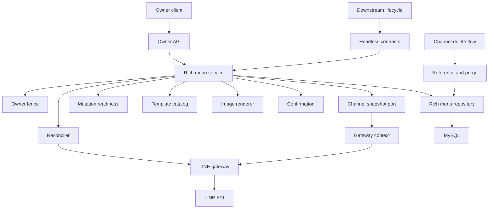
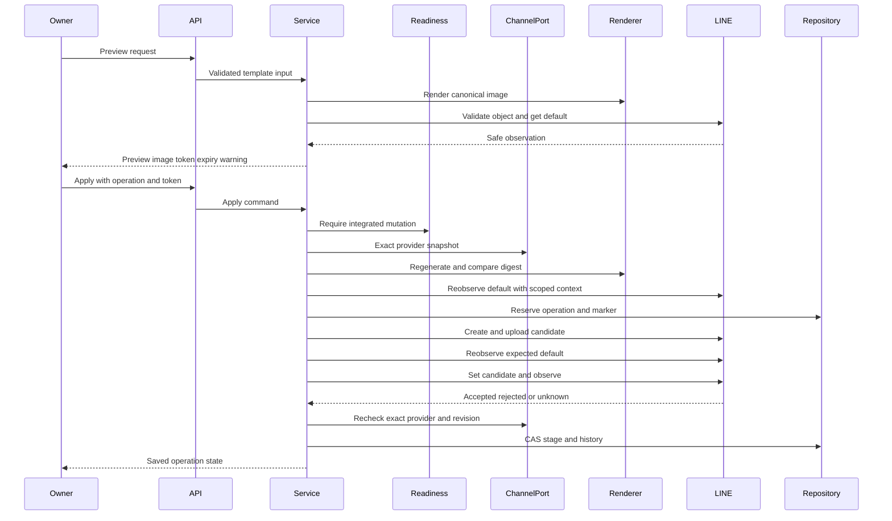
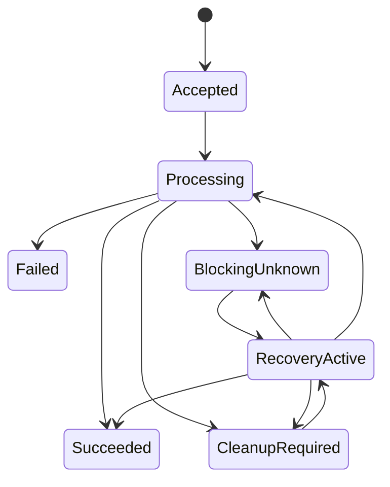
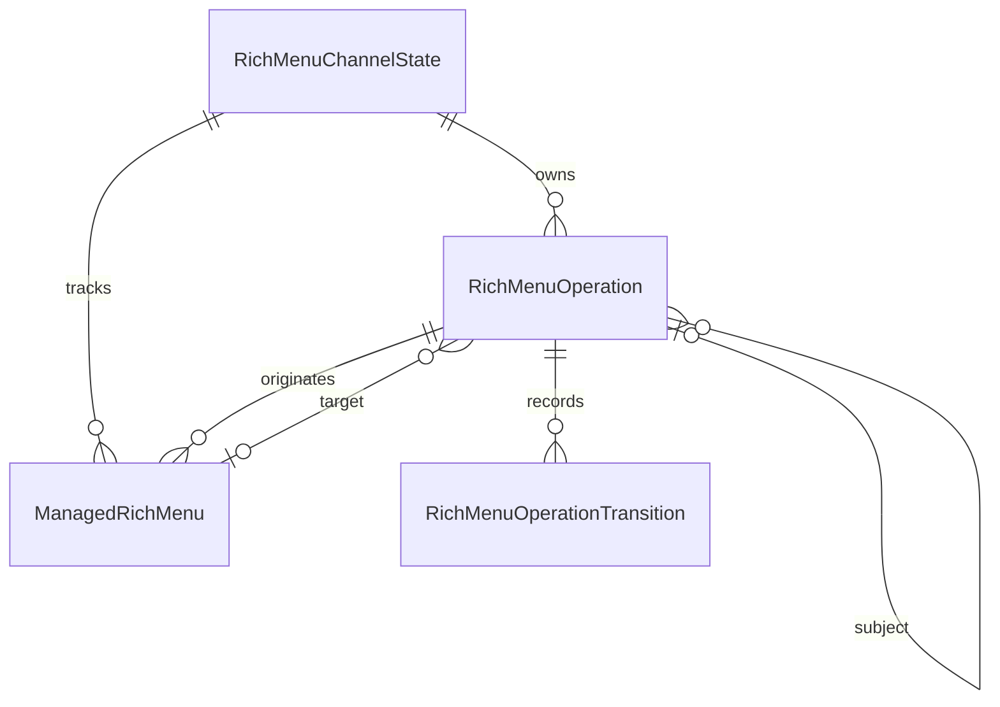
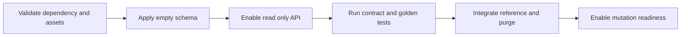

# Technical Design: line-rich-menu-foundation

## Overview

本機能は、認証済みownerが登録済みMessaging APIチャネルの既定リッチメニューを、3種類の版付き組み込みテンプレートから安全にpreview・適用・照合・解除できるBackend基盤を提供する。画像生成、確認値、LINEの多段外部作用、管理資源、operation、履歴を一つのチャネル集約へ結び付け、結果不明を成功または不存在へ推測しない。

新規Django app `linerichmenus`を責任境界とする。既存のowner/provider fence、exact-origin CSRF、暗号化資格情報、`updated_at` revision、reference fenceを公開契約として利用し、Frontend、チャネルactive状態の変更、物理削除orchestrationは下流仕様へ残す。

### Goals

- 確認したテンプレート版・入力・生成画像・現在defaultだけを一意なoperationへ適用する。
- LINE mutationのretry key不在と外部通信の結果不明を、永続段階と明示再確認で安全に収束させる。
- 管理対象と証明できる候補・適用中・旧資源だけを追跡し、アプリ外資源を編集・削除しない。
- owner APIと下流headless/reference/history purge契約を同じ状態機械から提供する。

### Non-Goals

- owner向けFrontend、チャネル無効化・再有効化・物理削除の最終orchestration
- 利用者別リッチメニュー、URI以外のaction、画像upload、自由レイアウト・配色・font、カスタムテンプレート
- 自動retry、background job、日時予約、統計、過去設定へのrollback、生成画像binaryの履歴保存
- Official Account Manager等のアプリ外資源の内容取得、管理対象への取込、編集、削除

## Boundary Commitments

### This Spec Owns

- 3種類のversion 1 template catalog、strict input validation、固定geometryと日本語画像renderer
- preview snapshot fingerprint、10分確認値、生成画像とLINE制約の事前検証
- LINE rich menuのvalidate/create/upload/download/list/get/default set/get/clear/delete gateway
- provider完全一致のowner channel snapshot portと、資格情報を明示的に受け取るchannel-scoped gateway context
- チャネル単位の管理状態、operation ID冪等性、管理資源の所有権marker、recoveryのsubject/target関係、状態遷移、履歴、明示recheck/cleanup
- owner専用Backend API、下流向けlifecycle port、reference probe、rollback-only history purge、mutation rollout readiness契約
- `RichMenuChannelState`、`RichMenuOperation`、`ManagedRichMenu`、`RichMenuOperationTransition`の永続データ

### Out of Boundary

- `frontend/`の変更、画面state、入力下書き、preview表示、owner確認dialog
- `LineChannel.is_active`の変更、無効化要確認状態、再有効化、チャネル行の物理削除
- 下流の`ChannelReferenceDirectory`へのprobe登録と、チャネル削除transactionへのhistory purge組込み。ただし統合完了までfoundationのmutation受付を有効化しない
- per-user rich menu、rich menu alias、action拡張、外部資源のcontent projection
- queue、scheduler、object storage、画像cache、過去画像archive

### Allowed Dependencies

- `lineaccounts`: `OwnerSessionAuthentication`、`OwnerProtectedAPIView`、`ExactOriginCsrfMixin`、`OwnerOperationFence`
- `linechannels`: provider完全一致・active・revision・credentialを一つのsnapshotへ閉じる`OwnerChannelOperationPort`、`ChannelReferenceFence`、`ChannelReferenceProbe`
- Django 6.0.7、DRF 3.17.1、MySQL 8.4、LINE Bot SDK 3.25.0、Pillow 12.3.0
- Django signingと`DJANGO_SECRET_KEY`によるpurpose-separated短期確認値
- 同梱`NotoSansJP-Regular.otf` version 2.004とSIL OFL 1.1

既存`DjangoAdminChannelRepository`のprovider-null互換scopeをリッチメニュー認可へ直接使用しない。禁止する依存は、`lineaccounts`/`linechannels` Modelへの直接参照、FrontendからLINE APIへの通信、Delivery modelの流用、SDK型・例外・access tokenのservice/API responseへの漏出である。

### Revalidation Triggers

- template ID/version、geometry、入力上限、normalization、palette、font file/digest、pixel digest規則の変更
- confirmation snapshot軸、preview nonce／usage key、有効期限、operation ID/fingerprint、state transition、ownership marker規則の変更
- LINE endpoint、rate limit、default 403/404意味、画像要件、SDK versionまたはretry契約の変更
- owner/provider fence、チャネルrevision、資格情報snapshot、reference/purge契約の変更
- recovery subject/target、blocking/active pointer、mutation readiness contractの変更
- `RichMenuOperation`をowner履歴のsource of truthとするdata ownership、history purge transaction境界の変更

## Architecture

### Existing Architecture Analysis

既存Backendは`View/Serializer → Service → Repository/Gateway → Model`と`container.py`によるcomposition rootを採用する。owner管理の外部照会は、transaction内でowner/provider/channel snapshotを取得し、transaction外で通信し、戻り時にowner/provider/revisionを再lockする。Deliveryはoperation ID、request fingerprint、一意制約、CAS、`unknown`非再送を持つ。既存admin repositoryはprovider未設定legacy行を管理対象へ含める互換scopeを持つため、本機能はexact-provider専用portを追加してfail closedにする。

本機能はこの形を保ちつつ、単一外部作用ではなくcreate→upload→default set→observeを扱うため、永続sagaを追加する。依存方向は次に固定し、右のlayerから左のlayerだけをimportする。

`linechannels public operation port → linerichmenus types → templates/renderer/confirmation/state/models → repositories/gateway → reconciliation/services → container/headless/presenters/serializers/views/urls`

### Architecture Pattern & Boundary Map



- **Selected pattern**: modular monolith、ports/adapters、channel-scoped persisted saga。
- **Domain boundary**: `linerichmenus`だけがtemplate、管理資源、operation、history、LINE rich menu gatewayを所有する。
- **Existing patterns preserved**: owner/provider fence、exact-origin CSRF、secret wrapper、transaction外I/O、revision recheck、unique fingerprint、CAS、safe error。
- **New components rationale**: rendererはbinary非永続化、reconcilerはmutationと観測の分離、channel stateはblockerと実行中recoveryの分離、readiness guardは下流probe統合前の孤立資源防止に必要である。

### Technology Stack

| Layer | Choice / Version | Role in Feature | Notes |
|-------|------------------|-----------------|-------|
| Backend | Python 3.14 / Django 6.0.7 / DRF 3.17.1 | owner API、service、transaction、model | 既存stackを維持 |
| Image | Pillow 12.3.0 | fixed PNG render、cmap/glyph・寸法・容量検証 | 新規固定依存 |
| Font | Noto Sans CJK JP 2.004 Regular subset | 日本語glyph | SHA-256固定、OFL同梱 |
| External | LINE Bot SDK 3.25.0 | rich menu JSON/blob endpoint | retry 0、gateway内に隔離 |
| Data | MySQL 8.4 | channel aggregate、operation、resource、transition | `utf8mb4`、row lock、unique/CAS |

## File Structure Plan

### Directory Structure

```text
backend/linerichmenus/
├── __init__.py                         # Django app package
├── apps.py                             # font/Pillow runtime prerequisiteのsystem check
├── types.py                            # immutable command/result/error/observation型
├── templates.py                        # 3 templateの版付きcatalogとstrict validation
├── renderer.py                         # fixed PNG生成、glyph/LINE制約、pixel digest
├── confirmation.py                     # 10分digest-only confirmation
├── state.py                            # operation/resourceの純粋な許可遷移
├── models.py                           # channel state、operation、resource、transition
├── repositories.py                     # lock、operation予約、CAS、history、reference/purge
├── gateway.py                          # channel-scoped LINE rich menu JSON/blob portとSDK adapter
├── reconciliation.py                  # 保存状態とLINE観測の分類・recheck収束
├── services.py                         # previewと全operationのapplication workflow
├── headless.py                         # lifecycle/reference/history purge公開contract
├── presenters.py                       # secret-free owner/headless projection
├── serializers.py                      # unknown field拒否とrequest境界検証
├── views.py                            # owner認証、CSRF、HTTP status mapping
├── urls.py                             # app-local owner API routes
├── container.py                        # 既存port、readiness guard、concrete実装のcomposition root
├── assets/fonts/
│   ├── NotoSansJP-Regular.otf          # Noto Sans CJK JP 2.004固定asset
│   └── OFL-1.1.txt                     # font license
├── migrations/
│   ├── __init__.py
│   └── 0001_initial.py                 # 独立schema、既存data変更なし
└── tests/
    ├── test_templates_renderer.py      # catalog、glyph、golden digest、画像制約
    ├── test_confirmation.py            # 全binding軸、tamper、expiry、token安全性
    ├── test_state_models.py             # transitionとDB constraint
    ├── test_repositories.py             # operation冪等、CAS、history、purge
    ├── test_repository_concurrency.py   # blocker/recovery排他、revision、delete競合
    ├── test_gateway.py                  # scoped資格情報、全endpoint、安全な結果分類
    ├── test_reconciliation.py           # marker、image、default、delete観測quorum
    ├── test_services.py                 # preview/apply/unlink/release/recheck/cleanup
    ├── test_api.py                      # owner scope、CSRF、strict DTO、pagination
    ├── test_headless_reference.py       # downstream port、reference、atomic purge
    ├── test_security.py                 # secret/URL/token/binary canary
    ├── test_performance.py              # query/time budget、非polling
    └── test_migrations.py               # 既存保存状態非変更
```

### Modified Files

- `backend/requirements.txt` — `Pillow==12.3.0`を追加する。
- `backend/config/settings.py` — `linerichmenus`を`INSTALLED_APPS`へ追加する。
- `backend/config/urls.py` — `/api/line/rich-menus/`へapp URLConfをincludeする。
- `backend/linechannels/admin_types.py` — serialization不能なexact-provider operation snapshot型を追加する。
- `backend/linechannels/admin_repositories.py` — 既存legacy scopeを変更せず、provider完全一致のsnapshot取得／revision再lock portを追加する。

`backend/linechannels/container.py`へのreference probe登録とdelete service変更は下流`line-rich-menu-admin-lifecycle`が所有する。本仕様は登録可能なconcrete probe／rollback-only purge builderと、既定でmutationを拒否するreadiness guardまでを提供する。下流はprobe、purge、readiness有効化を同一releaseへまとめる。

### Component to File Ownership

| Component | Primary Files |
|-----------|---------------|
| TemplateCatalog | `templates.py`, `types.py` |
| DeterministicRenderer | `renderer.py`, `assets/fonts/*`, `apps.py` |
| RichMenuConfirmation | `confirmation.py` |
| RichMenuStateMachine | `state.py`, `models.py` |
| RichMenuRepository | `repositories.py`, `models.py` |
| RichMenuGateway | `gateway.py` |
| RichMenuReconciler | `reconciliation.py` |
| RichMenuService | `services.py` |
| OwnerRichMenuAPI | `serializers.py`, `presenters.py`, `views.py`, `urls.py` |
| HeadlessReferenceContracts | `headless.py`, `repositories.py` |
| OwnerChannelOperationPort | `linechannels/admin_types.py`, `linechannels/admin_repositories.py` |
| MutationReadiness | `services.py`, `container.py` |
| CompositionRoot | `container.py` |

## System Flows

### Preview and Apply



各LINE callは直前に取得したexact-provider snapshot由来の`RichMenuGatewayContext`を必須とし、前後でDB transactionを閉じる。外部応答後にowner/provider/channel revision/operation stageが一致しない場合、応答で現在状態を上書きせず`unknown`か`recheck_required`へCASする。次の外部callへ進む場合はsnapshot/contextを再取得し、古いaccess tokenを複数stageへ持ち回らない。create、upload、default setを同じrequest中に順次進められるが、一段階でもunknownなら停止し、自動retryしない。preview時点のdefaultはapply受付時に加え、時間のかかるcreate/upload後かつset default直前にも再観測し、差分があればcandidateを`cleanup_required`へ残してsetを開始しない。

### Operation and Resource State



`Processing`の具体stageは`creating | uploading | setting_default | verifying | clearing_default | cleaning | local_release`である。channel stateは未解決の`blocking_operation_id`と、現在I/Oを実行する`active_operation_id`を分離する。明示recheck／cleanupはblockerを`subject_operation_id`へ持つ独立operationとして一件だけ`RecoveryActive`へclaimし、未解決なら元blockerを維持する。観測で元stageの成功を確認し未開始stageが残る場合、recoveryを確定して元operationを次stageへatomic handoffするため、結果不明だった外部作用自体は再実行しない。

createの明示拒否でLINE IDが発行されていない場合は外部作用なしの`Failed`としてblockerを解放する。create成功後のupload拒否、set直前のdefault差分、置換後の旧資源は、検証可能な候補を`CleanupRequired`として保持する。resource lifecycleは`candidate → applied → old/cleanup_required → deleted`または`applied → released`だけを許可する。

## Requirements Traceability

| Requirement | Summary | Components | Interfaces | Flows |
|-------------|---------|------------|------------|-------|
| 1.1, 1.2, 1.3, 1.4, 1.5, 1.6, 1.7 | owner/provider/channel/revision/CSRFと外部I/O後fence | API, Service, Repository | OwnerOperationFence, OwnerChannelOperationPort | Preview and Apply |
| 2.1, 2.2, 2.3, 2.4, 2.5, 2.6, 2.7, 2.8 | 3版付きtemplate、strict input、HTTPS URI限定 | TemplateCatalog, API | TemplateCatalog, PreviewCommand | Preview and Apply |
| 3.1, 3.2, 3.3, 3.4, 3.5, 3.6, 3.7 | 決定的日本語画像、glyph/LINE制約、binary非保存 | Renderer, Confirmation | RenderedImage, ImageDigest | Preview and Apply |
| 4.1, 4.2, 4.3, 4.4, 4.5, 4.6, 4.7, 4.8, 4.9 | 10分preview、全軸binding、token安全性 | Confirmation, Service, API | PreviewSnapshot, ConfirmationValue | Preview and Apply |
| 5.1, 5.2, 5.3, 5.4, 5.5, 5.6, 5.7, 5.8 | 保存状態とLINE実状態の保守的分類 | Reconciler, Gateway, Repository | DefaultObservation, ChannelStateView | State and Recheck |
| 6.1, 6.2, 6.3, 6.4, 6.5, 6.6, 6.7, 6.8, 6.9, 6.10, 6.11 | operation冪等、適用・置換、旧資源保護 | Service, StateMachine, Repository, Gateway | ApplyCommand, OperationView | Preview and Apply |
| 7.1, 7.2, 7.3, 7.4, 7.5, 7.6, 7.7, 7.8, 7.9 | default解除とlocal管理終了の分離 | Service, Reconciler, StateMachine | UnlinkCommand, ReleaseCommand | Operation State |
| 8.1, 8.2, 8.3, 8.4, 8.5, 8.6, 8.7, 8.8, 8.9 | unknown保存、自動再作用禁止、subject付き明示照合 | Reconciler, Gateway, Repository | RecheckCommand, RecoveryHandoff, ObservationQuorum | Operation State |
| 9.1, 9.2, 9.3, 9.4, 9.5, 9.6, 9.7, 9.8 | 強い所有権とdefault非一致後だけcleanup | Service, Reconciler, Repository | CleanupCommand, ManagedResourceView | Operation State |
| 10.1, 10.2, 10.3, 10.4, 10.5, 10.6, 10.7, 10.8, 10.9, 10.10, 10.11, 10.12 | owner専用履歴、snapshot不変、秘密非露出、非破壊導入 | Repository, Presenter, API | HistoryPage, SafeError | 全flow |
| 11.1, 11.2, 11.3, 11.4, 11.5, 11.6, 11.7, 11.8, 11.9, 11.10 | owner/headless/reference/purgeと安全なrollout契約 | API, HeadlessReferenceContracts, Service | LifecyclePort, ReferenceProbe, HistoryPurge, MutationReadiness | State and Recheck |

## Components and Interfaces

| Component | Domain/Layer | Intent | Req Coverage | Key Dependencies | Contracts |
|-----------|--------------|--------|--------------|------------------|-----------|
| TemplateCatalog | Domain | 3 template版と入力規則を固定する | 2.1–2.8 | types P0 | Service |
| DeterministicRenderer | Domain | glyph保証済みPNGとpixel digestを生成する | 3.1–3.7 | Pillow/font P0 | Service |
| RichMenuConfirmation | Security | preview全軸を10分tokenへ結ぶ | 4.2–4.9, 10.7, 10.9 | Django signing P0 | Service |
| RichMenuStateMachine | Domain | operation/resourceの許可遷移を一意にする | 6.1–9.8 | types P0 | State |
| RichMenuRepository | Data | channel lock、冪等予約、CAS、履歴を永続化する | 1.7, 5.1, 6.1–10.12, 11.7–11.9 | MySQL P0 | Service, State |
| OwnerChannelOperationPort | Integration | exact providerの資格情報snapshotとrevision再lockを提供する | 1.3–1.7 | linechannels P0 | Service |
| RichMenuGateway | External | LINE endpointをsafe resultへ縮約する | 3.5, 5.2–5.7, 6.5–9.7 | LINE SDK P0 | Service |
| RichMenuReconciler | Domain | 管理状態と外部観測を保守的に分類する | 5.1–5.8, 6.8, 7.2–9.7 | Gateway P0, Repository P0 | Service |
| RichMenuService | Application | previewと全operationをorchestrateする | 1.1–11.10 | 全domain port P0 | Service |
| OwnerRichMenuAPI | HTTP | owner専用strict contractを公開する | 1.1–1.6, 4.1–4.6, 10.3–10.10, 11.1 | Service P0 | API |
| HeadlessReferenceContracts | Integration | 下流lifecycleとdelete contractを公開する | 11.2–11.10 | Service/Repository P0 | Service, State |
| MutationReadiness | Runtime | probe/purge統合前のmutationをfail closedにする | 11.7–11.10 | composition root P0 | Service |
| CompositionRoot | Runtime | concrete dependencyを一意に構築する | 1.1–11.10 | existing ports P0 | Factory |

### Template and Image Domain

#### TemplateCatalog

| Field | Detail |
|-------|--------|
| Intent | immutableな3 templateとstrict normalizationを提供する |
| Requirements | 2.1, 2.2, 2.3, 2.4, 2.5, 2.6, 2.7, 2.8 |

**Responsibilities & Constraints**

- `jp-link-one@1`、`jp-link-two@1`、`jp-link-three@1`を2500×843で定義する。
- areaは1分割、2等分、`834/833/833`の3分割とし、重複・gap・canvas外を許可しない。
- 各areaは`displayName`と`uri`だけを要求する。display nameはtrim＋NFC後1〜20 Unicode code point、URIはtrim後1〜1000 code point、absolute HTTPS、host必須、userinfo/control文字なしとする。
- field欠落、余剰field、template/version不一致、glyph非対応、URI不正をfield-level errorで返す。暗黙のversion fallbackを行わない。

**Contracts**: Service [x]

```python
class TemplateCatalog(Protocol):
    def list_templates(self) -> tuple[TemplateDescriptor, ...]: ...
    def normalize(self, command: TemplateInput) -> NormalizedTemplate | InputRejected: ...
```

#### DeterministicRenderer

| Field | Detail |
|-------|--------|
| Intent | 同一normalized inputから同じcanonical pixel内容を生成する |
| Requirements | 3.1, 3.2, 3.3, 3.4, 3.5, 3.6, 3.7 |

**Responsibilities & Constraints**

- Pillow 12.3.0、fixed palette/padding/font size/two-line wrap、`NotoSansJP-Regular.otf`だけを使う。
- font SHA-256は`dff723ba59d57d136764a04b9b2d03205544f7cd785a711442d6d2d085ac5073`。startup checkでPillow version、font digest、OFL assetを検証する。
- 全code pointをcmapで検証してから描画し、fallbackを無効にする。
- digestはtemplate ID/version、width/height、canonical RGBA bytesのlength-prefix列をSHA-256する。PNGはmetadataなし固定optionでencodeし、format/dimension/aspect/1MBを再検証する。
- binaryはmethod returnとpreview response、LINE upload callの寿命だけに限定し、model、token、log、errorへ渡さない。

**Contracts**: Service [x]

```python
class DeterministicRenderer(Protocol):
    def render(self, template: NormalizedTemplate) -> RenderedImage | RenderRejected: ...
```

### Security and Persistence

#### RichMenuConfirmation

| Field | Detail |
|-------|--------|
| Intent | preview snapshot fingerprintを改変不能な10分tokenへ結ぶ |
| Requirements | 4.2, 4.3, 4.4, 4.6, 4.7, 4.9, 10.7, 10.9 |

**Responsibilities & Constraints**

- snapshot軸はowner identity、provider、channel ID/revision、default observation fingerprint、template ID/version、normalized全入力、pixel digestである。
- token payloadはpurpose、version、issued time、128-bit以上のrandom preview nonce、SHA-256 snapshot fingerprintだけとし、snapshot値、URL、binary、credential、LINE response、内部IDを含めない。
- apply時に全軸を再計算してconstant-time比較する。新規operation受付時はtoken全体のSHA-256 digestをconfirmation usage keyとしてuniqueに予約し、同じtokenの別operation再利用を拒否する。同じsnapshotから新しく発行した別nonceのtokenは、以前のoperationに拘束されない。

**Contracts**: Service [x]

```python
class RichMenuConfirmation(Protocol):
    def issue(self, snapshot: PreviewSnapshot, now: datetime) -> IssuedConfirmation: ...
    def verify(self, token: str, expected: PreviewSnapshot, now: datetime) -> ConfirmationResult: ...
```

#### RichMenuStateMachine and Repository

| Field | Detail |
|-------|--------|
| Intent | channel単位排他、operation冪等、resource ownership、historyを永続化する |
| Requirements | 5.1, 6.1–6.11, 7.1–7.9, 8.1–8.9, 9.1–9.8, 10.1–10.12, 11.7–11.9 |

**Responsibilities & Constraints**

- `RichMenuChannelState`行を`select_for_update`し、`blocking_operation_id`、`active_operation_id`、cleanup待ち、applied resourceの競合を一箇所で判定する。
- operation IDはglobal unique、request fingerprintはowner/channel/kind/subject/target/config/confirmationを含む。同一ID・同一fingerprintは現在blockerの変化後も保存済み状態を返し、異なるfingerprintはconflictを返す。
- recheckは`subject_operation_id`を必須、cleanupは`subject_operation_id`と`target_resource_id`を必須とする。unlink/releaseは`target_resource_id`だけを必須とし、applyは両方を持たない。subject/targetは同一channelに属し、循環参照を許さない。
- 通常operationはblockerがない場合だけ受付する。recovery operationは指定subjectが現在blockerで、kindとsubject stage／target lifecycleの組合せが許可される場合だけ、blockerを保持したままactiveへatomic claimする。
- create前に128-bit以上のrandom ownership markerを保存し、LINE rich menu `name`へversioned prefix付きで埋める。LINE ID単独では所有権としない。
- 各外部段階は`ready → in_flight → accepted/rejected/unknown`をCASする。response到着時のstage/revision mismatchは現在状態を上書きしない。
- `in_flight` claimは`stage_started_at`を保存する。process crashやDB finalize不能後のstatus/recheckは外部mutationを再実行せず、期限超過した`in_flight`を同じoperationの`unknown`へCASして観測手順へ送る。
- recheckがsubjectの不明stageを観測済みへできた場合、recheck operationを確定し、subjectをterminalへ確定するか、次の未開始stageへactive pointerをatomic handoffする。cleanup deleteがunknownならcleanup operationを新blockerへ移し、以後のrecheckはそのcleanupをsubjectにする。
- operationのconfiguration snapshotは受付時点の表示名・完全URL・template版を保持し、operationとtransitionがowner履歴となる。画像binaryとtokenは保存しない。

**Contracts**: Service [x] / State [x]

```python
class RichMenuRepository(Protocol):
    def accept(self, command: AcceptedOperation) -> OperationAccepted | OperationReplay | OperationConflict: ...
    def accept_recovery(self, command: AcceptedRecoveryOperation) -> RecoveryAccepted | OperationReplay | OperationConflict: ...
    def claim_stage(self, operation_id: UUID, expected: OperationStage) -> StageClaimResult: ...
    def complete_stage(self, outcome: StageOutcome) -> OperationView: ...
    def handoff_recovery(self, outcome: RecoveryOutcome) -> RecoveryHandoffResult: ...
    def get_state(self, scope: OwnerChannelScope) -> ChannelStateView: ...
    def list_history(self, query: HistoryQuery) -> HistoryPage: ...
```

### LINE Integration and Reconciliation

#### OwnerChannelOperationPort

| Field | Detail |
|-------|--------|
| Intent | LINE callに使用できるexact-provider snapshotと応答採用前のrevision proofを提供する |
| Requirements | 1.3, 1.4, 1.5, 1.6, 1.7 |

**Responsibilities & Constraints**

- `provider_id == owner proof provider_id`、`provider_id IS NOT NULL`、active、expected revision、credential readableを一度に検証し、access tokenをserialization不能・redactedなsnapshotへ閉じる。
- provider未設定legacy行、inactive、stale、credential unavailable/unreadableを安全なclosed unionで返し、LINE callを開始させない。
- 外部I/O後は同じowner/provider/channel/revisionをtransaction内で再lockし、差分があればresponseを現在状態へ採用しない。
- 既存admin repositoryのlegacy-compatible methodは変更せず、専用exact methodを追加する。

**Contracts**: Service [x]

```python
class OwnerChannelOperationPort(Protocol):
    def snapshot_exact(self, command: ChannelSnapshotCommand) -> ChannelSnapshotResult: ...
    def lock_unchanged(self, proof: ChannelRevisionProof) -> ChannelRevisionResult: ...
```

#### RichMenuGateway

| Field | Detail |
|-------|--------|
| Intent | LINE rich menu APIをraw secret/errorなしのtyped resultへ縮約する |
| Requirements | 3.5, 4.8, 5.2–5.7, 6.5–6.11, 7.2–7.5, 8.1–8.8, 9.2–9.7 |

**Dependencies**

- Inbound: Reconciler/Service — 外部作用・観測（P0）
- Inbound: `RichMenuGatewayContext` — channel public ID、revision、redacted access token（P0）
- External: LINE Bot SDK 3.25.0 / `api.line.me` / `api-data.line.me`（P0）

**Contracts**: Service [x]

```python
class RichMenuGateway(Protocol):
    def validate(self, context: RichMenuGatewayContext, request: RichMenuObject) -> MutationResult: ...
    def create(self, context: RichMenuGatewayContext, request: RichMenuObject) -> CreateResult: ...
    def upload(self, context: RichMenuGatewayContext, rich_menu_id: LineRichMenuId, image: RenderedImage) -> MutationResult: ...
    def download(self, context: RichMenuGatewayContext, rich_menu_id: LineRichMenuId) -> ImageObservation: ...
    def list_resources(self, context: RichMenuGatewayContext) -> ResourceListObservation: ...
    def get_resource(self, context: RichMenuGatewayContext, rich_menu_id: LineRichMenuId) -> ResourceObservation: ...
    def set_default(self, context: RichMenuGatewayContext, rich_menu_id: LineRichMenuId) -> MutationResult: ...
    def get_default(self, context: RichMenuGatewayContext) -> DefaultObservation: ...
    def clear_default(self, context: RichMenuGatewayContext) -> MutationResult: ...
    def delete(self, context: RichMenuGatewayContext, rich_menu_id: LineRichMenuId) -> MutationResult: ...
```

`RichMenuGatewayContext`はowner API DTOではなく、exact snapshotからserviceが作る一回のcall scopeであり、repr／serialization時にtokenを出さない。`Accepted`は2xxと期待schema、`Rejected`は作用しなかったと公式契約から確定できる4xx、`Unknown`はtimeout、connection interruption、5xx、429、decode/schema不正、client close failureとする。raw body/exception/tokenをreturn、repr、logへ含めない。

#### RichMenuReconciler

| Field | Detail |
|-------|--------|
| Intent | 保存したownership/stageと観測をmutationなしで収束させる |
| Requirements | 5.1–5.8, 6.8, 7.2–7.5, 8.1–8.9, 9.2–9.7 |

**Responsibilities & Constraints**

- default IDが同一channelの管理資源なら`managed_current`、404なら`no_api_default`、403なら`external_manager_default`、未知IDなら`external_api_default`、観測失敗なら`unknown`とする。
- `released` lifecycleのLINE IDは既知であっても管理対象へ戻さず`external_api_default`とする。
- create unknownはmarker完全一致一件だけを採用し、0件・複数件はunknownを維持する。
- upload unknownはdownload成功後のcanonical pixel digest一致だけを確認とする。
- delete unknownはget 404、list marker不在、default非一致の全てが同じ明示recheckで得られた場合だけdeletedへ収束する。
- resource ID/marker/operation bindingが不十分な資源へdeleteを発行しない。

**Contracts**: Service [x]

```python
class RichMenuReconciler(Protocol):
    def observe_channel(self, context: ReconcileContext) -> Reconciliation: ...
    def recheck_operation(self, context: RecheckContext) -> RecheckResult: ...
```

### Application and Public Contracts

#### RichMenuService

| Field | Detail |
|-------|--------|
| Intent | owner/channel fenceとdomain portを合成して全use caseを実行する |
| Requirements | 1.1–11.10 |

**Responsibilities & Constraints**

- owner mutationは最初にoperation kindごとのmutation readinessを確認し、transaction内でowner/provider、exact-provider channel snapshot、active/revision、reference fenceを確認する。inactive channelは保存state/history readだけ許可する。
- previewはlocal validation/render後にLINE object validateとdefault観測を行い、安全に分類できた場合だけtokenを発行する。
- applyは入力再送、re-render、token/revision/default完全一致後にoperationを予約する。create/upload後かつset直前にも確認済みdefaultを再観測し、差分があればsetを開始しない。新候補のdefault一致確認前に旧管理資源をdeleteせず、確認後に`old`/`cleanup_required`へ移す。
- apply受付は最初にoperation IDとcanonical fingerprintを照合し、既存同一operationならconfirmation expiry後も保存済み状態を返す。新規operationの場合だけtoken expiryとconfirmation usage key未使用を検証し、失敗時は状態を変更しない。
- createが作用なしで明示拒否された場合はresourceをcleanup blockerにせずfailedへ確定する。create成功後のupload拒否またはset直前のdefault差分では候補を自動deleteせず、ownershipと現在defaultを再確認できる`cleanup_required`として元operationへ残す。Official Account Manager defaultを置換しても、その外部資源自体を編集・deleteしない。
- unlinkは現在defaultが対象管理資源と一致するときだけclearし、既にnoneまたは別資源なら外部mutationなしで非defaultへ収束する。
- releaseはLINE callを行わずresourceを`released`へ移し、current managed pointerを外す。以後そのLINE IDを観測してもexternal defaultに分類し、managed/delete対象へ自動復帰させない。
- recheck／cleanupは指定subjectが現在blockerである場合だけ独立recovery operationとして受付する。recheckで中間stageの成功を確認した場合はsubjectを次の未開始stageへhandoffし、結果不明だったstage自体を再実行しない。
- cleanupはsubject、target、ownership、origin operation、現在default非一致を再確認して一件だけdeleteする。`released`資源を対象にしない。

**Contracts**: Service [x]

```python
class RichMenuService(Protocol):
    def list_templates(self, owner: OwnerOperationContext) -> TemplateListResult: ...
    def preview(self, owner: OwnerOperationContext, command: PreviewCommand) -> PreviewResult: ...
    def get_state(self, owner: OwnerOperationContext, channel_id: UUID) -> StateResult: ...
    def start_operation(self, owner: OwnerOperationContext, command: OperationCommand) -> OperationResult: ...
    def get_operation(self, owner: OwnerOperationContext, operation_id: UUID) -> OperationResult: ...
    def list_history(self, owner: OwnerOperationContext, query: HistoryQuery) -> HistoryResult: ...
```

#### MutationReadiness

| Field | Detail |
|-------|--------|
| Intent | channel delete側のreference/purge統合前に新規管理状態を作らせない |
| Requirements | 11.7, 11.8, 11.9, 11.10 |

**Responsibilities & Constraints**

- readiness modeは`read_only | recovery_only | enabled`のclosed setとする。foundation単独は`read_only`で、template、preview、state、operation/history readだけを許可し、全`start_operation`とheadless mutationをLINE call前に`integration_not_ready`へ拒否する。
- `enabled`は全operation、`recovery_only`は既存管理状態を解消する`unlink | release | recheck | cleanup`だけを許可し、新規候補を作るapplyを拒否する。
- downstream releaseはrich menu reference probe登録、rollback-only purge組込み、readiness `enabled`を一つのcomposition changeとして適用する。三条件の一部だけを有効にしない。`recovery_only`もprobe/purge integration markerを必須とする。
- schema適用やroute公開だけでmutation readyとはみなさない。startup validationは`recovery_only`／`enabled`時にintegration markerが不足していればfail closedにする。

**Contracts**: Service [x] / State [x]

```python
class MutationReadiness(Protocol):
    def authorize(self, kind: OperationKind) -> MutationReady | IntegrationNotReady: ...
```

#### OwnerRichMenuAPI

| Method | Endpoint | Request | Response | Errors |
|--------|----------|---------|----------|--------|
| GET | `/api/line/rich-menus/templates/` | none | `TemplateListResponse` | 401, 403, 503 |
| POST | `/api/line/rich-menus/channels/{channelId}/preview/` | template/version/fields/channelRevision | `PreviewResponse` | 400, 401, 403, 409, 422, 429, 503 |
| GET | `/api/line/rich-menus/channels/{channelId}/state/` | none | `ChannelStateResponse` | 401, 403, 404, 503 |
| POST | `/api/line/rich-menus/channels/{channelId}/operations/` | discriminated `OperationCommand` | `OperationResponse` | 400, 401, 403, 409, 422, 503 |
| GET | `/api/line/rich-menus/operations/{operationId}/` | none | `OperationResponse` | 401, 403, 404, 503 |
| GET | `/api/line/rich-menus/channels/{channelId}/history/` | cursor/limit | `HistoryPageResponse` | 400, 401, 403, 404, 503 |

`OperationCommand.kind`は`apply | unlink | release | recheck | cleanup`のdiscriminated unionとし、全variantにoperation IDとexpected channel revisionを要求する。applyだけconfirmation tokenとtemplate入力、unlink/releaseはtarget managed resource ID、recheckはsubject operation ID、cleanupはsubject operation IDとtarget managed resource IDを要求する。未知keyとvariant外fieldを拒否する。readinessがkindを許可しない場合は保存状態とLINEを変更せず503 `integration_not_ready`を返す。

Preview responseだけがconfirmation token、完全URL、base64 PNGを返せる。operation/status/history responseはtoken/image binaryを返さない。history pageは新しい順、limit 1〜50、opaque cursor、`hasMore`を返す。

- `TemplateListResponse`: template ID/version、表示名、canvas寸法、area説明、required field、表示名/URL上限を返す。
- `PreviewResponse`: channel opaque IDと運用名、template ID/version、ordered display name/完全URL、PNG content type/寸法/digest/base64、実状態分類、外部default置換warning、URLの履歴保存とsecret非包含warning、confirmation token、10分expiryを返す。
- `ChannelStateResponse`: 保存済み管理状態、current managed resource、blocking operation、active recovery、cleanup対象、最新実状態分類と観測時刻、history summary、`nextAllowedActions`を返す。inactive channelでは保存済みprojectionだけを返し、LINEを観測しない。
- `OperationResponse`: operation ID/kind/status/stage/safe result、subject operation relation、target resource relation、受付/完了時刻、`nextAllowedActions`を返す。外部raw IDは管理対象でowner scopeを満たす場合だけsafe opaque表現にする。
- `HistoryPageResponse`: operation ID/kind、channel opaque IDと操作時運用名、subject operation、target管理資源、受付/完了時刻、transition、安全な結果、template ID/version、表示名/完全URL snapshot、default/cleanup関係を返す。別owner/provider/channelの存在を区別しない。

#### HeadlessReferenceContracts

| Field | Detail |
|-------|--------|
| Intent | 下流チャネルlifecycleが同じ状態機械を利用する |
| Requirements | 11.2–11.10 |

**Contracts**: Service [x] / State [x]

```python
class RichMenuLifecyclePort(Protocol):
    def get_guard_state(self, command: HeadlessStateCommand) -> HeadlessStateResult: ...
    def start_unlink(self, command: HeadlessUnlinkCommand) -> OperationResult: ...
    def recheck(self, command: HeadlessRecheckCommand) -> OperationResult: ...

class RichMenuReferenceProbe(ChannelReferenceProbe, Protocol):
    def is_referenced(self, channel_public_id: UUID) -> bool: ...

class RichMenuChannelHistoryPurge(Protocol):
    def purge_history(self, channel_public_id: UUID) -> HistoryPurgeResult: ...
```

Headless commandもowner context、provider、channel revision、operation IDを必須とし、owner APIと同じreadiness、fence、競合、result分類、自動retry禁止を適用する。guard stateは`clear_to_disable`をdefault解除確認済みかつunknown/cleanup待ちなしの場合だけ返す。reference probeはapplied、processing、unknown、cleanup待ちをblockし、terminal history-onlyはblockしない。

purgeはDjango transaction内での呼出しをruntime assertionし、`ChannelReferenceFence.lock_existing`で対象channel rowを同じtransactionへlockする。blocker、storage failure、削除不整合を検出した場合はsafe resultを返す前にtransactionをrollback-onlyへ設定し、呼出側が結果を無視してもchannel deleteをcommitできない。transaction外呼出しはprogramming errorとして変更前に拒否する。

## Data Models

### Domain Model



- **Aggregate root**: `RichMenuChannelState`。channel public UUIDごとに一件で、blocking operation、active operation、current managed resourceを管理する。
- **Entity**: `RichMenuOperation`。owner/provider/channel/kind/request snapshot、subject operation、target resource、現在stage/resultを持ち、owner履歴のheaderとなる。
- **Entity**: `ManagedRichMenu`。operation固有marker、LINE ID、image digest、candidate/applied/old/cleanup/deleted/released lifecycleを持つ。
- **Entity**: `RichMenuOperationTransition`。safe codeと時刻だけをappend-onlyで記録する。
- **Value objects**: normalized template、pixel digest、default observation fingerprint、operation fingerprint、safe error、next allowed action。

### Logical and Physical Data Model

| Table / Model | Key fields | Constraints / Indexes |
|---------------|------------|-----------------------|
| `linerichmenus_channelstate` | `channel_public_id UUID`, `blocking_operation_id UUID?`, `active_operation_id UUID?`, `current_resource_id UUID?`, last observation kind/fingerprint/time | UNIQUE channel ID、INDEX blocking/active operation、observation enum CHECK |
| `linerichmenus_operation` | `operation_id UUID`, channel FK, owner identity UUID, provider ID, kind, `subject_operation_id?`, `target_resource_id?`, request fingerprint, confirmation usage digest?, expected revision, status, stage, stage started at, result code, configuration JSON?, timestamps | PK operation ID、nullable self/resource FK、UNIQUE confirmation usage digest when non-null、INDEX channel+accepted_at/subject/target、CHECK kind/relation/status/stage |
| `linerichmenus_resource` | `public_id UUID`, channel FK, origin operation FK, `line_rich_menu_id?`, ownership marker, lifecycle, image digest, timestamps | UNIQUE line ID when non-null、UNIQUE marker、INDEX channel+lifecycle、CHECK lifecycle |
| `linerichmenus_transition` | operation FK, sequence, from/to stage, safe reason, observed_at, created_at | UNIQUE operation+sequence、INDEX operation+created_at |

`configuration_snapshot`はversioned JSON objectとしてtemplate ID/versionとordered fieldsの表示名・完全URLだけを持つ。serializerはread時にもschemaを検証し、catalog変更で既存snapshotを書き換えない。外部raw response、credential、token、image binary、owner LINE user IDを列へ追加しない。

operation relation CHECKは、`apply: subject null/target null`、`unlink|release: subject null/target required`、`recheck: subject required/target null`、`cleanup: subject required/target required`を固定する。同一channel、subject非自己参照、subject chain非循環、targetのorigin/lifecycle整合はchannel state lock下のrepositoryで検証する。nullable relationはhistory purge transaction内だけ明示解除でき、それ以外の更新を公開しない。

### Consistency & Integrity

- operation/resource作成前に`ChannelReferenceFence.lock_existing`とchannel state rowを同じtransactionでlockする。
- 外部I/O中はDB lockを保持せず、戻り時にowner/provider/channel revisionとoperation stageをexact portで再lockする。
- `blocking_operation_id`はunknownまたはcleanup blockerが解消するまで保持する。`active_operation_id`は現在外部I/Oをclaimした通常／recovery operationだけを指し、I/O待ちでないunknown中はnullにできる。
- blocker中は、そのblockerをsubjectとする許可済みrecheck／cleanup一件だけをactiveへclaimできる。通常operation、release、異なるsubject/target、二件目のrecoveryは拒否する。
- recovery完了時は、child/subject/resource/pointer/transitionを一つのtransactionで更新する。recheck観測成功で未開始stageが残る場合はchildをterminalにし、subjectを次stageへactive handoffする。cleanup delete unknown時だけchildを新blockerにする。
- state/current resourceとresource lifecycleの整合はrepository methodとDB CHECK/unique constraintで二重に守る。
- history purgeはterminal history-only以外を削除せず、nullable recovery relationを同一transaction内で解除してからoperation/transition/deleted-or-released resourceと空のchannel state rowを削除する。途中失敗はtransactionをrollback-onlyにする。

## Error Handling

### Error Strategy

- HTTP syntax/unknown field/template/URL/glyph/image違反は外部通信前にfield-level `invalid_input`へ縮約する。
- owner/provider/channel不存在・provider未設定・不一致は存在やsecretを区別しない`channel_unavailable`、inactiveはread-only `channel_inactive`、revision差は`stale_channel`とする。
- reference/purge統合前のmutationは`integration_not_ready`として保存状態とLINEを変更せず拒否する。
- LINE 4xxで作用なしを確認できる場合だけ`external_rejected`、timeout/5xx/429/解釈不能はoperationを`unknown`へ保存する。
- storage errorが外部作用前ならsafe failure、外部作用後なら作用を推測せず`unknown`または`recheck_required`へ収束させる。

### Error Categories and Responses

| Category | Safe codes | HTTP / State | Next action |
|----------|------------|--------------|-------------|
| Input | `invalid_input`, `template_changed`, `image_invalid` | 400/422 | 入力修正・new preview |
| Auth/scope | `authentication_required`, `owner_operation_blocked`, `channel_unavailable` | 401/403/404 | 再認証または対象再選択 |
| Concurrency | `stale_channel`, `operation_conflict`, `operation_in_progress`, `preview_expired` | 409 | state取得・new preview |
| Runtime integration | `integration_not_ready` | 503、変更なし | 下流probe/purge統合を完了 |
| External rejected | `line_rejected` | saved failed | state確認、候補があれば明示cleanup |
| Ambiguous | `timeout_unknown`, `response_unknown`, `observation_unknown` | saved unknown | 同じoperationの明示recheck |
| Rate limit | `rate_limited` | previewはtokenなし429、mutation後はsaved unknown | 自動retryせず同じoperationを明示recheck |
| Storage | `storage_retryable`, `storage_unavailable` | 503またはsaved unknown | state取得、自動mutation retryなし |

### Monitoring

- operation ID、kind、safe stage/result、channel opaque UUID、duration、query countだけをstructured log対象とする。
- full URL、display name、token、image bytes/base64、LINE ID/raw body、access token、owner identityを通常ログへ出さない。
- create/deleteの100回/時とlist 10回/秒を超える自動処理を持たず、429件数とunknown滞留時間だけをsafe metricにする。

## Testing Strategy

全Backend test定義直前に、日本語の`テストケース:`と`期待値:`コメントを置く。

### Unit Tests

- TemplateCatalogが3 ID/version、geometry、required/extra field、HTTPS absolute URL、userinfo/control文字、20/1000上限、暗黙fallback禁止を検証する（2.1–2.8）。
- Rendererが日本語golden pixel digest、NFC同値、未対応glyph拒否、font/Pillow差し替え拒否、PNG寸法/aspect/1MB、binary非reprを検証する（3.1–3.7）。
- Confirmationがowner/provider/channel/revision/default/template/input/imageの一軸変更、tamper、未来timestamp、10分超過、token payload秘密不在、同じtokenの別operation再利用拒否、同じsnapshotの別nonce token利用を検証する（4.2–4.9, 10.7, 10.9）。
- StateMachineが全許可遷移、blocking/active分離、recovery subject/target、releaseとunlinkの分離、candidate/applied/old/deleted/released invariantをtable-drivenで検証する（6.4, 7.1–7.9, 8.1–8.9, 9.8）。
- Reconcilerがdefault 403/404/managed/unknown ID、marker 0/1/複数、download digest、delete観測quorumを分類する（5.2–5.8, 8.3–8.8, 9.2–9.7）。

### Repository and Integration Tests

- 同一operation＋同一fingerprintが一行へ収束し、異fingerprintと同confirmation別operationを拒否する（6.1–6.4）。
- channel state lockで通常operationを相互排他にし、blockerをsubjectとするrecovery一件だけをatomic claimできること、異subject／target、循環、別channel、二重recoveryを拒否すること、MySQL 1205/1213をsafe分類する（6.4, 7.9, 8.2, 9.8）。
- recheck childの観測成功が元operationの確定または次の未開始stageへのhandoffを一transactionで行い、cleanup delete unknownだけがchildを新blockerへ移すことを検証する（8.3–8.8, 9.6–9.8, 10.1–10.2）。
- 各外部段階の遅延中にowner/provider/channel revision/operation stageを変更し、旧応答が新状態を上書きせずrecheckable stateになる（1.7）。
- replacementで新default確認前は旧resourceがappliedを維持し、確認後だけold/cleanupへ移る（6.6–6.10）。
- historyがowner/provider/channel scope、新しい順、limit 1〜50、opaque cursor、snapshot不変を満たす（10.1–10.6）。

### Gateway and Service Composition Tests

- exact-provider snapshotがprovider null／不一致、inactive、stale、credential unreadableをLINE call 0件で拒否し、全gateway methodが同じsnapshot由来contextを必要とすることを検証する（1.3–1.7）。
- 全LINE endpointで2xx、400/401/403/404/415、429、5xx、timeout、connection、malformed response、close failureをsafe unionへ変換し、retry回数0とtoken非露出を確認する（5.5, 6.11, 8.8, 9.7）。
- previewがmanager default警告を返し、default unknown/validate failureではtokenを発行せず、inactiveではLINEへ到達しない（1.5, 4.1, 4.8）。
- applyのcreate→upload→set→get flowが一候補だけを作り、set直前のdefault差分で停止すること、各段階unknownで停止すること、明示recheckが不明stageを再実行せず観測し、確認後だけ次の未開始stageへ元operationを進めることを検証する（4.7, 6.5–6.8, 8.1–8.9）。
- create明示拒否はresource blockerを残さずfailed、create成功後のupload拒否はcleanup requiredになることを検証する（6.11, 9.1）。
- unlinkが対象一致時だけclearし、none/外部/別管理資源では外部defaultを変更しない。releaseはLINE callゼロでmanaged対象から外す（7.2–7.8）。
- cleanupが強いownership、origin operation、default非一致を満たす一件だけをdeleteし、失敗/unknownを保存する（9.1–9.8）。

### API, Headless, Security and Performance Tests

- owner APIがsession/provider/channel scope、unsafe methodのexact-origin CSRF、stale revision、strict recovery relation、安全な404を検証する（1.1–1.6, 11.1, 11.10）。
- read-only rolloutではpreview/state/history readだけを許可し、owner/headless mutationを`integration_not_ready`かつLINE call 0件へ拒否する。recovery-onlyはprobe/purge integration marker必須でapplyを拒否し、unlink/release/recheck/cleanupだけを許可する。統合markerが揃ったenabled compositionだけが全mutationを有効化できることを検証する（11.7–11.10）。
- preview responseだけがtoken/URL/base64 imageを返し、operation/state/history/error/log/reprへtoken/image/credential/raw responseが出ないことをcanaryで検証する（4.3–4.5, 10.7–10.10）。
- headless unlink/recheckがowner APIと同じoperation/fence/resultを使い、確定unlink時だけ`clear_to_disable`を返す（11.2–11.6）。
- reference probeがapplied/processing/unknown/cleanup待ちだけをblockし、history-onlyはblockしない。purgeのtransaction外呼出しを拒否し、blocker／storage failure／途中失敗時はrollback-onlyとなり、呼出側が結果を無視してもchannel deleteをcommitできないことを検証する（11.7–11.9）。
- state/history query countを履歴件数に依存しないbudgetへ固定し、明示recheck一回につきlist最大一回、自動polling/retryなしを検証する。
- migrationが既存channel/recipient/delivery/webhook/interactionと履歴を変更せず、empty rich menu schemaだけを追加する（10.12）。

UI E2Eは下流仕様の範囲である。本仕様はDRF APIとconcrete compositionのend-to-end testをcritical user flowの代替とする。

## Security Considerations

- preview/applyを含む全owner routeをactive owner sessionで保護し、mutationはexact-origin CSRFを必須にする。
- access tokenはexact-provider snapshotとgateway call context内だけredacted wrapperとして保持し、LINE ID/raw responseとともにmodel、exception、logへ渡さない。
- confirmation tokenはbodyでのみ往復し、URL/cursor/log/historyへ含めない。token payloadはpurpose/version/time/random nonce/fingerprintだけとし、usage keyはtoken digestだけを保存する。
- ownership markerは暗号学的random値で、resource IDとorigin operationの保存済み一致を併用する。marker prefixだけで削除権限を認めない。
- full URLのuserinfoを拒否し、queryへsecretを含めない警告をpreviewに含める。URLはowner専用operation history以外へ保存しない。
- font asset、OFL、Pillow versionのstartup check失敗時はpreview/applyをfail closedにする。

## Performance & Scalability

- 対象は個人開発用であるためbackground worker/cacheを追加しない。channel state/historyはindexed queryとlimit 50で読む。
- imageは一request内で最大1MBのPNG一件だけを保持する。previewとapplyで再生成し、DB/object storageへ書かない。
- LINE create/delete 100回/時、list 10回/秒を設計上限とし、automatic polling/retryを禁止する。
- DB lockはowner/channel/operationの短いtransactionだけに限定し、renderと外部I/O中は保持しない。

## Migration Strategy



1. `Pillow==12.3.0`、font、OFLを追加し、container buildとstartup system checkでversion/digestを検証する。
2. `linerichmenus.0001_initial`で独立4 tableとconstraints/indexesを作る。data migration、既存row更新、既存外部作用を行わない。
3. appとowner API routeをread-only readinessで有効にする。template、preview、state、history readは利用できるが、owner/headless mutationは`integration_not_ready`へfail closedにする。
4. golden image、exact-provider snapshot、scoped LINE mock、recovery handoff、migration非破壊testを通す。
5. 下流Specがreference probeとrollback-only purgeをチャネル削除transactionへ組み込み、同じreleaseでintegration markerとmutation readinessを有効化してからFrontend／チャネル状態変更へ接続する。

probe、purge、readinessのいずれかが欠ける場合はmutationを有効化しない。schema適用後に外部resource/operationが存在する場合、rollbackでtableを削除せず、probe/purge統合を残したままreadinessを`recovery_only`へ移してapplyを停止し、read/recheck/cleanup契約とownership dataを保持してからforward fixする。管理状態が一件も存在しないfoundation単独状態だけは`read_only`へ戻せる。

## Supporting References

- 詳細なAPI rate limit、font digest、build/adopt比較、サイズ判定は`research.md`を参照する。
- Noto font: version 2.004、`NotoSansJP-Regular.otf`、SHA-256 `dff723ba59d57d136764a04b9b2d03205544f7cd785a711442d6d2d085ac5073`、SIL OFL 1.1。
