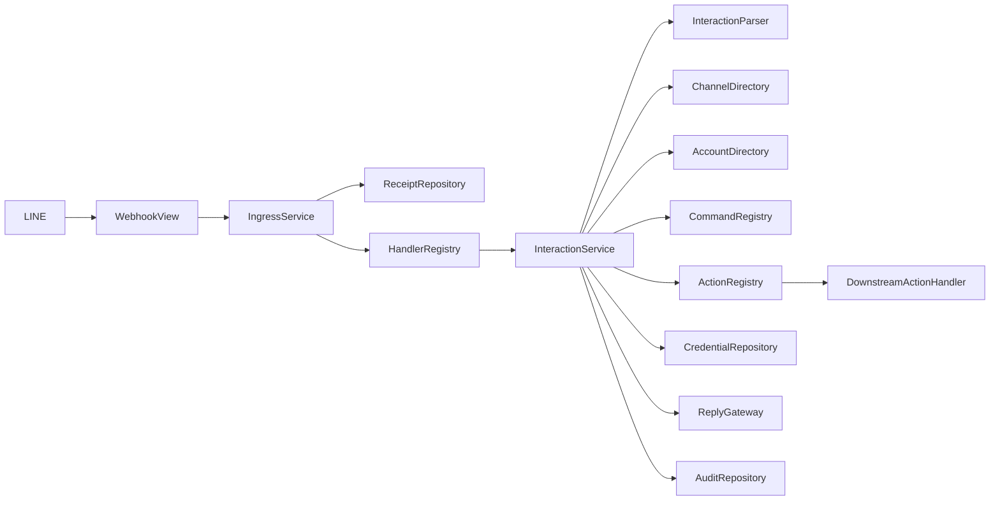
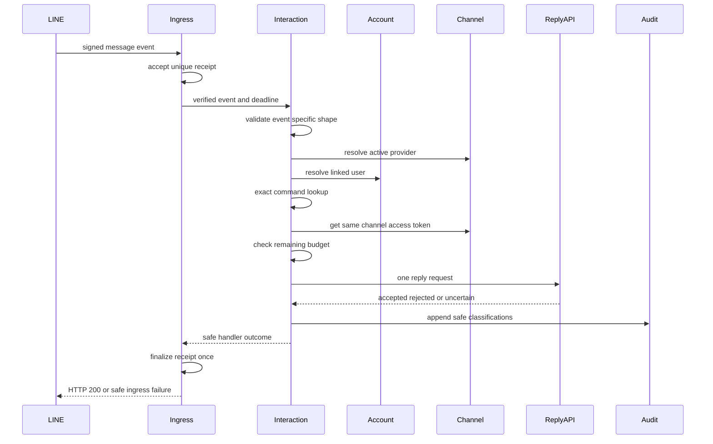
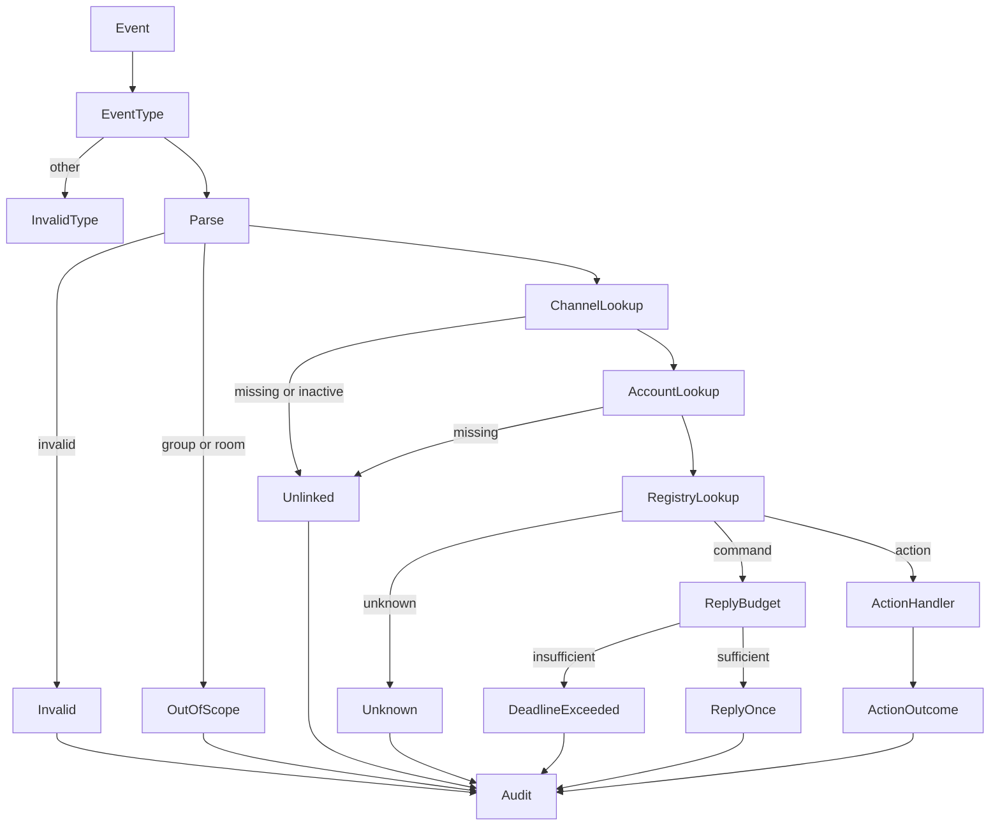
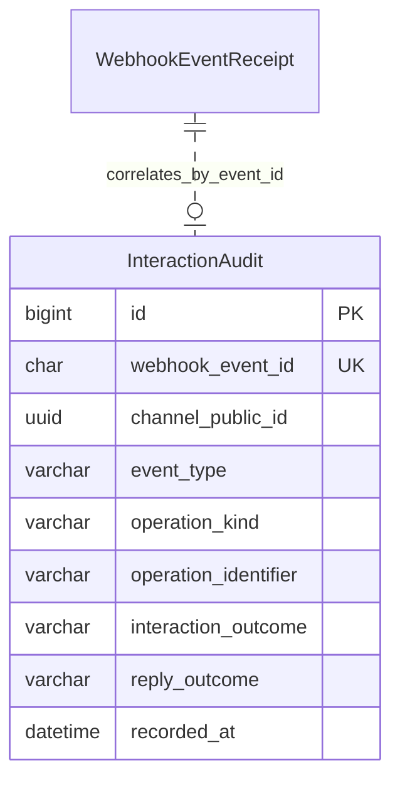
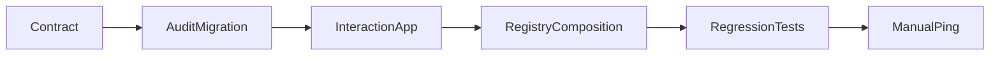

# 技術設計書

## Overview

本機能は、`line-webhook-ingress` が真正性と一回限りの受付を確認した `message`／`postback` event を、既存の連携済み利用者に限定して有限の command／action registry へ渡す。連携済み利用者は LINE トークで `/ping` を送り、同じ有効チャネルから `pong` を一度だけ受け取ることで Webhook から reply API までの疎通を確認できる。

新しい `lineinteractions` Django app が event 固有検証、利用者照合、allowlist、reply、PII-free audit、後続 postback handler port を所有する。これに先立ち、既存 `linewebhooks` handler contract へ View 入口で採取した request 全体の absolute deadline を追加し、最大10イベントの同期処理でも reply 開始可否と transport timeout を同じ2秒予算から判断できるようにする。reply transport は cancellable な全体 watchdog を持ち、Ingress が期限で未dispatchにした event は専用の安全な receipt／audit 分類へ確定する。

本設計は23件の実行可能タスクへ収まり、現在のサイズ方針では `PASS (single-spec)` とする。実装・レビュー境界は `handler execution budget`、`interaction dispatch`、`command reply and audit` の3ワークストリームに分離し、依存順を維持する。

### Goals

- 検証済み user source の `/ping` に、同じチャネルの reply token と access token だけで `pong` を一件返す。
- text command と versioned postback action を完全一致する有限 registry だけへ振り分ける。
- active owner、同一 provider identity、対象チャネル recipient の既存連携を確認し、未連携・不正・対象外・未知入力を外部作用なしの no-op とする。
- reply の `accepted`／`rejected`／`unknown`／未実行と interaction 結果を、禁止データなしで後から区別する。
- 既存 receipt の at-most-once 実行権と deadline-aware transport により、再送・並行到着・timeout でも reply／action を自動再実行しない。

### Non-Goals

- Webhook の URL、署名、`destination`、共通 event 属性、receipt 重複排除の再実装
- identity、owner、recipient の作成・更新、friendship state や recipient `enabled` の変更
- 自然言語応答、部分一致、正規化、動的 import、SQL、URL、file path、任意コード実行
- action payload の真正性、有効期限、冪等性、配信記録更新、配信固有 token の検証
- push、multicast、broadcast、narrowcast、複数 message reply、reply の retry key／自動再試行
- queue、worker、HTTP 応答後の遅延処理、端末到達・表示・既読の保証

## Boundary Commitments

### This Spec Owns

- Webhook View 入口で request 開始時刻を採取し、service composition、dispatch、receipt finalize、HTTP responseを含む2秒のabsolute deadlineへ変換する契約
- `VerifiedEventHandler` へ request 全体の monotonic deadline、dispatch位置、残件数、外部I/O cutoffを渡す backward-incompatible contract extension と既存 handler の回帰
- deadline不足で未dispatchとなったeventを`dispatch_deadline_exceeded`へ確定するreceipt／safe audit契約
- `message`／`postback` の event 固有構造、user source、LINE user ID、reply token、UTF-16 code unit 上限の検証
- `/ping` → `pong` と非秘密 command identifier `connectivity_ping_v1` の固定契約
- `v1:<action-name>:<opaque-payload>` postback envelope、safe action identifier、静的 command／action registry
- active owner、同一 provider identity、対象 channel recipient の read-only 完全一致照合
- postback action handler の入力・4結果・単一登録・単一呼出し契約
- 同じ有効チャネルの access token による reply API 一回呼出し、deadline 判定、結果分類
- PII-free `InteractionAudit` と、安全な downstream `HandlerOutcome` への変換

### Out of Boundary

- `linewebhooks` が所有する署名検証、payload 共通検証、receipt 作成、重複収束、公開 HTTP status 判定
- `linechannels` が所有する channel schema、active 判定、資格情報暗号化・復号・rotation
- `lineaccounts` が所有する owner／identity／recipient schema と lifecycle
- 後続 action handler が所有する payload 検証、業務 transaction、配信受取確認、冪等性
- `linefriendships` の follow／unfollow projection と event ordering
- interaction payload、reply token、LINE user ID、access token、外部応答、生例外の恒久保存
- action handler からの LINE reply、複数 handler fan-out、handler のネットワーク外部I/O

### Allowed Dependencies

- `linewebhooks.VerifiedWebhookEvent`、`HandlerExecutionContext`、`VerifiedEventHandler`、`HandlerOutcome`、receipt の初回実行権
- `linechannels.LineChannelDirectory` と `CredentialRepository.get_access_token()` が返す active channel の typed projection
- `lineaccounts.LineSubject` と本仕様で追加する read-only `InteractionAccountDirectory`
- Django 6.0.7、Django ORM／migration、MySQL 8.4 InnoDB の UNIQUE／CHECK／短い transaction
- HTTPX 0.28.1 の `AsyncClient`、async transport、timeout。retry transport は追加しない
- Python 3.14 の dataclass、Protocol、Literal、monotonic clock、`asyncio.timeout()`、UTF-16LE encoding
- LINE Messaging API の reply endpoint 一つ。push 系 endpoint と LINE user profile endpoint は使用しない

### Revalidation Triggers

- Webhook Viewのrequest開始時刻、`VerifiedEventHandler.handle()`、handler execution profile、`HandlerExecutionContext`、per-dispatch reserve、2秒 deadline、最大10イベントの変更
- receiptの`dispatch_deadline_exceeded`、dispatch-closed audit、未dispatch eventの再送時非実行契約の変更
- `/ping`、`pong`、`connectivity_ping_v1`、postback `v1` envelope、safe action name 文法の変更
- `ActionHandlerCommand`／`ActionOutcome`、単一 action 登録、payload ownership の変更
- owner／provider／identity／recipient の照合条件、channel directory／credential projection の変更
- interaction audit の field、result taxonomy、保存期間、PII policy の変更
- reply endpoint、成功 response、token 有効性、rate limit、HTTPX total watchdog／timeout／retry 方針の変更
- queue／worker、HTTP 応答後処理、action handler のネットワーク外部I/O、複数 reply の導入

## Architecture

### Existing Architecture Analysis

- `linewebhooks` は署名済み immutable event を `webhookEventId` UNIQUE receipt で一度だけ handler へ渡し、handler を transaction 外で同期実行する。duplicate と terminal receipt は再 dispatch されない。
- 現行 `VerifiedEventHandler.handle(event)` は deadline を受け取らず、Ingress は2秒超過を事後監査するだけである。また現行Viewはrequestごとにserviceを構築した後で`ingest()`を呼び、開始時刻も`ingest()`内で採取するため、composition時間が2秒予算に含まれない。外部 reply を安全に開始するには、View入口の開始時刻、残 dispatch 数を含む per-event budget、期限不足後のdispatch抑止が必要である。
- `linefriendships` は downstream app が handler port を実装し、account-owned adapter と channel directory を composition root で合成する先行例である。
- `linechannels.CredentialRepository` は active channel の access token を用途限定で復号し、固定環境値や別チャネルへ fallback しない。
- 既存 `delivery.LINEGateway` は固定環境値による push 専用であり、reply token、全体 deadline、一回利用の契約に合わないため再利用しない。

### Architecture Pattern & Boundary Map



**Architecture Integration**:

- **Selected pattern**: 既存の application service + purpose-specific ports を維持し、Ingress composition root だけが concrete adapter を合成する。
- **Internal boundaries**: `linewebhooks` はView入口のdeadline、一回実行権、handler execution profile、per-event budget、期限不足後のdispatch抑止と専用skip分類、`lineinteractions` は意味解釈・reply開始判断・dispatch・audit、`lineaccounts` は連携照合、後続 app は action 固有 mutation を所有する。
- **Dependency direction**: `linewebhooks types → lineinteractions types/constants → parser/registries/gateway/repositories → service → container`。account／channel の concrete adapter は各所有 app に置き、最上位 container だけが接続する。
- **Existing patterns preserved**: immutable typed union、safe `repr`、静的 registry、短い DB transaction、外部通信の transaction 外実行、conditioned receipt finalize、canary security test。
- **Size review control**: 3ワークストリームを別 file owner と test suite に保ち、task 生成で境界を結合せず、bounded review内で依存と統合点を検証する。

### Technology Stack

| Layer | Choice / Version | Role in Feature | Notes |
| --- | --- | --- | --- |
| Backend | Python 3.14 / Django 6.0.7 | typed handler、service、ORM、migration | 新規 HTTP endpoint なし |
| Webhook | existing `linewebhooks` | verified event、receipt、deadline context | handler contract を拡張 |
| Account / Channel | existing `lineaccounts` / `linechannels` | linked user と same-channel token の解決 | schema は変更しない |
| External HTTP | HTTPX 0.28.1 / Python `asyncio` | LINE reply POST、cancellable total watchdog、transport test | sync-facing port、retry なし、新規依存なし |
| Data | MySQL 8.4 InnoDB | PII-free interaction audit | event payload/FK は保存しない |
| Runtime | Docker Compose | migration、Backend test、実機疎通 | queue／worker 追加なし |

## File Structure Plan

### Directory Structure

```text
backend/
├── lineinteractions/
│   ├── __init__.py                         # Django app package
│   ├── apps.py                             # app metadata
│   ├── constants.py                        # fixed command reply IDs and budget constants
│   ├── types.py                            # redacted values result unions and Protocols
│   ├── parsing.py                          # event-specific validation and v1 postback envelope
│   ├── registries.py                       # immutable command and action registries
│   ├── gateway.py                          # one-shot LINE reply HTTP adapter
│   ├── models.py                           # PII-free InteractionAudit
│   ├── repositories.py                     # audit append adapter
│   ├── services.py                         # interaction use case and safe outcome mapping
│   ├── container.py                        # app-local dependency builder
│   ├── migrations/
│   │   ├── __init__.py
│   │   └── 0001_initial.py                 # audit table constraints and index
│   └── tests/
│       ├── __init__.py
│       ├── support.py                      # redacted fakes and event builders
│       ├── test_types.py                   # immutable redacted contracts
│       ├── test_parsing.py                 # source shape UTF-16 and v1 grammar
│       ├── test_registries.py              # exact match duplicate registration
│       ├── test_gateway.py                 # one HTTP call and result taxonomy
│       ├── test_models.py                  # field whitelist and CHECK constraints
│       ├── test_repositories.py            # append and storage failure
│       ├── test_services.py                # command action no-op and failure flows
│       ├── test_integration.py             # signed ingress to fake reply/action
│       ├── test_concurrency.py             # duplicate event single side effect
│       ├── test_security.py                # forbidden-data canary scan
│       └── test_performance.py             # one five ten events and deadline cutoff
└── lineaccounts/
    ├── interaction_repositories.py         # read-only linked interaction user adapter
    └── tests/test_interaction_repositories.py
```

### Modified Files

- `backend/linewebhooks/apps.py` — startup時にcached composition rootを構築し、重複event／action registrationをrequest受付前にfail closedで検証する。
- `backend/linewebhooks/views.py` — `post()`入口の最初にmonotonic開始時刻を採取し、cached service取得前の時間も含めて`ingest()`へ渡す。
- `backend/linewebhooks/types.py` — finiteな`HandlerExecutionContext`、execution profile literal、event-scopedなdeadline skip audit outcomeを追加する。
- `backend/linewebhooks/handlers.py` — handler port を `handle(event, context)` へ変更し、registration型とlocal／deadline-managed external profileを静的登録する。
- `backend/linewebhooks/models.py` — receipt failure codeへ`dispatch_deadline_exceeded`を追加する。
- `backend/linewebhooks/repositories.py` — deadline skip専用failure codeをCAS finalizeできるようにする。
- `backend/linewebhooks/migrations/0002_receipt_dispatch_deadline.py` — failure code choice／CHECK constraintを安全に拡張する。
- `backend/linewebhooks/audit.py` — event-scopedな`dispatch_deadline_exceeded`をsafe whitelistへ追加する。
- `backend/linewebhooks/services.py` — View採取のrequest開始時刻、request deadline、残 dispatch 数、local/finalize/response reserve、external cutoff、dispatch-closed latch、deadline skip分類を管理する。
- `backend/linewebhooks/container.py` — `message`／`postback` を同一 interaction handler instanceへ登録し、service graphをprocessごとに一度だけ構築・cacheする。
- `backend/linewebhooks/tests/support.py` — context-aware fake handler を提供する。
- `backend/linewebhooks/tests/test_types.py` — execution context の finite deadline、index、残件数、external cutoff invariantを検証する。
- `backend/linewebhooks/tests/test_handlers.py` — deadline context の型契約と既存 registry を検証する。
- `backend/linewebhooks/tests/test_api.py` — View入口のclock採取、cached service取得時間を含むdeadline伝播、公開HTTP結果を検証する。
- `backend/linewebhooks/tests/test_models.py`／`test_repositories.py`／`test_audit.py` — deadline skipのchoice、CHECK、CAS、safe auditを検証する。
- `backend/linewebhooks/tests/test_services.py` — 同一deadlineとevent別残件数、profile別cutoff、dispatch-closed、専用receipt finalizeを検証する。
- `backend/linewebhooks/tests/test_container.py`／`test_app.py` — friendship／interaction登録、single cached graph、startup fail-closedを検証する。
- `backend/linewebhooks/tests/test_concurrency.py` — context 追加後も handler 一回へ収束することを検証する。
- `backend/linewebhooks/tests/test_performance.py` — 最大10件の deadline propagation と2秒契約を再検証する。
- `backend/linefriendships/types.py` — friendship handler Protocol を context-aware signature に合わせる。
- `backend/linefriendships/services.py` — context を受け取るが projection では外部通信に使わない。
- `backend/linefriendships/tests/test_types.py` — context-aware handler Protocol conformance を検証する。
- `backend/linefriendships/tests/test_services.py` — context 追加後の projection 結果を維持する。
- `backend/linefriendships/tests/test_security.py` — context 追加後も event content 非露出を維持する。
- `backend/linefriendships/tests/test_performance.py` — 1 event 100 ms以下の既存 budget を再検証する。
- `backend/config/settings.py` — `lineinteractions` app を `INSTALLED_APPS` へ追加する。

各新規 component は上記の単一 owner file を持つ。`InteractionService`、`InteractionParser`、registries、reply gateway、audit repository、account adapter を同一 file に集約しない。

## System Flows

### 固定 command reply



reply API を開始した時点で token は消費済みと扱う。transport timeout、通信中断、成功 body の解釈不能は `unknown` とし、監査／receipt finalize の成否にかかわらず再送しない。

### Interaction 分岐



判定順は event type → event shape/source → channel/provider → linked user → registry とする。未連携利用者で未知 command だった場合は `unlinked` を優先し、外部作用と raw candidate の監査を行わない。

## Requirements Traceability

| Requirement | Summary | Components | Interfaces | Flows |
| --- | --- | --- | --- | --- |
| 1.1 | `/ping` に `pong` 一件 | CommandRegistry、InteractionService、ReplyGateway | CommandDefinition、reply_text | 固定 command reply |
| 1.2 | 同じ channel と reply token | ChannelDirectory、CredentialRepository、ReplyGateway | VerifiedInteractionChannel、ReplyToken | 固定 command reply |
| 1.3 | reply 受付済み記録 | AuditRepository | ReplyAccepted、InteractionAudit | 固定 command reply |
| 1.4 | reply 内容の秘密非露出 | constants、ReplyGateway | fixed ReplyCommand | 固定 command reply |
| 1.5 | push 系を使用しない | ReplyGateway | reply_text only | 固定 command reply |
| 1.6 | command 完全不一致は no-op | CommandRegistry、InteractionService | resolve exact | Interaction 分岐 |
| 1.7 | credential fallback 禁止 | CredentialRepository、InteractionService | CredentialUnavailable | 固定 command reply |
| 2.1 | 登録 action を一回呼出し | ActionRegistry、InteractionService、Ingress receipt | PostbackActionHandler | Interaction 分岐 |
| 2.2 | typed action context を渡す | Interaction types | PostbackActionCommand | Interaction 分岐 |
| 2.3 | action 4結果を区別 | InteractionService、AuditRepository | ActionOutcome | Interaction 分岐 |
| 2.4 | 未登録 action は no-op | ActionRegistry、InteractionService | resolve exact | Interaction 分岐 |
| 2.5 | handler failure を再実行しない | InteractionService、Ingress receipt | ActionFailed、HandlerFailed | Interaction 分岐 |
| 2.6 | 重複 action 登録拒否 | ActionRegistry | constructor invariant | startup composition |
| 2.7 | payload 業務判定を委譲 | InteractionService | OpaqueActionPayload | Interaction 分岐 |
| 2.8 | delivery 固有 mutation を所有しない | boundary、PostbackActionHandler | downstream port | Interaction 分岐 |
| 2.9 | handler 追加時の既存契約維持 | registries、container tests | immutable registries | startup composition |
| 3.1 | verified message/postback を判定 | InteractionParser | parse | Interaction 分岐 |
| 3.2 | owner/provider/identity/recipient 完全一致 | AccountDirectory、ChannelDirectory | resolve_linked | Interaction 分岐 |
| 3.3 | source/user/reply token 不正 | InteractionParser | InvalidInteraction | Interaction 分岐 |
| 3.4 | group/room 対象外 | InteractionParser | OutOfScopeInteraction | Interaction 分岐 |
| 3.5 | 未連携は非作成 no-op | AccountDirectory、InteractionService | LinkedUserMissing | Interaction 分岐 |
| 3.6 | 他 event type を入力にしない | InteractionParser、Ingress registry | InvalidInteraction | Interaction 分岐 |
| 3.7 | 未知追加 field を無視 | InteractionParser | field allow-read | Interaction 分岐 |
| 4.1 | 有限 allowlist | CommandRegistry、ActionRegistry | static resolve | Interaction 分岐 |
| 4.2 | text UTF-16 1..5000 | InteractionParser | utf16_code_units | Interaction 分岐 |
| 4.3 | postback UTF-16 1..300 | InteractionParser | parse_postback_v1 | Interaction 分岐 |
| 4.4 | 欠落・型・長さ不正 | InteractionParser | InvalidInteraction | Interaction 分岐 |
| 4.5 | 補正なし完全一致 | registries | exact string key | Interaction 分岐 |
| 4.6 | 未知 candidate は no-op | registries、InteractionService | UnknownInteraction | Interaction 分岐 |
| 4.7 | message/action 種別分離 | InteractionParser | discriminated parse result | Interaction 分岐 |
| 4.8 | 入力を実行先にしない | versioned envelope、static registry | safe identifier | Interaction 分岐 |
| 4.9 | event ごとに最大1処理 | InteractionService、registries | single resolved operation | Interaction 分岐 |
| 5.1 | reply token 一回要求 | ReplyGateway、Ingress receipt | one-shot reply_text | 固定 command reply |
| 5.2 | text message 最大一件 | ReplyGateway | fixed one-item messages | 固定 command reply |
| 5.3 | 200 valid response は accepted | ReplyGateway | ReplyAccepted | 固定 command reply |
| 5.4 | 明示 HTTP failure は rejected | ReplyGateway | ReplyRejected | 固定 command reply |
| 5.5 | transport／解釈不能は unknown | ReplyGateway | ReplyUnknown | 固定 command reply |
| 5.6 | 処理・監査失敗後も再試行なし | InteractionService、Ingress receipt | HandlerFailed | 固定 command reply |
| 5.7 | redelivery／並行は初回 receipt へ収束 | Ingress receipt、concurrency tests | ReceiptDecision | 固定 command reply |
| 5.8 | accepted は API 受付のみ | ReplyAccepted、audit taxonomy | accepted semantics | 固定 command reply |
| 6.1 | interaction／reply／未dispatch詳細分類 | InteractionAudit、Ingress receipt／audit | outcome unions、dispatch deadline failure | Interaction 分岐 |
| 6.2 | safe field だけを監査 | InteractionAudit、AuditRepository | AuditRecord | 両 flow |
| 6.3 | 禁止データ非露出 | redacted types、model whitelist | safe repr | 両 flow |
| 6.4 | 生例外を安全分類へ置換 | InteractionService、ReplyGateway、repositories | safe unions | 両 flow |
| 6.5 | no-op を正常結果として返す | InteractionService | HandlerSucceeded | Interaction 分岐 |
| 6.6 | 作用失敗を ingress へ返す | InteractionService | HandlerFailed | 両 flow |
| 6.7 | raw interaction data 非保存 | InteractionAudit schema | field whitelist | 両 flow |
| 7.1 | 最大10件で2秒維持 | Webhook View、IngressService、ExecutionContext、performance tests | View-started absolute deadline | 両 flow |
| 7.2 | reply を有限時間で分類 | InteractionService、ReplyGateway | cancellable ReplyTimeoutBudget | 固定 command reply |
| 7.3 | 残予算不足なら未開始 | IngressService、InteractionService、receipt／safe audit | DispatchDeadlineExceeded、DeadlineExceeded | 固定 command reply |
| 7.4 | event ごとに LINE request 最大1回 | ReplyGateway、InteractionService | one-shot port | 固定 command reply |
| 7.5 | HTTP 後の遅延実行なし | sync-facing service、cancellable gateway、boundary | no batch/job/background task contract | 両 flow |

## Components and Interfaces

| Component | Domain / Layer | Intent | Requirement Coverage | Key Dependencies | Contracts |
| --- | --- | --- | --- | --- | --- |
| Webhook request deadline | HTTP/Webhook boundary | View入口からHTTP responseまでのabsolute deadlineを確立する | 7.1, 7.2, 7.3 | shared monotonic clock P0 | Service |
| HandlerExecutionContext | Webhook contract | deadlineと残dispatch予算をhandlerへ伝える | 7.1, 7.2, 7.3 | monotonic clock P0 | Service |
| Dispatch deadline finalization | Webhook receipt/audit | 未dispatch eventを専用期限超過へ確定する | 6.1, 6.6, 7.3 | receipt repository P0 | State |
| InteractionParser | Interaction boundary | event 固有構造と入力上限を検証する | 3.1, 3.3, 3.4, 3.6, 3.7, 4.2, 4.3, 4.4, 4.7 | VerifiedWebhookEvent P0 | Service |
| InteractionAccountDirectory | Account adapter | 既存連携を read-only 完全一致で解決する | 3.2, 3.5 | lineaccounts models P0 | Service |
| CommandRegistry | Dispatch | 固定 command を完全一致で解決する | 1.1, 1.6, 4.1, 4.5, 4.6 | constants P0 | Service |
| PostbackActionRegistry | Dispatch | versioned action を単一 handler へ解決する | 2.1–2.9, 4.1, 4.5, 4.6, 4.8, 4.9 | downstream handler P0 | Service |
| LineReplyGateway | External integration | same-channel reply を一度だけ送る | 1.2–1.5, 5.1–5.5, 5.8, 7.2–7.4 | HTTPX、LINE API P0 | Service |
| InteractionAuditRepository | Persistence | PII-free 結果を一件保存する | 1.3, 6.1–6.4, 6.7 | MySQL P0 | State |
| InteractionService | Application | parse から safe handler result までを統括する | 1.1–7.5 | 全 ports P0 | Service |
| InteractionContainer | Composition | concrete dependency と静的登録を起動時に確定する | 2.6, 2.9, 4.1 | builders P1 | Service |

### Webhook Execution Contract

#### Webhook Request Deadline and HandlerExecutionContext

| Field | Detail |
| --- | --- |
| Intent | View入口起点の2秒 deadline と残 dispatch 用 reserve を下流へ伝える |
| Requirements | 7.1, 7.2, 7.3 |

**Responsibilities & Constraints**

- `WebhookAPIView.post()` はbody/header参照とservice取得より前の最初の処理として共有monotonic clockを一度読み、`request_started_at_monotonic`を`ingest()`へ渡す。Ingressはその値から`+2.0`したabsolute deadlineを一度だけ計算する。
- production compositionは`AppConfig.ready()`からprocessごとに一度構築・cacheし、重複event／action registrationをrequest受付前にfail closedで検出する。Viewはcached serviceを取得するが、その取得時間もView採取の2秒予算に含める。testsはservice providerと同じclock domainを明示注入する。
- Ingress は各 call 前に、現在と後続の local handler 100 ms、各 receipt finalize 20 ms、HTTP response 200 msを完了できる残時間があるか確認する。不足した時点で `dispatch_closed` とし、現在以降のcreated／processing receiptを`dispatch_deadline_exceeded`でfinalizeし、同名のevent-scoped safe auditを残す。handlerとInteractionAuditは開始しない。
- `local` profile は登録済み`VerifiedEventHandler`全体で1 event 100 ms以下・ネットワーク外部I/Oなしを維持する。friendship handlerだけが初期のlocal registrationである。postback action handlerはIngress registryへ直接登録せず、interaction handlerの100 ms local portionに含まれる下位予算とする。
- `deadline_managed_external` profile はgateway以外のlocal処理を100 ms以下とし、Ingressが算出した `external_io_deadline_monotonic` より前だけ外部要求を開始できる。初期 interaction handlerだけがこのprofileに属する。
- 同期local handlerを実行中に強制中断するものではない。外部replyだけはgateway内部のcancellable total watchdogで上限を持ち、開始抑止、100 ms local contract、container性能テストと組み合わせて2秒上限を設計する。
- monotonic値はprocess-localであり、永続化、ログ、外部 API payload に含めない。NaN／infinity／非正値を拒否する。

**Dependencies**

- Inbound: `WebhookAPIView` — request開始時刻採取、`WebhookIngressService` — deadline作成（P0）
- Outbound: all `VerifiedEventHandler` implementations — budget 伝播（P0）

**Contracts**: Service [x]

```python
HandlerExecutionProfile = Literal["local", "deadline_managed_external"]

@dataclass(frozen=True, slots=True)
class HandlerExecutionContext:
    response_deadline_monotonic: float
    dispatch_index: int
    remaining_dispatch_count: int
    external_io_deadline_monotonic: float | None

@dataclass(frozen=True, slots=True)
class HandlerRegistration:
    event_type: str
    handler: VerifiedEventHandler
    execution_profile: HandlerExecutionProfile

class VerifiedEventHandler(Protocol):
    def handle(
        self,
        event: VerifiedWebhookEvent,
        context: HandlerExecutionContext,
    ) -> HandlerOutcome: ...

class WebhookIngressService(Protocol):
    def ingest(
        self,
        channel_public_key: str,
        raw_body: bytes,
        signature: str | None,
        *,
        request_started_at_monotonic: float,
    ) -> IngressResult: ...
```

- Preconditions: request開始時刻とdeadlineは同じ共有clock domainのfinite positive値。deadlineは開始時刻+2秒。indexと残件数は0..9、external cutoffはdeadline以前のfinite値またはlocal profileの`None`。
- Postconditions: Ingress は既存 receipt finalize と HTTP mapping を所有し続け、dispatchを閉じた後に新しいhandlerを開始しない。期限で未開始のcreated receiptは`dispatch_deadline_exceeded`へ一度だけ確定する。
- Invariants: raw request、secret、HTTP request object を context へ追加しない。同一requestのdeadlineは同じで、indexは単調増加、残件数は単調減少する。

### Interaction Boundary

#### InteractionParser

| Field | Detail |
| --- | --- |
| Intent | verified envelope から一時的な typed interaction だけを生成する |
| Requirements | 3.1, 3.3, 3.4, 3.6, 3.7, 4.2, 4.3, 4.4, 4.7 |

**Responsibilities & Constraints**

- event type は `message`／`postback` だけを受理し、source type は `user` だけを有効とする。`group`／`room` は `OutOfScopeInteraction`、その他の欠落・不正は `InvalidInteraction` とする。
- LINE user ID は既存 `U[0-9a-f]{32}` contract、reply token は1..512 UTF-16 code unitのopaque stringとして専用redacted valueに閉じ込める。
- text は message type `text` かつ UTF-16 code unit 1..5000。postback data は1..300で、lone surrogate／encode failure は invalid とする。
- postback は `v1:<action-name>:<opaque-payload>` の最初の2区切りだけを読む。action 名は `[a-z][a-z0-9_.-]{0,63}`、payload は空を許し、decode／parse／normalize しない。
- 未知 field は参照せず拒否理由にも使わない。

**Dependencies**

- Inbound: `VerifiedWebhookEvent` — 署名・destination・共通属性検証済み envelope（P0）
- Outbound: `LineSubject`、`ReplyToken`、`OpaqueActionPayload` — request-local typed values（P0）

**Contracts**: Service [x]

```python
class RedactedNonSerializableString:
    """redactionとserialization禁止だけを所有し、空文字規則は持たない。"""

class ReplyToken(RedactedNonSerializableString):
    """1..512 UTF-16 code unit。gatewayだけがrequest用途にrevealできる。"""

class OpaqueActionPayload(RedactedNonSerializableString):
    """空文字を許し、action handlerだけが検証用途にrevealできる。"""

@dataclass(frozen=True, slots=True, repr=False)
class ParsedTextInteraction:
    subject: LineSubject
    reply_token: ReplyToken
    candidate: str

@dataclass(frozen=True, slots=True, repr=False)
class ParsedPostbackInteraction:
    subject: LineSubject
    reply_token: ReplyToken
    action_name: str
    payload: OpaqueActionPayload

ParseResult = (
    ParsedTextInteraction
    | ParsedPostbackInteraction
    | InvalidInteraction
    | OutOfScopeInteraction
)

class InteractionParser(Protocol):
    def parse(self, event: VerifiedWebhookEvent) -> ParseResult: ...
```

**Implementation Notes**

- Integration: `FrozenJsonObject` から必要 field だけを読む。
- Validation: UTF-16LE encode byte length ÷ 2で code unit を数える。
- Risks: candidate、payload、token、subject の `repr` と exception message へ値を含めない。

#### InteractionAccountDirectory

| Field | Detail |
| --- | --- |
| Intent | interaction を既存 owner identity recipient へ read-only で結び付ける |
| Requirements | 3.2, 3.5 |

**Responsibilities & Constraints**

- `InteractionService` が `LineChannelDirectory.get()` でchannelを解決し、存在、`is_active=True`、非空 provider ID を確認して `VerifiedInteractionChannel` を作る。
- singleton owner が active、identity の provider／subject が完全一致、recipient の identity／channel／provider が完全一致した場合だけ safe public IDs を返す。
- `enabled`／friendship state は配信・友だち状態の別責任であり照合条件にしない。
- create、upsert、update、lock、raw subject 返却 API を持たない。

**Dependencies**

- Inbound: `InteractionService` — linked user lookup（P0）
- Outbound: `OwnerAccount`、`LineIdentity`、`DeliveryRecipient` の read-only query（P0）

**Contracts**: Service [x]

```python
@dataclass(frozen=True, slots=True)
class VerifiedInteractionChannel:
    channel_public_id: UUID
    provider_id: str

@dataclass(frozen=True, slots=True)
class VerifiedInteractionUser:
    identity_public_id: UUID
    recipient_public_id: UUID

@dataclass(frozen=True, slots=True)
class LinkedInteractionUserMissing:
    status: Literal["missing"] = "missing"

class InteractionAccountDirectory(Protocol):
    def resolve_linked(
        self,
        *,
        channel_public_id: UUID,
        provider_id: str,
        subject: LineSubject,
    ) -> VerifiedInteractionUser | LinkedInteractionUserMissing: ...
```

`lineaccounts.interaction_repositories` は `lineinteractions.types` の値型／Protocolだけを実装し、`lineinteractions.services`／`container` をimportしない。concrete adapterのimportは `lineinteractions.container` に限定する。

### Dispatch Contracts

#### CommandRegistry and PostbackActionRegistry

| Field | Detail |
| --- | --- |
| Intent | untrusted candidate を有限の immutable operation へ完全一致で解決する |
| Requirements | 1.1, 1.6, 2.1–2.9, 4.1, 4.5, 4.6, 4.8, 4.9 |

**Responsibilities & Constraints**

- command registry は `/ping` 一件だけを `connectivity_ping_v1` と固定 reply `pong` へ結ぶ。
- action registry は起動時 iterable から immutable map を作り、重複 action 名、unsafe identifier、同一名複数 handler を `ValueError` で拒否する。
- 本Spec単体の production action registry は空とし、contract test は fake registration を注入する。後続Specは最上位 composition root から明示的 registration を渡す。
- candidate へ trim、case fold、Unicode normalize、percent decode、prefix／substring match を行わない。
- registry は module、callable path、URL、SQL、file path を candidate から生成しない。

**Dependencies**

- Inbound: `InteractionContainer` — startup registrations（P0）
- Outbound: `PostbackActionHandler` — exactly one resolved handler（P0）
- Outbound: fixed constants — `/ping`、`pong`、`connectivity_ping_v1`（P0）

**Contracts**: Service [x]

```python
@dataclass(frozen=True, slots=True)
class CommandDefinition:
    identifier: Literal["connectivity_ping_v1"]
    exact_text: Literal["/ping"]
    reply_text: Literal["pong"]

class CommandRegistry(Protocol):
    def resolve(self, candidate: str) -> CommandDefinition | None: ...

class StaticCommandRegistry(CommandRegistry): ...

@dataclass(frozen=True, slots=True, repr=False)
class PostbackActionCommand:
    action_name: str
    payload: OpaqueActionPayload
    channel: VerifiedInteractionChannel
    webhook_event_id: str
    user: VerifiedInteractionUser
    execution: HandlerExecutionContext

ActionOutcome = ActionSucceeded | ActionNoChange | ActionRejected | ActionFailed

class PostbackActionHandler(Protocol):
    def handle(self, command: PostbackActionCommand) -> ActionOutcome: ...

class PostbackActionRegistry(Protocol):
    def resolve(self, action_name: str) -> PostbackActionHandler | None: ...

class StaticPostbackActionRegistry(PostbackActionRegistry): ...
```

- `ActionRejected` は検証済み業務拒否として正常に分類し、`ActionFailed`、exception、不正 return だけを handler failure とする。
- payload の真正性、有効期限、冪等性、mutation は action handler が自身の transaction で再検証する。

### External Reply

#### LineReplyGateway

| Field | Detail |
| --- | --- |
| Intent | reply token と same-channel token を一回の LINE reply request にだけ使用する |
| Requirements | 1.2, 1.3, 1.4, 1.5, 1.7, 5.1–5.5, 5.8, 7.2, 7.3, 7.4 |

**Responsibilities & Constraints**

- endpoint は `POST https://api.line.me/v2/bot/message/reply` に固定し、Authorization bearer、reply token、text message一件だけを構築する。
- `push` 系 method、`X-Line-Retry-Key`、redirect follow、自動 retry を持たない。
- Ingressが将来のlocal処理とHTTP responseを予約した `external_io_deadline_monotonic` を渡す。serviceはgateway直前に共有monotonic clockで再計算し、利用可能総budgetを最大600 msに制限する。cancellation／client close用100 msを先に予約し、transport watchdogを少なくとも200 ms確保できない300 ms未満ではclientを呼ばない。
- gatewayの公開portは同期のまま保つが、実装はprivate async routineを`asyncio.run()`で完了まで実行し、HTTPX `AsyncClient`の作成、request送信、response status確定、response/client close全体を`asyncio.timeout()`で囲む。timeout cancellation後にtaskを残さず、HTTP response後へ通信を持ち越さない。
- `ReplyTimeoutBudget.total_seconds` は上記100 msを除いた最大500 msのauthoritative total watchdogである。HTTPX connect/read/write/pool timeoutもこの値以下に設定するが、2秒契約の主たる強制境界はphase timeoutではなくcancellable total watchdogとする。
- HTTP 200を公式成功応答として `accepted` とし、bodyは解釈・保持しない。明示的な非200 HTTP response は `rejected`。開始後にHTTP statusを確定できないtimeout、network error、protocol errorは `unknown`。
- response body、headers、request ID、生 exception を result、audit、通常 log に含めない。
- production gatewayはrequestごとにHTTPX `AsyncClient`をasync context managerで生成・closeし、`follow_redirects=False`、retry transportなしとする。response bodyは読まずstatus確定後にcloseする。testはasync client factoryへ`MockTransport`またはcontrolled delayed transportを注入する。

**Dependencies**

- Inbound: `InteractionService` — typed token、fixed text、finite budget（P0）
- External: HTTPX 0.28.1 — one-shot HTTPS transport（P0）
- External: LINE Messaging API reply endpoint — explicit HTTP result（P0）

**Contracts**: Service [x]

```python
@dataclass(frozen=True, slots=True)
class ReplyTimeoutBudget:
    total_seconds: float

ReplyResult = ReplyAccepted | ReplyRejected | ReplyUnknown

class LineReplyGateway(Protocol):
    def reply_text(
        self,
        *,
        access_token: AccessToken,
        reply_token: ReplyToken,
        text: str,
        timeout: ReplyTimeoutBudget,
    ) -> ReplyResult: ...
```

- Preconditions: `timeout.total_seconds > 0`、text は固定 `pong`、token は redacted typed value。
- Postconditions: HTTP transport call は0回または1回。開始後の result は3分類のいずれか。method return時にはasync taskとopen response/clientを残さない。
- Invariants: gateway は token を保存せず、再試行 API を公開しない。watchdog timeoutは`ReplyUnknown`へ縮約し、同じtokenで新しいtaskを作らない。

### Persistence and Application

#### InteractionAuditRepository

| Field | Detail |
| --- | --- |
| Intent | interaction と reply の安全な最終分類を一件保存する |
| Requirements | 1.3, 6.1, 6.2, 6.3, 6.4, 6.7 |

**Responsibilities & Constraints**

- `webhook_event_id` UNIQUE により一 event 一 audit とし、channel UUID、event type、allowlist 済み operation identifier、安全な2分類、recorded time だけを保存する。
- raw text、postback data／payload、reply token、LINE user ID、identity／recipient FK、access token、Authorization、外部 response／exception field を schema に持たない。
- append は短い transaction で行い、DB failure／constraint failure を内容非露出の storage failure へ変換する。
- audit failure 後に interaction を再実行しない。Ingress receipt が初回実行権を保持する。

**Dependencies**

- Inbound: `InteractionService` — content-free final classification（P0）
- Outbound: Django ORM / MySQL — append-only audit row（P0）

**Contracts**: State [x]

```python
InteractionOutcome = Literal[
    "command_processed",
    "action_succeeded",
    "action_no_change",
    "action_rejected",
    "unknown",
    "invalid",
    "out_of_scope",
    "unlinked",
    "handler_failed",
    "processing_failed",
    "credential_unavailable",
    "deadline_exceeded",
]
ReplyOutcome = Literal["accepted", "rejected", "unknown", "not_started"]

@dataclass(frozen=True, slots=True)
class InteractionAuditRecord:
    channel_public_id: UUID
    webhook_event_id: str
    event_type: Literal["message", "postback"]
    operation_kind: Literal["none", "command", "action"]
    operation_identifier: str | None
    interaction_outcome: InteractionOutcome
    reply_outcome: ReplyOutcome

class InteractionAuditRepository(Protocol):
    def record(self, audit: InteractionAuditRecord) -> Literal["recorded", "failed"]: ...
```

#### InteractionService

| Field | Detail |
| --- | --- |
| Intent | verified event を最大一つの operation へ変換し、安全な監査と ingress outcome を確定する |
| Requirements | 1.1–7.5 |

**Responsibilities & Constraints**

1. parser result を `invalid`／`out_of_scope`／valid interaction へ分ける。
2. active channel/provider と linked user を解決する。missing は `unlinked` とし作成しない。
3. text と action の対応 registry だけを完全一致で解決する。unknown は operation identifier を保存せず no-op とする。
4. action は一 handler を一回呼び、4結果または例外を安全分類する。reply token は action handler へ渡さない。
5. command は same-channel credential を取得し、共有monotonic clockでcontextのexternal cutoffを直前確認する。利用可能budgetが300 ms未満ならgatewayを呼ばず、100 msのcancellation／close reserveを除いた最大500 msをgatewayのtotal watchdogとして渡す。
6. reply 開始後は3結果を分類し、同じ token を再利用しない。
7. channel/account/registry/credentialの予期しない例外は、operation解決前なら`processing_failed + none`、command解決後なら`processing_failed + command`へ縮約する。action handlerの失敗だけを`handler_failed`とする。gatewayの不正returnはrequest結果不明として`command_processed + reply unknown`へ縮約する。
8. safe audit を一回記録する。audit failure は `HandlerFailed`、no-op／action success／no-change／rejected／reply accepted は `HandlerSucceeded`、action failure／processing failure／credential failure／deadline／reply rejected／reply unknown は `HandlerFailed` とする。

**Dependencies**

- Inbound: `linewebhooks.HandlerRegistry` — verified event と execution context（P0）
- Outbound: `InteractionParser`、`LineChannelDirectory`、`InteractionAccountDirectory`、command／action registries（P0）
- Outbound: `CredentialRepository`、`LineReplyGateway`、`InteractionAuditRepository`（P0）
- External: Ingressと共有する monotonic clock callable — deterministic cutoff（P0）

**Contracts**: Service [x]

`DefaultInteractionService` は `VerifiedEventHandler` をstructuralに実装する。重複するsemantic alias Protocolは追加しない。

**Implementation Notes**

- Integration: 外部 reply と action handler は audit transaction 外で呼ぶ。
- Validation: gateway／handler の不正 return は safe failure。`isinstance` で union member を確認する。
- Risks: unlink と作用の間の TOCTOU は不可避。action handler は mutation 時に業務前提を再検証し、reply は初回に確認した linked snapshot と ingress receipt を信頼境界とする。

#### InteractionContainer

| Field | Detail |
| --- | --- |
| Intent | interaction の concrete ports と静的 operation registrations を起動時に一度だけ合成する |
| Requirements | 2.6, 2.9, 4.1 |

**Responsibilities & Constraints**

- app-local builder は parser、channel／account directories、credential repository、reply gateway、audit repository、command registry、action registry を組み立てる。
- `linewebhooks.container` は一つの interaction handler instance を `message` と `postback` の両 event type へ登録する。
- `follow`／`unfollow` registrationは`local`、`message`／`postback` registrationは`deadline_managed_external`とする。registryはprofile欠落・未知値・重複event typeを起動時に拒否する。
- `linewebhooks.container` は一つの monotonic clock callableを作り、Ingress serviceとinteraction builderの両方へ渡す。別clockやwall clockをdeadline計算に混在させない。
- `linewebhooks.apps.LineWebhooksConfig.ready()` は副作用のないbuilderを一度呼び、完成したservice graphをcontainer cacheへ保持する。DB queryや外部通信はstartupで行わない。build失敗時はprocessを起動せず、View内で初回検出へ遅延させない。
- `lineinteractions.container` がaccount/channel/gateway/auditを構築し、`linewebhooks.container` は完成handlerのevent type/profile登録だけを所有する。
- action registrations は immutable iterable として外から受ける。初期 runtime は空、tests は fake、後続 `linked-recipient-delivery` は composition root から追加する。
- duplicate／unsafe action registration は request 受付前の startup／service build で失敗させ、部分的 registry を公開しない。

**Dependencies**

- Inbound: `linewebhooks.container` — top-level composition（P0）
- Outbound: `lineinteractions` builders、`lineaccounts` adapter、`linechannels` builders（P0）

**Contracts**: Service [x]

```python
def build_interaction_handler(
    *,
    action_registrations: Iterable[tuple[str, PostbackActionHandler]] = (),
    monotonic_clock: Callable[[], float],
) -> VerifiedEventHandler: ...

def initialize_webhook_ingress_service() -> None:
    """AppConfig.ready()から一度だけ構築し、registration errorは起動失敗にする。"""

def get_webhook_ingress_service() -> WebhookIngressService:
    """初期化済みのprocess-local serviceだけを返し、request内で再構築しない。"""
```

## Data Models

### Domain Model

- `ParsedInteraction` は request 中だけ存在し、subject、reply token、candidate／payload を永続化しない。
- `VerifiedInteractionUser` は identity／recipient の public UUID snapshot で、action handler へ raw LINE user ID を渡さない。
- `InteractionAudit` は interaction domain が所有する唯一の永続 entity で、Ingress receipt と `webhook_event_id` によって論理的に1対1対応するが FK を持たない。
- LINE reply は取り消せない外部作用であり、receipt commit が実行権、gateway call 開始が token 消費境界、audit は結果の安全な観測である。

### Logical Data Model



関連は logical correlation だけで、cross-app FK を作らない。Ingress receipt の削除や migration rollback が interaction audit を cascade delete しないためである。

### Physical Data Model

`lineinteractions_interaction_audit`（`InteractionAudit.Meta.db_table` で明示）:

| Column | Type | Null | Constraint / Meaning |
| --- | --- | --- | --- |
| `id` | BIGINT | no | primary key |
| `webhook_event_id` | VARCHAR(26) | no | UNIQUE、upstream validated event ID |
| `channel_public_id` | CHAR(32) / UUIDField | no | opaque channel identifier |
| `event_type` | VARCHAR(16) | no | `message` or `postback` |
| `operation_kind` | VARCHAR(8) | no | none/command/action |
| `operation_identifier` | VARCHAR(64) | yes | allowlist 済み ID だけ。unknown／invalid等は null |
| `interaction_outcome` | VARCHAR(32) | no | `InteractionOutcome` choice |
| `reply_outcome` | VARCHAR(16) | no | accepted/rejected/unknown/not_started |
| `recorded_at` | DATETIME(6) | no | timezone-aware record time |

Constraints:

- `event_type IN ('message', 'postback')`。
- `invalid`／`out_of_scope`／`unlinked`／`unknown` は `operation_kind='none'`、identifier null、reply `not_started` とする。
- operation解決前の `processing_failed` は `operation_kind='none'`、identifier null、reply `not_started` とする。
- command解決後の `processing_failed`、`credential_unavailable`、`deadline_exceeded` は `event_type='message'`、`operation_kind='command'`、identifier `connectivity_ping_v1`、reply `not_started` とする。
- `command_processed` は `event_type='message'`、`operation_kind='command'`、identifier `connectivity_ping_v1`、replyを `accepted`／`rejected`／`unknown` のいずれかとする。
- `action_succeeded`／`action_no_change`／`action_rejected`／`handler_failed` は `event_type='postback'`、`operation_kind='action'`、safe identifier非null、reply `not_started` とする。
- 上記以外の組合せを単一CHECK constraintで拒否する。application unionとmigration constraintの組合せ表を同じtest dataで検証する。
- `(channel_public_id, recorded_at)` index を運用確認用に追加する。
- retention 自動削除は設けない。手動削除時はWebhookを停止し、安全な監査を必要に応じてexportしてauditだけを削除する。receiptはdedupe維持のため連動削除せず、将来receiptを削除する場合は再送期間と監査要件を再設計する。

既存`linewebhooks_event_receipt.failure_code`には`dispatch_deadline_exceeded`を追加する。これはreceiptが`processing`として初回実行権を得た後、残予算不足によりhandlerを一度も開始しなかった場合だけ使用できる。statusは`failed`、completed_atは非nullとし、既存`handler_failed`とのCHECK組合せをmigrationで拡張する。SafeWebhookAuditにも同名のevent-scoped outcomeを追加し、channel UUID、webhook event ID、event typeだけを記録する。

## Error Handling

### Error Strategy

- 構造・source・長さ・version 不正は `invalid`、group／room は `out_of_scope`、連携不一致は `unlinked`、allowlist 不一致は `unknown` として正常 no-op にする。
- processing failure、credential unavailable、deadline不足、action failure、reply rejected／unknown、audit storage failure は安全な `HandlerFailed` にする。公開 HTTP status は Ingress が既存規則で決める。
- reply API の非200は明示的 `rejected`、request 開始後に HTTP result を確定できない場合は `unknown`。どちらも再送しない。
- Ingress がlocal completion reserve不足でdispatchを閉じたeventはhandlerを呼ばず、receiptを`dispatch_deadline_exceeded`でfinalizeし、同名のevent-scoped safe auditを残す。interaction処理自体を開始していないためInteractionAuditは作らないが、receipt／Ingress auditによりhandler未開始、reply未実行、期限超過を後から区別できる。finalize失敗時は既存契約どおり`processing`を残し再実行しない。
- 生 exception、traceback、HTTP body、header、token を error object、audit、通常 log へ渡さない。
- audit／receipt finalize の crash window では exactly-once result persistence を約束しない。receipt の at-most-once を優先し、`processing` を自動回復しない。

### Error Categories and Responses

| Category | Interaction result | Reply result | Ingress handler result | Retry |
| --- | --- | --- | --- | --- |
| invalid / out of scope / unlinked / unknown | safe no-op | not_started | succeeded | none |
| action succeeded / no change / rejected | classified | not_started | succeeded | action handler owner only; dispatcher none |
| action failed / bad return / exception | handler_failed | not_started | failed | none |
| dependency failure before operation | processing_failed | not_started | failed | none |
| credential unavailable | credential_unavailable | not_started | failed | none |
| insufficient deadline | deadline_exceeded | not_started | failed | none |
| ingress dispatch closed before handler | not_started; receipt=`dispatch_deadline_exceeded` | not_started | not called | none |
| reply HTTP 200 | command_processed | accepted | succeeded | none |
| reply explicit HTTP failure | command_processed | rejected | failed | none |
| reply uncertain transport/result | command_processed | unknown | failed | none |
| audit storage failure | not persisted | prior classification | failed | none |

### Monitoring

- `InteractionAudit` を channel UUID、event ID、event type、safe operation ID、outcome だけで確認する。
- Ingress の`response_deadline_exceeded`、event-scopedな`dispatch_deadline_exceeded`、interactionの`deadline_exceeded`を分ける。順にHTTP全体の実測超過、handler自体の期限skip、handler内でのreply未開始を表す。
- 通常 log は outcome code と opaque IDs だけを whitelist し、`exc_info` と arbitrary context を禁止する。

## Testing Strategy

すべての Backend test は定義直前に日本語の `テストケース:` と `期待値:` コメントを置く。

### Unit Tests

- `InteractionParser`: user／group／room、reply token 0/1/512/513、message type、unknown field、UTF-16 0/1/5000/5001、補助平面文字、lone surrogate、postback 0/1/300/301を検証する（3.1, 3.3, 3.4, 3.7, 4.2–4.4）。
- v1 postback grammar: version、2区切り、safe action name、空 payload、payload 内 `:`、case／空白／Unicode 非補正を検証する（2.2, 4.5, 4.7, 4.8）。
- registries: `/ping` だけの exact command、未知 no-op、action duplicate／unsafe name の起動時拒否、immutable snapshot、単一 resolve を検証する（1.6, 2.4, 2.6, 4.1, 4.6, 4.9）。
- ReplyGateway: endpoint、Authorization、reply token、text一件、redirect/retryなし、HTTP 200、非200、timeout／network／protocol例外、単一callをasync transportで検証する。cancellable delayed transportをwatchdogより長く待たせ、wall-clock上限、`unknown`、task／client close、retryなしを検証する（1.2, 1.4, 1.5, 5.1–5.5, 7.2, 7.4）。
- InteractionService: 判定優先順位、action 4結果、不正 return、生例外、credential failure、共有fake clockとfake gatewayによるminimum start cutoff、audit failure、safe handler result を検証する（2.1–2.5, 3.5, 6.1, 6.4–6.6, 7.2, 7.3）。

### Integration Tests

- account adapter: active owner、provider、subject、channel、recipient の全一致だけが safe public IDs を返し、各 mismatch、inactive owner、provider missing で非作成 missing となる（3.2, 3.5）。
- audit model/repository: field whitelist、UNIQUE、CHECK、safe append、DB failure を検証し、禁止 field が model signature／migration に存在しないことを確認する（6.1–6.4, 6.7）。
- signed HTTP message: Webhook View → receipt → interaction → fake LINE reply → audit → empty HTTP 200を通し、View入口の開始時刻、same-channel token、reply token一回利用を検証する（1.1–1.3, 5.1, 5.7, 7.1）。
- signed HTTP postback: 登録 action の4結果、未知 action、malformed data、未連携 user を通し、handler／reply／DB mutation の回数を確認する（2.1–2.9, 3.3–3.5）。
- regression: follow／unfollow、empty、unsupported、duplicate、handler failure の既存 HTTP／receipt 結果を context-aware contract 後も維持する（2.9, 5.7, 7.1）。

### Concurrency and Recovery Tests

- 同一 `webhookEventId` を独立 DB connection から並行送信し、receipt一件、replyまたはaction一回、audit一件へ収束する（2.1, 5.1, 5.7）。
- reply accepted 後の audit failure、handler return 後の receipt finalize failure を注入し、再送でも gateway／action handler を再実行しない（2.5, 5.6, 5.7）。
- action handler が自身の業務 state を競合更新する場合でも、dispatcher は一回だけ委譲し、業務冪等性を推測しない（2.7, 2.8）。

### Security Tests

- text、postback data／payload、reply token、LINE user ID、access token、Authorization、生 response、生 exception の canary が `repr`、log record、audit row、receipt、HTTP response に存在しない（1.4, 6.2–6.4, 6.7）。
- candidate が SQL、URL、module、file path、Unicode confusable、prefix を含んでも static exact registry 以外を呼ばない（4.5, 4.8, 4.9）。
- 別チャネル credential、固定環境 token、delivery push gateway へ fallback しない（1.2, 1.5, 1.7）。

### Performance and Deadline Tests

- Backend/MySQL container 相当で1・5・10 event の signed request をView入口からresponse生成まで測定し、cached service取得を含む全pathを2,000 ms未満とする。外部timeoutを含まないfast pathは内部warning target 1,500 ms未満、query数線形を必須とする（7.1）。
- fake clockとfake gatewayで先行replyの時間消費を決定的に進め、残dispatchごとの120 msとHTTP response 200 msを予約し、external budgetが300 ms未満になった後は新しい replyを開始せず `deadline_exceeded` とする（7.2–7.4）。
- Ingress service testでlocal／deadline-managed external profile、index／残件数、dispatch-closed latchを検証し、local completion reserve不足後にfriendship／interactionのどちらも開始せず、各created receiptとsafe auditを`dispatch_deadline_exceeded`へ確定する（6.1, 7.1, 7.3）。
- action handlerを含むinteraction handlerのlocal portion全体を1 event 100 ms以下、ネットワーク外部I/Oなしとし、10件合計でも既存2秒 contract を維持する。action handler単体にはこの100 msを別枠で与えない（2.9, 7.1, 7.5）。
- controlled loopback slow HTTP serverでresponse headerをwatchdogより遅延させ、Viewからのfull requestが2秒未満で`unknown`、receipt failed、reply一回、background taskなしへ収束することをcontainer testで測る。LINE Platform自体は負荷試験に含めず、実HTTPは個人開発者による単一`/ping` smoke testだけにする（5.5, 7.1, 7.2, 7.5）。

### Manual End-to-End Acceptance

- migration 後、連携済み本人が LINE の1対1トークで `/ping` を送り、同じ公式アカウントから `pong` 一件を受け取る。audit は `connectivity_ping_v1`／`accepted` だけを持ち、受信 text と IDs／token を持たない（1.1–1.5, 6.1–6.3）。
- `/Ping`、` /ping`、未知文、未連携 user、group／roomでは reply がなく、安全な no-op audit だけになる（1.6, 3.3–3.5, 4.5, 4.6）。

## Security Considerations

- trust transition は `verified webhook → event-specific valid → active channel/provider → linked user → allowlist operation` の順だけで進める。
- `ReplyToken`、`OpaqueActionPayload`、`LineSubject`、`AccessToken` は immutable、non-serializable、redacted `repr` とし、reveal method を用途別 adapter に限定する。
- action handler へ reply token と raw subject を渡さない。channel／identity／recipient は public UUID context だけを渡す。
- postback payload を decoder、template、query、path、module、URLとして解釈しない。登録 action handlerだけが opaque valueを検証する。
- 外部通信中に DB transaction／row lock を保持しない。linked snapshot 後の unlink 競合は action handler の mutation-time revalidation と at-most-once policy で扱う。
- secrets、event content、生 exception を通常 logへ出さず、DB general query logは既存方針どおり無効にする。

## Performance & Scalability

- public contract は署名済み最大10イベントをWebhook View入口から2秒以内。内部1,500 msはfast pathのwarning targetであり、有限timeout pathの必須値ではない。
- Ingressは各残dispatchにlocal handler 100 msとreceipt finalize 20 ms、request末尾にHTTP response 200 msを予約する。現在eventのexternal cutoffは `deadline - ((remaining_dispatch_count + 1) * 120 ms) - 200 ms` とする。
- interaction serviceはgateway直前の残budgetを `min(600 ms, external_cutoff - now)` とし、300 ms未満なら開始しない。開始時は100 msをcancellation／close reserveとして残し、残る最大500 msを`asyncio.timeout()`のtotal watchdogへ渡す。HTTPX phase timeoutはwatchdog以下とし、authoritative上限には使わない。
- `local` profileは登録handler全体で1 event 100 ms以下・ネットワーク外部I/Oなし、`deadline_managed_external` profileはgateway以外の全処理（postback action handlerを含む）を合計100 ms以下かつexternal cutoff必須とする。将来この制約を超えるhandlerはregistryへ登録せず、queue／別 endpointを再設計する。
- 10件すべてが遅い reply を要求した場合、先に開始した request を有限時間で分類し、残予算不足後の event は外部要求なしの `deadline_exceeded` とする。全 command への reply 成功より2秒応答を優先する。
- interaction audit は個人学習環境の小規模 append-only tableであり、cache、partition、shardingを導入しない。

## Migration Strategy



1. View入口のrequest clock、cached startup composition、`HandlerExecutionContext`、execution profile、per-event reserve、dispatch-closed latch、receiptの`dispatch_deadline_exceeded` migrationを追加し、friendship／ingress testをすべて更新する。この段階では message／postback registryを追加しない。
2. `lineinteractions` app と audit migrationを追加し、empty action registryで parser／service／cancellable reply gatewayを検証する。
3. `linewebhooks.container` へ同一 interaction handlerを `message`／`postback` として登録し、signed integration、concurrency、security、controlled slow transport、View起点performance testを通す。
4. Docker Compose 起動時 migration適用後、単一 `/ping` 実機疎通を行う。

rollback は LINE Webhook を一時無効化してから message／postback 登録を外し、context contractを旧 signatureへ戻す。`dispatch_deadline_exceeded`を持つreceiptが存在する間は旧CHECKへ戻せないため、migration rollback前にその件数を確認し、receiptを削除せず新choiceを保持するforward-only rollbackを既定とする。audit table rollbackは詳細監査を失うがIngress receiptは残る。rollback後も既に使った reply tokenを再利用せず、過去 receiptを削除しない。

## Supporting References

- [LINE Messaging API reference](https://developers.line.biz/en/reference/messaging-api/) — reply token、reply endpoint、postback dataの契約
- [Receive messages](https://developers.line.biz/en/docs/messaging-api/receiving-messages/) — redelivery と `webhookEventId`
- [Character counting in a text](https://developers.line.biz/en/docs/messaging-api/text-character-count/) — UTF-16 code unit
- [Webhook error statistics](https://developers.line.biz/en/docs/messaging-api/check-webhook-error-statistics/) — 2秒 timeout
- `.kiro/specs/line-webhook-ingress/design.md` — receipt、handler、deadline の既存契約
- `.kiro/specs/line-webhook-command-dispatch/research.md` — discovery、size exception、trade-off
