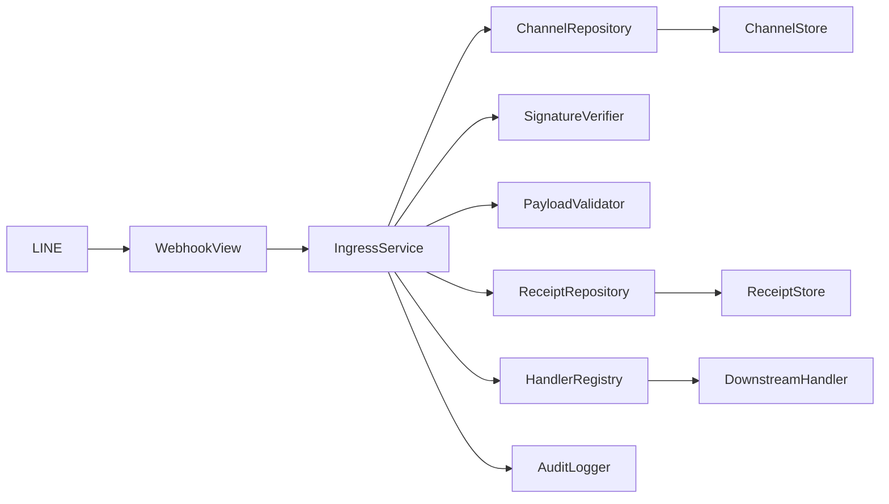
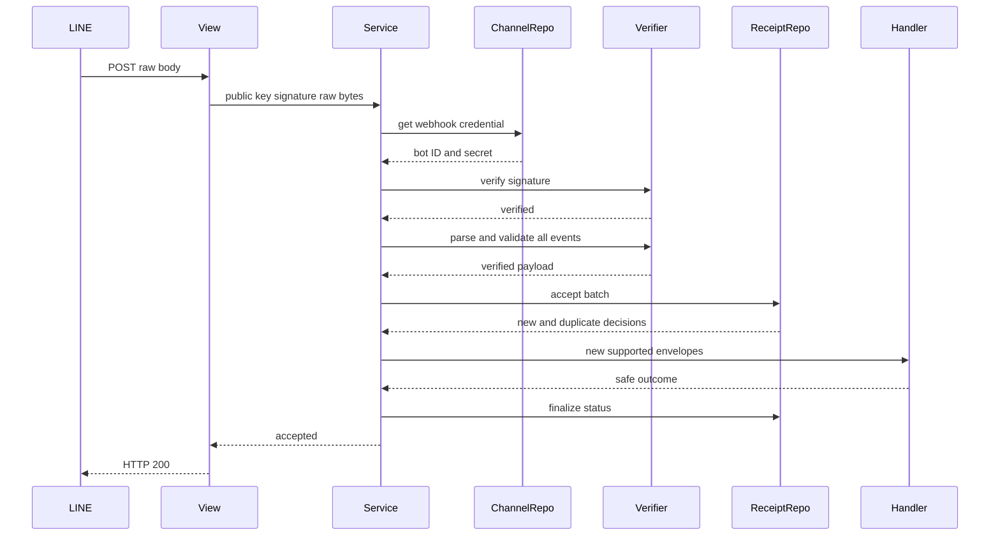
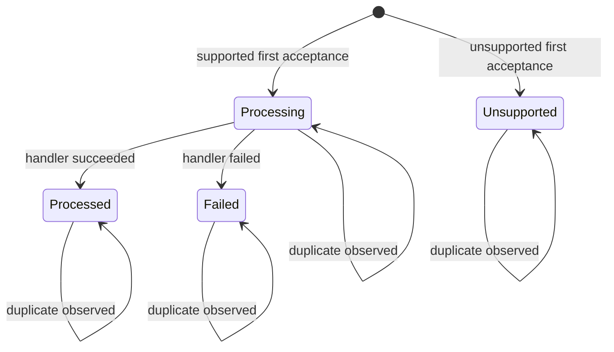

# 技術設計書

## Overview

本機能は、複数の LINE 公式アカウントから届く Webhook をチャネルごとに真正性確認し、検証済み event を `webhookEventId` 単位で一度だけ受け付ける Backend 境界を提供する。個人開発者は専用 URL を LINE Developers Console に設定でき、空 event による疎通、再送、未知 event、同期 handler の成功・失敗を安全に追跡できる。

新しい `linewebhooks` Django app が公開 HTTP、raw body 署名、`destination` と payload 基本検証、受付台帳、検証済み envelope、同期 handler port、安全な監査を所有する。`linechannels` は Webhook 用途限定の typed credential projection を追加し、Ingress は channel model、暗号文、Cipher を直接参照しない。event 固有の状態更新、意味解釈、reply、payload 永続化、再実行は後続仕様へ残す。

### Goals

- 公開 UUID を候補選択にだけ使い、raw bytes 署名と保存済み bot user ID によって request 全体の真正性を確認する。
- payload 全体を検証してから `webhookEventId` UNIQUE の台帳へ原子的に受付確定し、並行再送でも handler を一度だけ呼ぶ。
- 未知フィールド・列挙値・event type を許容し、登録済み handler だけへ immutable な検証済み envelope を渡す。
- raw body、署名、秘密値、event 固有ユーザーデータ、生例外を永続化・通常ログ・公開応答へ出さず、2 秒以内の応答契約を維持する。

### Non-Goals

- follow／unfollow による recipient 更新、message／postback の意味解釈、reply 送信
- event payload、LINE user ID、reply token、message/postback 内容の恒久保存
- queue／worker、自動 replay、失敗 handler の再実行、順序保証、完全な配信保証
- group／room 管理、Beacon、画像・動画取得、配信到達・既読管理
- Frontend、チャネル管理 UI、LINE Webhook statistics API との外部連携

## Boundary Commitments

### This Spec Owns

- `POST /api/line/webhooks/{channel_public_key}/` の匿名公開受付と POST 以外の安全な拒否
- public UUID から active channel、bot user ID、Webhook secret を同一用途 projection として解決する upstream integration contract
- raw request body と `X-Line-Signature` の HMAC-SHA256 検証、署名後の JSON／`destination`／共通 event 属性検証
- `webhookEventId` を主キーとする受付台帳、初回／同一 request 内／別 request／並行 request の重複収束
- `VerifiedWebhookEvent`、`VerifiedEventHandler`、event type registry の安定した in-process contract
- `processing`、`processed`、`failed`、`unsupported` の受付・処理分類と安全な audit event
- 署名済み raw body 256 KiB 以下、1 request 10 event 以下という受付上限と、登録 handler 1件100 ms以下という同期実行 contract
- 空 event、重複、未知 event、handler failure を含む valid request の HTTP 200 応答

### Out of Boundary

- event type 固有の業務状態、recipient、配信、reply、外部 API 作用の ownership
- handler の自動再実行、`processing` receipt の recovery、dead-letter、queue、worker
- raw request、署名、secret、`destination`、event payload、user/source ID、reply token、message/postback 内容の永続化
- IP allowlist、public UUID、署名前 JSON を真正性根拠として利用すること
- 一つの event type に複数 handler を fan-out する汎用 event bus

### Allowed Dependencies

- `linechannels.WebhookCredentialRepository` が返す active channel の public UUID、bot user ID、redacted `ChannelSecret`
- Django 6.0.7 の URL routing、`HttpRequest.body`、ORM、migration、`transaction.atomic()`、timezone
- Django REST Framework 3.17.1 の `APIView` と `Response`。Webhook View は project 既定の owner authentication/permission と body parser を上書きして空にする
- MySQL 8.4 InnoDB の UNIQUE constraint、transaction、conditioned update
- Python 3.14 標準 `hmac`、`hashlib`、`base64`、`json`、`dataclasses`、`typing`、`uuid`
- 標準 Backend/MySQL container で1 event 100 ms以下、外部 I/O なしを満たす、event type ごとに最大1件の同期 `VerifiedEventHandler`

### Revalidation Triggers

- LINE の署名方式、署名 header、payload top-level、共通 event 属性、`webhookEventId` 形式の変更
- `linechannels` の public UUID、bot user ID、active 判定、credential pair の原子更新、`ChannelSecret` 利用契約の変更
- `VerifiedWebhookEvent`、handler result、registry の単一 handler 規則、receipt status/failure code の変更
- queue/worker、自動 recovery、複数 handler fan-out、request payload 保存、event 固有データ保存の導入
- 外部通信を行う handler、1 request の event 上限、応答 deadline、Django/DRF parser/middleware 順序の変更
- 下流仕様が `processing` receipt の再実行、event ordering、exactly-once 外部作用を前提にする変更

## Architecture

### Existing Architecture Analysis

- Backend は機能別 Django app、app-local URLConf、`config/urls.py` の `include` を採用する。公開 HTTP は DRF `APIView` / `Response` で検証する。
- project 既定の DRF authentication/permission は owner session 用である。Webhook View は匿名 LINE request のため `authentication_classes = []`、`permission_classes = []`、`parser_classes = []` を明示する。
- `linechannels` は credential 暗号化、active 判定、用途別復号を所有する。既存 account-linking 用 directory は bot user ID を意図的に返さないため拡張しない。
- `delivery.DeliveryService` は DB UNIQUE、短い受付 transaction、transaction 外の外部作用、条件付き結果更新を採用している。Ingress も同じ at-most-once pattern を event batch に適用する。

### Architecture Pattern & Boundary Map



**Architecture Integration**:

- **Selected pattern**: Django app 内の application service + purpose-specific ports。外部 HTTP、上流 credential、永続化、下流 handler、監査を constructor injection で分離する。
- **Domain/feature boundaries**: `linechannels` は検証材料を返すまで、`linewebhooks` は検証済み event の一意な受付まで、下流 handler は event 固有作用を所有する。
- **Cross-app ownership**: 本仕様は `linechannels` に用途限定 read projection を追加するが、channel schema、暗号化、active 判定の所有権は移さない。projection と Ingress の接続だけを本仕様の integration 成果とし、各 app 内の実装境界を別々にレビューできるようにする。
- **Dependency direction**: `types/models → verification/handlers/repositories/audit → services → views`。`container` だけが concrete implementation を合成する。`linewebhooks` から `linechannels.models`、Cipher、暗号文への import を禁止する。
- **Existing patterns preserved**: app-local URLConf、typed dataclass union、safe failure code、DB UNIQUE による線形化、transaction 外の作用、MySQL concurrency test。
- **New components rationale**: 署名前 parse 防止、将来互換 validation、受付権の一意化、下流責務の分離をそれぞれ明示的な contract にするために必要である。
- **Steering compliance**: Backend-only secret、データ最小化、冪等性、Asia/Tokyo/timezone-aware audit、2 秒応答を維持する。

### Technology Stack

| Layer | Choice / Version | Role in Feature | Notes |
|-------|------------------|-----------------|-------|
| Backend HTTP | Django 6.0.7 / DRF 3.17.1 | raw body 取得、公開 POST、status mapping | parser/auth/permission を View 単位で無効化 |
| Verification | Python 3.14 stdlib | HMAC-SHA256、strict Base64、constant-time comparison、JSON parsing | 新規依存なし。SDK event parser は入口に使わない |
| Data | Django ORM / MySQL 8.4 InnoDB | receipt UNIQUE、短い batch transaction、CAS finalize | event payload は保存しない |
| Integration | `linechannels` typed repository | active channel、bot user ID、secret の整合 snapshot | 既存 encrypted schema は変更しない |
| Runtime | Docker Compose / ngrok existing tunnel | LINE から Backend `/api` への HTTPS 導線 | 新しい service、env secret は追加しない |

## File Structure Plan

### Directory Structure

```text
backend/
├── linewebhooks/
│   ├── __init__.py                         # Django app package
│   ├── apps.py                             # app metadata
│   ├── urls.py                             # channel_public_key route
│   ├── views.py                            # raw body HTTP adapter と安全な status mapping
│   ├── types.py                            # JSON、verified envelope、ingress/handler/audit result 型
│   ├── verification.py                     # HMAC 検証、payload 基本検証、immutable envelope 生成
│   ├── handlers.py                         # handler protocol と event type registry
│   ├── models.py                           # WebhookEventReceipt と状態制約
│   ├── repositories.py                     # batch acceptance と CAS finalize
│   ├── audit.py                            # 内容を受け取れない structured audit adapter
│   ├── services.py                         # 検証から受付・dispatch・結果分類までの use case
│   ├── container.py                        # repository、validator、registry、service の composition
│   ├── migrations/
│   │   ├── __init__.py
│   │   └── 0001_initial.py                 # receipt table、UNIQUE、CHECK、indexes
│   └── tests/
│       ├── __init__.py
│       ├── test_verification.py            # raw signature と tolerant validation
│       ├── test_handlers.py                # registry と verified-only contract
│       ├── test_repositories.py            # batch atomicity、duplicate、CAS state
│       ├── test_services.py                # empty、unknown、known、failure、duplicate flow
│       ├── test_api.py                     # method、status、body、auth/parser 契約
│       ├── test_concurrency.py             # MySQL 並行 request の一意受付
│       ├── test_security.py                # body、secret、user data、生例外の非露出 canary
│       └── test_performance.py             # 受付上限内の2秒応答とquery budget
└── linechannels/
    └── tests/test_webhook_credential_repository.py  # 用途限定 projection と snapshot 契約
```

### Modified Files

- `backend/config/settings.py` — `linewebhooks.apps.LineWebhooksConfig` を登録する。
- `backend/config/urls.py` — `path("api/line/webhooks/", include("linewebhooks.urls"))` を追加する。
- `backend/linechannels/types.py` — redacted secret を含む safe `WebhookChannelAvailable` union を追加する。
- `backend/linechannels/repositories.py` — bot user ID と channel secret を単一 read/decrypt で返す `WebhookCredentialRepository` を追加する。
- `backend/linechannels/container.py` — `build_webhook_credential_repository()` factory を追加する。
- `README.md` — LINE Developers Console の channel 別 URL、疎通確認、ngrok 公開中の注意、receipt の非再実行方針を記載する。

各 component の物理 owner は、`WebhookAPIView` → `views.py`、`WebhookIngressService` → `services.py`、`WebhookCredentialRepository` → `linechannels/repositories.py`、`RawSignatureVerifier` と `WebhookPayloadValidator` → `verification.py`、`EventReceiptRepository` → `repositories.py`、`HandlerRegistry` → `handlers.py`、`SafeWebhookAuditLogger` → `audit.py` とする。`apps.py` と settings 登録は app 起動だけ、`types.py` は副作用のない共通 value contract だけ、`container.py` は concrete composition だけを所有し、これらを同一の実装責務として束ねない。

## System Flows

### 検証、受付、dispatch



- 署名、`destination`、全 event の基本検証が完了するまで receipt を作らない。1件でも不正なら request 全体を拒否する。
- `accept_batch()` commit が handler 実行権の線形化点である。新規 `processing` だけを dispatch し、既存 receipt と同一 request 内の後続重複は保存済み状態へ収束する。
- handler は transaction 外で順番に実行する。raw exception は `handler_failed` へ置換し、receipt finalize 後に request 全体を 200 とする。

### Receipt state



重複は state、発生時刻、初回 redelivery flag、failure code を更新しない。commit 後の process 停止で残る `processing` は自動再実行せず、監査可能な未完了分類として保持する。

## Requirements Traceability

| Requirement | Summary | Components | Interfaces | Flows |
|-------------|---------|------------|------------|-------|
| 1.1, 1.2, 1.5 | channel 別 POST と候補選択 | WebhookAPIView、WebhookIngressService | HTTP API、Ingress service | 検証・受付 |
| 1.3, 1.4 | invalid/unknown/inactive/credential failure の fail closed | WebhookCredentialRepository、WebhookAPIView | Credential result、HTTP 404 | 検証・受付 |
| 2.1, 2.2, 2.3 | raw body 署名を最初に検証 | RawSignatureVerifier、WebhookIngressService | Signature service | 検証・受付 |
| 2.4, 2.5 | 署名後の `destination` 照合 | WebhookPayloadValidator、WebhookChannelAvailable | Verified payload | 検証・受付 |
| 3.1, 3.2, 3.3, 3.7 | top-level、受付上限、全 event の基本契約 | WebhookPayloadValidator、WebhookIngressService | Payload validation result、Ingress rejection | 検証・受付 |
| 3.4 | empty event 疎通 | WebhookIngressService、SafeWebhookAuditLogger | Ingress accepted | 検証・受付 |
| 3.5 | unknown field/enum/type の tolerant reader | WebhookPayloadValidator、HandlerRegistry | FrozenJsonObject、resolve | 検証・受付 |
| 3.6 | 複数 event の個別分類 | EventReceiptRepository、WebhookIngressService | accept_batch | 検証・受付 |
| 4.1, 4.2, 4.3 | UNIQUE による一意受付と重複抑止 | WebhookEventReceipt、EventReceiptRepository | Receipt decisions | Receipt state |
| 4.4, 4.5, 4.6 | redelivery 監査、元時刻保持、非保証 | WebhookEventReceipt、WebhookIngressService | Receipt state | Receipt state |
| 5.1, 5.2, 5.4 | verified envelope だけを既知 handler へ渡す | VerifiedWebhookEvent、HandlerRegistry | VerifiedEventHandler | 検証・受付 |
| 5.3 | raw/secret/pre-verification data を envelope から除外 | VerifiedWebhookEvent、WebhookPayloadValidator | FrozenJsonObject | 検証・受付 |
| 5.5 | 未登録 type を unsupported にする | HandlerRegistry、EventReceiptRepository | resolve、initial status | Receipt state |
| 6.1, 6.2 | handler 成功・失敗を安全に finalize | WebhookIngressService、EventReceiptRepository | HandlerOutcome、finalize | Receipt state |
| 6.3, 6.4 | failed duplicate の非再実行と下流責務分離 | HandlerRegistry、WebhookIngressService | ReceiptDecision | Receipt state |
| 7.1, 7.2 | 最小 receipt と safe operation audit | WebhookEventReceipt、SafeWebhookAuditLogger | AuditEntry | 両 flow |
| 7.3, 7.4, 7.5 | content/secret/raw error 非保存・非露出 | 全 HTTP/verification/persistence component | safe repr、safe codes | 両 flow |
| 8.1, 8.2 | 上限内の valid request を2秒以内に200 | WebhookPayloadValidator、HandlerRegistry、WebhookIngressService、WebhookAPIView、SafeWebhookAuditLogger | Verified payload、handler budget、Ingress result、HTTP API、deadline audit | 検証・受付 |
| 8.3 | handler failure 記録後も200 | WebhookIngressService、EventReceiptRepository | failed finalize | Receipt state |
| 8.4 | channel/credential/signature/destination/payload failure を非2xx | WebhookAPIView、WebhookIngressService | rejection mapping | 検証・受付 |
| 8.5 | timeout redelivery を保存済み受付へ収束 | EventReceiptRepository、WebhookIngressService | duplicate decision | Receipt state |

## Components and Interfaces

| Component | Domain/Layer | Intent | Req Coverage | Key Dependencies | Contracts |
|-----------|--------------|--------|--------------|------------------|-----------|
| WebhookAPIView | HTTP | raw request を use case へ渡し安全な status を返す | 1.1–1.5, 2.1–2.3, 8.1–8.5 | IngressService P0, DRF P0 | API |
| WebhookIngressService | Application | 検証、batch受付、dispatch、監査を順序制御する | 1.2–1.4, 2.1–2.5, 3.1–3.7, 4.1–4.6, 5.1–5.5, 6.1–6.4, 8.1–8.5 | 全 ports P0 | Service |
| WebhookCredentialRepository | Upstream data | active bot ID と secret の整合 projection を返す | 1.2–1.4, 2.1, 2.4 | linechannels models/Cipher P0 | Service |
| RawSignatureVerifier | Verification | raw bytes の HMAC を constant time 検証する | 2.1–2.3 | ChannelSecret P0, stdlib P0 | Service |
| WebhookPayloadValidator | Verification | 署名後 JSON を tolerant validation し verified object にする | 2.4–2.5, 3.1–3.5, 3.7, 5.2–5.3, 8.1 | stdlib json P0 | Service |
| EventReceiptRepository | Persistence | batch acceptance と receipt CAS finalize を所有する | 3.6, 4.1–4.6, 5.5, 6.1–6.3, 8.3, 8.5 | MySQL P0 | Service, State |
| HandlerRegistry | Integration | event type から最大1 handler を解決する | 3.5, 5.1, 5.4–5.5, 6.4, 8.1 | Downstream handler P0 | Service |
| SafeWebhookAuditLogger | Observability | whitelist 済み classification だけを構造化記録する | 7.1–7.5, 8.1 | Python logging P1 | Service |

### HTTP Layer

#### WebhookAPIView

| Field | Detail |
|-------|--------|
| Intent | 署名検証前の raw body を変換せず application service へ渡す |
| Requirements | 1.1, 1.3, 1.4, 1.5, 2.1, 2.2, 8.1, 8.2, 8.3, 8.4, 8.5 |

**Responsibilities & Constraints**

- URLConf は `<str:channel_public_key>/` を受け、service が canonical UUID v4 を検証する。malformed、unknown、inactive、credential unavailable は同じ 404 body へ写像する。
- `authentication_classes`、`permission_classes`、`parser_classes` を空にし、`request.data` を参照しない。`request.body` を一度だけ bytes として取得する。
- `request.headers` から `X-Line-Signature` を大小無視で取得する。body、header、path fragment を例外 message や log へ含めない。
- POST 以外は `http_method_not_allowed()` の固定 405 応答とし、service を呼ばない。

**Dependencies**

- Outbound: WebhookIngressService — use case（P0）
- External: DRF APIView/Response — HTTP adapter（P0）

**Contracts**: API [x]

##### API Contract

| Method | Endpoint | Request | Response | Errors |
|--------|----------|---------|----------|--------|
| POST | `/api/line/webhooks/{channel_public_key}/` | raw bytes + `X-Line-Signature` | empty HTTP 200 | 400 payload/destination、401 signature、404 channel/credential、503 storage/unexpected safe failure |
| Other | same | ignored | none | fixed HTTP 405 |

公開 error body は 400/401/404 で同じ `{"error":{"code":"webhook_rejected"}}`、503 で `{"error":{"code":"webhook_unavailable"}}` とし、内部 failure code、channel state、受信内容を含めない。

### Upstream Integration

#### WebhookCredentialRepository

| Field | Detail |
|-------|--------|
| Intent | public UUID から active bot ID と Webhook secret を同一 snapshot で返す |
| Requirements | 1.2, 1.3, 1.4, 2.1, 2.4 |

**Responsibilities & Constraints**

- `LineChannel` の active、bot user ID、channel secret ciphertext を単一 query projection で読む。
- inactive、unknown、credential absent/corrupt、DB failure を既存 `CredentialUnavailable` の safe code へ分類する。
- channel secret 列だけを既存 Cipher で復号し、`WebhookChannelAvailable` へ redacted wrapper のまま格納する。
- account-linking 用 `LineChannelDirectory`、既存 `CredentialRepository`、channel/credential schema を変更しない。

**Dependencies**

- Inbound: WebhookIngressService — verification material（P0）
- Outbound: linechannels models — single projection（P0）
- Outbound: CredentialCipher — channel secret decrypt（P0）

**Contracts**: Service [x]

##### Service Interface

```python
@dataclass(frozen=True, repr=False)
class WebhookChannelAvailable:
    status: Literal["available"]
    channel_public_id: UUID
    bot_user_id: str
    channel_secret: ChannelSecret

WebhookChannelResult = WebhookChannelAvailable | CredentialUnavailable

class WebhookCredentialRepository(Protocol):
    def get(self, channel_public_id: UUID) -> WebhookChannelResult: ...
```

- Preconditions: canonical UUID v4。
- Postconditions: success は active channel の bot user ID と当該行 context で復号した secret だけを返す。
- Invariants: secret の `reveal_for_use()` は RawSignatureVerifier 内だけで呼び、結果を保持・serialize・log しない。

### Verification Layer

#### RawSignatureVerifier

| Field | Detail |
|-------|--------|
| Intent | request body bytes が対象 channel secret に対応することを JSON parse 前に証明する |
| Requirements | 2.1, 2.2, 2.3 |

**Dependencies**

- Inbound: WebhookIngressService — raw body/header/secret（P0）
- External: Python hmac/hashlib/base64 — standard primitive（P0）

**Contracts**: Service [x]

```python
class RawSignatureVerifier(Protocol):
    def verify(
        self,
        raw_body: bytes,
        signature: str | None,
        channel_secret: ChannelSecret,
    ) -> Literal["verified", "rejected"]: ...
```

- header は strict Base64 decode し、形式不正を `rejected` とする。
- expected digest bytes と supplied digest bytes は `hmac.compare_digest()` で比較する。
- body decode、JSON parse、normalization、secret/body/signature を含む例外を生成しない。

#### WebhookPayloadValidator

| Field | Detail |
|-------|--------|
| Intent | 署名済み bytes を共通契約だけで検証し immutable verified payload に変換する |
| Requirements | 2.4, 2.5, 3.1, 3.2, 3.3, 3.4, 3.5, 3.7, 5.2, 5.3, 8.1 |

**Dependencies**

- Inbound: WebhookIngressService — signature verified bytes/bot ID（P0）
- External: Python json — strict JSON decode（P0）

**Contracts**: Service [x]

```python
type FrozenJsonScalar = str | int | float | bool | None
type FrozenJsonValue = (
    FrozenJsonScalar
    | tuple[FrozenJsonValue, ...]
    | Mapping[str, FrozenJsonValue]
)
type FrozenJsonObject = Mapping[str, FrozenJsonValue]

@dataclass(frozen=True)
class VerifiedEventData:
    webhook_event_id: str
    event_type: str
    occurred_at_ms: int
    is_redelivery: bool
    event: FrozenJsonObject

@dataclass(frozen=True)
class VerifiedWebhookPayload:
    events: tuple[VerifiedEventData, ...]

class WebhookPayloadValidator(Protocol):
    def validate(
        self,
        raw_body: bytes,
        expected_bot_user_id: str,
    ) -> VerifiedWebhookPayload | PayloadRejected: ...
```

- JSON root は object、`destination` は canonical bot user ID と完全一致、`events` は array とする。
- 署名成功後、JSON parse 前に raw body が 256 KiB 以下であることを確認する。`events` は0〜10件とし、上限超過は `PayloadRejected` とする。この非意味的な上限判定に本文内容を使用しない。
- 各 event は object、`webhookEventId` は canonical 26文字 ULID、`type` は1〜255文字の string、`timestamp` は bool でない非負の signed 64-bit millisecond integer、`deliveryContext.isRedelivery` は bool とする。
- 1件でも不正なら `PayloadRejected` とし verified event を一件も返さない。空 array は valid tuple とする。
- 未知 field、field order、既知 field 内の未知 enum、未知 event type を拒否しない。event object は再帰的に immutable 化し、safe `repr` は content を表示しない。

### Application and Downstream Integration

#### HandlerRegistry

| Field | Detail |
|-------|--------|
| Intent | verified event type を event 固有の同期 handler へ接続する |
| Requirements | 3.5, 5.1, 5.4, 5.5, 6.4, 8.1 |

**Responsibilities & Constraints**

- process startup 時に event type ごとに最大1 handler を登録し、request 中は immutable とする。
- 未登録 type は `None` を返し、event-specific code を呼ばない。
- handler に raw body、signature、secret、`destination`、mutable pre-verification object を渡さない。
- handler は標準 Backend/MySQL container の contract test で1 event 100 ms以下、外部 I/O なしの軽量同期処理に限定する。queue/retry、外部作用、固有 state の安全性は登録する下流仕様が所有する。
- 登録を追加する下流仕様は最悪10件の payload で request 全体が2秒以内になることを再検証し、この予算を満たさない handler を registry へ登録しない。

**Contracts**: Service [x]

```python
@dataclass(frozen=True, repr=False)
class VerifiedWebhookEvent:
    channel_public_id: UUID
    webhook_event_id: str
    event_type: str
    occurred_at_ms: int
    is_redelivery: bool
    data: FrozenJsonObject

@dataclass(frozen=True)
class HandlerSucceeded:
    status: Literal["succeeded"]

@dataclass(frozen=True)
class HandlerFailed:
    status: Literal["failed"]

HandlerOutcome = HandlerSucceeded | HandlerFailed

class VerifiedEventHandler(Protocol):
    def handle(self, event: VerifiedWebhookEvent) -> HandlerOutcome: ...

class HandlerRegistry(Protocol):
    def resolve(self, event_type: str) -> VerifiedEventHandler | None: ...
```

- `VerifiedWebhookEvent.__repr__` は IDs/type/redelivery だけを表示し、`data` を表示しない。
- handler の生例外は service 境界で捕捉し、`HandlerFailed` 相当の `handler_failed` へ変換する。exception object と traceback は通常 audit に渡さない。

#### WebhookIngressService

| Field | Detail |
|-------|--------|
| Intent | trust transition と at-most-once dispatch の全順序を所有する |
| Requirements | 1.2, 1.3, 1.4, 2.1–2.5, 3.1–3.7, 4.1–4.6, 5.1–5.5, 6.1–6.4, 8.1–8.5 |

**Responsibilities & Constraints**

1. public key を canonical UUID v4 として検証し、Webhook credential を取得する。
2. raw signature を検証する。成功前に payload validator を呼ばない。
3. payload と `destination`、全 event を検証する。空 events は audit 後に accepted を返す。
4. registry support を snapshot し、supported は `processing`、unsupported は `unsupported` の candidate として全 event を `accept_batch()` へ渡す。
5. commit 済みの新規 `processing` decision だけを verified envelope にして handler へ渡し、結果を CAS finalize する。
6. 重複は handler を呼ばず、保存済み state を変更しない。handler failure を finalize できた request は accepted とする。
7. monotonic clock で request 全体を測定する。標準 runtime で内部目標1,500 ms、外部契約2,000 msとし、2,000 ms以上は内容非露出の deadline audit を必ず残す。

複数の新規 handler は payload 順に独立分類する。ある handler の safe failure、生例外、または finalize storage failure が後続 event の handler 呼出しを中断してはならない。全 event の処理後、handler failure だけなら accepted、いずれかの finalize storage failure があれば request-level `storage_unavailable` とする。

**Dependencies**

- Outbound: WebhookCredentialRepository、RawSignatureVerifier、WebhookPayloadValidator、EventReceiptRepository、HandlerRegistry、SafeWebhookAuditLogger（P0）
- External: monotonic clock / timezone clock — 2秒 budget と audit time（P1）

**Contracts**: Service [x]

```python
IngressFailureCode = Literal[
    "channel_unavailable",
    "signature_rejected",
    "payload_rejected",
    "storage_unavailable",
    "unexpected",
]

@dataclass(frozen=True)
class IngressAccepted:
    status: Literal["accepted"]

@dataclass(frozen=True)
class IngressRejected:
    status: Literal["rejected"]
    code: IngressFailureCode

IngressResult = IngressAccepted | IngressRejected

class WebhookIngressService(Protocol):
    def ingest(
        self,
        channel_public_key: str,
        raw_body: bytes,
        signature: str | None,
    ) -> IngressResult: ...
```

- Preconditions: body は HTTP adapter が受信した bytes そのもの。登録 handler は1 event 100 ms以下、外部 I/O なしの contract test を通過している。
- Postconditions: accepted は empty、duplicate、unsupported、全新規 handler の分類完了を含む。controlled rejection は一件も新規受付しない。
- Invariants: receipt commit 前に handler を呼ばない。duplicate/failed receipt で handler を再実行しない。transaction 中に handler を呼ばない。

### Persistence and Observability

#### EventReceiptRepository

| Field | Detail |
|-------|--------|
| Intent | event batch の受付権を一意に確定し、処理結果を単調更新する |
| Requirements | 3.6, 4.1, 4.2, 4.3, 4.4, 4.5, 4.6, 5.5, 6.1, 6.2, 6.3, 8.3, 8.5 |

**Responsibilities & Constraints**

- request 内全 candidate を1つの短い transaction で処理し、storage error では新規行を全 rollback する。
- `webhook_event_id` UNIQUE を唯一の重複判定にする。事前 read は最適化に限定し、`IntegrityError` を内側 `atomic()` の外で duplicate へ変換する。
- 新規 decision だけが `created=True`。同一 request の2件目、別 request、並行 request は既存 receipt の immutable snapshot を返す。
- decision は candidate と同じ件数・順序で返す。同一 request 内で ID が重複した場合は最初の occurrence だけが `created=True` となり、後続 occurrence の metadata/support 判定は既存 receipt を上書きしない。
- finalize は `status=processing` 条件付き update で `processed` または `failed` へ一度だけ遷移する。重複観測は update しない。

**Contracts**: Service [x] / State [x]

```python
ReceiptInitialStatus = Literal["processing", "unsupported"]
ReceiptStatus = Literal["processing", "processed", "failed", "unsupported"]

@dataclass(frozen=True)
class ReceiptCandidate:
    channel_public_id: UUID
    webhook_event_id: str
    event_type: str
    occurred_at_ms: int
    is_redelivery: bool
    initial_status: ReceiptInitialStatus

@dataclass(frozen=True)
class ReceiptDecision:
    receipt_id: int
    webhook_event_id: str
    status: ReceiptStatus
    created: bool

class EventReceiptRepository(Protocol):
    def accept_batch(
        self,
        candidates: tuple[ReceiptCandidate, ...],
    ) -> tuple[ReceiptDecision, ...] | ReceiptStorageFailed: ...

    def mark_processed(self, receipt_id: int) -> Literal["updated", "unchanged", "failed"]: ...
    def mark_failed(
        self,
        receipt_id: int,
        code: Literal["handler_failed"],
    ) -> Literal["updated", "unchanged", "failed"]: ...
```

#### SafeWebhookAuditLogger

| Field | Detail |
|-------|--------|
| Intent | 運用上必要な結果と時刻を content-free structured log にする |
| Requirements | 7.1, 7.2, 7.3, 7.4, 7.5, 8.1 |

**Contracts**: Service [x]

```python
AuditOutcome = Literal[
    "channel_rejected",
    "signature_rejected",
    "payload_rejected",
    "empty_accepted",
    "event_accepted",
    "event_duplicate",
    "event_unsupported",
    "handler_processed",
    "handler_failed",
    "storage_unavailable",
    "response_deadline_exceeded",
]

@dataclass(frozen=True)
class WebhookAuditEntry:
    outcome: AuditOutcome
    observed_at: datetime
    channel_public_id: UUID | None = None
    webhook_event_id: str | None = None
    event_type: str | None = None
    elapsed_ms: int | None = None

class WebhookAuditLogger(Protocol):
    def record(self, entry: WebhookAuditEntry) -> None: ...
```

型が body、signature、secret、event data、exception を受け取れないことを第一防御とする。ログ format は safe field whitelist だけを使い、`exc_info` と arbitrary context dictionary を禁止する。`elapsed_ms` は非負整数で `response_deadline_exceeded` のときだけ設定し、他 outcome では `None` とする。

## Data Models

### Domain Model

- **VerifiedWebhookPayload**: request-local value。署名と destination を検証済みの event tuple を所有し、永続化しない。
- **VerifiedWebhookEvent**: handler 境界の immutable value。channel public UUID、event metadata、verified event data を持つが raw request/secret は持たない。
- **WebhookEventReceipt**: aggregate root。`webhookEventId` ごとの受付権と最小 audit metadata、処理分類だけを所有する。
- **Invariant**: receipt の event metadata は初回 insert 後 immutable。state は `processing → processed|failed` のみで、`unsupported` は terminal。duplicate は state transition ではない。

### Logical Data Model

`WebhookEventReceipt` は `linechannels` への FK を持たず、検証時点の `channel_public_id` を値として保存する。これにより channel lifecycle と audit lifecycle の shared ownership を作らず、将来 channel が物理削除されても receipt を不意に cascade しない。

### Physical Data Model

| Table | Field | Type | Constraint / Purpose |
|-------|-------|------|----------------------|
| `linewebhooks_event_receipt` | `id` | BIGINT | PK |
| | `webhook_event_id` | VARCHAR(26) | UNIQUE、canonical uppercase ULID、dedupe linearization |
| | `channel_public_id` | CHAR(32) UUID storage | index、非秘密 channel reference |
| | `event_type` | VARCHAR(255) | 未知値を保持、payload content は含めない |
| | `occurred_at_ms` | BIGINT UNSIGNED 相当 | LINE 原発生時刻、更新禁止 |
| | `is_redelivery` | BOOLEAN | 初回受信値、dedupe key にしない |
| | `status` | VARCHAR(16) | processing/processed/failed/unsupported |
| | `failure_code` | VARCHAR(32) NULL | failed 時だけ `handler_failed` |
| | `accepted_at` | DATETIME(6) | timezone-aware 初回受付時刻 |
| | `completed_at` | DATETIME(6) NULL | terminal classification 時刻 |
| | `updated_at` | DATETIME(6) | CAS finalize 時刻 |

**Consistency & Integrity**:

- UNIQUE `webhook_event_id`。channel との composite unique にはしない。
- CHECK: `processing` は `completed_at IS NULL AND failure_code IS NULL`。
- CHECK: `processed` / `unsupported` は `completed_at IS NOT NULL AND failure_code IS NULL`。
- CHECK: `failed` は `completed_at IS NOT NULL AND failure_code='handler_failed'`。
- `event_type` 検索 index は初期スコープで追加しない。`channel_public_id, accepted_at` の複合 index を運用上の時系列確認に追加する。
- DB 制約は状態整合と一意性を保証し、初回 metadata の不変性は `EventReceiptRepository` の write contract で保証する。新規 insert 後の更新は `status`、`failure_code`、`completed_at`、`updated_at` だけを field whitelist で許可し、DB trigger は導入しない。
- payload、signature、destination、secret、user/source ID、reply token、message/postback 内容の column は作らない。

### Data Contracts & Integration

- Envelope version field は現段階で追加しない。Python class identity と typed import path が in-process verified contract を示す。
- 下流 handler は `VerifiedWebhookEvent` だけを受け、request/View/model へ依存しない。
- 下流が event data を永続化する場合、当該下流仕様が schema、目的、保持期間、削除方法を定義する。Ingress receipt と transaction を共有しない。

## Error Handling

### Error Strategy

- **候補 channel failure**: malformed/unknown/inactive/incomplete/unreadable/storage を public には同一 404 `webhook_rejected`、audit には content-free `channel_rejected` とする。
- **signature failure**: missing/malformed/mismatch を同一 401。event parse、receipt、handler を実行しない。
- **payload failure**: 署名済み raw body の256 KiB超過、invalid UTF-8/JSON/root/destination、10件超過の events、common field 不正を同一 400。部分受付しない。
- **receipt storage failure**: batch rollback し 503。handler を実行しない。
- **handler failure/exception**: `handler_failed` を finalize し 200。生 exception/traceback を通常 log へ出さない。
- **finalize storage failure**: handler を再実行せず receipt を `processing` のまま保持し 503。再送も duplicate として handler を呼ばない。

### Monitoring

- safe outcome と observed time を必須とし、accepted/duplicate/unsupported/handler failure を event ID 単位で識別する。
- `WebhookIngressService` が monotonic clock で request latency を測定し、2,000 ms以上を `response_deadline_exceeded` audit として記録する。`elapsed_ms` 以外の body size や event contents は記録しない。
- 1,500 ms以上2,000 ms未満は test/運用上の warning threshold とし、外部契約違反になる前に handler 登録または query 増加を検出する。
- `processing` receipt の件数・最終更新時刻は運用 query で確認可能にするが、自動 mutation/replay は行わない。

## Testing Strategy

### Unit Tests

- `RawSignatureVerifier`: exact raw bytes の正当署名だけを受理し、欠落、invalid Base64、本文1 byte変更、別 secret を拒否する（2.1, 2.2, 2.3）。
- `WebhookPayloadValidator`: destination mismatch、raw body 256 KiB超過、root/events/common field の各不正、11件以上の event で request 全体を拒否し、空 events と10件の event を valid とする（2.4, 2.5, 3.1, 3.2, 3.3, 3.4, 3.7）。
- tolerant reader: unknown field/order/enum/event type を保持し、既知 event と同じ batch を妨げない（3.5, 3.6）。
- `HandlerRegistry`: event type ごとに単一 handler を返し、未登録 type は handler call なしで unsupported となる（5.1, 5.5, 6.4）。
- envelope/audit safe repr: raw body、signature、secret、user ID、reply token、message/postback canary を表示・serialize しない（5.3, 7.3, 7.4, 7.5）。

### Integration Tests

- `WebhookCredentialRepository`: active rowだけが bot ID と対象 secret を返し、access token を復号せず、unknown/inactive/incomplete/corrupt/DB failure を safe result にする（1.2, 1.3, 1.4, 2.4）。
- batch acceptance: 複数 valid event を一 transaction で作成し、同一 request 内重複は一行/new handler一回、storage failure は全 rollback にする（3.3, 3.6, 4.1, 4.2）。
- duplicate replay: 別 request の isRedelivery=true でも初回 occurred_at/redelivery/status/failure を維持し handler を再実行しない（4.3, 4.4, 4.5, 4.6, 6.3）。
- handler flow: success は processed、safe failure/exception は failed、unknown は初期 unsupported、各 terminal request は 200 outcome になる（5.1, 5.2, 5.5, 6.1, 6.2, 8.3）。
- finalize failure: handler を一度だけ呼び、receipt は processing、HTTP は503、再送でも handler を呼ばない（4.3, 8.5）。

### HTTP Contract Tests

- exact route の POST だけが service を呼び、GET/PUT/DELETE/OPTIONS は固定405となる（1.1, 1.5）。
- owner session/CSRF なしで LINE request を受け、DRF `request.data` parser が署名前に動かない（1.1, 2.1）。
- malformed public key、unknown/inactive/credential unavailable の body が同じ404で内部状態を含まない（1.3, 1.4, 7.4）。
- missing/bad signature は401、destination/payload は400、receipt storage は503となり、いずれも receipt/handler がゼロである（2.2, 2.5, 3.3, 8.4）。
- empty、duplicate、unsupported、handler failed は empty 200 を返す（3.4, 5.5, 8.2, 8.3）。
- request/response/log/model field の canary scan で禁止データと生例外が残らない（7.1, 7.2, 7.3, 7.4, 7.5）。

### MySQL Concurrency Tests

- `TransactionTestCase`、独立 DB connection、同時 barrier で同じ `webhookEventId` を送信し、receipt 1件、`created=True` 1件、handler call 1回へ収束する（4.2, 8.5）。
- 複数 request に一部共通 ID がある場合、各固有 ID は一度だけ受け付け、共通 ID の metadata を上書きしない（3.6, 4.2, 4.5）。
- CAS finalize と duplicate read の競合で terminal status が processing へ戻らず、failed handler が再実行されない（6.1, 6.2, 6.3）。

### Performance

- container 相当 Backend/MySQL で signed single-event request と上限10件 request の受信から response までを測定し、1 event 100 ms以下の stub handler で2秒未満、内部目標1,500 ms未満を必須とする（8.1）。
- empty、duplicate、unsupported の各 path が2秒未満で、signature/payload validation と必要最小 query だけを行うことを確認する（8.2）。
- 1件、5件、10件の batch で latency と query 数を計測し、handler 数に線形であること、receipt transaction 中に handler 時間が含まれないこと、2,000 ms以上で deadline audit が残ることを確認する（3.6, 8.1）。

## Security Considerations

- trust level を `untrusted raw → signature verified bytes → destination verified payload → accepted verified event` の順でのみ昇格する。
- public UUID、送信元 IP、JSON content は authentication factor ではない。signature と selected bot destination の両方を必須にする。
- signature は strict Base64 と constant-time digest comparison。secret の平文 scope は verifier call 内だけにする。
- View/parser、exception、model、audit、response の各境界を canary test し、raw body、signature、secret、event content、生 exception を禁止する。
- anonymous endpoint であるため owner authentication と exact-origin CSRF を使わない。真正性は LINE signature が担い、POST 以外を明示拒否する。
- Django `DEBUG=False` と DB query log 非露出は既存 `linechannels` runtime invariant を継続する。

## Performance & Scalability

- external contract は、署名済み raw body 256 KiB以下、event 10件以下、登録 handler 1件100 ms以下という有効 request contract の範囲で、受信から HTTP response まで2秒以内とする。内部目標は1,500 msとする。
- handler は request ごとに順次実行し、順序は payload 内の新規 event 順とする。ただし LINE 全体の発生順・再送順保証には使わない。
- 上限超過は署名検証後の payload rejection とし、receipt と handler を一件も作らない。上限、handler budget、外部 I/O のいずれかを変更する仕様は、queue または明示 timeout とともに2秒契約を再設計する。
- receipt は学習環境の監査台帳で、partition/sharding/TTL を導入しない。削除 policy を追加する場合は dedupe 保持期間への影響を再設計する。

## Migration Strategy

1. `linechannels` に Webhook credential projection と tests を追加する。既存 schema/data migration はない。
2. `linewebhooks` app、receipt migration、container、URL を追加し、空 registry では上限内の valid non-empty event を `unsupported` として安全に受け付ける。migration は UNIQUE/CHECK/index だけを作り、metadata 不変性は repository の限定 update と tests で保証する。
3. migration と Backend test を通した後、LINE Developers Console に channel 別 URL を設定して空 event 疎通を確認する。
4. 後続 `line-friendship-sync` / `line-webhook-command-dispatch` が handler を登録する際、envelope compatibility と2秒 budgetを再検証する。

Rollback は URL include と app 登録を外して公開受付を停止してから code migration を戻す。receipt table を削除する rollback は重複排除履歴を失うため、LINE 側 Webhook を無効化し、再有効化時に過去 event が再送され得ることを確認した場合だけ実行する。
