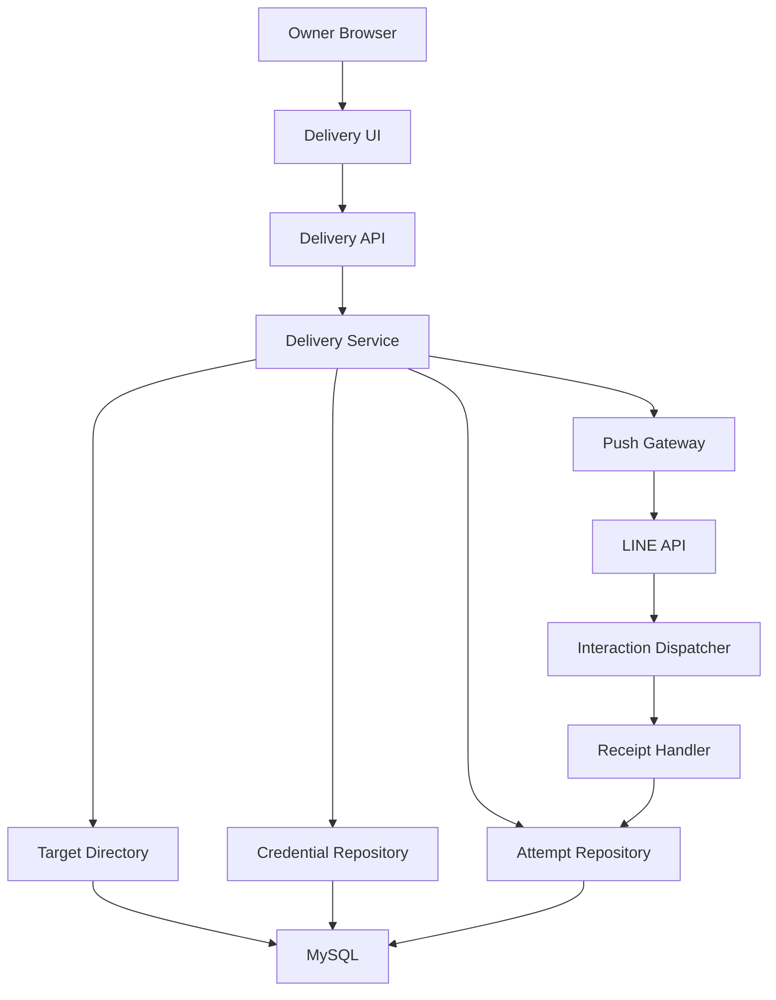
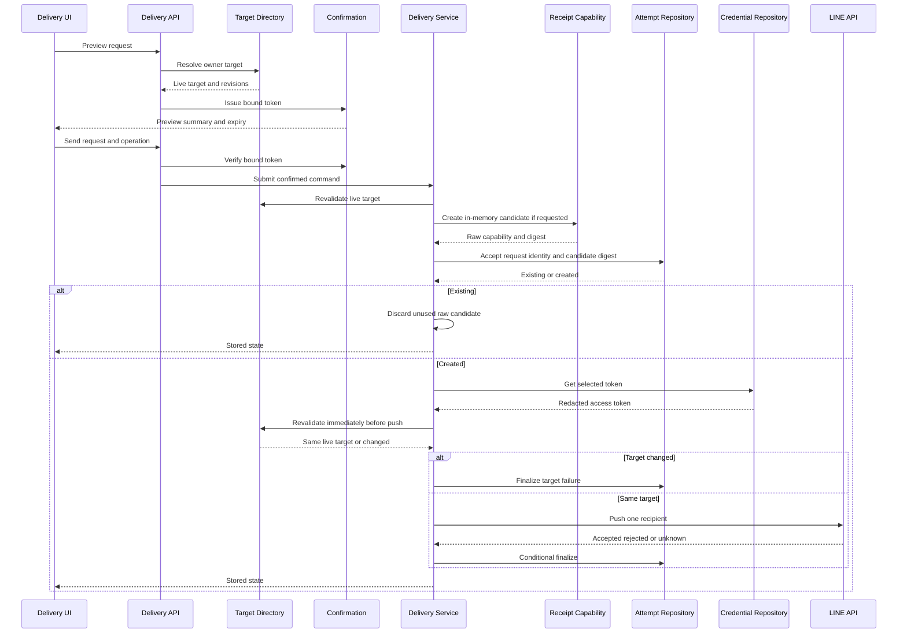
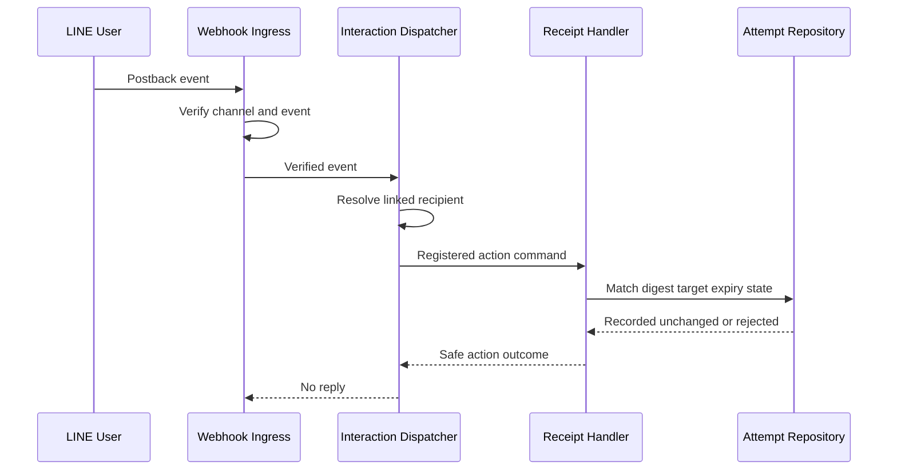
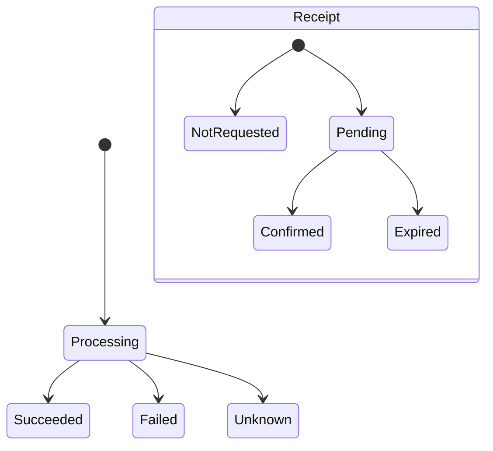
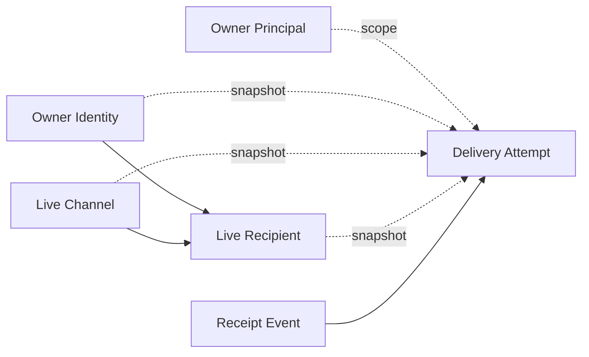

# 技術設計書: linked-recipient-delivery

## Overview

本機能は、認証済みownerが登録済みMessaging APIチャネルとチャネル別recipientを選択し、配信元・配信先・整形済み内容・受取確認有無を確認してから、一件のrecipientへ安全にpushする機能を提供する。既存の固定宛先配信が持つ入力整形、送信前確認、operation ID、二重送信防止、`processing`／`succeeded`／`failed`／`unknown`を維持し、ownerとtargetを確認・冪等性・監査の同一性へ追加する。

`delivery` appを配信aggregateの単一ownerとする。`lineaccounts`はlive target projectionとLINE subjectの安全な解決、`linechannels`は選択チャネルのredacted access token、`lineinteractions`は検証済みpostback action dispatchだけを提供する。受取確認は配信状態と独立した属性として同じDeliveryAttemptへ記録し、LINE受付を到達・表示・既読または受取確認へ昇格させない。

### Goals

- owner principal、送信時owner identity、channel、recipient、内容、受取確認optionを一つの確認済み操作とrequest identityへ結び付ける。
- 送信直前のlive target再検証と選択チャネル資格情報により、単一recipientだけへpushする。
- operation IDとrequest fingerprintで連打、HTTP再試行、並行送信を既存状態へ収束させる。
- unlink後もPIIを残さないtarget snapshot、LINE結果、任意の明示的受取確認を監査可能にする。
- 既存fixed delivery recordと確定済み状態を破壊せずmigrationする。

### Non-Goals

- 任意のLINE user ID入力、multicast、broadcast、narrowcast、予約、campaign、自動再送
- LINE端末到達、表示、既読の取得または保証
- チャネル・recipientの登録、変更、friendship同期
- 全配信を検索・列挙する履歴画面、月間利用量管理
- queue、worker、外部KMS、汎用notification frameworkの導入

## Boundary Commitments

### This Spec Owns

- owner向けchannel／recipient選択projectionと配信不可理由の公開契約
- owner principal・送信時owner identity・target・target revision・message・受取確認optionを結ぶ期限付きconfirmation
- linked recipient deliveryのrequest identity、状態機械、target snapshot、LINE結果、receipt状態
- 選択channelのaccess tokenと選択recipientのLINE subjectだけを使うpush adapter
- `delivery.received` postback capabilityの発行、digest検証、期限・target・status判定、冪等更新
- linked deliveryのFrontend入力・preview・送信・status確認状態

### Out of Boundary

- owner session、exact-origin CSRF、recipient登録・削除・enabled、friendship projectionの実装
- channel資格情報の暗号化、rotation、管理UI
- Webhook raw body、署名、destination、event ledger、source user照合、汎用action registry
- LINE user ID、access token、channel secret、暗号化値、receipt capabilityの公開
- fixed environment targetを選択肢またはfallbackとして使うこと
- receipt actionからLINEトークへreplyすること

### Allowed Dependencies

- `lineaccounts.OwnerSessionAuthentication`、検証済み`OwnerSessionContext.session.owner_slot`、`IsActiveOwner`、`ExactOriginCsrfMixin`
- `lineaccounts`のdelivery target directoryとredacted `LineSubject`
- `linechannels.CredentialRepository` とredacted `AccessToken`
- `lineinteractions.PostbackActionHandler`、`PostbackActionCommand`、静的action registration
- Django ORM／signing、DRF、LINE Bot SDK 3.25.0、React 19、TypeScript 6
- 既存のrelative `/api` protected HTTP client、MySQL 8.4

依存方向は次を強制する。

- Backend: Domain Types → Ports → Services and Adapters → Composition → HTTP
- Frontend: DTO Validation → API Adapter and State Reducer → Component → App
- ServicesとAdaptersは同じlayerのpeerであり相互importしない。Compositionだけが具体adapterをserviceへ注入する。
- `delivery` は `lineaccounts`／`linechannels`のModelを直接importしない。
- `lineinteractions` は `delivery` のModel、token、業務状態をimportしない。

### Revalidation Triggers

- recipient配信可否条件、owner principal／identity契約、provider/channel関係の変更
- 単一owner slotを別人物へ再割当てする運用、複数owner化、またはowner監査principalのライフサイクル変更
- `CredentialRepository` のresult型、redacted secret型、channel active判定の変更
- postback wire format、action名制約、`PostbackActionCommand`、event dedup保証の変更
- LINE push、retry key、text/template/postback上限またはSDK message objectの変更
- DeliveryAttemptのstatus、request fingerprint、receipt不変条件、legacy target modeの変更
- queue／worker導入、外部通信transaction方針、複数ownerまたは複数recipient deliveryへの拡張
- receipt TTL、confirmation max age、PII保持方針の変更

## Architecture

### Existing Architecture Analysis

- 現行 `delivery` はowner保護済みのpreview／send／status API、5000 UTF-16 code unitsのformatter、message-only confirmation、fixed credential gateway、operation IDとactive fingerprintによる二重送信防止を持つ。
- `DeliveryAttempt` は外部通信前に `processing` としてcommitされ、LINE callはtransaction外、終端結果は `status=processing` の条件付き更新で最初の確定結果だけを保存する。この順序を維持する。
- account unlinkはrecipientとidentityを物理削除するが、singletonのOwnerAccount rowとslotは維持する。linked deliveryはowner principal slotと非FK identity／target snapshotを保存し、unlink workflowへ監査削除責任を追加しない。
- interaction dispatcherは検証済みchannel、provider、recipient、event ID、不透明payloadだけを静的actionへ一度渡す。receipt handlerはこの下流契約だけを利用する。
- Frontendはstrict DTO parser、protected relative HTTP client、純粋reducerを持つ。新しいglobal state libraryは導入しない。

### Architecture Pattern & Boundary Map

選択したpatternは既存Django app内のPorts and Adaptersによる垂直拡張である。配信aggregateの所有を分散させず、account、credential、interactionのupstream境界をadapterとして利用する。



Key decisions:

- DeliveryServiceはlive targetをaccept直前に再解決し、CredentialRepositoryのchannel active再確認後、transaction外でPushGatewayを呼ぶ。
- ReceiptHandlerはdelivery statusを変更せず、receipt列だけを条件付き更新する。
- LINE subjectとreceipt capabilityの生値は外部call境界を越えて永続化・serializeしない。

### Technology Stack

| Layer | Choice / Version | Role in Feature | Notes |
|-------|------------------|-----------------|-------|
| Frontend | React 19.2.7 / TypeScript 6.0.3 | target選択、preview、status、receipt表示 | strict mode、`any`禁止 |
| HTTP | Django REST Framework 3.17.1 | owner向けAPIとsafe error envelope | session + exact-origin CSRF |
| Backend | Python 3.14 / Django 6.0.7 | confirmation、配信状態、receipt handler | 型注釈とimmutable dataclass |
| Data | MySQL 8.4 | attempt、snapshot、idempotency、receipt CAS | `utf8mb4`、非FK監査snapshot |
| LINE | line-bot-sdk 3.25.0 | text + optional Buttons template push | SDK/HTTP retry無効 |
| Webhook | 既存lineinteractions | 検証済みpostback dispatch | 新規action一件だけ登録 |

新しい外部依存は追加しない。Django signing、Python `secrets`／`hashlib`、既存LINE SDKを採用する。

## File Structure Plan

### Directory Structure

```text
backend/
├── delivery/
│   ├── types.py                         # 配信command、result、snapshot、errorのimmutable domain型
│   ├── models.py                        # DeliveryAttemptの永続状態とDB不変条件
│   ├── repositories.py                  # attempt accept、owner scoped status、終端CAS、receipt CAS
│   ├── confirmation.py                  # 期限付きpreview snapshotの発行と検証
│   ├── formatters.py                    # 既存text整形とUTF-16上限
│   ├── services.py                      # target再検証、冪等accept、外部call、結果確定
│   ├── gateway.py                       # typed single recipient LINE push adapter
│   ├── receipt.py                       # capability発行とdelivery.received action handler
│   ├── container.py                     # directory、credential、repository、gatewayの依存合成
│   ├── serializers.py                   # target IDs、receipt option、preview/send request検証
│   ├── views.py                         # owner向けtarget、preview、send、status HTTP契約
│   ├── urls.py                          # deliveries配下のresource routing
│   └── migrations/
│       └── 0002_linked_recipient_delivery.py
├── lineaccounts/
│   └── delivery_repositories.py         # owner scoped live target projection adapter
└── linewebhooks/
    └── container.py                     # production action registration

frontend/
├── src/
│   ├── deliveryDto.ts                   # exact response validationと公開DTO
│   ├── deliveryApi.ts                   # target、preview、send、status client
│   ├── deliveryState.ts                 # targetを含む純粋状態機械
│   ├── DeliveryForm.tsx                 # 選択、不可理由、preview、結果、receipt表示
│   └── style.css                        # disabled targetとsummary panelの表示
└── test/
    ├── delivery.test.ts
    ├── deliveryApi.test.ts
    └── DeliveryForm.test.tsx
```

Backend testは既存 `backend/delivery/tests/` を責務別packageとして維持し、`test_targets.py`、`test_confirmation.py`、`test_receipt.py`、`test_migration.py`、`test_security.py`を追加する。既存 `test_api.py`、`test_services.py`、`test_gateway.py`、`test_models.py`、`test_concurrency.py`は公開契約変更に合わせて更新する。`backend/lineaccounts/tests/test_delivery_repositories.py` と `backend/linewebhooks/tests/test_container.py` がupstream adapterとaction登録を検証する。

### New Files

- `backend/delivery/types.py` — 配信domainのimmutable command、result、snapshot、error union
- `backend/delivery/repositories.py` — DeliveryAttemptのaccept、owner scoped lookup、terminal／receipt CAS
- `backend/delivery/receipt.py` — receipt capability factoryと`delivery.received` handler
- `backend/delivery/container.py` — concrete adapterをdomain serviceへ注入するcomposition root
- `backend/delivery/migrations/0002_linked_recipient_delivery.py` — legacy保持を伴うschema／data migration
- `backend/lineaccounts/delivery_repositories.py` — owner scoped target projectionのaccount adapter
- `backend/delivery/tests/test_targets.py`、`test_confirmation.py`、`test_receipt.py`、`test_migration.py`、`test_security.py` — 新規境界の責務別検証
- `backend/lineaccounts/tests/test_delivery_repositories.py` — account adapterのownership、provider、query budget検証

### Modified Files

- `backend/delivery/models.py` — linked target snapshot、request fingerprint、receipt属性と制約を追加
- `backend/delivery/services.py` — direct ORMとfixed gateway依存をports経由の配信orchestrationへ置換
- `backend/delivery/confirmation.py` — message-only無期限tokenをowner/target/option込み期限付きtokenへ拡張
- `backend/delivery/gateway.py` —settings固定値を廃止し、typed access token／subject／message objectsを受け取る
- `backend/delivery/serializers.py` —canonical UUID、strict boolean、targetとreceipt optionを追加
- `backend/delivery/views.py` —target endpoints、owner scoped status、safe classification、target summaryを追加
- `backend/delivery/urls.py` —channel／recipient一覧routeを追加
- `backend/linewebhooks/container.py` —`delivery.received` handlerを既存静的registryへ明示登録
- `frontend/src/deliveryDto.ts` —target、preview、status、receiptのexact parserを追加
- `frontend/src/deliveryApi.ts` —GET targetと拡張POST DTOを追加
- `frontend/src/deliveryState.ts` —5つの編集軸、recipient reset、confirmation invalidationを追加
- `frontend/src/DeliveryForm.tsx` —target選択、不可理由、receipt checkbox、source/recipient previewを追加
- `frontend/src/style.css` —target stateとpreview/status summaryの視覚区別を追加

`frontend/src/App.tsx` と `frontend/src/httpApi.ts` は既存auth gateとprotected clientをそのまま再利用する。固定env値は新gatewayから参照しない。`LINE_USER_ID` をowner allowlist移行補助が参照する間はenv key自体の削除を本仕様へ含めず、配信fallbackだけを禁止する。

Componentと主owner fileの対応は次のとおりである。

| Component | Primary File | Supporting Files |
|-----------|--------------|------------------|
| DeliveryTargetDirectory | `backend/lineaccounts/delivery_repositories.py` | `backend/delivery/container.py` |
| ConfirmationService | `backend/delivery/confirmation.py` | `backend/delivery/types.py` |
| AttemptRepository | `backend/delivery/repositories.py` | `backend/delivery/models.py` |
| DeliveryService | `backend/delivery/services.py` | `backend/delivery/container.py`, `backend/delivery/types.py` |
| ChannelPushGateway | `backend/delivery/gateway.py` | `backend/delivery/types.py` |
| ReceiptHandler | `backend/delivery/receipt.py` | `backend/linewebhooks/container.py` |
| DeliveryAPI | `backend/delivery/views.py` | `backend/delivery/serializers.py`, `backend/delivery/urls.py` |
| DeliveryState | `frontend/src/deliveryState.ts` | `frontend/src/deliveryDto.ts` |
| DeliveryForm | `frontend/src/DeliveryForm.tsx` | `frontend/src/deliveryApi.ts`, `frontend/src/style.css` |

## System Flows

### Preview and Send



Previewとsendは別owner操作である。send requestの全入力をconfirmationへ再照合した後でも、Serviceはaccept用live targetを解決し、資格情報取得後かつpush直前に同じrevisionを再確認する。receipt candidateはaccept前にmemory上だけで生成し、digestは新規attempt作成と同じtransactionで保存する。既存operationまたはactive fingerprint競合ではraw candidateを直ちに破棄し、LINEへ渡さない。target不一致、state change、credential unavailableではLINEを呼ばず、別channelやfixed settingへ切り替えない。

### Receipt Confirmation



同一 `webhookEventId` はingress ledger、同一deliveryへの別eventはreceipt CASで収束する。recipientがdisabledまたは`not_friend`へ変化しても関係が残れば記録でき、unlink／delete済みならdispatcherがhandlerへ渡さない。

### Orthogonal State



Delivery statusとreceipt statusは直交する。receipt更新はdelivery status、LINE request ID、accepted request ID、completed timestampを変更しない。

## Requirements Traceability

| Requirement | Summary | Components | Interfaces | Flows |
|-------------|---------|------------|------------|-------|
| 1.1, 1.2, 1.3, 1.4, 1.5 | active owner限定、CSRF、所有・provider非開示 | Delivery API, Target Directory | OwnerProtectedAPIView, TargetDirectory | Preview and Send |
| 2.1, 2.2, 2.3, 2.4, 2.5, 2.6, 2.7, 2.8 | 安全なchannel／recipient選択と不可理由 | Target Directory, Delivery UI | Target list APIs, Target DTO | Preview and Send |
| 3.1, 3.2, 3.3, 3.4, 3.5, 3.6, 3.7 | 件名・本文・receipt option検証 | Formatter, Delivery API, Delivery State | PreviewRequest, MessageFormatter | Preview and Send |
| 4.1, 4.2, 4.3, 4.4, 4.5, 4.6, 4.7, 4.8 | owner・target・内容を結ぶ期限付きpreview | Confirmation, Delivery State, Delivery UI | ConfirmationSnapshot, Preview API | Preview and Send |
| 5.1, 5.2, 5.3, 5.4, 5.5, 5.6, 5.7, 5.8 | 直前再検証と一件push | Delivery Service, Credential Repository, Push Gateway | SubmitCommand, PushCommand | Preview and Send |
| 6.1, 6.2, 6.3, 6.4, 6.5, 6.6 | target込み冪等性、並行抑止、first terminal | Attempt Repository, Delivery Service | RequestFingerprint, DeliverySubmission | Preview and Send |
| 7.1, 7.2, 7.3, 7.4, 7.5, 7.6, 7.7, 7.8, 7.9, 7.10, 7.11 | immutable snapshot、結果、owner scoped status、legacy保持 | DeliveryAttempt, Attempt Repository, Delivery API | Status API, DeliverySnapshot | Orthogonal State |
| 8.1, 8.2, 8.3, 8.4, 8.5, 8.6, 8.7, 8.8, 8.9, 8.10, 8.11 | 明示的receipt capabilityと冪等記録 | Receipt Handler, Attempt Repository, Webhook Composition | PostbackActionHandler, ReceiptStatus | Receipt Confirmation |
| 9.1, 9.2, 9.3, 9.4, 9.5, 9.6, 9.7 | safe分類、unknown導線、秘密・PII非露出 | Delivery API, Push Gateway, Delivery UI, Receipt Handler | SafeError, typed gateway results | 全flow |

## Components and Interfaces

| Component | Domain/Layer | Intent | Req Coverage | Key Dependencies | Contracts |
|-----------|--------------|--------|--------------|------------------|-----------|
| DeliveryTargetDirectory | Account Adapter | owner scoped live targetを安全に投影・解決する | 1.4, 1.5, 2.1, 2.2, 2.3, 2.4, 2.5, 2.6, 2.7, 2.8, 4.6, 5.1, 5.2, 5.3, 5.4 | Owner identity P0, LineChannel P0 | Service |
| ConfirmationService | Delivery Domain | preview snapshotを期限付きで結ぶ | 3.2, 3.3, 3.4, 3.5, 3.6, 3.7, 4.1, 4.2, 4.3, 4.4, 4.5, 4.6, 4.7, 4.8 | Django signing P0 | Service |
| AttemptRepository | Delivery Persistence | request accept、owner status、terminal／receipt CASを所有する | 6.1, 6.2, 6.3, 6.4, 6.5, 6.6, 7.1, 7.2, 7.3, 7.4, 7.5, 7.6, 7.7, 7.8, 7.9, 7.10, 8.2, 8.3, 8.4, 8.5, 8.6, 8.7, 8.8, 8.9, 8.10 | MySQL P0 | Service, State |
| DeliveryService | Delivery Application | 再検証、credential取得、push、結果確定をorchestrateする | 5.1, 5.2, 5.3, 5.4, 5.5, 5.6, 5.7, 5.8, 6.1, 6.2, 6.3, 6.4, 6.5, 6.6, 7.1, 7.2, 7.3, 7.4, 7.5, 7.6, 7.7, 7.8, 7.9, 9.1, 9.2, 9.3, 9.4, 9.5, 9.6 | Target P0, Attempt P0, Credential P0, Gateway P0 | Service |
| ChannelPushGateway | LINE Adapter | 一つの選択subjectへ一つのpush requestを送る | 5.2, 5.5, 5.6, 5.7, 5.8, 7.3, 7.4, 7.5, 9.1, 9.5, 9.6 | LINE API P0 | Service |
| ReceiptHandler | Delivery Application | 検証済みpostbackを一つのattemptのreceiptへ収束させる | 8.1, 8.2, 8.3, 8.4, 8.5, 8.6, 8.7, 8.8, 8.9, 8.10, 8.11, 9.1, 9.5, 9.6 | Interaction P0, Attempt P0 | Service, Event |
| DeliveryAPI | HTTP | owner向けtarget、preview、send、status契約を公開する | 1.1, 1.2, 1.3, 1.4, 1.5, 2.1, 2.2, 2.3, 2.4, 2.5, 2.6, 2.7, 2.8, 3.1, 3.2, 3.3, 3.4, 3.5, 3.6, 3.7, 4.1, 4.2, 4.3, 4.4, 4.5, 4.6, 4.7, 4.8, 7.6, 7.7, 7.8, 7.9, 7.10, 7.11, 9.1, 9.2, 9.3, 9.4, 9.5, 9.6, 9.7 | Protected view P0 | API |
| DeliveryState | Frontend State | input、confirmation、operation、status遷移を純粋に管理する | 2.4, 2.5, 3.1, 3.2, 3.3, 3.4, 3.5, 3.6, 3.7, 4.2, 4.4, 4.5, 4.6, 4.7, 9.2, 9.3, 9.4 | DTO P0 | State |
| DeliveryForm | Frontend UI | 安全な選択、preview、結果、receiptを表示する | 2.1, 2.2, 2.3, 2.4, 2.5, 2.6, 2.7, 2.8, 3.1, 3.2, 3.3, 3.4, 3.5, 3.6, 4.1, 4.2, 4.7, 7.6, 7.9, 8.1, 9.2, 9.3, 9.4, 9.5 | State P0, API P0 | State |

### Account Integration

#### DeliveryTargetDirectory

| Field | Detail |
|-------|--------|
| Intent | owner identityに属するchannelとrecipientだけをlive projectionとして返す |
| Requirements | 1.4, 1.5, 2.1, 2.2, 2.3, 2.4, 2.6, 2.7, 2.8, 4.6, 5.1, 5.3, 5.4 |

**Responsibilities & Constraints**

- active owner identityと同じproviderに属する登録済みchannelを返す。
- recipient解決はowner identity、channel ID、recipient ID、provider関係を一つのquery条件で照合する。
- listはinactive、disabled、`not_friend`、`unknown`を除外せず、理由付きsafe summaryとして返す。
- send用resultだけがredacted `LineSubject` を持つ。API projectionはLINE subjectを持たない。
- channel／recipient update versionを返し、confirmation stale判定へ使う。

**Dependencies**

- Inbound: DeliveryService — listとresolveの利用 (P0)
- Outbound: OwnerAccount／LineIdentity／DeliveryRecipient — owner関係とrecipient状態 (P0)
- Outbound: LineChannel — provider、label、active、version (P0)

**Contracts**: Service [x] / API [ ] / Event [ ] / Batch [ ] / State [ ]

```python
class DeliveryTargetDirectory(Protocol):
    def list_channels(
        self, owner_identity_id: UUID
    ) -> tuple[DeliveryChannelChoice, ...]: ...

    def list_recipients(
        self, owner_identity_id: UUID, channel_id: UUID
    ) -> tuple[DeliveryRecipientChoice, ...] | TargetUnavailable: ...

    def resolve(
        self,
        owner_identity_id: UUID,
        channel_id: UUID,
        recipient_id: UUID,
    ) -> LiveDeliveryTarget | TargetUnavailable: ...
```

- Preconditions: UUIDはserializerまたはtyped callerで検証済み。
- Postconditions: `LiveDeliveryTarget` はowner/provider/channel/recipientが一致する。
- Invariants: `delivery_available` はchannel active、recipient enabled、friendship `friend`の論理積である。

**Implementation Notes**

- Integration: `lineaccounts/delivery_repositories.py` がModel joinを閉じ込める。
- Validation: owner mismatchと存在しないIDを同じ結果型へ縮約する。
- Risks: list queryのN+1を禁止し、固定query budgetをtestする。

**Target Revision Contract**

- revisionはversion prefix `v1`、owner identity UUID、channel UUID、provider ID、active、channel `updated_at`、recipient UUID、enabled、friendship state、recipient `updated_at`を長さprefix付きcanonical encodingで結合したSHA-256 digestとする。
- datetimeはUTCの固定microsecond表現へ正規化する。delivery availabilityまたはpreview source labelへ影響する既存mutationは対応rowの`updated_at`を必ず更新する。
- channel／recipient状態が一度変わって元へ戻っても`updated_at`差で古いconfirmationを拒否する。credential ciphertextだけのrotationやidentity display name更新はtarget revisionへ含めない。
- directoryはpreview、confirmation expected snapshot、accept前、push直前のすべてで同じrevision builderを使用し、各境界で独自digestを再実装しない。

### Delivery Domain and Persistence

#### ConfirmationService

| Field | Detail |
|-------|--------|
| Intent | ownerが確認したtarget、target revision、message、receipt optionを期限付きtokenへ結ぶ |
| Requirements | 3.2, 3.3, 3.4, 3.5, 3.6, 3.7, 4.1, 4.2, 4.3, 4.4, 4.5, 4.6, 4.8, 8.1 |

**Responsibilities & Constraints**

- subject/bodyの生値、display name、LINE subjectをsigned payloadへ入れない。
- payloadはversion、owner principal slot、送信時owner identity UUID、channel UUID、recipient UUID、target revision digest、message fingerprint、receipt requested、receipt expiryを持つ。
- max ageは10分、receipt expiryはpreview時刻から24時間を既定とし、clockを注入可能にする。
- send時にrequestから再生成したsnapshotと完全一致を要求する。

**Dependencies**

- Inbound: DeliveryAPI — issue／verify (P0)
- Outbound: Django signing — tamperとtimestamp検証 (P0)
- Outbound: Formatter — message fingerprint (P0)

**Contracts**: Service [x] / API [ ] / Event [ ] / Batch [ ] / State [ ]

```python
class ConfirmationService:
    def issue(
        self, snapshot: ConfirmationSnapshot
    ) -> IssuedConfirmation: ...

    def verify(
        self,
        token: str,
        expected: ConfirmationSnapshot,
    ) -> ConfirmationVerified | ConfirmationRejected: ...
```

- Preconditions: targetはpreview時点でdeliverable、messageはformatter検証済み。
- Postconditions: verified resultはtoken発行時と同じowner／target／message／optionを表す。
- Invariants: tokenは発行時と同じowner principalかつ同じactive identity以外で使用できない。unlink後の再連携ではidentity UUIDが変わるため、古いconfirmationは再利用できない。

#### AttemptRepository

| Field | Detail |
|-------|--------|
| Intent | DeliveryAttemptの整合性、冪等accept、状態照会、delivery／receiptの条件付き更新を所有する |
| Requirements | 6.1, 6.2, 6.3, 6.4, 6.6, 7.1, 7.2, 7.3, 7.4, 7.5, 7.6, 7.7, 7.8, 7.10, 8.2, 8.3, 8.4, 8.5, 8.6, 8.7, 8.8, 8.9, 8.10 |

**Responsibilities & Constraints**

- `(operation_id, request_fingerprint)` の一致は既存状態、operation IDの別fingerprint利用はconflictを返す。
- `active_request_fingerprint` のunique constraintで同じowner／target／message／optionの並行processingを一つにする。別operation IDで同じactive fingerprintへ競合したrequestも、作成済みattemptを再読込してcanonical operation IDと同じprocessing stateを返す。
- owner status lookupは、認証済みsessionから得た `owner_principal_slot` とoperation IDを同時条件にし、別principalへ存在を開示しない。`owner_identity_public_id` は送信時監査snapshotであり、照会認可キーにしない。
- receipt requestedのaccept commandはcandidate digestとexpiryを持つ。新規rowではattempt作成と同じtransactionで保存し、既存operationまたはactive fingerprint競合ではDBへ保存しない。
- `ReceiptCommitment` はdigestとexpiryだけを持ち、`AcceptedDeliveryCommand.receipt_commitment` はreceipt未要求時にnullとする。raw capabilityはrepository contractを越えない。
- finalizeは `status=processing` の行だけを更新し、first terminalを維持する。
- receipt更新はdigest、expiry、channel、recipient、receipt requested、statusを照合し、`confirmed_at IS NULL` の行だけを更新する。
- live FKを持たず、unlink後もsnapshotを保持する。

**Dependencies**

- Inbound: DeliveryService — accept／finalize／status (P0)
- Inbound: ReceiptHandler — receipt CAS (P0)
- Outbound: DeliveryAttempt／MySQL — transactionとunique constraint (P0)

**Contracts**: Service [x] / API [ ] / Event [ ] / Batch [ ] / State [x]

```python
class AttemptRepository(Protocol):
    def accept(
        self, command: AcceptedDeliveryCommand
    ) -> AttemptAccepted | ExistingAttempt | AttemptConflict: ...

    def finalize(
        self,
        attempt_id: int,
        result: LinePushResult,
        completed_at: datetime,
    ) -> DeliverySnapshot: ...

    def get_for_owner(
        self, owner_principal_slot: int, operation_id: UUID
    ) -> DeliverySnapshot | None: ...

    def confirm_receipt(
        self, command: ConfirmReceiptCommand
    ) -> ReceiptRecorded | ReceiptUnchanged | ReceiptRejected: ...
```

- Preconditions: `accept` commandはlive target再検証済み。
- Postconditions: external call前にattemptがcommitされる。receipt requestedの新規attemptはdigest／expiryも同じcommitで完全になる。operation ID一致またはactive fingerprint競合は既存attemptを返し、candidate digestを保存しない。終端更新はreceipt列を変更しない。
- Invariants: terminal statusは再び変更されない。初回receipt日時とevent IDは上書きされない。

**State Management**

- Delivery: `processing → succeeded | failed | unknown`
- Receipt: `not_requested` または `pending → confirmed`。期限超過はquery時にderived `expired` とする。
- Concurrency: operation unique、active request unique、status CAS、receipt null CASを組み合わせる。

#### DeliveryService

| Field | Detail |
|-------|--------|
| Intent | 確認済みcommandをlive targetへ一度だけpushし、保存済み結果へ収束させる |
| Requirements | 5.1, 5.2, 5.3, 5.4, 5.5, 5.6, 5.7, 5.8, 6.1, 6.2, 6.3, 6.4, 6.5, 6.6, 7.1, 7.2, 7.3, 7.4, 7.5, 7.6, 7.7, 7.8, 7.9, 9.1, 9.2, 9.5, 9.6 |

**Responsibilities & Constraints**

- confirmation後のowner／targetをlive directoryで再解決し、revisionとdeliverabilityを確認してattemptをacceptする。
- versioned request fingerprintをowner principal、送信時owner identity、channel、recipient、message fingerprint、receipt optionから作る。receipt expiryとcapabilityはidentityへ含めない。
- receipt requestedでは256-bit random candidateをaccept前にmemory上で生成し、digestとexpiryだけを`AcceptedDeliveryCommand`へ渡す。`AttemptAccepted`の場合だけraw capabilityをpush commandへ移し、`ExistingAttempt`／`AttemptConflict`ではraw値を破棄する。
- candidate generationは外部作用ではない。永続的なcapability発行は新規attemptのdigest commitをもって成立し、既存attemptには追加attemptも外部callも行わない。
- active fingerprint競合で別operation IDが提示された場合は、既存attemptのcanonical operation IDと状態を返し、追加attemptも外部callも作成しない。
- access token取得失敗をconfiguration failureとしてfinalizeし、別資格情報へfallbackしない。
- access token取得後、gateway callの直前にtargetをもう一度解決し、accept時と同じrevision／deliverabilityでなければtarget changed failureへfinalizeしてLINEを呼ばない。
- LINE callをDB transaction外で実行し、client retryを無効にする。
- 5xx、timeout、connection interruption、unparseable responseを `unknown` とする。

**Dependencies**

- Inbound: DeliveryAPI — submit／status (P0)
- Outbound: DeliveryTargetDirectory — live resolve (P0)
- Outbound: AttemptRepository — idempotencyと状態 (P0)
- Outbound: CredentialRepository — selected access token (P0)
- Outbound: ChannelPushGateway — external push (P0)
- Outbound: ReceiptCapabilityFactory — opaque action (P1)

**Contracts**: Service [x] / API [ ] / Event [ ] / Batch [ ] / State [ ]

```python
class DeliveryService:
    def submit(
        self, command: SubmitLinkedDelivery
    ) -> DeliverySubmission: ...

    def check_status(
        self,
        owner_principal_slot: int,
        operation_id: UUID,
    ) -> DeliverySnapshot | None: ...
```

- Preconditions: APIでconfirmation verified。Serviceはaccept前とgateway call直前にlive targetを再検証する。
- Postconditions: new attemptは保存したdigestに対応するraw capabilityだけを使って一回だけgatewayを呼び、既存attemptはcandidateを破棄して保存状態だけを返す。
- Invariants:一つのcommandは一つのchannel、一つのrecipient、一つのpush requestだけを表す。

### LINE Integration

#### ChannelPushGateway

| Field | Detail |
|-------|--------|
| Intent | typed secretとrecipientを一回のLINE push requestへ変換し、安全な結果型を返す |
| Requirements | 5.2, 5.5, 5.6, 5.7, 5.8, 7.3, 7.4, 7.5, 7.9, 9.1, 9.5, 9.6 |

**Responsibilities & Constraints**

- `to` はcommandのredacted `LineSubject` 一件だけから取得する。
- messagesはtext一件、receiptありの場合だけButtons template一件を追加する。
- `X-Line-Retry-Key` はoperation UUID。access tokenはselected channelのrepository resultだけを使う。
- 200とaccepted-request-id付き409をacceptedへmapする。
- 400、401、403、413、429とその他明示4xxを安全なrejected分類へmapする。
- 5xx、timeout、connection error、response decode errorをunknownへmapする。
- response body、token、subjectを例外、result、logへ含めない。

**Dependencies**

- Inbound: DeliveryService — PushCommand (P0)
- External: LINE Messaging API — push endpoint (P0)
- External: line-bot-sdk 3.25.0 — request model (P1)

**Contracts**: Service [x] / API [ ] / Event [ ] / Batch [ ] / State [ ]

```python
class ChannelPushGateway(Protocol):
    def push(
        self, command: PushLinkedRecipientCommand
    ) -> LinePushAccepted | LinePushRejected | LinePushUnknown: ...
```

- Preconditions: commandは一つのAccessToken、一つのLineSubject、検証済みtextを持つ。
- Postconditions: HTTP callは最大一回で、SDK retryは0。
- Invariants: receiptなしのcommandへaction messageを追加しない。

### Webhook Integration

#### ReceiptHandler

| Field | Detail |
|-------|--------|
| Intent | `delivery.received` actionを対応する一件のattemptの明示的receiptへ変換する |
| Requirements | 8.1, 8.2, 8.3, 8.4, 8.5, 8.6, 8.7, 8.8, 8.9, 8.10, 8.11, 9.1, 9.5, 9.6 |

**Responsibilities & Constraints**

- `OpaqueActionPayload` の生値をhash化し、値自体を保存・表示・logしない。
- verified commandのchannel public IDとrecipient public IDをattempt snapshotへ照合する。
- expiry内かつreceipt requested、statusが `processing|succeeded|unknown` のときだけ記録する。
- `failed`、token不一致、期限切れ、target不一致は状態を変えずrejectedへ縮約する。
- `confirmed_at` とverified `webhook_event_id` は初回だけ保存する。
- handlerはreplyを開始しない。

**Dependencies**

- Inbound: StaticPostbackActionRegistry — verified action command (P0)
- Outbound: AttemptRepository — digest lookupとreceipt CAS (P0)
- Outbound: clock／SHA-256 — expiryとcapability照合 (P1)

**Contracts**: Service [x] / API [ ] / Event [x] / Batch [ ] / State [ ]

```python
class ReceiptHandler(PostbackActionHandler):
    def handle(
        self, command: PostbackActionCommand
    ) -> ActionSucceeded | ActionNoChange | ActionRejected | ActionFailed: ...
```

**Event Contract**

- Trigger: action name `delivery.received`
- Wire data: `v1:delivery.received:<opaque capability>`
- Input guarantee: webhook署名、destination、source user、provider、linked recipient、event dedupはupstream検証済み
- Idempotency: same eventはingress ledger、same attemptはreceipt CAS
- Reply: none

### HTTP and Frontend

#### DeliveryAPI

| Field | Detail |
|-------|--------|
| Intent | owner向けsafe DTOだけでtarget、preview、send、statusを公開する |
| Requirements | 1.1, 1.2, 1.3, 1.4, 1.5, 2.1, 2.2, 2.3, 2.4, 2.5, 2.6, 2.7, 2.8, 3.1, 3.2, 3.3, 3.4, 3.5, 3.6, 3.7, 4.1, 4.2, 4.3, 4.4, 4.5, 4.6, 4.7, 4.8, 7.6, 7.7, 7.9, 7.10, 7.11, 9.1, 9.2, 9.3, 9.4, 9.5, 9.6, 9.7 |

**Contracts**: Service [ ] / API [x] / Event [ ] / Batch [ ] / State [ ]

| Method | Endpoint | Request | Response | Errors |
|--------|----------|---------|----------|--------|
| GET | `/api/deliveries/targets/channels/` | none | `{items: DeliveryChannelChoice[]}` | 401, 503 |
| GET | `/api/deliveries/targets/channels/{channelId}/recipients/` | none | `{items: DeliveryRecipientChoice[]}` | 400, 401, 404, 503 |
| POST | `/api/deliveries/preview/` | `PreviewRequest` | `PreviewResponse` | 400, 401, 403, 404, 409 |
| POST | `/api/deliveries/` | `SendRequest` | `DeliveryStatus` | 400, 401, 403, 404, 409 |
| POST | `/api/deliveries/{operationId}/status/` | empty | `DeliveryStatus` | 400, 401, 403, 404 |

`PreviewRequest` は `channelId`、`recipientId`、`subject`、`body`、`receiptRequested` を持つ。`SendRequest` は同じfieldに `operationId` と `confirmationToken` を加える。余剰field、非canonical UUID、非boolean receipt option、非string textを拒否する。

`PreviewResponse` はchannel label／ID、recipient display name／ID、friendship state、formatted text、receipt requested、receipt expiryまたはnull、confirmation tokenを返す。`DeliveryStatus` は送信時snapshot、delivery status、accepted／completed timestamps、安全なLINE request ID、receipt requested／pending／confirmed／expiredを返し、display name、LINE subject、secret、capabilityを返さない。

#### DeliveryState and DeliveryForm

summary-only component。`EditingInput` は `channelId | null`、`recipientId | null`、`subject`、`body`、`receiptRequested`を持つ。channel変更はrecipientをnullへ戻す。5つの入力軸の変更はいずれもpreview stateからeditingへ戻し、confirmation tokenをstateから除去する。previewから戻る操作は値を変更せずeditingへ移る。

processing／submitting中はtargetとsend操作を無効にする。network errorは既存operationのstatus確認だけを案内し、status 404が確認されるまで同一operationの明示再requestも表示しない。`succeeded` の見出しは「LINEに受け付けられました」を維持し、到達・既読表現を使わない。receiptはdelivery statusと別行で表示する。

## Data Models

### Domain Model

- **DeliveryAttempt aggregate root**: operation identity、owner principal、送信時owner identity snapshot、target snapshot、message、delivery status、LINE IDs、receipt stateを所有する。
- **LiveDeliveryTarget value**: owner/provider/channel/recipient一致、deliverability、revisions、redacted subjectを表す。永続化しない。
- **ConfirmationSnapshot value**: previewとsendを比較するPII-free snapshot。
- **TargetRevision value**: owner identity、channel/provider/state/version、recipient/state/versionのcanonical `v1` SHA-256。
- **RequestFingerprint value**: owner principal、送信時owner identity、channel、recipient、message fingerprint、receipt optionのversioned SHA-256。
- **ReceiptCommitment value**: attempt insertへ渡すdigestとexpiry。raw capabilityを持たない。
- **ReceiptCapabilityCandidate value**: accept前のmemory上だけに存在するrandom生値とdigestを持つ。digestは新規attemptと原子的に保存し、生値はその新規attemptのLINE requestへだけ渡す。

Business invariants:

- linked attemptはowner principal、送信時owner identity、channel、recipient、送信時target stateを必ず持つ。
- fixed legacy attemptはlinked snapshotを要求せず既存statusを保持する。
- `processing` だけがterminalへ遷移できる。
- `active_request_fingerprint` はprocessing時だけ非null。
- receipt confirmedはreceipt requestedかつ初回event一件だけである。
- receipt updateはdelivery statusとLINE IDsを変更しない。

### Logical Data Model



点線関係はprincipal／UUID snapshotでありFKではない。Live entity削除はDeliveryAttemptをcascadeしない。

### Physical Data Model

`delivery_deliveryattempt` は既存列を保持し、次を変更する。

| Field | Type | Null | Constraint / Purpose |
|-------|------|------|----------------------|
| `request_fingerprint` | char 64 | no | 旧content fingerprintをrename、request同一性 |
| `active_request_fingerprint` | char 64 | yes | unique、processing中だけ非null |
| `owner_principal_slot` | smallint | no | singleton ownerの安定した認可scope、legacyは1へbackfill |
| `owner_identity_public_id` | UUID | legacy only | linked mode必須、送信時identity snapshot |
| `channel_public_id` | UUID | legacy only | linked target snapshot |
| `channel_label_snapshot` | varchar 255 | legacy only | 送信時運用名、PIIではない |
| `recipient_public_id` | UUID | legacy only | linked target snapshot |
| `channel_active_snapshot` | boolean | legacy only | 送信時state |
| `recipient_enabled_snapshot` | boolean | legacy only | 送信時state |
| `friendship_state_snapshot` | varchar 16 | legacy only | friend／not_friend／unknown |
| `receipt_requested` | boolean | no | default false |
| `receipt_expires_at` | datetime | yes | requested時必須 |
| `receipt_token_digest` | char 64 | yes | unique、requested時必須 |
| `receipt_confirmed_at` | datetime | yes | 初回receipt |
| `receipt_webhook_event_id` | varchar 26 | yes | 初回verified event ID |

Indexes:

- existing unique `operation_id`
- unique nullable `active_request_fingerprint`
- composite `(owner_principal_slot, operation_id)` for owner status lookup
- unique nullable `receipt_token_digest`

Check constraints:

- `target_mode` は `fixed_user | linked_recipient`
- linked modeはowner principal／identity、channel、recipientと3つのstate snapshotが非null
- processing／terminalの既存時刻・failure・active fingerprint整合性
- receipt falseはexpiry、digest、confirmed fieldsがnull
- receipt trueはexpiryとdigestが非null
- `receipt_confirmed_at` と `receipt_webhook_event_id` は両方nullまたは両方非null

`owner_principal_slot` はclient入力から受け取らず、`OwnerSessionAuthentication`が返す検証済み`OwnerSessionContext.session.owner_slot`から取得する。現行の単一owner境界ではslot 1がunlink後も残るため、同一ownerが再連携して新しいidentity UUIDになっても過去attemptを照会できる。owner適格条件を別人物へ変更してslotを再割当てする運用は本仕様外であり、実施前に過去監査の認可・隔離・移管方針を再設計する。

display name、LINE subject、access token、channel secret、receipt capability生値、LINE生responseは保存しない。

### Data Contracts & Integration

- JSON field名はcamelCase、status／reasonは閉じたstring unionとしてFrontendでruntime検証する。
- unavailable reasonは `channel_inactive | recipient_disabled | not_friend | friendship_unknown | no_deliverable_recipient` のみ公開する。
- existence／ownership／provider mismatchは詳細reasonを公開せず `target_not_available` にする。
- receipt eventは既存 `PostbackActionCommand` をversion変更せず利用する。delivery固有schemaはopaque payload内部に漏らさない。

## Error Handling

### Error Strategy

- HTTP boundaryでsyntax、型、unknown field、message lengthをfail fastする。
- ownershipと存在は同じ404 safe error、既知のowner target state変化は409 safe reasonへ分ける。
- 外部LINE resultはtyped unionへ縮約し、生exception／bodyをserviceとAPIへ渡さない。
- 結果不明は成功・失敗へ推測せず `unknown`、状態確認導線だけを返す。
- receipt action failureは既存action outcomeへ縮約し、Webhook 2xx契約とsafe auditを維持する。

### Error Categories and Responses

| Category | Code / State | HTTP / Outcome | Owner Action |
|----------|--------------|----------------|--------------|
| session | `authentication_required` | 401 | 再認証 |
| intent | `csrf_failed` | 403 | 正規originから再操作 |
| input | `validation_error` | 400 | field修正 |
| hidden target | `target_not_available` | 404 | 一覧再取得 |
| target state | `target_not_deliverable` | 409 | state確認と再preview |
| confirmation | `confirmation_required`／`confirmation_stale`／`confirmation_expired` | 400／409 | 再preview |
| idempotency | `operation_id_reused` | 409 | operation IDを再利用せず、保存状態確認 |
| credential | `configuration` | terminal failed | selected channel設定確認 |
| LINE 4xx | `invalid_request`／`authentication`／`permission`／`rate_limited` | terminal failed | safe summary確認 |
| ambiguous external | `service_unknown`／`timeout_unknown`／`response_unknown` | terminal unknown | status確認、自動再送なし |
| receipt | safe rejected classification | ActionRejected | delivery不変 |
| persistence | `storage_unavailable`／`unexpected` | 503／safe failed | 後で状態確認 |

### Monitoring

- structured logはoperation ID、channel／recipientのopaque public ID、safe code、status transitionだけを許可する。
- subject/body、display name、LINE subject、credentials、receipt payload、external response bodyをlogしない。
- metrics候補はstatus別件数、target rejection分類、receipt outcome、processing expiry、LINE latencyであり、個人識別値をlabelにしない。
- 外部LINEを使うload testは禁止し、gateway fakeで時間・競合・query budgetを検証する。

## Testing Strategy

### Unit Tests

- Formatterがblank、改行保持、5000 UTF-16境界を判定し、receipt templateの固定文言をmessage lengthへ混入しない。
- ConfirmationServiceがowner、channel、recipient、各revision、message、receipt option、expiryの一軸変更、tamper、max ageを拒否する。
- Request fingerprintが同じrequestで安定し、owner／target／message／receipt optionの差を区別する。
- Gatewayがreceiptなしでtext一件、ありでtext＋Buttons template一件、選択token／subject／retry keyだけを使う。
- Gatewayが200／409／4xx／429／5xx／timeout／connection／malformed responseをtyped resultへ正しく縮約する。
- ReceiptHandlerがdigest、expiry、channel、recipient、requested、delivery statusを判定し、生payloadをresult／reprへ出さない。

### Repository and Integration Tests

- Target directoryがowner/provider/channel/recipientを完全一致で解決し、他owner・別provider・別channel・一覧外IDを同じhidden resultへ縮約する。
- inactive channel、disabled recipient、`not_friend`、`unknown`、deliverableを理由付き投影し、固定query budgetを維持する。
- acceptがoperation reuse、同一request並行、同文面別target、同target別receipt optionを期待どおり区別する。
- receipt requestedの並行acceptが複数candidateを生成しても、勝者のdigestだけを新規attemptと同じtransactionで保存し、敗者のraw candidateをgatewayへ渡さない。
- LINE callがtransaction外であり、selected credential unavailable時に別channel／envへfallbackしない。
- statusがowner principal slotでscopeされ、unlink後の同一owner再連携でもsnapshotとterminal結果を照会できる。送信時identity UUIDは認可ではなく監査snapshotとして保持する。
- terminal CASの競合でfirst resultを維持し、same operationへ外部callを追加しない。
- receipt CASが別event IDの再操作と並行実行を初回timestampへ収束させ、delivery status／LINE IDsを変更しない。
- signed postback統合がdisabled／`not_friend` relationを許可し、deleted relation、failed attempt、expired tokenを拒否し、replyしない。

### API and Frontend Tests

- target API、preview、send、statusが未認証・unlink pendingをserializerより先に拒否し、unsafe POSTはexact-origin CSRFを要求する。
- preview responseがsource label、recipient display name／friendship、formatted text、receipt expiryを返し、secret／LINE subject／capabilityを返さない。
- channel変更でrecipientがclearされ、channel、recipient、subject、body、receipt optionの変更がconfirmationを破棄する。
- previewから入力へ戻ると全入力を保持し、不可targetではsendへ進めない。
- submitting／processing中の連打を一件に抑止し、network error後はstatus確認、unknownは自動再送なしとする。
- successをLINE受付として表示し、receipt pending／confirmed／expiredをdelivery statusと分離する。
- DTO parserが余剰key、unknown enum、invalid UUID、secret canaryをprotocol errorにする。

### Migration and Regression Tests

- 0001 schemaから0002へ移行し、fixed rowsのoperation ID、message、fingerprint、terminal status、failure、LINE IDs、timestampsが同値で残る。
- 全legacy rowへowner principal slot 1をbackfillし、active owner identityを一意に解決できるrowだけ送信時identity snapshotを追加する。identityを解決できないrowも削除せず、principal scoped statusで既存結果を維持する。
- linked／fixed target mode constraint、receipt field pairing、processing／terminal constraintをMySQLで検証する。
- 既存fixed delivery contractをlinked optionへ黙示fallbackせず、旧確定recordの読み取りを保持する。

### Performance and Safety Tests

- channel／recipient list、preview、statusのquery budgetをfixture数に依存しない上限で固定する。
- barrierと独立DB connectionでaccept、finalize、receiptの競合を検証する。
- gateway fakeで外部call開始前後のdeadlineと一回性を測定し、LINE platformへ負荷testしない。
- DB、API response、captured log、exception textにLINE subject、access token、channel secret、receipt capability canaryが存在しないことを検証する。

すべてのFrontend／Backend test定義直前に、日本語の `テストケース:` と `期待値:` コメントを置く。

## Security Considerations

- active owner sessionとexact-origin CSRFは既存共通境界を必須とし、delivery viewで独自認証を作らない。status scopeのowner principal slotとconfirmation用identity UUIDはいずれもsession principalから取得し、client入力を信頼しない。
- target IDはopaque UUIDでもauthorization tokenとして扱わない。全queryでowner identityとprovider関係を再照合する。
- confirmation tokenはPII-freeなsigned snapshotであり、別owner、改変、期限切れ、state revision変更を拒否する。
- receipt capabilityは256-bit random、生値非保存、digest lookup、channel／recipient二重照合、24時間expiryで保護する。accept競合の敗者candidateは永続化せず、serialize／log／gatewayへ渡さない。
- redacted `AccessToken` と `LineSubject` はgateway callに必要な最短scopeだけでrevealし、serialize／repr不能を維持する。
- error envelope、通常log、monitoring labelへ外部生response、秘密、display name、本文を入れない。

## Performance & Scalability

- 個人学習環境の単一recipient配信を対象とし、cache、batch、workerを導入しない。
- list projectionはbounded queries、attempt lookupはunique／composite index、receiptはunique digest lookupとする。
- LINE request timeoutは既存connect 3秒／read 10秒相当を維持し、SDK retryは0。外部call中にDB transactionを保持しない。
- `processing` expiryは既存30秒を維持し、期限後status確認が `unknown` へ一度だけ条件付き更新する。

## Migration Strategy

```mermaid
flowchart LR
    AddColumns[Add Nullable Columns]
    RenameFingerprint[Rename Fingerprints]
    BackfillLegacy[Backfill Legacy Owner]
    ReplaceConstraints[Replace Constraints]
    DeployRuntime[Deploy Linked Runtime]
    ValidateRecords[Validate Records]

    AddColumns --> RenameFingerprint
    RenameFingerprint --> BackfillLegacy
    BackfillLegacy --> ReplaceConstraints
    ReplaceConstraints --> DeployRuntime
    DeployRuntime --> ValidateRecords
```



1. nullable owner principal slot、identity／target snapshot／receipt列と新indexを追加する。
2. fingerprint列をrenameして既存値をそのまま保持する。
3. legacy fixed rowsのowner principal slotをsingletonの1へbackfillする。active owner identityを一意に解決できるrowだけ送信時identity snapshotもbackfillし、解決不能rowはidentity nullのまま保持する。
4. owner principal slotをnon-nullへ変更し、fixed-only constraintをmode別constraintへ置換してreceipt pairingと既存status constraintを適用する。
5. linked runtimeとFrontendを同時にdeployし、新規sendからlinked modeだけを作成する。fixed envをfallbackに使わない。
6. migration testとrecord count／terminal status比較を実行する。

Rollbackはruntimeを旧codeへ戻すだけではrename fieldとchoiceが不整合になるため、schema rollbackを伴う。rollback前に新規linked rowの有無を検査し、存在する場合は自動削除・fixed変換せず停止する。既存fixed rowはforward migration中も保持される。

## Supporting References

- 調査根拠、LINE公式契約、採否比較、サイズ判定は `research.md` を参照する。
