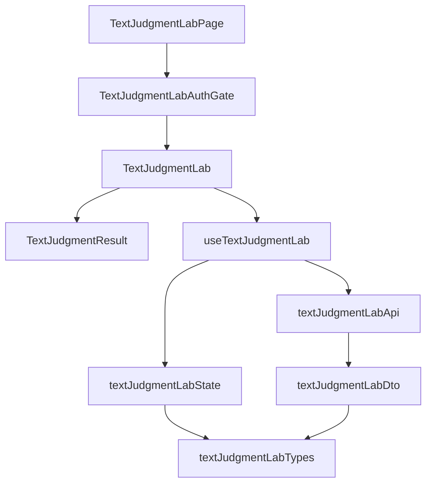

# 技術設計書

## Overview

文章判定ラボで成功済みの文章を選び、書き換え後だけを既存APIで判定し、元の文章と結果を一組で比較する。比較元・入力・履歴は現在の画面のメモリだけに保持する。要件の用語を使用し、共通ドメインや既存APIの意味は変更しない。

### Goals

- 入力置換の確認から編集、中止、判定、比較表示までを同じ画面で完了する。
- 比較元と実際に送った文章の対応を固定し、失敗後の手動再送と古い応答の破棄を保証する。
- 通常送信と比較で同じ判定表示・通信・認証境界を利用する。

### Non-Goals

文章の自動書き換え、理由説明、優劣評価、モデル選択、3件以上の比較、永続履歴、他画面へのデータ引き渡しは追加しない。

## Boundary Commitments

### This Spec Owns

- **B1 状態と送信制御**: 画面内履歴の通常／比較の区別、比較元snapshot、入力置換・編集・中止の遷移、送信時snapshotと完了応答の対応、15秒待機、再送と失効の競合制御。
- **B2 表示と操作**: 成功結果の選択操作、置換確認、編集中の比較元表示、二列／一列の結果表示、フォーカスと状態案内。
- **B3 画面寿命の接続**: 既存認証ゲートで一度許可された内容を失効・確認不可・再確認による拒否時にも読取専用で保持する。初回未許可はmountしない。画面離脱時には全状態を破棄する。

### Out of Boundary

- Backend、DB、Jev gateway、固定3質問、利用回数制限、DTO検証、Bearer認証方式、LIFF設定、owner session、route registryは既存機能の所有とする。
- 認証・利用資格の判定規則は変更しない。B3は既存状態を受け取る画面のmount寿命だけを扱う。
- 既存`text-judgment-lab`の成果物と承認履歴を変更しない。移行・新しい設定・共通steering変更は不要。

### Allowed Dependencies

- `textJudgmentLabTypes.ts`の`JudgmentResponse`、`JudgmentRequest`、`LabAccessState`を再利用する。
- `LabHttpClient.judge`と`LabHttpError`、`LabAuthContext`の`access`、`getValidIdToken`、`invalidateAccess`を使う。比較データをHTTP adapterや認証ゲートへ渡さない。
- 純粋なStateは型にだけ依存する。hookはStateとAPIの型・エラー、認証contextの型に依存し、UIはhookと表示部品に依存する。State・API・hookからrouterやUIをimportしない。
- CSSは既存`style.css`のラボ領域とtheme tokenを使用する。新規依存は導入しない。

### Revalidation Triggers

- `JudgmentResponse`、固定3質問、正規化・文字数条件、API contractVersionが変わる場合はsnapshot、表示、fixtureを再検証する。
- `LabAuthContext`の有効性・子のmount条件・route寿命が変わる場合はB1とB3の失効・後着応答テストを再実行する。
- 待機時間、同時実行数、保存先、結果の選択単位が変わる場合は状態遷移とサイズ判定へ戻る。
- 比較をAPIへ送りたい場合、永続化や別モデル比較を導入する場合は本specの境界を拡張せず、別の要件・設計判断を行う。

## Architecture

### Existing Architecture Analysis

現状は`useTextJudgmentLab`が通常turnの追加、入力、通信とタイマーを管理し、`TextJudgmentLab`内の`Judgment`が結果を表示する。比較をこのturnへそのまま追加すると通常結果と比較結果が二重に残るため、履歴を判別可能なunionにする。純粋な遷移を`textJudgmentLabState.ts`へ分離し、hookには通信と寿命制御を残す。

`TextJudgmentLabAuthGate`は初回許可以後、失効・確認不可でも子を保持するが、`denied`では子を外す。要件5.5に従い、初回許可後は`denied`でも同じ子を同じ位置に保持し、全変更操作を無効にする。初回拒否では内容をmountしない。再認証で文書が遷移する場合は画面離脱として消去する。



依存方向は図の矢印に従う。Page、API、DTO、共通型は変更なしの上流。比較の表示に汎用比較フレームワークを導入せず、既存の結果表示だけを抽出する。

### Technology Stack

| 層 | 技術・既存固定版 | 役割 |
|---|---|---|
| Frontend | TypeScript 6.0.3、React 19.2.7 | unionによる履歴・状態、hookと表示 |
| 表示 | Tailwind CSS 4.3.3、既存CSS、ブラウザ標準confirm・details・meter | token共有、置換確認、数値と詳細表示 |
| 検証 | Vitest 4.1.10、jsdom 28.1.0 | 純粋遷移、API回数、タイマー・認証競合 |

版は`frontend/package.json`の現行固定値であり、更新しない。ブラウザ確認は既存Docker Compose環境で行う。

## File Structure Plan

パスはリポジトリルート基準。各行がtaskの`_Boundary:_`の参照先となる。

| 操作 | 具体的パス | Component・単一の責務 | 境界 |
|---|---|---|---|
| 作成 | `frontend/src/textJudgmentLabState.ts` | LabState: 履歴型・snapshot型と純粋な状態遷移 | B1 |
| 変更 | `frontend/src/useTextJudgmentLab.ts` | useTextJudgmentLab: 遷移と単一実行・通信寿命の接続 | B1 |
| 作成 | `frontend/src/TextJudgmentResult.tsx` | TextJudgmentResult: 元のJudgmentを抽出した共通結果表示 | B2 |
| 変更 | `frontend/src/TextJudgmentLab.tsx` | TextJudgmentLab: 履歴・比較・入力の表示と操作接続 | B2 |
| 変更 | `frontend/src/style.css` | ラボに限定した比較レイアウトと操作のfocus表現 | B2 |
| 変更 | `frontend/src/TextJudgmentLabAuthGate.tsx` | TextJudgmentLabAuthGate: 初回許可後の子のmount維持 | B3 |
| 作成 | `frontend/test/textJudgmentLabState.test.ts` | snapshotと遷移の不変条件の検証 | B1 |
| 変更 | `frontend/test/TextJudgmentLab.test.tsx` | 表示・通信・入力・後着応答の統合検証 | B1・B2 |
| 変更 | `frontend/test/TextJudgmentLabAuthGate.test.tsx` | 初回拒否と許可後の読取専用保持の検証 | B3 |
| 作成 | `frontend/test/TextJudgmentLabComparisonIntegration.test.tsx` | Pageと実AuthGateを含む失効・再確認・unmountの統合検証 | B1・B3 |

変更なしの依存先は`frontend/src/TextJudgmentLabPage.tsx`、`frontend/src/textJudgmentLabTypes.ts`、`frontend/src/textJudgmentLabApi.ts`、`frontend/src/textJudgmentLabDto.ts`。既存の`frontend/test/textJudgmentLabApi.test.ts`と`frontend/test/fixtures/text-judgment-lab-v3.json`を契約回帰に使う。

## Components and Interfaces

| Component | 役割 | 要件 | 主要依存 | 契約 |
|---|---|---|---|---|
| LabState | 入力・比較・履歴の純粋遷移 | 1.1, 1.2, 1.3, 1.4, 1.5, 1.6, 2.1, 2.2, 2.4, 3.4, 4.1, 4.2, 4.3, 5.1, 5.3, 5.6 | Outbound: 共通型 P0 | State |
| useTextJudgmentLab | 単一実行と有効な応答の採用 | 3.1, 3.2, 3.3, 3.4, 3.5, 3.6, 5.1, 5.2, 5.3, 5.4, 5.5, 5.6, 5.7 | Outbound: LabState・API・認証context P0 | Service |
| TextJudgmentLab | 選択・確認・入力・対表示 | 1.1, 1.2, 1.3, 1.4, 1.5, 1.6, 2.1, 2.2, 2.3, 2.4, 2.5, 3.2, 3.5, 3.6, 4.1, 4.2, 4.3, 6.1, 6.2, 6.3, 6.4, 6.5, 6.6 | Outbound: hook・結果表示 P0 | 表示props |
| TextJudgmentResult | 数値・metadata・返却値 | 4.4, 4.5, 4.6, 4.7, 6.3, 6.4 | Outbound: 共通型 P0 | 表示props |
| TextJudgmentLabAuthGate | 許可後の読取専用保持 | 5.4, 5.5, 5.7 | Inbound: Page P0、Outbound: 既存LIFF・access API P0 | 既存context |

### LabState

Inboundはhook（P0）、Outboundは`JudgmentResponse`（P0）。React、ネットワーク、時間、tokenを保持しない。以下は実装が従うローカル契約であり、HTTP契約ではない。

```typescript
type Immutable<T> = { readonly [K in keyof T]: Immutable<T[K]> }
type JudgmentSnapshot = Readonly<{
  text: string
  result: Immutable<JudgmentResponse>
}>
type ResultRef = Readonly<{
  entryId: number
  side: 'single' | 'original' | 'rewritten'
}>
type SingleOutcome =
  | { kind: 'pending' }
  | { kind: 'succeeded'; result: Immutable<JudgmentResponse> }
  | { kind: 'failed'; message: string }
type LabEntry =
  | { kind: 'single'; id: number; text: string; outcome: SingleOutcome }
  | { kind: 'comparison'; id: number; original: JudgmentSnapshot; rewritten: JudgmentSnapshot }
type Submission = Readonly<{
  id: number
  draft: string
  text: string
  original: JudgmentSnapshot | null
}>
type LabComposer =
  | { kind: 'editing'; draft: string; original: JudgmentSnapshot | null; error: string | null }
  | { kind: 'pending'; submission: Submission }
type LabState = Readonly<{
  entries: readonly LabEntry[]
  composer: LabComposer
}>
type LabAction =
  | { type: 'edit'; draft: string }
  | { type: 'select'; source: ResultRef; replacementConfirmed: boolean }
  | { type: 'cancel_comparison' }
  | { type: 'start'; id: number }
  | { type: 'succeed'; id: number; result: JudgmentResponse }
  | { type: 'fail'; id: number; message: string }

declare function transition(state: LabState, action: LabAction): LabState
declare function findSuccessfulResult(state: LabState, source: ResultRef): JudgmentSnapshot | null
```

- `ResultRef`は通常成功turnと、比較済みの両側を選べる。未完了・失敗・不正参照は`null`として無視する。再比較でも元の履歴を変更しない。
- 選択時に成功文章と検証済み応答を独立したsnapshotとしてコピーする。入力の変更や元のオブジェクトの変更でsnapshotが変わらない。snapshotは深いreadonly型で公開し、値を書き換えるcastを使用しない。
- `draft !== ''`なら空白だけでも置換確認を要求する。`select`は確認なしでは入力と比較元の両方を変更しない。選択確定時は新しい文章をコピーし、旧比較と旧エラーを置き換える。
- `start`は非空の`draft.trim()`かつ入力全体のUnicode code point数が1,000以下のときだけ受け付ける。UIと遷移で同じ条件を使い、送る`text`は既存どおりtrimする。失敗復元用の`draft`は空白・改行も含め別に保存する。
- 通常送信の`start`はpendingのsingleを一件追加する。比較の`start`は履歴へ追加せず、composerをpendingにする。比較成功時だけcomparisonを一件追加する。
- 成功・失敗はpendingのsubmission IDと一致する場合だけ採用する。比較成功で入力と選択を空に戻す。比較失敗でoriginalと送信前のdraftをeditingへ戻す。通常送信の成功・失敗は既存singleの一件を更新する。
- pending中のedit、select、cancel、startは無変更。中止は入力を残してoriginalと比較エラーを解除する。古い完了actionは無変更となる。

### useTextJudgmentLab

InboundはUI（P0）。OutboundはLabState、LabHttpClient、LabAuthContext（すべてP0）。State契約の変更と同じB1で実装する。

```typescript
type SelectionOutcome = 'selected' | 'confirmation_required' | 'ignored'
interface LabController {
  readonly state: LabState
  readonly pending: boolean
  setDraft(value: string): void
  selectSource(source: ResultRef, replacementConfirmed?: boolean): SelectionOutcome
  cancelComparison(): void
  submit(): Promise<void>
}
declare function useTextJudgmentLab(
  api: LabHttpClient,
  context: LabAuthContext,
): LabController
```

`submit`内で送信直前に`access.kind === 'authorized'`と`getValidIdToken()`を確認する。tokenは通信呼出しの局所変数に限定する。無効入力・非許可・既に実行中ならAPIを呼ばない。選択・編集・中止も非許可時は無変更とする。

実行中jobは単調増加ID、AbortController、15秒timer、開始時submissionを持つ。React再render前の連打にも効く同期的な単一実行guardを設ける。UIのdisabledだけに依存しない。表示データの正本はLabState一つとし、jobは寿命管理のhandleと開始時snapshotだけを持つ。

完了時はjobの同一性、画面の存続、現在の利用資格、`getValidIdToken()`による期限、開始から15秒未満を確認してからStateへ渡す。待機上限はtimerに加えて完了時の経過時間でも確認し、バックグラウンドでtimer実行が遅れた成功を採用しない。期限が切れていたら失敗遷移と無効化を先に確定する。

timeout・利用資格喪失ではjobを先に無効化し、timerを解除してabortし、保持したsubmissionを失敗遷移へ渡す。AbortSignalを無視する通信からの後着も同一性検査で破棄する。利用資格が戻っても自動送信しない。unmountでは無効化・timer解除・abortだけを行い、旧画面へstate更新しない。

### 表示部品と認証ゲート

`TextJudgmentResult`のpropsは`Readonly<{ result: Immutable<JudgmentResponse> }>`。分類と4候補確率、感情スコアと目盛り、急ぎの確率の順序を共通化する。確率は小数第1位の百分率、感情は小数第2位、時間は整数msとして表示するが、元データは丸めない。各結果でモデルとJev応答時間を表示し、`details/summary`で検証済み`JudgmentResponse`全体をJSON表示する。Backendが公開しないJevのHTTP生応答や秘密情報は扱わない。モデルの判定である旨を明記し、優劣・正解率・理由を付加しない。

`TextJudgmentLab`は成功snapshotごとに「書き換えて試す」を提供する。選択が`confirmation_required`なら`window.confirm`で入力置換を確認し、trueの場合だけ確定を要求する。false・ダイアログ抑止は拒否として扱う。確定後はtextareaへfocus、拒否時は起点ボタンへfocusを戻す。確認文へ本文や返却値を埋め込まない。

編集中・待機中はcomposerの上に「比較元」と文章・共通結果を表示する。編集中は「比較する」「比較をやめる」、待機中は「判定中…」を表示する。比較待機中も送信したdraftを読取専用で見せ、全変更操作を無効にする。Enterはtextarea標準の改行とし、keydownによる送信を追加しない。成功・中止後は入力へfocusを戻し、認証失効時は既存の案内を妨げない。

比較履歴は通常の幅36remのassistantや最大85%のuser吹き出しで囲まず、チャット列の全幅に独立したarticleとして置く。元の文章、書き換え後をそれぞれ見出し付きsectionにする。画面幅768px以上は`minmax(0, 1fr)`の二列、768px未満はDOM順の一列とする。列とカードに`min-width: 0`、本文は改行維持と折返し、モデルとJSONは長い連続文字も折り返す。JSON領域に縦スクロールを残す場合はキーボードでも到達できるようにする。CSSはラボ領域へ限定する。

既存`role=log`、`role=status`、`role=alert`と文字の状態案内を使う。focus-visibleを全操作で確認できるようにする。比較開始ボタンと返却値のsummaryには側の見出しによる文脈を与える。外部AI送信・秘密情報を入力しない注意書きは通常と比較で同じcomposer内に常時表示する。

認証ゲートは`hasAuthorized`がtrueになった後、許可状態が変化しても子のkeyや位置を変えず保持する。deniedを含む非許可時は既存案内に読取専用である旨を補い、hookがすべての変更操作と通信を停止する。認証方式・許可条件・LIFF呼出しは変更しない。

## System Flows

| 開始状態・イベント | 次の状態と作用 |
|---|---|
| editing、成功結果を選択、入力なし | 比較元を固定して文章をコピー |
| editing、成功結果を選択、入力あり | 承認時だけ比較元・入力を同時置換。拒否は無変更 |
| 比較editing、中止 | draftを残し通常editing |
| editing、有効入力・有効認証で送信 | submission固定、pending、API一回 |
| 比較pending、有効な成功応答 | 一組を履歴追加、空の通常editing |
| 比較pending、失敗・15秒・資格喪失 | 同じ比較元とdraftを持つediting、エラー表示 |
| 失敗後、再確認・再認証の完了 | 状態を保持し、明示送信を待つ |
| 旧jobの完了 | 現在の入力・履歴・jobは無変更 |
| 画面離脱・reload | 全データ破棄、次回は空の通常editing |

成功した比較のどちらの側からも再比較できるが、編集中の比較は常に一組とする。同一文章の再判定も禁止せず、文字列差分による送信条件は追加しない。

## Data Models

`LabEntry`が履歴の単位、`JudgmentSnapshot`が成功文章と結果の単位、`Submission`が一回の判定の単位となる。IDは画面内の識別用で、APIやstorageへ送らない。比較履歴は両側のsnapshotを持ち、元turnが後から変わることを前提に参照解決しない。比較元は結果への参照から選択時に解決する。

既存HTTP契約は`POST /api/labs/text-judgment/judgments`、bodyは`{ contractVersion: 3, text: string }`のみ。Bearer tokenは認証ヘッダーへ渡す。cookieは`omit`、cacheは`no-store`、redirectは`error`を維持する。比較元、履歴、identity、自由な質問をbodyに含めない。固定3質問とJevへの入力分離は既存Backendが所有し、比較専用分岐を追加しない。

結果は既存DTOで検証された数値・モデル・elapsedMsをそのまま保持する。永続化、URL、localStorage、sessionStorage、共有storeを使わず、画面を離れると履歴ごと破棄する。

## Error Handling

| 条件 | 表示と回復 |
|---|---|
| 空・空白・1,000文字超 | 送信不可と既存入力条件を表示、API呼出しなし |
| 通信失敗・不正応答・5xx | 安全な既存エラー文、比較元とdraft保持、手動再送 |
| 429 | 回数制限として待機を案内、同じ比較を保持、自動再試行なし |
| 15秒到達 | timeoutを表示しjobを破棄、後着無視 |
| 401・token期限切れ | `invalidateAccess('auth_expired')`、再認証案内、読取専用保持 |
| 403・503・資格確認不可 | `invalidateAccess('access_unavailable')`または既存access状態、読取専用保持 |
| 不正な参照・重複操作・旧完了 | 状態を変更せず、通信を増やさない |

本文・返却値・tokenをconsoleや新規監査へ出さない。利用者向け状態表示とテストで観測し、追加の監視基盤は導入しない。

## Requirements Traceability

| Requirement | Summary | Components | Interfaces | Flows |
|---|---|---|---|---|
| 1.1, 1.2 | 成功結果だけを選択 | LabState、TextJudgmentLab | ResultRef | 選択 |
| 1.3, 1.4, 1.5, 1.6 | コピー・置換承認・拒否保持 | LabState、TextJudgmentLab | selectSource | 確認後の同時置換 |
| 2.1, 2.2 | 元の固定と選び直し | LabState、TextJudgmentLab | JudgmentSnapshot | 選択・pending |
| 2.3, 2.4, 2.5 | 編集・中止・改行 | TextJudgmentLab、LabState | setDraft、cancelComparison | 通常入力への復帰 |
| 3.1, 3.2, 3.3 | 入力条件・一回送信・固定契約 | useTextJudgmentLab、LabState | submit、既存judge | pending開始 |
| 3.4, 3.5, 3.6 | 待機中の全変更禁止 | useTextJudgmentLab、TextJudgmentLab | 単一job、pending | 重複操作拒否 |
| 4.1, 4.2, 4.3 | 一組だけ追加し通常へ戻る | LabState、TextJudgmentLab | comparison entry | succeed |
| 4.4, 4.5, 4.6, 4.7 | 数値・metadata・元データと説明範囲 | TextJudgmentResult | result props | 両側の共通表示 |
| 5.1, 5.2, 5.3, 5.4 | 失敗保持・待機上限・手動再送 | useTextJudgmentLab、LabState | fail、submit | 失敗からediting |
| 5.5, 5.6 | 失効保持・旧応答の破棄 | useTextJudgmentLab、TextJudgmentLabAuthGate | job、既存context | 非許可・再確認 |
| 5.7 | 画面寿命限定 | useTextJudgmentLab、TextJudgmentLabAuthGate | unmount | 破棄・再入場 |
| 6.1, 6.2, 6.3 | 二列・一列と長い内容 | TextJudgmentLab、TextJudgmentResult | CSSと見出し | 比較閲覧 |
| 6.4, 6.5, 6.6 | キーボード・状態・注意書き | TextJudgmentLab、TextJudgmentResult | focus、semantic role | 一連の比較操作 |

## Testing Strategy

### 純粋遷移

- 1.1〜2.4: 通常成功・比較両側から選択し、元オブジェクト変更でsnapshotが変化しないこと、空白を含む入力の置換拒否、中止・選び直しを検証する。
- 3.2, 3.4, 4.1〜4.3: 文字数境界、pending中の禁止action、成功時の一組追加・二重追加なしを検証する。
- 5.1, 5.3, 5.6: 空白と改行を含むdraftの復元、修正後の再送、旧IDの完了による新比較の上書きがないことを検証する。

### UI・通信・認証の統合

- 1.3〜3.6: confirmの承認・拒否・抑止、空白入力、EnterとIME、同一イベント内の連打、比較中止後の通常送信。API引数を完全一致で検査し、比較元・履歴を送らず一回だけ呼ぶことを確認する。
- 4.1〜4.7: 元と書き換え後で異なるfixture値を使い、同じ順序、各側のモデル・時間・未丸めJSONを確認する。通常履歴を重複追加せず、両側から再比較できることを確認する。
- 5.1〜5.6: network、429、protocol_error、401、403、503、15秒timeoutを再現する。AbortSignalを無視する遅延Promiseを使い、timeout後に別の比較を始めても旧応答が混入しないことを検証する。タイマー通知前でも15秒以上経過した完了を拒否する。
- 5.4〜5.7: Pageと実AuthGateを合成し、期限切れ、visible復帰の再確認、確認不可、許可後denied、初回denied、再許可、unmountと再mountを試す。前者ではdraftと元を保持し、初回拒否では未mount、画面再入場では空、再許可だけではAPI再実行なしを確認する。

### 実画面の受入経路

1. デスクトップ幅1,280pxで通常判定→比較開始→編集→判定→両側の返却値確認。チャット全幅の左右表示を確認する（1.1, 2.3, 3.1, 4.1〜4.7, 6.1）。
2. 幅375pxと320pxで同じ経路と長い文章・モデル・JSONを確認する。上下の順序を保ち、document全体に横スクロールがないことを確認する。767px／768pxでも切替を確認する（6.2, 6.3）。
3. キーボードだけで置換拒否・承認→編集→中止→再比較→送信→summaryを操作し、focus、改行、注意書き、文字による状態を確認する。LINE内ブラウザでもconfirmが利用できることを確認する（1.4〜1.6, 2.4, 2.5, 6.4〜6.6）。
4. 通信失敗→入力修正→手動再送、失効→再確認→手動送信、離脱→再入場で保持と消去を確認する（5.1〜5.7）。

既存Vitest・jsdomとブラウザ確認を使い、新しいE2E基盤を追加しない。実装時は`sh scripts/check.sh frontend`、`docker compose run --rm frontend npm test`、`docker compose run --rm frontend npm run build`を実行する。テスト定義直前の日本語コメント規約に従う。この設計工程では実装・実画面検証は未実施。

## Integration & Migration Notes

実装順はB1の型・遷移→hookとB3の寿命接続→B2の結果抽出・入力操作・表示→統合・実画面検証とする。Stateとhookは一つの所有範囲で更新する。B2はState契約確定後、B1とは別ファイルで進められるが、最終統合で通常送信の回帰を確認する。

Frontendのみ一括提供する。Backend変更、migration、環境変数、データ変換、段階的rollout flagは不要。問題時はFrontendの変更を戻せる。既存履歴は非永続なので新版へのデータ移行はない。追加の外部通信は比較一回につき既存判定一回で、待機上限は15秒を維持する。
