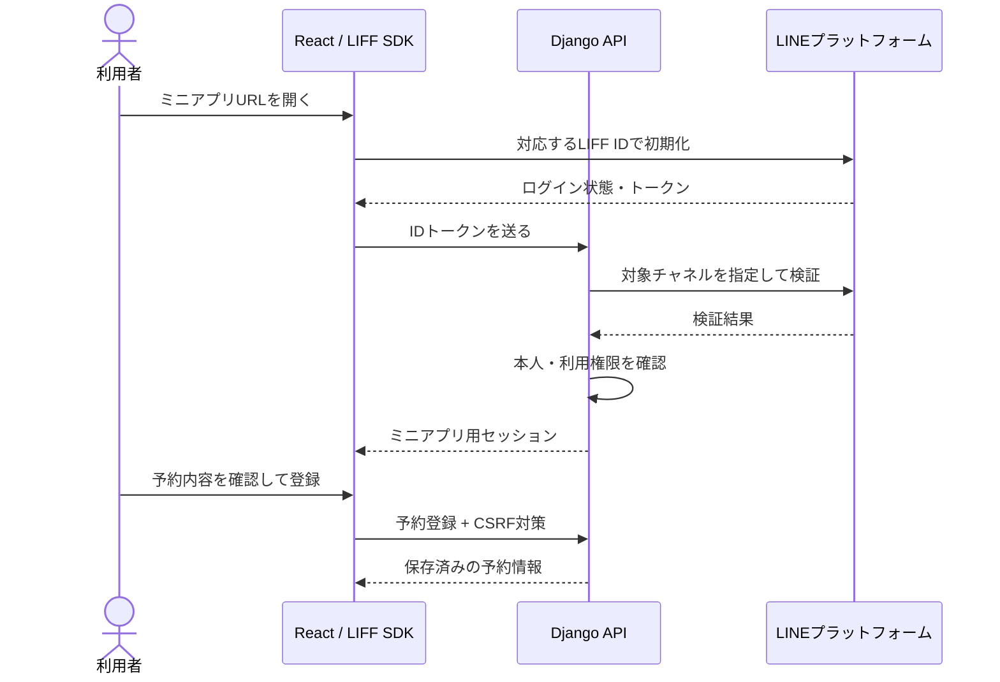
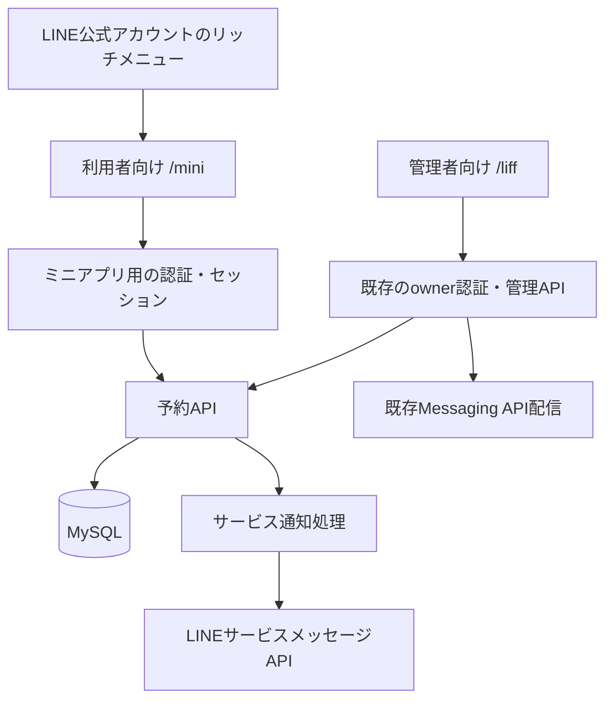

# LINEミニアプリ導入調査と機能開発の提案

調査日: 2026年9月15日  
対象: LINE Message Playground  
位置付け: 公式資料と現在のコードに基づく調査・検討資料。要件・設計の承認済み仕様ではない。

## 1. 結論

**このアプリには、LINEミニアプリを利用した「来店予約・受付通知プレイグラウンド」を追加することを推奨する。**

まずは自分だけが利用する架空の店舗を題材に、「予約する → 内容を確認する → 取り消す」を実装する。その後、開発用チャネルで「予約完了・取消完了」のサービスメッセージを送信し、通知から予約詳細へ戻る体験まで検証する。

この案なら、既存のLIFF認証、Django API、DB、リッチメニュー、外部API操作の記録を活かしながら、業務でも応用しやすい次の点を学べる。

- ミニアプリチャネルの作成と、開発・審査・本番の設定管理
- LINE内・外部ブラウザでの起動、ログイン、画面への復帰
- 利用者の操作を起点とするデータ登録と、本人だけが閲覧・変更できる認可
- ミニアプリ固有のサービスメッセージと、既存のMessaging API配信との違い
- 通知の失敗や二重操作が、予約データに及ぼす影響の扱い

**認証審査を初期開発の前提にする必要はない。** 未認証ミニアプリとして公開する方法があり、サービスメッセージも開発用の内部チャネルでテストできる。ただし、未認証の本番用チャネルではサービスメッセージを利用できない。[既存Webアプリのミニアプリ化](https://developers.line.biz/ja/docs/line-mini-app/develop/web-to-mini-app/)、[サービスメッセージAPI](https://developers.line.biz/ja/reference/line-mini-app/)

業務で開発する具体的なサービスは未提示のため、ここでは予約を学習用の仮題材とした。業務が会員証や注文中心であれば、後述の候補比較を使って題材を変更できる。

## 2. LINEミニアプリの基礎

### 2.1 LIFF・LINE Login・Messaging APIとの関係

LINEミニアプリは、LIFF（LINE Front-end Framework）上で動くWebアプリである。ReactやDjangoを別の技術へ置き換える必要はなく、Webアプリをホストし、LINE Developersコンソールのミニアプリチャネルへ接続する。[LINEミニアプリとは](https://developers.line.biz/ja/docs/line-mini-app/discover/introduction/)

| 要素 | 役割 | このアプリでの位置付け |
| --- | --- | --- |
| LIFF SDK | LINEの実行環境・ログイン・トークンなどをWeb画面から扱う | `@line/liff`を導入済み |
| LINE LoginチャネルのLIFFアプリ | LINEログインチャネルに追加するWebアプリ | 現在の管理画面の入口 |
| LINEミニアプリチャネル | ミニアプリの設定、内部チャネル、審査、専用機能を管理する | 新しく追加する対象 |
| Messaging APIチャネル | LINE公式アカウントとしてpush・reply・Webhook・リッチメニューを扱う | 既存の配信・管理機能 |
| サービスメッセージ | ミニアプリで利用者が行った操作への確認・応答を送る | 予約完了・取消完了の通知候補 |

LINEログインチャネルのLIFF登録と、ミニアプリチャネルの作成は別の手順である。現在のWebコードは再利用できるが、LINEログインチャネルに登録したLIFFアプリ自体をミニアプリチャネルへ移行することはできない。新しいミニアプリチャネルを作成して接続する。公式は、新規のLIFFアプリをミニアプリとして作成することを推奨している。[移行に関する公式FAQ](https://developers.line.biz/ja/faq/tags/line-mini-app/)、[LIFFアプリの登録](https://developers.line.biz/ja/docs/liff/registering-liff-apps/)

### 2.2 未認証と認証済み

| 項目 | 未認証ミニアプリ | 認証済ミニアプリ |
| --- | --- | --- |
| LINEヤフーの認証審査 | 未通過 | 通過済み |
| Web画面を公開する | 可能 | 可能 |
| サービスメッセージ | 開発用内部チャネルでテスト可能。本番利用は不可 | 本番利用可能。使用するテンプレートにも審査が必要 |
| 認証バッジ | なし | あり |
| ホーム画面へのショートカット、Custom Path、チャネル同意の簡略化 | 初期開発では利用を前提にしない | 利用できる機能が増える |

「未認証」はLINEによるサービスの認証審査の状態を表す。**ユーザー認証が不要、APIを無認証にしてよい、という意味ではない。** 機能の公開条件は、[ミニアプリの種類](https://developers.line.biz/ja/docs/line-mini-app/discover/introduction/)と[サービスメッセージの手順](https://developers.line.biz/ja/docs/line-mini-app/develop/service-messages/)を参照する。

## 3. 導入方法

### 3.1 準備するもの

1. LINE Developersの開発者アカウントと、実機確認用のLINEアカウント。
2. ミニアプリを作成するプロバイダーと、その管理権限。
3. HTTPSでアクセスできるWebアプリ。本プロジェクトの開発検証には既存のngrok構成を使える。
4. サービス名、説明、アイコン、提供地域、事業主情報、プライバシーポリシーなど、コンソールで求められる情報。
5. 公式アカウントとの連携を学ぶ場合は、既存のMessaging APIチャネル。

作成者・サービスの利用条件は公式の案内とポリシーで確認し、所在国・地域などには実際の情報を設定する。業務用はサービス提供主体のプロバイダーを使用し、この個人用検証環境と業務の資格情報・データを混在させない。[はじめに](https://developers.line.biz/ja/docs/line-mini-app/quickstart/)、[プロバイダーとチャネル管理](https://developers.line.biz/ja/docs/line-developers-console/best-practices-for-provider-and-channel-management/)

### 3.2 コンソールで作成・設定する

1. [LINE Developersコンソール](https://developers.line.biz/console/)を開く。
2. このアプリの既存LINE Login・Messaging APIと連携させる場合は、それらと同じプロバイダーを選ぶ。
3. 新規チャネルの種類で「LINEミニアプリ」を選び、必要事項を入力する。
4. 作成後、開発用・審査用・本番用の内部チャネルそれぞれについて、LIFF ID、チャネルID、チャネルシークレットを確認する。
5. ［ウェブアプリ設定］でエンドポイントURLとScopeなどを設定する。
6. 開発を確認するLINEアカウントをTesterとして登録し、権限の承認まで済ませる。
7. 開発用LIFF IDを使った起動URLを実機で開く。

1つのミニアプリチャネルの作成により3つの内部チャネルが用意され、各内部チャネルには1つのLIFFアプリが対応する。**LIFF IDとチャネル資格情報は環境ごとに異なる。** 開発用の資格情報を本番用へ流用しない。[コンソールガイド](https://developers.line.biz/ja/docs/line-mini-app/discover/console-guide/)

同じプロバイダー配下では、同じユーザーのユーザーIDをチャネル間で対応付けられる。別プロバイダーでは同一人物でもIDが異なり、チャネルを後から別プロバイダーへ移動することもできない。ただし、同じIDであることだけを根拠に、データの利用目的や本人の同意を省略しない。[プロバイダー設計](https://developers.line.biz/ja/docs/line-developers-console/best-practices-for-provider-and-channel-management/)

### 3.3 このプロジェクトの設定案

既存管理画面は`/liff`配下を使用している。推奨案では、利用者向けミニアプリの入口を`/mini`として追加する。

| 項目 | 開発用の提案例 | 注意点 |
| --- | --- | --- |
| ミニアプリのエンドポイントURL | `https://<NGROK_DOMAIN>/mini` | 現在は未実装。ルート追加と認証拡張が必要 |
| 利用者に案内する起動URL | `https://miniapp.line.me/<開発用LIFF ID>` | 開発用URLはテスターの確認用 |
| Frontendの公開設定 | `VITE_MINI_APP_LIFF_ID` | 新規追加する設定名の案。秘密値ではない |
| Backendの検証対象 | `LINE_MINI_APP_CHANNEL_ID` | LIFF IDではなく、対象内部チャネルのチャネルID |
| Backendの秘密値 | `LINE_MINI_APP_CHANNEL_SECRET` | サーバーだけへ渡す |
| Backendのプロバイダー設定 | `LINE_MINI_APP_PROVIDER_ID` | チャネルとの対応をコンソールで確認 |
| Scope | `openid profile` | 既存の認証処理が両方を前提にしているため。メール等は追加しない |

上記の新しい環境変数は**現行コードでは読み込まれない**。実装時に設定ローダー、`.env.example`、`compose.yaml`の受け渡しを追加する。既存の`VITE_LIFF_ID`や`LINE_LOGIN_*`は管理画面用として維持する。

開発・審査・本番は、それぞれのデプロイ先へ対応する値を設定する。単にLIFF IDだけを切り替えるのではなく、エンドポイント、検証対象チャネル、通知用資格情報、DB等の環境境界を揃える。

現在のComposeはVite開発サーバーとngrokを使用する。公開運用を行う場合は、Frontendのビルド成果物、Djangoの本番用サーバー、HTTPS、DBバックアップなどの運用構成を別途用意する。LINE側のチャネル作成だけで、このアプリのサーバーがホストされるわけではない。[既存Webアプリのミニアプリ化](https://developers.line.biz/ja/docs/line-mini-app/develop/web-to-mini-app/)

### 3.4 アプリ内の基本処理

起動時の流れは次のとおり。

- `liff.init({ liffId })`の完了後にLIFF APIを使用する。
- LINEのLIFFブラウザでは初期化時にログイン処理が行われる。外部ブラウザではログインが必要なタイミングで`liff.login()`を使うなど、明示的な処理が必要。
- Backendには`liff.getIDToken()`の生トークンを送り、LINEの検証APIで検証する。ブラウザで取得・デコードした`userId`やプロフィールを認証の根拠として受け付けない。
- Backendでは検証先の`client_id`と`aud`、発行者、有効期限を確認する。信頼するチャネルはサーバー設定から選び、リクエストが指定する任意のチャネルを信頼しない。
- サービス通知用にLIFFアクセストークンを受け取る場合も、対象チャネルとログイン済み本人への対応を検証する。

参考: [ユーザー情報を安全に使う](https://developers.line.biz/ja/docs/liff/using-user-profile/)、[LIFF API](https://developers.line.biz/ja/reference/liff/)、[外部ブラウザ対応](https://developers.line.biz/ja/docs/line-mini-app/develop/external-browser/)

外部ブラウザでも基本サービスを利用できる構成にする。LINEログインが必要な予約機能はログインへ案内し、`liff.closeWindow()`等の利用できない機能は環境に応じて表示を変える。LINEを使っていない人へのゲスト予約は初期案には含めず、公開対象を広げる段階で検討する。

### 3.5 利用者の入口と詳細画面へのリンク

- 初期検証は開発用ミニアプリURLを実機で開く。
- 次に、既存リッチメニューのHTTPSリンクへミニアプリURLを設定する。
- 予約詳細へ戻す通知や共有には、ページに対応するパーマネントリンクを使用する。

例えば、エンドポイントが`https://example.com/mini`、詳細画面が`https://example.com/mini/reservations/<予約UUID>`なら、対応するリンクは`https://miniapp.line.me/<LIFF ID>/reservations/<予約UUID>`となる。実装時はLIFFのリダイレクトを経た詳細画面への復帰も実機で確認する。[パーマネントリンク](https://developers.line.biz/ja/docs/line-mini-app/develop/permanent-links/)

予約UUIDを知っていることは閲覧権限を意味しない。リンクにユーザーIDやトークンを入れず、予約詳細APIで本人の予約か毎回確認する。

### 3.6 公開と認証審査

初期学習は開発用内部チャネルで行う。本番用内部チャネルは公開用であり、開発用のTester制限と同じアクセス制限があると考えない。未認証ではコンソール設定の変更が本番側にも反映される項目があるため、環境別エンドポイントとアプリ側の認可を確認する。[コンソールガイド](https://developers.line.biz/ja/docs/line-mini-app/discover/console-guide/)

認証済みとして運用する段階では、サービス情報、プライバシーポリシー、審査用環境、通知テンプレート、操作を再現できるテストシナリオを準備する。現在の本人限定認証のままでは審査担当者が業務フローを確認できないため、利用者向けの認可を別途設計する。審査期間の公式目安は1〜2週間程度で、完了日は指定できない。これは開発工数とは別である。[審査ガイド](https://developers.line.biz/ja/docs/line-mini-app/submit/submission-guide/)

## 4. 通知の使い分け

### 4.1 Messaging APIとサービスメッセージ

| 比較点 | Messaging APIのpush | ミニアプリのサービスメッセージ |
| --- | --- | --- |
| このプロジェクトでの用途 | 本人連携済み宛先へのテスト配信 | 利用者が行った予約・取消への応答 |
| 表示される送信元 | 自分のLINE公式アカウント | 日本では「LINEミニアプリ お知らせ」 |
| 対象の指定 | チャネルとLINEユーザーID | 操作に対応するサービス通知トークン |
| 内容 | 現在の実装はテキスト配信など | コンソールで追加したテンプレートと変数 |
| 友だち状態 | 現行アプリは連携・配信可否を検証する | 自分の公式アカウントへの友だち追加を送信の前提にしない |
| 用途の制約 | Messaging API側の送信条件に従う | 操作への確認・応答。販促・広告等には使わない |
| 費用 | 公式アカウントの料金・配信条件を別途確認 | 必要なサービス通知は無料と公式FAQに記載 |

参考: [サービスメッセージ](https://developers.line.biz/ja/docs/line-mini-app/develop/service-messages/)、[友だち追加なしでの通知](https://developers.line.biz/ja/services/line-mini-app/)、[LINEミニアプリFAQ](https://developers.line.biz/ja/faq/tags/line-mini-app/)

サービスメッセージの無料枠を一般配信の代替として使う案は採用しない。また、サービスメッセージと既存Webhookの受取確認postbackが自動的につながるわけではない。通知リンクから詳細画面を開く処理と、利用者が明示的に確認する処理はアプリ側で設計する。

### 4.2 サービスメッセージの実装手順

1. コンソールで、予約完了・取消完了に適したテンプレートを追加し、API用テンプレート名と必須変数を確認する。実際の候補名はコンソール確認後に確定する。
2. 予約操作時に、Frontendから最新のLIFFアクセストークンをBackendへ送る。
3. Backendでそのトークンと本人・環境の対応を検証する。
4. 対象内部チャネルのチャネルID・シークレットから、サーバー側でステートレスチャネルアクセストークンを発行する。
5. `POST /message/v3/notifier/token`へLIFFアクセストークンを渡し、サービス通知トークンを発行する。
6. `POST /message/v3/notifier/send?target=service`へ、テンプレート名、変数、サービス通知トークンを送る。
7. 応答の更新後トークン、残回数、有効期限、`sessionId`を保存し、同じ予約の後続通知に使用する。

サービス通知トークンは最大5回・発行から1年間という制約を持ち、**同じLIFFアクセストークンから複数発行してはいけない**。送信後のトークン更新と残回数の管理も必要になる。`expiresIn`と`remainingCount`が0の成功応答は、送信済みだがトークンを更新できなかった場合を含む。[サービスメッセージAPI仕様](https://developers.line.biz/ja/reference/line-mini-app/)

### 4.3 このアプリでの扱い方

以下は本プロジェクトへの設計提案である。

- **予約状態と通知状態を別々に保存する。** 通知に失敗しても、保存済み予約を「予約失敗」として作り直させない。
- 通知の重複要求は同じ操作IDの結果へ収束させる。LINEへ送る処理はDBトランザクションの外へ置く。
- 同じ通知セッションの送信を直列化し、前回の更新後トークンが保存される前に次の通知を送らない。
- 生のLIFFアクセストークンを長期保存せず、必要なタイミングでサービス通知トークンへ交換する。保存するサービス通知トークンは暗号化し、通常ログには出さない。
- 予約・取消の状態変更と通知予定を同じDBトランザクションで記録し、処理漏れを追跡できるようにする。
- 同じLIFFアクセストークンの再利用を識別できる情報を保持し、通知トークンの重複発行を防ぐ。初期検証は1つの通知セッションに1予約を対応させる。
- 続けて別の予約を行う場合のトークン更新・再起動の挙動は、最初の技術検証で確認する。単に`getAccessToken()`を再実行すれば新しい値になるとは考えない。再発行できない場合も、予約の保存結果と通知できない理由を分けて表示する。
- 既存のMessaging APIのretry keyをそのままサービスメッセージに流用しない。今回確認した通知APIには同じ再試行キーや配信結果照会APIの記載がないため、タイムアウト後は`unknown`として自動再送を止める。後続のトークンも不明になった場合、復旧条件が決まるまで送信を止める。

通常ログには操作ID、内部環境、時刻、API種別、HTTP結果、失敗分類を記録する。利用者の予約内容や秘密値を一括出力する方式は避ける。公式も開発者側でのリクエスト記録を求めており、LINE側からログの提供は行わないとしている。[開発ガイドライン](https://developers.line.biz/ja/docs/line-mini-app/development-guidelines/)

## 5. 現在のアプリとの適合性

### 5.1 コードで確認できた基盤

| 既存機能 | 確認したファイル | 再利用の方向 |
| --- | --- | --- |
| React・LIFF SDK | `frontend/package.json`、`frontend/src/liffClient.ts` | SDK初期化・実行環境判定の仕組み |
| LINEトークンのサーバー検証 | `backend/lineaccounts/gateway.py` | 検証処理を環境別設定で構成する |
| 本人限定認証・セッション | `backend/lineaccounts/session_services.py`、`authentication.py` | 初期検証の本人制限。利用者向けセッションは別責務 |
| HTTPSからDjangoへの接続 | `compose.yaml` | ngrok → Vite → `/api`の開発経路 |
| 管理画面のルーティング | `frontend/src/appRoutes.ts`、`AuthGate.tsx` | 管理画面を維持してミニアプリ入口を追加 |
| リッチメニューのHTTPSリンク | `backend/linerichmenus/catalog.py` | ミニアプリへの入口。1〜3リンクの組み込みテンプレートあり |
| 配信API・状態取得 | `backend/delivery/views.py`、`urls.py` | 外部作用の操作記録・結果不明を扱う設計パターン |
| チャネル・Webhook管理 | `backend/linechannels/`、`backend/linewebhooks/` | 公式アカウントとの連携検証 |

コードとステアリングの静的確認に基づく評価であり、今回LINEアカウントで実行した結果ではない。

READMEには「配信APIに認証がない」という説明が残っているが、現行コードの`LocalDeliveryAPIView`は`OwnerProtectedAPIView`を継承している。導入判断は現行コードを優先した。READMEの該当説明は、実装時に整合させる対象である。

### 5.2 単純な設定変更では足りない箇所

| 現状 | 必要な対応 |
| --- | --- |
| `liffConfig.ts`が`/liff`と`https://liff.line.me/`を前提にする | `/mini`とミニアプリURLの設定・型・検証を追加 |
| `AuthGate.tsx`が`VITE_LIFF_ID`を使う | 起動入口ごとに正しいLIFF IDを選ぶ |
| `appRoutes.ts`が管理画面の定義済みURLのみ許可する | 予約詳細を含むミニアプリ用ルートと復帰先検証を追加 |
| `lineaccounts/runtime.py`が1組の`LINE_LOGIN_*`を保持する | 管理画面用・ミニアプリ用のチャネル構成を明示的に分ける |
| `gateway.py`が固定のチャネルIDに対して`aud`等を検証する | ミニアプリ用検証インスタンスを構成する。既存検証を緩めない |
| `session_services.py`が許可した本人をownerへ結び付ける | ミニアプリ利用者の認証成功を管理者権限に直結させない |
| 通知実装がMessaging API中心 | サービス通知の専用Gateway・トークン管理・監査を追加 |

旧形式の`https://liff.line.me/<LIFF ID>`でもミニアプリを開く互換性は残る。しかし、これだけで認証・内部チャネル・ルートの問題が解消するわけではない。[URLの互換性](https://developers.line.biz/ja/docs/line-mini-app/develop/permanent-links/)

### 5.3 推奨する構成

最初は両画面を同じ本人が使用してよい。ただし、管理画面は既存ownerセッション、ミニアプリ側は本人制限付きの利用者セッションとして識別する。サーバー側のセッションキー・Principal・許可APIを分け、ミニアプリへログインしただけでチャネル資格情報を操作できる状態にしない。

同じFrontendで2種類のLIFFを扱う場合は、入口で一方だけを初期化する。管理画面とミニアプリの切替は、それぞれの起動URLを通る別のページ読み込みとして検証し、同一画面上で両SDK設定を同時初期化しない。

予約は新しいDjango appに置き、既存appとは公開された型・サービス境界を介して接続する。Messaging APIチャネル用の資格情報モデルへ、用途が異なるミニアプリ資格情報をそのまま押し込まない。

## 6. 開発する機能の比較

以下の難易度・優先度は、このリポジトリの既存基盤と学習目的に基づく相対評価である。

| 候補 | 利用者の体験 | 新しく学べること | 規模 | 判断 |
| --- | --- | --- | --- | --- |
| A. 来店予約・受付通知 | 日時を選ぶ、予約を確認・取消する、通知から戻る | ミニアプリ認証、業務状態、サービスメッセージ、詳細リンク | 中 | **推奨。ミニアプリと通知の学習を一連の操作で行える** |
| B. デジタル会員証 | 自分の会員番号・QRを表示する | 本人連携、会員表示、実機UI | 小〜中 | 業務が会員証中心なら有力。通知の学習は別機能が必要 |
| C. 配信の受取確認画面 | 配信詳細を開いて確認済みにする | 深いリンク、本人認可、状態更新 | 小〜中 | 既存のpostback受取確認と重なり、新しい学習範囲は比較的小さい |
| D. アンケート・問い合わせ | フォームに入力し、受付結果を確認する | 入力・保存・履歴、必要なら通知 | 小〜中 | 最短のフォーム練習に向く。自由文の個人情報管理が増える |
| E. モバイルオーダー・決済 | 商品を注文し、支払い、受け取る | 注文・在庫・決済・外部状態照合 | 大 | 初期学習には範囲が広い。予約・通知の後に検討 |

Aは、単なる管理画面のミニアプリ化から一歩進み、利用者が操作するサービスを作れる。現在の「LINE連携を小さく安全に学ぶ」という目的にも合う。

## 7. 推奨機能の具体案

### 7.1 最初に作る体験

架空店舗「Playground相談窓口」への来店予約を題材にする。

1. 利用者がリッチメニューまたは起動URLからミニアプリを開く。
2. 固定の相談メニューと、テスト用に登録した予約枠を選ぶ。
3. 確認画面で日時を確認して予約する。
4. 予約番号、日時、状態を詳細画面で確認する。
5. サービス通知を有効にした開発検証では、予約完了の通知を受け取る。
6. 通知のリンクから同じ予約詳細へ戻る。
7. 予約を取り消し、状態が取り消し済みに変わる。通知対応段階では取消完了も送る。

### 7.2 最小版に含めるもの

- 固定のテスト店舗・相談メニューと、事前登録した少数の日時枠。
- 予約の作成、自分の予約一覧・詳細、取消。
- 1枠1予約をDB制約・トランザクションで守り、同時操作による重複予約を拒否する。
- 同じ登録要求の連打は同じ予約へ収束させる。
- 予約状態はまず`confirmed`と`cancelled`に限定する。
- 通知対応段階では、予約完了・取消完了の2種類と、その処理結果の表示。
- owner管理画面での検証用予約一覧・通知状態の確認。

名前・電話番号・メールアドレスの入力は求めず、サーバーで検証済みのLINE identityと予約を結び付ける。公開UUID、日時枠、状態、作成・取消日時など、検証に必要な情報だけを保存する。学習データの保持期間は暫定30日とし、削除手段と連携解除時の処理を要件で確定する。

### 7.3 初期版の対象外

- 不特定多数の利用者登録と、多店舗・多事業者への対応
- 実在店舗の予約受付、決済、在庫、クーポン、ポイント
- 複雑な営業時間、座席数、定休日、キャンセル料
- 時刻指定のリマインド配信や大規模なジョブ基盤
- 認証済ミニアプリとしての本番公開

自動リマインドは、予約・通知の基本動作が安定した後に追加する。日時管理、ジョブ実行、取消との競合、送信時点の権限・期限確認を独立した学習範囲として扱える。

## 8. 推奨する実施順序と確認項目

### 段階1: ミニアプリ接続の技術検証

コンソール設定、`/mini`の入口、環境別LIFF初期化、サーバー側トークン検証、本人限定セッションまでを作る。

完了の目安:

- 開発用ミニアプリURLからiOS・AndroidのLINEで起動できる。
- 外部ブラウザでログインし、元の画面へ復帰できる。
- 管理画面用とミニアプリ用のID・トークンを取り違えた場合に拒否できる。
- 許可していないユーザーは業務APIを使えず、ミニアプリの認証で管理APIへ入れない。
- 開発用テンプレートの選択・プレビュー・テスト送信条件をコンソールで確認できる。

### 段階2: 予約機能の最小版

通知を必須にせず、予約・詳細・取消と、リッチメニューからの起動を完成させる。

完了の目安:

- 連打・再読み込みで予約が増えず、同じ枠の二重予約を防げる。
- 期限切れの認証、別人の予約UUID、取消済み予約の再操作を正しく扱える。
- 詳細URLを直接開いた場合も、認証を経て対応する予約へ戻れる。
- 画面を閉じた後も、保存済みの予約状態を再表示できる。

### 段階3: 開発用のサービスメッセージ連携

予約完了・取消完了の通知、トークン更新、通知結果の記録を追加する。

完了の目安:

- Admin／Testerの確認用アカウントに、操作と対応する通知が届く。
- 通知先・チャネル環境・予約所有者の取り違えを防げる。
- 更新後トークンが次回送信に使われ、同じLIFFアクセストークンで重複発行しない。
- 通知失敗時にも予約は保存済みとして表示される。
- タイムアウトを結果不明として扱い、勝手に再送しない。
- 通知リンクを開いても、別人の予約情報は取得できない。

### 段階4: 必要になった場合の公開準備

一般利用者とownerの権限、利用目的・保持・削除、審査担当者の確認方法、環境分離、本番監視を整える。サービスメッセージを本番で使う場合は認証審査・テンプレート審査を進める。

テストは既存のVitestとDjango test runnerを利用し、LINEへの通信はモックで異常系・競合を確認する。実機テストは少数の正常動作確認に限定する。LINEのAPIやミニアプリ起動URLを使った負荷試験は行わない。[開発ガイドライン](https://developers.line.biz/ja/docs/line-mini-app/development-guidelines/)

この順序は実施案であり、実行タスク数や工数の確定値ではない。仕様化する際はプロジェクトのspec-sizingルールを適用し、必要なら「ミニアプリ接続・認証」「予約」「サービス通知」にレビュー範囲を分け、Requirements → Design → Tasksの各段階で確認する。

## 9. 費用と未確定事項

### 9.1 費用の考え方

サービスメッセージによる必要な通知は無料と案内されている。ただし、Webホスティング、DB、ドメイン、開発用トンネルの契約、運用・開発コストは別途発生し得る。Messaging APIによる公式アカウントの配信費用とも区別する。[公式FAQ](https://developers.line.biz/ja/faq/tags/line-mini-app/)

現段階では有料サービスの契約や、料金プランの変更は不要。既存環境を使って接続と最小機能を検証し、公開する段階で必要な稼働条件から費用を見積もる。

### 9.2 仕様化・実装時に確認すること

| 確認事項 | 今回の仮置き・確認方法 |
| --- | --- |
| 業務で開発するミニアプリの題材 | 予約・受付と仮定。実際の業務に合わせて候補を再評価 |
| 作成可能なプロバイダー・地域・権限 | コンソールで確認。今回アカウントにはアクセスしていない |
| 通知テンプレート名と必須項目 | コンソールの予約・取消に適合するテンプレートを確認 |
| ミニアプリと既存公式アカウントのリンク設定 | 同一プロバイダーを前提に、友だち追加・状態確認を実機確認 |
| 連続予約時のLIFFアクセストークン | 再起動・再認証後の更新挙動と、通知セッションの単位を技術検証 |
| 外部ブラウザでの動作 | ログイン・Cookie・CSRF・詳細画面への復帰を確認 |
| 連携解除・退会 | 取消対象チャネルを明確にし、予約データ・通知トークン・セッションの停止と削除を設計 |
| 公開の必要性 | 初期版は本人による開発検証。認証済み公開は別段階 |

連携解除は画面上のログアウトとは異なる。LINEへの認可取消が必要な場面と、ローカルデータの削除を揃える。複数チャネル構成では、既存LINE Loginだけを取り消してミニアプリ側の認可を残さないよう、解除対象と利用者への説明を決める。[退会・連携解除のガイドライン](https://developers.line.biz/ja/docs/line-mini-app/development-guidelines/)

## 10. 調査範囲と参照資料

### 10.1 今回確認したこと

- LINE Developersの公式ドキュメントを参照し、導入・公開条件・通知APIを調査した。
- コアステアリング、README、FrontendのLIFF・ルート・認証実装、Backendの認証・配信・リッチメニュー実装を確認した。
- 新規チャネル作成、設定変更、実メッセージ送信、アプリ実装、認証審査の申請は行っていない。
- 記載の機能案、画面URL、追加設定名、データ保持期間は提案であり、公式仕様と区別した。

### 10.2 主な公式資料

すべて調査日現在の公開資料。機能条件・コンソール表示は実装開始時にも再確認する。

| 資料 | 確認する内容 |
| --- | --- |
| [LINEミニアプリとは](https://developers.line.biz/ja/docs/line-mini-app/discover/introduction/) | 概要、認証状態、利用者の入口 |
| [はじめに](https://developers.line.biz/ja/docs/line-mini-app/quickstart/) | 開発開始の手順 |
| [コンソールガイド](https://developers.line.biz/ja/docs/line-mini-app/discover/console-guide/) | 内部チャネル、LIFF ID、環境別設定 |
| [既存Webアプリのミニアプリ化](https://developers.line.biz/ja/docs/line-mini-app/develop/web-to-mini-app/) | SDK導入から公開まで |
| [プロバイダー・チャネル管理](https://developers.line.biz/ja/docs/line-developers-console/best-practices-for-provider-and-channel-management/) | チャネル配置、サービス提供主体、IDの対応 |
| [LIFFのユーザー情報の扱い](https://developers.line.biz/ja/docs/liff/using-user-profile/) | トークンのサーバー検証 |
| [LIFF APIリファレンス](https://developers.line.biz/ja/reference/liff/) | 初期化・ログイン・利用可能API |
| [外部ブラウザ対応](https://developers.line.biz/ja/docs/line-mini-app/develop/external-browser/) | LINE外でのログインと機能差 |
| [パーマネントリンク](https://developers.line.biz/ja/docs/line-mini-app/develop/permanent-links/) | 詳細画面へ戻るURL |
| [サービスメッセージの開発手順](https://developers.line.biz/ja/docs/line-mini-app/develop/service-messages/) | テンプレート、送信先、後続通知 |
| [LINEミニアプリAPI](https://developers.line.biz/ja/reference/line-mini-app/) | 通知トークン、回数、APIの入出力 |
| [審査ガイド](https://developers.line.biz/ja/docs/line-mini-app/submit/submission-guide/) | 審査資料、環境、期間 |
| [開発ガイドライン](https://developers.line.biz/ja/docs/line-mini-app/development-guidelines/) | 負荷試験、ログ、退会処理 |
| [公式FAQ](https://developers.line.biz/ja/faq/tags/line-mini-app/) | 通知料金など |
